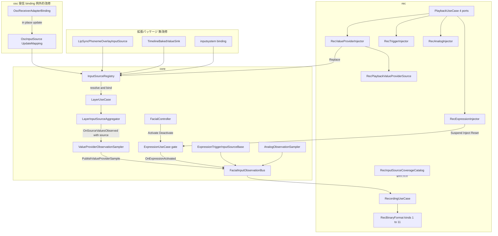
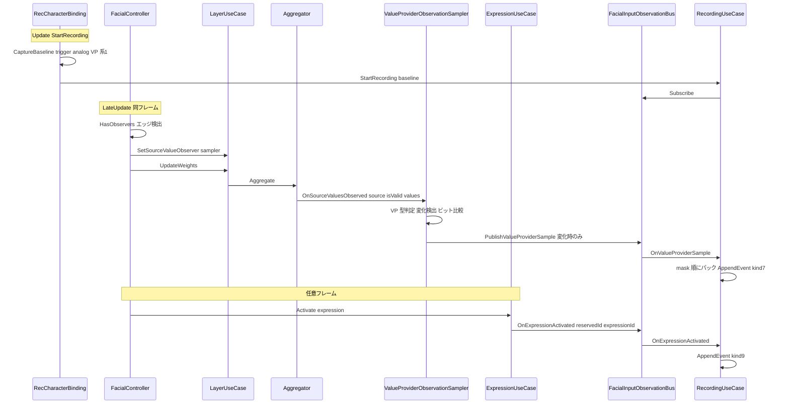
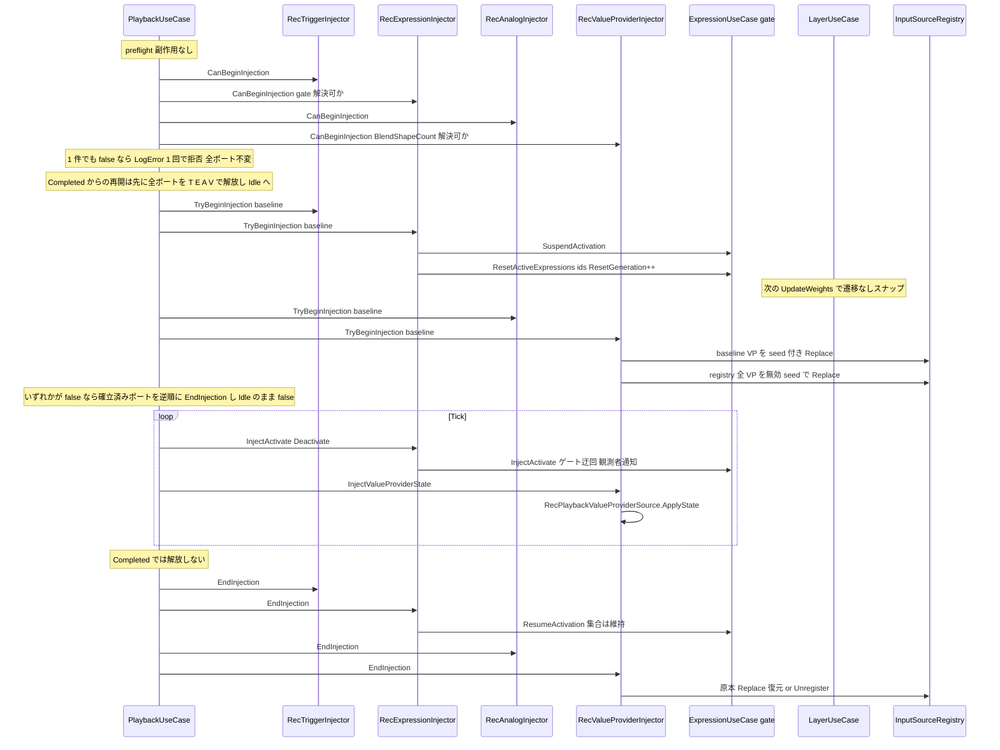
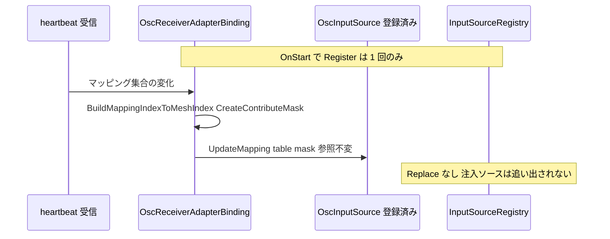

# Technical Design Document — rec-full-input-coverage

## Overview

**Purpose**: 本機能は、REC（`com.hidano.facialcontrol.rec`）の記録・基準状態捕捉・再生時遮断・注入・`.fcrec` ラウンドトリップの対象を、FacialControl の表情パイプラインを動かす全入力経路へ拡張する。新たに対象となるのは (a) `ValueProviderInputSourceBase` 派生の値提供型入力源（`OscInputSource` / `LipSyncPhonemeOverlayInputSource` / `TimelineBakedValueSink` / `OverlayInputSource` / `AnalogExpressionInputSource` / `AnalogBlendShapeInputSource`）と、(b) `FacialController.Activate/Deactivate` から `ExpressionUseCase` へ直行する系1 経路である。あわせて、全パッケージの `IInputSource` 実装と `IAnalogInputSource` 単独実装を「観測対象」または「理由付き明示的除外」に分類する一覧を rec Runtime に置き、reflection ベースの網羅性ゲートテストで分類漏れを機械的に拒否する。

**Users**: FacialControl を利用する Unity エンジニアが、OSC / iFacialMocap / uLipSync / Timeline / スクリプト直呼びを含むあらゆる入力構成で、収録どおりのブレンドを再生で完全再現するために利用する。ライブラリ開発者は、入力源を追加するたびにゲートテストが分類を要求することで「半端な未対応」を構造的に防ぐ。

**Impact**: core（`com.hidano.facialcontrol`）に値提供型の観測面（既存 `ILayerSourceValueObserver` の拡張 + `ValueProviderObservationSampler`）と系1 の観測面・遮断面・注入面（`ExpressionUseCase` のゲート）を追加する。rec の `.fcrec` は `formatVersion` 1 のまま記録構造を変更する（新 kind 5 種、u16 count、mask 順の疎値レコード）。あわせて既存ヘッダの予約フィールド `flags` の bit0 を必須マーカー（`RecHeaderFlags.FullInputBaseline`）とし、本 spec 以前の構造で書かれたファイルを読込段階で確定的に拒否する（版の繰り上げなし）。osc パッケージの受信 binding は heartbeat 由来のマッピング変化時に registry `Replace` を行わず、構築時に登録した `OscInputSource` を in-place 更新する（唯一の拡張パッケージ改修）。再生開始は 4 注入ポート（trigger / expression / analog / valueProvider）の all-or-nothing 確立とし、既存 2 ポートの契約も共通の `IInjectionPort`（副作用なし preflight + bool 戻りの確立）へ移行する。既存コードパスの挙動は観測者ゼロ・遮断/注入未使用時に bit 単位で不変とする。

### Goals

- 観測対象に分類した全入力源について、記録・基準状態・遮断・注入・`.fcrec` ラウンドトリップの 5 点を全て成立させる（部分成立は完成とみなさない）
- 値提供型は「レイヤー合成に実際に消費された値・有効性・寄与対象集合」を唯一の消費点（`LayerInputSourceAggregator`）で観測し、`TryWriteValues` の二重評価を行わない
- 系1 経路を系2 と同じ「観測面後付け + Suspend/Resume + Inject + 遷移なし基準確立」の形で core に追加する
- `IInputSource` / `IAnalogInputSource` 単独実装の分類一覧を単一の正本（`RecInputSourceCoverageCatalog`）として保持し、Small ゲートテストが CI の全 push で検証する
- 毎フレームの定常処理（記録中・再生中）でヒープ確保ゼロを維持し、10 体同時でも per-FC で線形にスケールする

### Non-Goals

- ランタイムのレイヤー weight / 入力源 weight 変更（inputsystem overlay binding の `FacialController.SetLayerWeight`、`LayerUseCase.SetInputSourceWeight`）の記録・遮断 — 初期には Linear **HID-80** へ分離していたが、`rec-weight-coverage` により記録・遮断・注入の対象へ上書きされた。現在は既知制限ではない
- 音声解析・音声波形の記録（リップシンクは `LipSyncPhonemeOverlayInputSource` が合成へ供給した BlendShape 値のみを対象）
- Timeline 独自 Track のベイク・スクラブ（rec-timeline-baking 系）、ランタイム UI、排他 on/off オプション
- 本 spec 以前の記録構造で書かれた `.fcrec` の読込互換・移行（単一フォーマットのみ。旧構造ファイルはヘッダ `flags` の必須ビット欠落として読込エラーになり、再生に到達しない。「Migration Strategy」）
- 記録セッション中の `SetProfile` / `LoadCharacter` 再初期化を跨ぐ完全な記録保証、再生中に新規登録された入力源の遮断（開始時スナップショット方式の既知制限を継承）

## Boundary Commitments

### This Spec Owns

- core への以下の面の追加（実装は core 内、契約オーナーは本 spec）:
  - 値提供型観測面: `ILayerSourceValueObserver` の拡張形（`IInputSource source` 引数）、`ValueProviderSample` 契約、`IFacialInputObserver.OnValueProviderSample` / `IFacialInputObservationBus.PublishValueProviderSample`、`ValueProviderObservationSampler`、`LayerUseCase.SetSourceValueObserver`、`FacialController` の観測者エッジ検出による observer 着脱
  - 系1 観測面・遮断面・注入面: `IExpressionActivationObserver` / `IExpressionActivationGate` / `ExpressionActivationSource.ReservedId`、`ExpressionUseCase` のゲート実装、`LayerUseCase` の遷移なしスナップ（`ExpressionUseCase.ResetGeneration` 追従）、`FacialController.ExpressionActivationGate` / `BlendShapeCount` 公開
- rec の拡張: `RecEventKind` 7〜11、`RecEvent` の u16 count / flags、`RecBaselineState` の値提供型・系1 エントリ、`RecBinaryFormat` の新レコードレイアウトとヘッダ `flags` 必須ビット（`RecHeaderFlags.FullInputBaseline`、`RecBinaryFormat.RequiredHeaderFlags`）、`RecEventChunkQueue` の byte ペイロードと容量方針、`RecTimelineSeek` の新 kind 畳み込み、`IInjectionPort` 共通契約（`CanBeginInjection` / `TryBeginInjection` / `EndInjection`。既存 `ITriggerInjectionPort` / `IAnalogInjectionPort` も本契約へ移行する）、`PlaybackUseCase` の 4 ポート順序と all-or-nothing 確立（preflight → 確立 → 失敗時は確立済みポートの逆順ロールバック）、`IValueProviderInjectionPort` / `IExpressionInjectionPort` と各 Injector、`RecPlaybackValueProviderSource`
- 入力源識別スコープ契約の明文化とゲートテスト: 「id は per-FC `InputSourceRegistry` 内で一意（重複 `Register` は LogError + 後勝ち上書き）、REC の観測・基準・注入状態はすべて per-FC、インスタンス参照は復元ガード」を本書「Architecture → 入力源識別スコープ」に固定し、registry / sampler / `RecBaselineState` / `RecIdTable` / `RecBinaryFormat` の Small テストで検証する
- 入力源分類の正本 `RecInputSourceCoverageCatalog`（rec Domain）と網羅性ゲートテスト（rec Tests）
- osc 受信 binding の heartbeat `Replace` 廃止と `OscInputSource.UpdateMapping` の契約（Req 3.9 / 3.10 / 8.4 の明示的例外）
- 既存 spec 文書（rec-recording-playback / rec-playback-input-exclusivity の design.md）および rec / timeline パッケージドキュメントの整合修正

### Out of Boundary

> **`rec-weight-coverage` による上書き注記:** 以下に残る HID-80 の weight 除外前提、および分類表の #4 / #17 に残る初期定義は上書きされた。現在の weight 系統は記録・遮断・注入対象であり、timeline REC Export の kind 12〜15 対応だけは timeline トラック合流後の follow-up とする。

- レイヤー weight / 入力源 weight のランタイム変更経路（HID-80）。これは初期境界であったが、`rec-weight-coverage` により記録・遮断・注入の対象へ上書きされた。`OverlayInputSource` の分類判定も、レイヤー weight を除外根拠にしてはならない
- lipsync / ifacialmocap / timeline / inputsystem パッケージの入力源実装の改修（Req 8.4）。timeline **Editor** の `RecEventSequenceAdapter`（REC Export）と `BakeSimulationHarness.RecordingObserver` は入力源実装ではなく、契約追随のコンパイル変更のみ行う
- `IInjectedInputSource` 占有規則・`ResetToExpressionStack` の意味論・`ITriggerEventObserver` 契約の変更（既存 spec の契約を流用し変更しない）
- Timeline 注入（`FacialTimelineReceiver` の gaze 乗っ取り）との同時使用時の優先順位変更（占有規則どおり先着優先のまま）

### Allowed Dependencies

- rec → core（Domain / Application / Adapters の 3 asmdef）のみ。rec Runtime は osc / inputsystem / lipsync / ifacialmocap / timeline を参照しない（分類一覧は型 FullName 文字列で持つ）
- core → rec の依存禁止。core は `IFacialInputObserver` / `IExpressionActivationGate` 等の契約のみを公開する
- osc → core（既存方向）。`OscInputSource.UpdateMapping` は osc 内で閉じる
- rec Tests EditMode → core Tests/Testing（`TestAssemblyCatalog`）。拡張パッケージ asmdef の参照追加は行わない（`AppDomain` 走査 + カタログ宣言の期待アセンブリ名リストによる双方向包含検査。「Components → RecInputSourceCoverageCatalogTests」参照）。Req 7.9 は参照追加を許容するが、Editor 専用 asmdef（`ExpressionCreator` 等は第三者パッケージ依存）を rec テストのコンパイル依存に取り込まないため不採用
- 除外契約の Medium テスト（osc `ArKitOscAdapterBindingTests` 追記、osc `OscReceiverAdapterBindingTests` 追記、inputsystem `InputSystemAdapterBindingIntegrationTests` 追記。NotRegisteredAtRuntime / WrappedByObservedSource 区分の**主契約**）は各パッケージの既存テスト asmdef に置き、rec への参照を持たない（期待型集合はリテラル）。Fake `IInputSourceRegistry` は各パッケージの Tests 内にテスト専用で置く（rec / timeline の Fake を参照しない）
- Rec.Domain ← Rec.Application ← Rec.Adapters ← Rec.Editor の asmdef 方向を維持

### Revalidation Triggers

- `ILayerSourceValueObserver.OnSourceValuesObserved` のシグネチャ変更（利用者: timeline Editor `BakeSimulationHarness`、core Small テスト）
- `IFacialInputObserver` / `IFacialInputObservationBus` / `IRecEventVisitor` / `IRecEventSink` の形状変更
- `.fcrec` のレコード kind 追加・レイアウト変更（`formatVersion` 1 のまま。本 spec 実装後の構造が唯一の定義）、およびヘッダ `flags` の必須ビット集合（`RecBinaryFormat.RequiredHeaderFlags`）の変更
- `PlaybackUseCase` のポート確立・解放順序（確立・`StopPlayback` 解放は T → E → A → V、確立失敗時のロールバックは確立済みポートの逆順）と `IInjectionPort` の形状（`CanBeginInjection` / `TryBeginInjection` / `EndInjection`）
- `InputSourceRegistry.Register` の重複 id 挙動（現行: `LogError` + 後勝ち上書き、`RegisteredIds` は重複しない）と `TryResolve` が id ごとに高々 1 インスタンスを返す性質。例外化・拒否化などの変更は本書「入力源識別スコープ」の前提を崩す
- `LayerInputSourceAggregator` が `TryWriteValues` を (layer, source) スロットごとに呼ぶ事実（同一インスタンスの複数レイヤー宣言で 1 フレーム複数回評価される）。source 単位 1 回へ変更された場合、sampler のフレーム内 dedupe 規則は不要になるが挙動は変わらない
- `ExpressionActivationSource.ReservedId`（`@expression`）の変更
- `OscInputSource` の「registry エントリ参照は構築時から不変」契約の変更
- `RecInputSourceCoverageCatalog` のエントリ形状（型 FullName / アセンブリ名 / 分類 / カテゴリ / 除外区分 / 理由 / wrapper 型 / 直接参照許容集合 / ランタイム登録契約テスト名）と `ProductAssemblies`（全パッケージの Runtime + Editor asmdef 名の期待リスト）
- 新パッケージ（`com.hidano.facialcontrol.*`）の asmdef 追加・改名・削除。`ProductAssemblies` を同時に更新しない限り、ゲートは「ロード済み ⊆ 期待」（未宣言の新 asmdef）または「期待 ⊆ ロード済み」（改名・削除・未ロード）の検査でアセンブリ名を挙げて失敗する。パッケージ追加の手順には `ProductAssemblies` の更新を含める（更新を忘れた場合は CI の Small ジョブが止める）
- `RecExclusionReason` の区分追加（区分ごとに契約テストが必須）。NotRegisteredAtRuntime / WrappedByObservedSource のエントリ追加（エントリごとに Fake registry 登録契約テストの宣言が必須）

## Architecture

### Existing Architecture Analysis

- **値提供型の消費点は 1 箇所**: `LayerInputSourceAggregator.AggregateInternal` が各 (layer, source) について `Tick` → scratch ゼロクリア → `TryWriteValues` → `sourceValueObserver?.OnSourceValuesObserved(...)` → 有効なら `layerMask.Or(source.ContributeMask)` + 加重和、の順で処理する。`ILayerSourceValueObserver` フック（`SetSourceValueObserver`）は既存で、唯一の利用者は timeline Editor のベイクハーネス。欠けているのは `ContributeMask` / 型判定に必要な `IInputSource` 参照の受け渡し、`LayerUseCase` → `FacialController` への配線、変化検出、バスの新メソッドである
- **系1 経路**: `FacialController.Activate/Deactivate` → `ExpressionUseCase.Activate/Deactivate`（プレーンクラス、`_activeByLayer: Dictionary<layer, List<Expression>>`）。消費側 `LayerUseCase.UpdateWeights` は `CollectActiveExpressions` → `GroupByLayer` → `LayerExpressionSource.UpdateExpressions`（変化検出のたびに必ず遷移を開始）。`LayerExpressionSource.Id` は `"input"` で inputsystem の予約 id と同名のため、系1 の識別子にも値提供型の選別にも id は使えない
- **既存の面の後付けパターン**: `ExpressionTriggerInputSourceBase` の `SetTriggerEventObserver` / `SuspendTriggerInput` / `ResumeTriggerInput` / `InjectTriggerOn/Off` / `ResetToExpressionStack`。系1 ゲートはこの形を `ExpressionUseCase` に写す
- **注入面**: `RecAnalogInjector` の Replace / Register + `IInjectedInputSource` 占有規則 + 参照同一性復元。`FacialController` は宣言 id 全てを `Subscribe` しており、Replace は `BindLateInputSource`（同 id スワップ + weight 焼き込み）で次フレームの Aggregate から反映される
> **HID-80 上書き注記:** 直参照経路 (2) の weight は `rec-weight-coverage` により記録・遮断・注入対象へ上書きされた。

- **直参照経路の実態**: (1) `OscReceiverAdapterBinding.PublishRuntimeMappings` が heartbeat でマッピング集合が変わるたび `new OscInputSource` + `_runtimeRegistry.Replace`（占有検査なし）。(2) inputsystem の `ApplyOverlayLayerWeights` が `InputActionAnalogSource` 直参照で `FacialController.SetLayerWeight` を毎フレーム駆動（HID-80）。(3) `AnalogExpressionInputSource` / `AnalogBlendShapeInputSource` / `OverlayInputSource` は内部で `IAnalogInputSource` 直参照や `IActiveExpressionProvider`（系2 の `Layer2ActiveExpressionProvider`）から値を導出するが、自身が registry 経由でレイヤーに居るため **自身を Replace すれば遮断できる**
- **`.fcrec`**: `RecEvent.AxisCount` は `byte`、`RecEventChunkQueue` は float ペイロードのみ（既定容量 128 float/segment）、`RecBinaryFormat` は kind 1〜6/255 を固定レイアウトで読み書き、`RecTimelineSeek` は kind 2〜4 のみ畳み込む、timeline Editor の `RecEventSequenceAdapter` は未知 kind で例外を投げる。ヘッダ（16 byte）の `flags`（u16、offset 6）は予約で writer は常に 0 を書き、reader は値を検証しない（「将来ビットを割り当てても `formatVersion` を上げずに済む」意図がコードコメントと rec README に明記されている）。`Serialize/Write` と `RecStreamWriter` はどちらも `RecBinaryFormat.WriteHeader` を経由するためヘッダの書込点は 1 箇所、読込点は `RecBinaryFormat.TryRead` の 1 箇所（`RecFileReader` と timeline Editor の Export はこれを呼ぶ）
- **入力源 id の一意性（実コードの挙動）**: `InputSourceRegistry`（core Adapters、`FacialController.InputSourceRegistry` として FC ごとに 1 個）は `Dictionary<string, IInputSource>` 1 本で `<slug>` / `<slug>:<sub>` 文字列をキーに保持する。同一 id への `Register` は例外を投げず、`Debug.LogError("[InputSourceRegistry] duplicate registration for id '{key}'; later registration wins.")` を出して既存エントリを**後勝ちで上書き**し、`RegisteredIds` には追加しない（既存 Small テスト `InputSourceRegistryTests.Register_DuplicatePrimarySlug_LogsErrorAndOverwrites` / `Register_DuplicateCompositeSlug_LogsErrorAndOverwrites` / `RegisteredIds_AfterDuplicateRegister_DoesNotDuplicate` が固定）。`Replace` は未登録なら新規登録、登録済みなら上書き（Info ログ）。したがって任意の時点で `TryResolve(id)` が返すインスタンスは高々 1 個であり、id → インスタンスは関数である。既存の `AnalogObservationSampler`（`Dictionary<string,int> _trackedSourceIndices`、`RegisteredIds` 走査）と `RecAnalogInjector`（`Dictionary<string, RecPlaybackAnalogSource> _attachedSources`、`ReferenceEquals` 復元ガード）はこの契約に依拠して id 文字列のみをキーにしている
- **`TryWriteValues` の評価粒度**: `LayerInputSourceAggregator.AggregateInternal` は `for l in layers: for s in GetSourceCountForLayer(l): source.Tick → scratch.Clear → source.TryWriteValues(scratch) → observer?.OnSourceValuesObserved(l, s, id, …)` の形で、**(layer, source) スロットごと**に `TryWriteValues` と observer フックを呼ぶ。`FacialController` は各レイヤーの `InputSourceDeclaration` を `registry.TryResolve(decl.Id)` で解決して `(layerIdx, source, weight)` に展開するため、同一 id を複数レイヤーに宣言した構成では**同一インスタンス**が複数スロットに置かれ、1 フレームに複数回評価・複数回通知される
- **4 ポート確立の非トランザクション性（本 spec で解消）**: 現行 `PlaybackUseCase.StartPlayback` は `_triggerPort.BeginInjection(baseline); _analogPort.BeginInjection(baseline); _scheduler.Load(...)` を void 戻りで順に呼び、途中失敗（例外・依存未解決）時に先行ポートの排他が残る経路を持つ。現行 2 ポートの `BeginInjection` は per-id の warn-once + skip のみで「ポート全体の失敗」を表現する手段が無い。4 ポート化に伴い `RecExpressionInjector`（gate 解決）/ `RecValueProviderInjector`（BlendShapeCount 解決）がポート全体として失敗し得るため、本 spec で確立を all-or-nothing にする（「System Flows → 再生開始のトランザクション」）

### Architecture Pattern & Boundary Map



**Architecture Integration**:

- **Selected pattern**: 既存コンポーネント拡張（gap analysis の Option A を基調に、観測は Aggregator フック、遮断は Replace 主経路の 1 段とする。基底 Suspend の二段防御（Option C）は不採用 — 直参照経路は OSC heartbeat のみで、それは osc 側の in-place 更新で根絶するため二段目が不要）
- **Domain boundaries**: 観測・遮断・注入の契約は core が所有し rec を知らない。値提供型の「何を変化とみなすか」（float ビット比較・mask ビット比較・有効性）は core の `ValueProviderObservationSampler` が所有し、「どう永続化するか」（mask 順疎値・flags）は rec が所有する。系1 のゲート状態は `ExpressionUseCase` が所有し、誰を・いつ遮断するかは `RecExpressionInjector` が所有する
- **Existing patterns preserved**: `HasObservers` 早期 return、observer 後付け（`Set*Observer`）、Suspend/Resume/Inject/Reset の 4 面、`IInjectedInputSource` 占有規則（id キー + 参照同一性の復元ガード）、`TryBeginInjection` 冒頭の再入吸収、warn-once ログ、`StopPlayback` 唯一の解放点。新規に加わる規則は「4 ポートの確立は all-or-nothing（preflight → 確立 → 逆順ロールバック）」のみ
- **New components rationale**: `ValueProviderObservationSampler`（Aggregator フックを bus publish と変化検出へ変換する唯一の点。Aggregator を汎用に保つ）、`RecValueProviderInjector` / `RecPlaybackValueProviderSource`（mask 可変の値提供型注入体）、`RecExpressionInjector`（系1 の Begin/End 対称ライフサイクル）、`RecInputSourceCoverageCatalog`（分類の単一正本。rec Runtime は拡張を参照できないため文字列 FullName）
- **Steering compliance**: 依存内向き（Adapters → Application → Domain）、Domain は Unity 型非依存（`UnityEngine.Debug` のみ容認）、エラーは Unity 標準ログ、毎フレーム GC ゼロ、Editor は UI Toolkit（本 spec に UI 追加なし）

### Dependency Direction（破ってはならない）

```
core Domain（契約: IExpressionActivationObserver / IExpressionActivationGate / ValueProviderSample / ILayerSourceValueObserver 拡張）
  ← core Application（ExpressionUseCase ゲート / LayerUseCase スナップ・observer 委譲）
    ← core Adapters（ValueProviderObservationSampler / FacialController 配線）
Rec.Domain（RecEvent / RecBinaryFormat / RecTimelineSeek / RecInputSourceCoverageCatalog / 注入ポート契約）
  ← Rec.Application（RecordingUseCase / PlaybackUseCase）
    ← Rec.Adapters（Injector 群 / RecPlaybackValueProviderSource / RecStreamWriter / RecCharacterBinding）
osc Runtime → core（OscInputSource.UpdateMapping は osc 内）
timeline Editor → rec Editor / Rec.Domain（RecEventSequenceAdapter は未対象 kind をスキップ）
```

### 入力源識別スコープ（id 一意性契約）

値提供型観測（`ValueProviderObservationSampler`）、基準捕捉（`RecCharacterBinding.CaptureBaseline`）、記録イベント（kind 7 / 8 の `sourceIdx`）、注入（`RecValueProviderInjector`）は、既存のアナログ経路と同じく **id 文字列のみをキー**にする。キー設計は変更せず、その一意性と有効範囲を次の 4 点で固定する。

1. **一意性の担保点は core の per-FC registry**: `InputSourceRegistry` は FC ごとに 1 個（`FacialController.InputSourceRegistry`）で、任意の時点で 1 つの id に対応するインスタンスは高々 1 個である（重複 `Register` は `LogError` + 後勝ち上書き。拒否も例外もしない。「Existing Architecture Analysis」の実コード確認）。REC はこの性質を**前提として使い、変更しない**（Req 8.1）。後勝ち上書きが起きた構成では、観測・基準・注入はいずれも「その時点で registry が返すインスタンス」を対象にする（アナログ経路の既存挙動と同一）。Subscribe 通知で `FacialController.HandleLayerInputSourceRebound` → `BindLateInputSource` が全スロットを新インスタンスへ差し替えるため、レイヤー側も常に registry の現在値と一致する
2. **REC 状態の有効範囲は FC インスタンス**: `FacialInputObservationBus` / `ValueProviderObservationSampler` / `ExpressionUseCase` ゲートは FC ごとに 1 組、`RecCharacterBinding.EnsurePlaybackSession(controller)` が構築する 4 Injector は controller ごとに 1 組で、FC 間に共有状態は無い。同じ id（例: `osc`、`@expression`）が 10 体の FC に存在しても、各 FC の sampler / injector / `.fcrec` は自 FC の registry しか見ないため衝突しない（Req 8.6）。`@expression` は FC ごとに 1 個の `ExpressionUseCase` に対応する予約 id であり、registry の id 空間（`[a-zA-Z0-9_.\-:]`）と構造的に交わらない
3. **同一インスタンスの複数レイヤー宣言**: Aggregator フックは (layer, source) ごとに発火する（1 フレームに同一インスタンスから複数回）。sampler の状態は **id 単位**（`Dictionary<string, Tracked>`）で、各コールバックは「当該 id の最後に publish した状態（値ビット列・mask ビット列・有効性）」と比較する。2 回目以降のコールバックは 1 回目で更新済みの状態と比較されるため、`TryWriteValues` がフレーム内で冪等（現行 6 実装はすべて該当。「RecCharacterBinding」の契約前提）なら**無変化の no-op**になり、publish は id ごとフレームごとに高々 1 回に収まる。非冪等な実装（同一フレームの 2 回目が異なる値を返す）では 2 回目も変化として publish され、再生では同一時刻の 2 イベントが順に適用されて注入体は後者の値で両スロットに供給される（既知制限 6）。レイヤー重複を sampler が検出・警告する機能は設けない（ライブ合成でも各スロットは同一インスタンスを読むため、意味上の衝突ではない）
4. **Replace 後の同一性**: 注入体は装着時に原本インスタンス参照（`IInjectedInputSource.ReplacedSource`）を記録し、`EndInjection` は `registry.TryResolve(id)` が**自身の注入体と参照同一**である場合に限り原本へ `Replace`（原本不在なら `Unregister`）する（`RecAnalogInjector.EndInjection` の既存規則。不一致は Warning + no-op で後続占有者を壊さない）。すなわち **id がキー、インスタンス参照が復元ガード**である。sampler 側も `Tracked` に観測したインスタンス参照を保持し、同 id で別参照が来たフレームは `HasSample = false` にして全量を publish する（Replace / 後勝ち上書き直後の状態を取りこぼさない）。osc heartbeat は in-place `UpdateMapping` へ移行するため（Gate A 決定 4）、再生中に原本参照が差し替わる経路は REC 自身の Replace と他注入者（Timeline gaze）のみになる

5. **キーは registry の登録キーで、入力源自身の `Id` ではない**（PR #46 レビュー対応で追記）: `OscInputSource` は常に `Id == "osc"` だが、binding は任意の slug（iFacialMocap は `ifm` 等）で registry に登録する。基準捕捉・注入は registry キーを列挙するので、観測 ID も registry キーでなければならない。Aggregator が観測フックに渡す `sourceId` を `source.Id` ではなく**スロットの同定キー**にし、`ValueProviderObservationSampler` はそれをそのまま publish する（同じインスタンスを 2 つのキーで宣言してもスロットごとに別 ID。インスタンス参照からの逆引きはしない）。レイヤー側（`LayerInputSourceRegistry` / `LayerUseCase.BindLateInputSource` / `UnbindLateInputSource`）も **宣言 id（= registry キー）をスロットの同定キー**にする（`FacialController` が解決時の宣言 id を `LayerUseCase` に渡し、Subscribe 通知の再バインドも宣言 id で対象スロットを選ぶ。Aggregator の観測 ID もスロットの同定キー）。これで同一レイヤーに slug 違いの OSC receiver（どれも `Id == "osc"`）を複数宣言していても、注入体（`Id` は registry キー）は該当スロットだけを置換・復元する

- **検証（Small）**: registry 前提は既存 `InputSourceRegistryTests` の 3 テストで固定済み（上記 1）。上記 5 は `LayerUseCaseTests.UpdateWeights_SourceValueObserver_ReceivesDeclaredIdAsSourceId`、`ValueProviderObservationSamplerTests.Sample_SameInstanceObservedUnderTwoSlotIds_PublishesEachSlotIdSeparately`、`RecValueProviderInjectorTests.TryBeginInjection_LiveSourceIdDiffersFromRegistryKey_ReplacesUnderRegistryKey`、`LayerInputSourceRegistryTests.TryAddSource_SameSourceIdWithDifferentSlotIds_RegistersBothSlots`、`LayerUseCaseTests.BindLateInputSource_WithDeclaredId_ReplacesOnlyTheDeclaredSlotWhenSourceIdsCollide`、同スロット置換は `LayerUseCaseTests.BindLateInputSource_ReplacingExistingId_KeepsOtherSourceWeights` で固定する。本 spec で追加するのは、sampler のフレーム内 dedupe（`ValueProviderObservationSamplerTests.Sample_SameSourceBoundToTwoLayers_PublishesOnce` / `Sample_SameIdDifferentInstance_RepublishesFullState`）、記録側の id 一意性（`RecBaselineStateTests.Constructor_DuplicateValueProviderSourceId_ThrowsArgumentException`、`RecIdTableTests.AddDefinedId_SameSourceIdAtDifferentIndex_ThrowsInvalidOperationException`、`RecBinaryFormatTests.TryRead_DuplicateBaselineValueProviderForSameSource_ReturnsError`）、注入側の参照ガード（`RecValueProviderInjectorTests.EndInjection_WhenCurrentEntryIsNoLongerOwned_LogsWarningAndPreservesCurrentSource`。アナログの既存テストと同名規則）。`RecInputSourceCoverageCatalog` は型 FullName をキーとする分類正本であり、入力源 id の一意性には関与しない（7.4 の重複検査は FullName に対するもの）

### Technology Stack

| Layer | Choice / Version | Role in Feature | Notes |
|-------|------------------|-----------------|-------|
| Runtime | Unity 6000.3.19f1 / C# | 実行基盤 | 既存どおり。対象 Unity プロジェクトは `FacialControl/` |
| core | `com.hidano.facialcontrol` Domain / Application / Adapters asmdef | 観測面・遮断面・注入面の追加 | 新規外部依存なし |
| rec | `com.hidano.facialcontrol.rec` Domain / Application / Adapters asmdef | 記録・再生・永続化・分類正本 | `.fcrec` formatVersion 1 据え置き・在置き変更（Gate A 決定 3。「Migration Strategy」）。ヘッダ `flags` bit0 を必須マーカーとして旧構造ファイルを拒否 |
| osc | `com.hidano.facialcontrol.osc` Runtime asmdef | heartbeat 時の in-place 更新 | 唯一の拡張改修 |
| Test | com.unity.test-framework 1.6.0 + `Hidano.FacialControl.Testing` | Small / Medium 属性、`TestAssemblyCatalog` | reflection は Small 禁止 API に含まれない |

新規外部依存なし。

## File Structure Plan

### core（`FacialControl/Packages/com.hidano.facialcontrol/`）

```
Runtime/Domain/
├── Interfaces/
│   ├── IExpressionActivationObserver.cs   # 新規: 系1 観測契約 + ExpressionActivationSource.ReservedId
│   └── IExpressionActivationGate.cs       # 新規: 系1 遮断・注入・基準確立の契約
├── Adapters/
│   ├── ValueProviderSample.cs             # 新規: 値提供型サンプルの ref struct（値・有効性・mask・変化フラグ）
│   ├── ILayerSourceValueObserver.cs       # 変更: IInputSource source 引数を追加
│   ├── IFacialInputObserver.cs            # 変更: OnValueProviderSample / OnExpressionActivated / OnExpressionDeactivated
│   └── IFacialInputObservationBus.cs      # 変更: IExpressionActivationObserver 継承 + PublishValueProviderSample
└── Services/
    ├── FacialInputObservationBus.cs       # 変更: 新 3 メソッドの配信（HasObservers 早期 return・例外隔離）
    └── LayerInputSourceAggregator.cs      # 変更: observer 呼出に source を渡す（1 引数追加のみ）
Runtime/Application/UseCases/
├── ExpressionUseCase.cs                   # 変更: IExpressionActivationGate 実装、observer、ResetGeneration
└── LayerUseCase.cs                        # 変更: SetSourceValueObserver 委譲、ResetGeneration 追従スナップ、LayerExpressionSource.SnapToExpressions
Runtime/Adapters/
├── InputSources/ValueProviderObservationSampler.cs  # 新規: ILayerSourceValueObserver 実装、VP 型判定・変化検出・publish
└── Playable/FacialController.cs           # 変更: sampler 構築、HasObservers エッジで observer 着脱、ExpressionActivationGate / BlendShapeCount 公開、gate observer 配線
Tests/Testing/TestAssemblyCatalog.cs       # 変更: FindProjectProductAssemblies（Runtime + Editor、テスト除外）、IsProjectProductAssemblyName、TryFindLoadedAssembly
```

### rec（`FacialControl/Packages/com.hidano.facialcontrol.rec/`）

```
Runtime/Domain/
├── Models/
│   ├── RecEventKind.cs                    # 変更: 7 ValueProviderSample / 8 BaselineValueProvider / 9 ExpressionActivate / 10 ExpressionDeactivate / 11 BaselineExpression
│   ├── RecEvent.cs                        # 変更: ValueCount(u16) / MaskByteCount(u16) / Flags、新 factory、PayloadFloatCount
│   ├── RecValueProviderFlags.cs           # 新規: IsValid / HasMask / HasValues
│   ├── RecBaselineState.cs                # 変更: ValueProviderEntries / ExpressionEntries、VP エントリの重複 SourceId 拒否、TryGetValueProviderEntry
│   ├── RecTimeline.cs                     # 変更: イベント別 float ペイロード + mask バイト列、新 kind の検証
│   ├── RecHeaderFlags.cs                  # 新規: ヘッダ flags のビット定義（FullInputBaseline = 0x0001。writer 必須・reader 必須検査）
│   └── RecInputSourceCoverageCatalog.cs   # 新規: 分類正本（型 FullName / アセンブリ名 / 分類 / カテゴリ / 除外区分 / 理由 / wrapper 型 / 直接参照許容集合 / ランタイム登録契約テスト名）+ ProductAssemblies（期待アセンブリ名リスト）
├── Interfaces/
│   ├── IRecEventSink.cs                   # 変更: AppendEvent に ReadOnlySpan<byte> maskBytes
│   ├── IInjectionPort.cs                  # 新規: CanBeginInjection / TryBeginInjection / EndInjection（4 ポート共通基底）
│   ├── ITriggerInjectionPort.cs           # 変更: IInjectionPort 継承、void BeginInjection 廃止
│   ├── IAnalogInjectionPort.cs            # 変更: 同上
│   ├── IValueProviderInjectionPort.cs     # 新規（IInjectionPort 継承）
│   └── IExpressionInjectionPort.cs        # 新規（IInjectionPort 継承）
└── Services/
    ├── RecBinaryFormat.cs                 # 変更: kind 7〜11 の serialize/deserialize、GetMaxRecordSize 拡張、基準先行不変条件の拡張、同一 source の kind 8 重複拒否、ヘッダ flags 必須ビットの書込（WriteHeader）と検査（TryRead）
    ├── RecEventChunkQueue.cs              # 変更: byte ペイロード区画、単一レコード超過時の専用セグメント確保
    ├── RecPlaybackScheduler.cs            # 変更: IRecEventVisitor に 3 メソッド追加、Dispatch 拡張
    ├── RecTimelineSeek.cs                 # 変更: BuildBaselineAt(timeline, offset, profile) で kind 7/9/10 を畳む
    └── RecValidation.cs                   # 変更: ExpressionEntries の欠落 id 検出
Runtime/Application/UseCases/
├── RecordingUseCase.cs                    # 変更: 新 observer メソッド、mask 順パック、id 表シード拡張
└── PlaybackUseCase.cs                     # 変更: 4 ポート、preflight → T→E→A→V の TryBeginInjection → 逆順ロールバック、新 Visit、profile 保持
Runtime/Adapters/
├── Playback/
│   ├── RecPlaybackValueProviderSource.cs  # 新規: ValueProviderInputSourceBase + IInjectedInputSource（可変 mask・dense 値・有効性）
│   ├── RecValueProviderInjector.cs        # 新規: IValueProviderInjectionPort（CanBegin = BlendShapeCount 解決可、baseline ∪ registry 全 VP を Replace）
│   ├── RecExpressionInjector.cs           # 新規: IExpressionInjectionPort（CanBegin = gate 解決可、Suspend/Reset/Inject/Resume）
│   ├── RecRegistryInjection.cs            # 新規 internal: 複合 id 分解・Register/Replace/Unregister・参照同一性復元・warn-once の共通化
│   ├── RecTriggerInjector.cs              # 変更: IInjectionPort 追随（CanBeginInjection / TryBeginInjection。挙動不変）
│   └── RecAnalogInjector.cs               # 変更: 共通ヘルパーへ委譲、IInjectionPort 追随（挙動不変）
├── Recording/RecStreamWriter.cs           # 変更: 新 baseline kind の書込、byte ペイロード、容量引数
└── Playable/RecCharacterBinding.cs        # 変更: CaptureBaseline（VP + 系1）、4 ポート構築、容量方針、gate 解決デリゲート
Tests/EditMode/
├── RecInputSourceCoverageCatalogTests.cs  # 新規 [SmallTest]: 網羅性ゲート（アセンブリ双方向包含検査を含む。未ロード期待アセンブリは名前付きで失敗 = fail-loud）
├── RecInputSourceExclusionContractTests.cs # 新規 [SmallTest]: 除外区分ごとの契約テスト（reflection 型レベル検査 + 補助の IL 走査 + ランタイム登録契約テストの宣言・存在検査）
├── ProductAssemblyIlScanner.cs            # 新規 internal テスト補助（補助検査）: product アセンブリの IL から型参照（newobj / call / ldfld 等）を収集。fail-closed（解決失敗・未知 opcode はメソッド名付きで失敗）
├── ProductAssemblyIlScannerTests.cs       # 新規 [SmallTest]: スキャナ自身の検出・ジェネリック文脈解決・fail-closed の固定
├── RecValueProviderInjectorTests.cs       # 新規 [SmallTest]
├── RecExpressionInjectorTests.cs          # 新規 [SmallTest]
├── RecPlaybackValueProviderSourceTests.cs # 新規 [SmallTest]
├── RecBaselineStateTests.cs               # 新規 [SmallTest]: VP エントリの重複 SourceId 拒否、TryGetValueProviderEntry
├── RecIdTableTests.cs                     # 新規 [SmallTest]: AddDefinedId の同一 id 別 index 拒否（既存挙動の固定）
└── （既存 RecBinaryFormatTests / RecEventChunkQueueTests / RecTimelineSeekTests / RecPlaybackSchedulerTests / RecordingUseCaseTests / PlaybackUseCaseTests（Fake 4 ポート化、preflight / ロールバック）/ RecStreamWriterTests / RecAnalogInjectorTests / RecTriggerInjectorTests へ追記）
Tests/PlayMode/
├── RecCharacterBindingPlayModeTests.cs    # 追記 [MediumTest]: VP / 系1 の完全再現・遮断・引き継ぎ・途中再生
└── RecGcZeroGateTests.cs                  # 追記 [MediumTest]: 大ベクトル VP 記録・再生の GC ゼロ。Null*InjectionPort Fake の IInjectionPort 追随
```

### Modified Files（その他）

- `FacialControl/Packages/com.hidano.facialcontrol.osc/Runtime/Adapters/InputSources/OscInputSource.cs` — `UpdateMapping(int[] mappingIndexToMeshIndex, BitArray contributeMask)` 追加、マッピング表が空のとき `TryWriteValues` は false
- `FacialControl/Packages/com.hidano.facialcontrol.osc/Runtime/Adapters/AdapterBindings/OscReceiverAdapterBinding.cs` — `OnStart` で `OscInputSource` を無条件に構築・`Register`（初期マッピング 0 件でも空マッピングで登録）、`PublishRuntimeMappings` は `_inputSource.UpdateMapping` のみ（`Replace` 削除）
- `FacialControl/Packages/com.hidano.facialcontrol.timeline/Editor/RecEventSequenceAdapter.cs` — Export 対象外 kind（7 / 9 / 10）をスキップ（例外を投げない）
- `FacialControl/Packages/com.hidano.facialcontrol.timeline/Editor/BakeSimulationHarness.cs` — `RecordingObserver.OnSourceValuesObserved` の新シグネチャ追随（引数を無視）
- `FacialControl/Packages/com.hidano.facialcontrol/Tests/Small/Domain/LayerInputSourceAggregatorTests.cs` — `RecordingObserver` の新シグネチャ追随 + source 引数の検証追加 + `Aggregate_SameInstanceInTwoLayers_ObserverCalledOncePerSlot`（(layer, source) ごとの通知という前提の固定）
- `FacialControl/Packages/com.hidano.facialcontrol/Tests/EditMode/Adapters/InputSources/InputSourceRegistryTests.cs`（既存 `[SmallTest]`）— 変更なし。`Register_DuplicatePrimarySlug_LogsErrorAndOverwrites` / `Register_DuplicateCompositeSlug_LogsErrorAndOverwrites` / `RegisteredIds_AfterDuplicateRegister_DoesNotDuplicate` を「入力源識別スコープ」1 の前提テストとして参照する（Revalidation Trigger）
- `FacialControl/Packages/com.hidano.facialcontrol.osc/Tests/EditMode/Adapters/AdapterBindings/ARKit/ArKitOscAdapterBindingTests.cs`（既存 `[MediumTest]`、EditMode）— 除外契約 `OnStart_FakeRegistry_RegistersNoInputSource` を追記（#18 `ArKitOscAnalogSource` の NotRegisteredAtRuntime **主契約**）
- `FacialControl/Packages/com.hidano.facialcontrol.osc/Tests/EditMode/Adapters/AdapterBindings/OscReceiverAdapterBindingTests.cs`（既存 `[MediumTest]`、EditMode）— 除外契約 `OnStart_FakeRegistry_RegisteredTypesAreOnlyCatalogObservedTypes` を追記（osc 受信 binding が registry に登録する実行時型が osc アセンブリの観測対象型リテラル集合 `{OscInputSource, GazeVector2InputSource}` に閉じ、`OscFloatAnalogSource` / `ArKitOscAnalogSource` を実行時型とする登録が無い。#19 `OscFloatAnalogSource` の NotRegisteredAtRuntime **主契約**、#18 の補強）。Fake `IInputSourceRegistry` は osc Tests 内に新設
- `FacialControl/Packages/com.hidano.facialcontrol.inputsystem/Tests/PlayMode/Integration/InputSystemAdapterBindingIntegrationTests.cs`（既存 `[MediumTest]`、PlayMode）— 除外契約 `OnStart_FakeRegistry_RegisteredTypesAreOnlyCatalogObservedTypes` を追記（#17 `InputActionAnalogSource` の WrappedByObservedSource **主契約**）
- 文書: `.kiro/specs/rec-recording-playback/design.md`、`.kiro/specs/rec-playback-input-exclusivity/design.md`、rec `README.md` / `Documentation~/README.md`、timeline `README.md` / `Documentation~/README.md`（Components 節「Documentation」参照）

## System Flows

### 記録フロー（値提供型 + 系1 を含む）



- **基準捕捉**（Req 5.1 / 5.2）: `CaptureBaseline` は registry を走査し、`ValueProviderInputSourceBase` 派生へ `TryWriteValues(scratch)`（`Tick` は呼ばない）を 1 回呼び、戻り値・`ContributeMask`・scratch を `ValueProviderEntry` に写す。系1 は `IExpressionActivationGate.CollectActiveExpressionIds` でレイヤー別順序付き id 列を得る。基準レコードは `RecStreamWriter.Open` で時刻付きイベントより前に書かれる（不変条件維持）
- **初回観測**: サンプラーは observer 着脱時に状態を破棄するため、着脱直後のフレームは全 VP が「変化」として時刻付きで記録される（アナログの既存挙動と同一。基準との重複は無害で、再生時は同値の再適用になる）
- **変化判定**: 有効時のみ値（float ビット一致）と mask（ビット一致）を比較する。無効時は有効性の変化のみ記録し、無効→有効の復帰時に最後に記録した値・mask と比較する（無効期間中の変化は復帰時に 1 件へ畳まれる）。mask が変化したフレームは必ず値も含めて記録する（値は新 mask 順で再パック）
- **同一 id の複数レイヤー宣言**: Aggregator は (layer, source) スロットごとに `TryWriteValues` とフックを呼ぶため、同一インスタンスは 1 フレームに複数回通知される。sampler の状態は id 単位で、各コールバックを「当該 id の最後に publish した状態」と比較するため、2 回目以降は 1 回目で更新済みの状態との比較になり、フレーム内で冪等な `TryWriteValues` なら無変化の no-op（publish は id ごとフレームごとに高々 1 回）。規則の全文は「Architecture → 入力源識別スコープ」3

### 再生フロー（preflight → 4 ポートの all-or-nothing 確立 → 時系列 → 解放）



- **順序（Req 3.7）**: 確立・`StopPlayback` 解放とも **trigger → expression（系1）→ analog → valueProvider** の同一順序。ゲート型（T / E。registry を触らない）を先に立て、Replace 型（A / V）を後に装着する。解放も同順（rec-playback-input-exclusivity の「確立・解放とも同一順序」判断を 4 種へ拡張）。`Load` 冒頭の `StopPlayback()` も同順に乗る。確立失敗時のロールバックのみ確立済みポートの**逆順**（下記）。4 ポートの解放は互いに依存しない同期処理（ライブフレームを挟まない）ため、同順解放と逆順ロールバックは意味上同値であり、順序の差は「完成した集合の解放」と「途中まで積んだスタックの巻き戻し」という操作の違いを表す

#### 再生開始のトランザクション（Req 3.7 / 4.4 / 5.4）

`StartPlayback` は「4 ポート全てが確立された状態」か「どのポートも確立されていない状態」のどちらかでしか終わらない。手順と不変条件:

1. **既存ガード**（変更なし）: オフセット不正・`Playing` 中・未 `Load` は Warning + false
2. **preflight（副作用なし）**: T → E → A → V の順に `IInjectionPort.CanBeginInjection(out reason)` を**全件**評価する（短絡しない。失敗を一度に列挙するため）。1 件でも false なら `Debug.LogError` を **1 回**（`Playback start refused: {port}: {reason}; …`）出して false を返す。この時点でいかなるポートの `TryBeginInjection` も呼ばれておらず、`State`・scheduler・全ポートの状態は呼出前と同一（`Completed` から再開を試みた場合は前セッションの排他がそのまま残る。利用者は `StopPlayback` で解放できる）。preflight が検査するのはポートの依存解決可否（FC 初期化済み = gate / registry / `BlendShapeCount` が解決できる）であり、baseline の構造妥当性は `Load` 時（`RecBinaryFormat.TryRead` + `RecValidation`）で既に保証されている。**registry の占有（他注入者の `IInjectedInputSource`）は preflight の拒否条件にしない**: 占有は id 単位の規則（Warning + スキップ、先着優先）であり、Timeline gaze 注入との共存（「Out of Boundary」「占有規則どおり先着優先のまま」）を保つため、開始拒否へ格上げしない
3. **`Completed` からの再開**: 確立に入る前に全ポートを T → E → A → V で `EndInjection`（`StopPlayback` と同一経路）し `Idle` を経由する。同期処理のためライブフレームは挟まらず、以降の確立は常に「どのポートも確立されていない状態」から始まる（従来は各ポートの `BeginInjection` 冒頭の再入吸収に依存していたが、途中失敗時に未到達ポートが前セッションの排他を保持し続ける経路を塞ぐ）
4. **確立**: T → E → A → V の順に `TryBeginInjection(baseline)` を呼ぶ。i 番目が false を返したら、確立済みの i−1 … 0 番目を**逆順**（V → A → E → T の部分列）に `EndInjection` し、scheduler を `Reset`、`State = Idle` のまま `Debug.LogError` を 1 回出して false を返す。`TryBeginInjection` が false を返すポートは自身の副作用を残さない契約（内部で `EndInjection` 済み）なので、ロールバック後に排他を保持するポートは存在しない
5. **成功**: `_scheduler.Load` → `Playing`（即完了なら `Completed`。Completed で解放しない規則は不変）

- **preflight 後に `TryBeginInjection` が false になる条件**: 依存が preflight と確立の間に失われた場合（`RecExpressionInjector` の gate デリゲートが null を返す、`RecValueProviderInjector` の `BlendShapeCount` デリゲートが 0 以下を返す）。T / A の実装は preflight 通過後に false を返さない（per-id の warn-once + スキップは「ポート全体の失敗」ではない）。Fake ポートで任意に失敗させるテストがロールバック経路を固定する（「Testing Strategy」）
- **系1 の基準確立（Req 4.7 / 5.4）**: `Suspend → Reset` の順。`ResetActiveExpressions` は `Activate` と同じレイヤー排他意味論で id 列を順に積み、観測者へは通知せず、`ResetGeneration` を進める。`LayerUseCase.UpdateWeights` は generation の変化を検出すると当該フレームの `UpdateExpressions` を `SnapToExpressions`（current = target、`_isComplete = true`、mask は current から再構築）で置き換えるため、収束窓なしに定常値で立ち上がる
- **値提供型の初期状態（Req 3.5 / 5.5）**: 基準に無い VP は **無効（`TryWriteValues` = false、mask 全 false）** で確立する。アナログの 0 埋めは「軸の中立値」、値提供型の無効は「合成への寄与なし」であり、どちらも「ライブ値を読まない確定的な中立状態」という同じ規則の適用である（0 埋め**有効**にすると mask ぶん下位レイヤーを 0 で上書きしてしまう）
- **系1 の解放（Req 4.9）**: `ResumeActivation` はアクティブ集合を変更しない。以後のライブ `Activate/Deactivate` が通常どおり遷移を開始する

### OSC heartbeat のマッピング変化（Req 3.9 / 3.10）



- `OnStart` では初期マッピングが 0 件でも `OscInputSource` を空マッピング（mask 全 false）で構築・`Register` する。空マッピングの `TryWriteValues` は false（無効 = 寄与なし。レイヤーに source が無い状態と等価）
- heartbeat で全マッピングが消えた場合も `UpdateMapping(空, 全 false)` で無効化する（従来は古いマッピングを持つ source が残っていた）
- 再生中に heartbeat が来ても registry のエントリは注入ソースのまま。原本 `OscInputSource` は in-place 更新され、`EndInjection` の参照同一性ガードで復元される

## Requirements Traceability

| Requirement | Summary | Components | Interfaces | Flows |
|-------------|---------|------------|------------|-------|
| 1.1 | 全実装の分類一覧 | RecInputSourceCoverageCatalog、本書「入力源分類表」 | RecInputSourceCoverageEntry | — |
| 1.2 | 除外根拠の文書化と機械的検証 | 本書「入力源分類表」理由列・除外区分列・契約テスト列、Catalog.Reason / ExclusionReason / RuntimeRegistrationContractTest、RecInputSourceExclusionContractTests（区分ごとの契約）+ パッケージ別 Fake registry 登録契約（NotRegisteredAtRuntime / WrappedByObservedSource の主契約）+ ProductAssemblyIlScanner（補助、fail-closed） | RecExclusionReason | — |
| 1.3 | OverlayInputSource の判定 | 本書「入力源分類表」（観測対象・値提供型。除外しないため契約テストは不要） | — | — |
| 1.4 | 派生型 / IAnalog 単独 / Editor の分類 | 同上。IAnalog 単独は NotRegisteredAtRuntime / WrappedByObservedSource 契約（主: Fake registry 登録テスト + `IInputSource` 非実装 / wrapper 観測対象の型レベル検査、補助: IL 走査）、Editor は EditorOnly 契約で根拠を検証 | RecExclusionReason | — |
| 1.5 | 観測対象の 5 点成立 | 全コンポーネント | — | 両フロー |
| 1.6 | 未分類追加の機械的拒否 | RecInputSourceCoverageCatalogTests（型の分類漏れ + アセンブリの宣言漏れ + 期待アセンブリの未ロードを名前付きで失敗） | TestAssemblyCatalog.FindProjectProductAssemblies、Catalog.ProductAssemblies | — |
| 2.1 | 消費値の観測面 | LayerInputSourceAggregator、ValueProviderObservationSampler | ILayerSourceValueObserver（source 追加） | 記録フロー |
| 2.2 | 有効性変化 | ValueProviderObservationSampler | ValueProviderSample.IsValid / ValidityChanged | 記録フロー |
| 2.3 | ContributeMask 変化 | 同上（Aggregator フック後に `source.ContributeMask` を読む） | ValueProviderSample.ContributeMask / MaskChanged | 記録フロー |
| 2.4 | 派生無改修 | 型判定 `is ValueProviderInputSourceBase` | — | — |
| 2.5–2.6 | 変化時のみ記録 | ValueProviderObservationSampler（id 単位状態。同一インスタンスの複数レイヤー宣言は id の最終 publish 状態との比較でフレーム内 dedupe、別インスタンス検出で全量再 publish。「入力源識別スコープ」3 / 4）、RecordingUseCase | PublishValueProviderSample | 記録フロー |
| 2.7 | 観測のみ・書き戻しなし | Sampler は scratch を読み取り専用で扱う | — | — |
| 2.8 | float ビット一致 | Sampler の `SingleToInt32Bits` 比較、RecBinaryFormat の生ビット書込 | — | — |
| 3.1 | 開始時スナップショットで全 VP 遮断 | RecValueProviderInjector.TryBeginInjection（baseline ∪ registry 走査。id は per-FC registry で一意、`TryResolve` は id ごとに高々 1 インスタンス。「入力源識別スコープ」1） | IValueProviderInjectionPort（IInjectionPort） | 再生フロー |
| 3.2 | ライブ値非反映 | Replace → BindLateInputSource（既存） | — | 再生フロー |
| 3.3 | 直参照経路の遮断面 | 自身を Replace することで直参照消費（AnalogExpression/Overlay）を無害化、OSC は in-place 更新 | — | OSC フロー |
| 3.4 | 同一コードパスへ供給 | RecPlaybackValueProviderSource（Aggregator が通常 VP として消費） | ValueProviderInputSourceBase | 再生フロー |
| 3.5 | ベースライン外の初期状態 | RecValueProviderInjector（無効 seed） | — | 再生フロー注記 |
| 3.6 | StopPlayback 唯一の解放点 | PlaybackUseCase | — | 再生フロー |
| 3.7 | 4 種の一貫順序・部分的排他を残さない | PlaybackUseCase（preflight 全件 → T→E→A→V の TryBeginInjection → 失敗時は確立済みポートの逆順 EndInjection で Idle。StopPlayback 解放は T→E→A→V） | IInjectionPort（CanBeginInjection / TryBeginInjection / EndInjection）、4 ポート | 再生フロー「再生開始のトランザクション」 |
| 3.8 | 占有規則 | RecRegistryInjection（IInjectedInputSource 検査・参照同一性復元） | IInjectedInputSource | — |
| 3.9 | heartbeat Replace 廃止 | OscReceiverAdapterBinding、OscInputSource.UpdateMapping | — | OSC フロー |
| 3.10 | 再生中の注入ソース保持 | 同上 | — | OSC フロー |
| 4.1–4.2 | 系1 観測面と識別子 | ExpressionUseCase、ExpressionActivationSource.ReservedId | IExpressionActivationObserver | 記録フロー |
| 4.3 | 系1 イベント記録 | RecordingUseCase（kind 9 / 10） | IFacialInputObserver.OnExpressionActivated/Deactivated | 記録フロー |
| 4.4–4.5 | 遮断面（冪等）と遮断中の無視 | ExpressionUseCase.SuspendActivation / ResumeActivation。gate 未解決（FC 未初期化）は RecExpressionInjector.CanBeginInjection が false を返し PlaybackUseCase が開始を拒否する（黙った no-op で「遮断されたつもり」の再生を始めない） | IExpressionActivationGate、IInjectionPort | 再生フロー |
| 4.6 | 注入経路 | ExpressionUseCase.InjectActivate / InjectDeactivate | IExpressionActivationGate | 再生フロー |
| 4.7 | 遮断 → 遷移なし基準確立 | RecExpressionInjector、ExpressionUseCase.ResetActiveExpressions、LayerUseCase スナップ | ResetGeneration | 再生フロー |
| 4.8 | 時刻到達で注入 | PlaybackUseCase.VisitExpressionActivate/Deactivate | IRecEventVisitor | 再生フロー |
| 4.9 | 解除後の維持 | ExpressionUseCase.ResumeActivation（集合不変） | — | 再生フロー |
| 4.10 | 欠落 expressionId | RecValidation、PlaybackUseCase.IsMissingExpressionId | — | — |
| 5.1 | VP 基準値 | RecCharacterBinding.CaptureBaseline（フレーム外 TryWriteValues。`RegisteredIds` 走査なので id ごとに 1 エントリ）、RecBaselineState（ValueProviderEntries の重複 SourceId を ArgumentException で拒否）、RecBinaryFormat.TryRead（同一 sourceIdx の kind 8 重複を読込エラー） | ValueProviderEntry、RecBaselineState.TryGetValueProviderEntry | 記録フロー注記 |
| 5.2 | 系1 基準 | CaptureBaseline → CollectActiveExpressionIds | IExpressionActivationGate | 記録フロー注記 |
| 5.3 | 基準先行 | RecStreamWriter.Open、RecBinaryFormat 不変条件（kind 8 / 11 は kind 7 / 9 / 10 より前） | — | — |
| 5.4 | 再生開始時の定常確立 | 4 ポート TryBeginInjection（all-or-nothing。preflight 不合格・確立途中失敗はいずれも「基準が一部だけ確立された再生」に進まず false）。旧構造ファイルは読込段階（ヘッダ flags 検査）で拒否されるため、「VP / 系1 の基準が空のまま成功したように見える再生」は起きない | IInjectionPort、RecBinaryFormat.TryRead | 再生フロー「再生開始のトランザクション」 |
| 5.5 | 基準外の確定状態 | RecValueProviderInjector（無効）、RecExpressionInjector（空集合） | — | 再生フロー |
| 5.6 | 基準確立の非通知 | ResetActiveExpressions は observer 非通知、VP の seed は ApplyState（観測面を通らない） | — | — |
| 6.1–6.2 | 新 kind のラウンドトリップ | RecBinaryFormat、RecTimeline、RecStreamWriter、RecFileReader | — | — |
| 6.3 | 255 超 | RecEvent.ValueCount(u16)、kind 7 / 8 の u16 count | — | — |
| 6.4–6.5 | formatVersion 1 据え置き・互換なし | RecBinaryFormat.CurrentFormatVersion = 1、構造の在置き変更（Gate A 決定 3。v1 未リリースのため旧リーダー母集団が存在しない。本書「Migration Strategy」）。ヘッダ `flags` bit0（`RecHeaderFlags.FullInputBaseline`）を `WriteHeader` が常に設定し `TryRead` が必須検査するため、本 spec 以前の構造のファイル（flags = 0）は内容に関わらず確定的に読込エラー | RecHeaderFlags、RecBinaryFormat.RequiredHeaderFlags、RecBinaryFormat.TryRead（必須 flags 欠落 / 未知 kind はエラー） | — |
| 6.6 | 記録サイズ | mask 順の疎値レコード（mask 外は保存しない） | — | — |
| 6.7 | 大ベクトルでも GC ゼロ | RecEventChunkQueue 容量方針（BlendShapeCount 由来）、RecordingUseCase の事前確保スクラッチ | — | — |
| 6.8 | 途中再生の畳み込み | RecTimelineSeek.BuildBaselineAt(timeline, offset, profile) | — | — |
| 6.9 | REC Export の継続読取 | timeline Editor RecEventSequenceAdapter（未対象 kind スキップ） | — | — |
| 7.1–7.2 | 列挙と除外 | TestAssemblyCatalog.FindProjectProductAssemblies（`Hidano.FacialControl*` かつ非テスト）、Catalog.ProductAssemblies（期待 20 アセンブリ）、RecInputSourceCoverageCatalogTests | — | — |
| 7.3–7.6 | 未分類 / 二重 / 陳腐化 / 空理由の失敗 | RecInputSourceCoverageCatalogTests（型単位）+ 同テストのアセンブリ双方向包含検査（期待 ⊆ ロード済み、ロード済み ⊆ 期待。未ロードは「黙って欠落」ではなくアセンブリ名付きの失敗）+ RecInputSourceExclusionContractTests（除外理由の妥当性: 区分ごとの契約違反を失敗として扱う。NotRegisteredAtRuntime / WrappedByObservedSource は Fake registry 登録契約が主、IL 走査は補助で fail-closed） | — | — |
| 7.7 | 観測カテゴリ / 除外区分の判別 | RecInputSourceCoverageEntry.Category / ExclusionReason（Excluded は None 以外必須）/ RuntimeRegistrationContractTest（NotRegisteredAtRuntime / WrappedByObservedSource は必須） | — | — |
| 7.8 | EditMode・Small | `[SmallTest]`、禁止 API 不使用（reflection / IL 読取のみ。ファイル I/O・AssetDatabase 不使用）。Medium の除外契約 3 件は各パッケージの既存 Medium fixture に追記 | — | — |
| 7.9 | 拡張アセンブリの列挙 | AppDomain 走査 + 期待アセンブリ名リスト（参照追加なし。未ロードは「期待 ⊆ ロード済み」検査で失敗: 正例 `FindProjectProductAssemblies_CatalogProductAssemblies_AllLoaded`、負例 `Gate_MissingExpectedAssembly_FailsWithAssemblyName`） | — | — |
| 7.10 | CI 自動実行 | 既存 `small-tests` ジョブ（全 push / PR） | — | — |
| 8.1 | 面の追加に限定 | 全 core 変更（既存パスは観測者ゼロで不変） | — | — |
| 8.2 | 未使用時ゼロコスト | FacialController の HasObservers エッジ検出（Aggregator フックは観測者ゼロ時 null）、系1 は bool 分岐 1 個 | — | — |
| 8.3 | core は rec 非依存 | 契約のみ core に置く | — | — |
| 8.4 | 拡張無改修（osc 例外） | osc binding / OscInputSource のみ改修 | — | OSC フロー |
| 8.5 | 毎フレーム GC ゼロ | Sampler の事前確保状態、Injector の ApplyState、キュー容量 | — | — |
| 8.6 | 10 体スケール | per-FC bus / sampler / gate / injector。入力源 id の有効範囲は FC の registry（同じ id が別 FC に存在しても REC 状態は交わらない。「入力源識別スコープ」2） | — | — |
| 8.7 | 消費粒度 | Aggregator フックはフレームに 1 回の TryWriteValues 直後 | — | 記録フロー |
| 8.8 | 標準ログのみ | warn-once 群、カスタム例外なし | — | — |
| 9.1–9.2, 9.4–9.10 | 受け入れ検証 | Testing Strategy 節 | — | — |
| 9.3 | 再生中のライブ VP 更新・系1 呼出の非反映 | RecCharacterBindingPlayModeTests（PlayMode）。前提として PlaybackUseCaseTests の `StartPlayback_PreflightFails_NoPortBegun` / `StartPlayback_ThirdPortFails_RollsBackFirstTwoInReverseOrder` / `StartPlayback_AllPortsSucceed_StateIsPlaying` が「遮断が一部だけ立った状態で再生が始まらない」ことを Small で固定する | IInjectionPort | 再生フロー「再生開始のトランザクション」 |
| 10.1–10.8 | 文書整合 | Components「Documentation」 | — | — |

## Components and Interfaces

### Summary

| Component | Domain/Layer | Intent | Req Coverage | Key Dependencies | Contracts |
|-----------|--------------|--------|--------------|------------------|-----------|
| ILayerSourceValueObserver 拡張 + Aggregator | core Domain | 消費点フックに `IInputSource` を渡す | 2.1–2.4, 8.7 | — | Event |
| ValueProviderSample / IFacialInputObserver / Bus 拡張 | core Domain | 値提供型・系1 の観測配信契約 | 2.1–2.3, 2.5, 4.1–4.2 | FacialInputObservationBus (P0) | Event |
| ValueProviderObservationSampler | core Adapters | VP 型判定・id 単位の変化検出（フレーム内 dedupe・別インスタンス検出）・publish | 2.1–2.8, 8.2, 8.5, 8.6 | Bus (P0) | Service |
| IExpressionActivationObserver / IExpressionActivationGate + ExpressionUseCase | core Domain / Application | 系1 の観測・遮断・注入・基準確立 | 4.1–4.9, 5.2, 5.6, 8.1–8.2 | FacialProfile (P0) | Service, Event, State |
| LayerUseCase スナップ + observer 委譲 | core Application | ResetGeneration 追従の遷移なし確立、observer 配線 | 4.7, 2.1 | ExpressionUseCase (P0), Aggregator (P0) | State |
| FacialController 配線 | core Adapters | sampler 着脱、gate 公開、BlendShapeCount 公開 | 2.1, 4.1, 8.2 | LayerUseCase (P0), Bus (P0) | State |
| OscInputSource.UpdateMapping + binding | osc Runtime | heartbeat の in-place 更新 | 3.9, 3.10, 8.4 | OscDoubleBuffer (P0) | Service |
| RecEvent / RecEventKind / RecBaselineState / RecTimeline | rec Domain | 新 kind・u16 count・flags のモデル。RecBaselineState は VP エントリの SourceId 一意性を構築時に拒否 | 6.1–6.3, 5.1 | — | State |
| RecBinaryFormat + RecHeaderFlags | rec Domain | kind 7〜11 の serialize/deserialize、ヘッダ flags 必須ビットの書込・検査（旧構造ファイルの確定的拒否）、同一 source の kind 8 重複拒否 | 6.1–6.6, 5.1, 5.3, 5.4 | RecIdTable (P0) | Batch |
| RecEventChunkQueue | rec Domain | byte ペイロードと容量方針 | 6.7, 8.5 | — | Service |
| RecTimelineSeek | rec Domain | 新 kind の畳み込み | 6.8 | FacialProfile (P0) | Service |
| RecInputSourceCoverageCatalog | rec Domain | 分類の単一正本 + 期待アセンブリ名リスト + 除外区分 | 1.1–1.4, 7.7, 7.9 | — | State |
| IInjectionPort + 4 ポート契約（ITriggerInjectionPort / IExpressionInjectionPort / IAnalogInjectionPort / IValueProviderInjectionPort） | rec Domain | 共通ライフサイクル（副作用なし preflight・bool 戻りの確立・冪等解放）と各ポートの注入メソッド | 3.6, 3.7, 4.4–4.9, 5.4 | — | Service |
| RecordingUseCase | rec Application | 新観測の正規化・パック | 2.5–2.6, 4.3, 5.1–5.3, 6.7 | IRecEventSink (P0) | Service |
| PlaybackUseCase | rec Application | preflight → T→E→A→V の all-or-nothing 確立 → 逆順ロールバック、新 Visit、欠落 id | 3.6–3.7, 4.4, 4.8, 4.10, 5.4, 6.8 | 4 ポート (P0) | Service, State |
| RecPlaybackValueProviderSource | rec Adapters | 値提供型の注入体 | 3.4, 3.5, 3.8 | ValueProviderInputSourceBase (P0) | State |
| RecValueProviderInjector / RecExpressionInjector / RecRegistryInjection（+ RecTriggerInjector / RecAnalogInjector の IInjectionPort 追随） | rec Adapters | 新ポートの実装、CanBeginInjection / TryBeginInjection の依存解決、id キー + 参照ガードの共通化 | 3.1–3.5, 3.7, 3.8, 4.4–4.9 | Registry (P0), Gate (P0) | Service |
| RecStreamWriter / RecCharacterBinding | rec Adapters | 基準捕捉・容量・セッション配線 | 5.1–5.3, 6.7 | FacialController (P0) | Service |
| RecInputSourceCoverageCatalogTests + TestAssemblyCatalog | rec Tests / core Testing | 網羅性ゲート（型 + アセンブリの双方向包含。未ロードはアセンブリ名付きで失敗 = fail-loud） | 1.6, 7.1–7.10 | Catalog (P0) | — |
| RecInputSourceExclusionContractTests + パッケージ別 Fake registry 登録契約（主）+ ProductAssemblyIlScanner（補助、fail-closed） | rec Tests / osc Tests / inputsystem Tests | 除外区分ごとの妥当性契約 | 1.2, 1.4, 7.3–7.7 | Catalog (P0) | — |
| timeline Editor 追随 | timeline Editor | REC Export の未対象 kind スキップ、observer シグネチャ追随 | 6.9 | Rec.Domain (P0) | — |
| Documentation | docs | 既存 spec / README の整合 | 10.1–10.8 | — | — |

### core Domain

#### ILayerSourceValueObserver 拡張 + LayerInputSourceAggregator

| Field | Detail |
|-------|--------|
| Intent | 消費点フックが観測者に `IInputSource` 参照を渡し、型判定と `ContributeMask` 読取を可能にする |
| Requirements | 2.1, 2.2, 2.3, 2.4, 8.7 |

**Responsibilities & Constraints**
- フック位置は不変: `TryWriteValues` 直後・`layerMask.Or` 前。lipsync のように `TryWriteValues` 内で `ContributeMask` が更新される実装も、この時点で最新 mask を返す
- 追加するのは引数 1 個のみ（`IInputSource source`）。observer が null のとき追加コストなし（既存 `?.` 呼出）
- 観測者は span を保持しない（既存契約）。`source.ContributeMask` の `BitArray` 参照もコールバック中のみ有効として扱う（実装は参照を使い回すため、保持するならコピー）

**Contracts**: Event [x]

##### Event Contract
```csharp
namespace Hidano.FacialControl.Domain.Adapters
{
    public interface ILayerSourceValueObserver
    {
        /// <summary>TryWriteValues 直後に (layer, source) ごとに同期通知。span / mask はコール中のみ有効。</summary>
        void OnSourceValuesObserved(
            int layerIdx,
            int sourceIdx,
            InputSourceId sourceId,
            IInputSource source,
            bool isValid,
            ReadOnlySpan<float> preWeightValues);
    }
}
```
- 既存実装 2 件（timeline Editor `BakeSimulationHarness.RecordingObserver`、core Small テスト `RecordingObserver`）はシグネチャ追随のみ

#### ValueProviderSample / IFacialInputObserver / IFacialInputObservationBus 拡張

| Field | Detail |
|-------|--------|
| Intent | 値提供型サンプルと系1 イベントを rec へ配信する契約 |
| Requirements | 2.1, 2.2, 2.3, 2.5, 4.1, 4.2, 5.6 |

**Contracts**: Event [x]

##### Event Contract
```csharp
namespace Hidano.FacialControl.Domain.Adapters
{
    /// <summary>値提供型 1 件のフレーム消費粒度サンプル。コール中のみ有効（保持禁止）。</summary>
    public readonly ref struct ValueProviderSample
    {
        public bool IsValid { get; }
        public bool ValidityChanged { get; }
        /// <summary>true のとき Values は BlendShapeCount 長の dense 値（pre-weight scratch）。</summary>
        public bool ValuesChanged { get; }
        /// <summary>true のとき ContributeMask が前回記録から変化。MaskChanged なら ValuesChanged も true。</summary>
        public bool MaskChanged { get; }
        public ReadOnlySpan<float> Values { get; }
        public BitArray ContributeMask { get; }
    }

    public interface IFacialInputObserver
    {
        void OnTriggerOn(string sourceId, string expressionId);
        void OnTriggerOff(string sourceId, string expressionId);
        void OnAnalogSample(string sourceId, ReadOnlySpan<float> axes);
        void OnValueProviderSample(string sourceId, in ValueProviderSample sample);
        void OnExpressionActivated(string sourceId, string expressionId);
        void OnExpressionDeactivated(string sourceId, string expressionId);
    }

    public interface IFacialInputObservationBus : ITriggerEventObserver, IExpressionActivationObserver
    {
        bool HasObservers { get; }
        void Subscribe(IFacialInputObserver observer);
        void Unsubscribe(IFacialInputObserver observer);
        void PublishAnalogSample(string sourceId, ReadOnlySpan<float> axes);
        void PublishValueProviderSample(string sourceId, in ValueProviderSample sample);
    }
}
```
- 配信規則は既存と同一: `HasObservers == false` で早期 return、publish 中の Subscribe/Unsubscribe は遅延適用、観測者例外は `Debug.LogException` で隔離
- 系1 の通知は bus が `IExpressionActivationObserver` を実装し、`ExpressionUseCase.SetActivationObserver(bus)` の 1 行で配線する（`SetTriggerEventObserver` と同型）

#### IExpressionActivationObserver / IExpressionActivationGate

| Field | Detail |
|-------|--------|
| Intent | 系1 経路の観測・遮断・注入・基準確立・基準列挙の契約を Domain に置く |
| Requirements | 4.1, 4.2, 4.4, 4.5, 4.6, 4.7, 4.9, 5.2, 5.6 |

**Contracts**: Service [x] / Event [x]

##### Service Interface
```csharp
namespace Hidano.FacialControl.Domain.Interfaces
{
    /// <summary>系1 経路（FacialController.Activate/Deactivate → ExpressionUseCase）の予約識別子。</summary>
    public static class ExpressionActivationSource
    {
        /// <summary>
        /// "@expression"。'@' は InputSourceId / AdapterSlug の許容文字 [a-zA-Z0-9_.\-:] に含まれないため、
        /// registry 上のいかなる入力源 id とも構造的に衝突しない。
        /// </summary>
        public const string ReservedId = "@expression";
    }

    public interface IExpressionActivationObserver
    {
        void OnExpressionActivated(string sourceId, string expressionId);
        void OnExpressionDeactivated(string sourceId, string expressionId);
    }

    public interface IExpressionActivationGate
    {
        bool IsActivationSuspended { get; }
        /// <summary>冪等。未遮断→遮断で true。</summary>
        bool SuspendActivation();
        /// <summary>冪等。アクティブ集合は変更しない。遮断→解除で true。</summary>
        bool ResumeActivation();
        /// <summary>ゲートを迂回し、ライブ Activate と同一の排他処理で受理し観測者へ通知する。未知 id は false。</summary>
        bool InjectActivate(string expressionId);
        /// <summary>ゲートを迂回し Deactivate。集合が変化したときのみ観測者へ通知。未知 id は false。</summary>
        bool InjectDeactivate(string expressionId);
        /// <summary>
        /// アクティブ集合を空にしてから expressionIds を順に Activate 意味論で積む（LastWins / Blend 適用）。
        /// 観測者へ通知しない。ResetGeneration を進め、LayerUseCase は次回 UpdateWeights で遷移を経ずスナップする。
        /// 未知 id はスキップ。空列 = 全解除。
        /// </summary>
        void ResetActiveExpressions(IReadOnlyList<string> expressionIds);
        /// <summary>レイヤー宣言順 × レイヤー内アクティブ化順で id を buffer へ収集する（buffer はクリアされる）。</summary>
        void CollectActiveExpressionIds(List<string> buffer);
        /// <summary>ResetActiveExpressions ごとに単調増加。</summary>
        int ResetGeneration { get; }
    }
}
```
- Preconditions: メインスレッド。`InjectActivate/InjectDeactivate` の null id は `ArgumentNullException`（既存 trigger 契約と整合）
- Postconditions: 遮断中のライブ `Activate/Deactivate` は null 検証後に無視・集合不変・観測者非通知・ログなし。`Inject*` の結果状態はライブ呼出と bit 単位同一
- Invariants: 遮断・注入未使用時のライブ `Activate/Deactivate` の追加コストは bool 分岐 1 個 + observer null チェック 1 回

### core Application

#### ExpressionUseCase（改修: IExpressionActivationGate 実装）

| Field | Detail |
|-------|--------|
| Intent | 系1 の状態オーナーに観測・遮断・注入・基準確立を追加する |
| Requirements | 4.1–4.9, 5.2, 5.6, 8.1, 8.2 |

**Responsibilities & Constraints**
- `Activate/Deactivate` 本体を private コア（`ActivateCore(Expression, bool notify)` / `DeactivateCore`）へ切り出し、ライブ面（ゲート適用・通知あり）、注入面（ゲート迂回・通知あり）、基準確立（ゲート無関係・通知なし）の 3 面から呼ぶ。切り出しは純リファクタ
- 通知規則: `Activate` は常に通知（再アクティブ化も Blend レイヤーで順序が変わるため）。`Deactivate` は 1 件以上除去したときのみ通知（trigger の「Remove 成功時のみ」と整合）
- `ResetActiveExpressions`: `_activeByLayer` の全リストを Clear → 各 id を `FindExpressionById` で解決し `ActivateCore(notify: false)` → `ResetGeneration++`。既存 List を再利用し alloc なし（非毎フレーム処理のため厳密な要件ではない）
- `CollectActiveExpressionIds`: `_profile.Layers` の宣言順にレイヤーを走査し、各レイヤーのリスト順で id を追加（基準の順序保証）。宣言外レイヤー名のリストは末尾に続ける
- `SetProfile` はゲート状態・observer を維持し、`ResetGeneration` を進める（レイヤー再構築で LayerUseCase 側も作り直されるため実質無影響）
- 配線 API: `SetActivationObserver(IExpressionActivationObserver observer)`（null = 解除）

**Contracts**: Service [x] / State [x]（`IExpressionActivationGate` の実装）

##### State Management
- State model: `_isActivationSuspended : bool`、`_resetGeneration : int`、`_activationObserver`
- Concurrency: メインスレッド前提（既存どおり）

#### LayerUseCase（改修: スナップと observer 委譲）

| Field | Detail |
|-------|--------|
| Intent | `ResetGeneration` 変化を検出して遷移なしスナップを行い、Aggregator の observer 設定を公開する |
| Requirements | 4.7, 5.4, 2.1 |

**Responsibilities & Constraints**
- `UpdateWeights` 冒頭で `_expressionUseCase.ResetGeneration != _lastSeenResetGeneration` を判定（int 比較 1 回）。真なら当該フレームの各レイヤーについて `UpdateExpressions` の代わりに `LayerExpressionSource.SnapToExpressions(list, mode, names)` を呼ぶ: target 計算 → `current = snapshot = target`、`_elapsedTime = _duration`、`_isComplete = true`、`_previousActiveIds` 更新、mask を current から再構築、`HasBeenActive = HasBeenActive || list.Count > 0`。空列で既に `HasBeenActive` なら 0 へスナップ
- `SetSourceValueObserver(ILayerSourceValueObserver observer)`: 保持して `_aggregator.SetSourceValueObserver` へ委譲。`BuildAggregatorPipeline`（`SetProfile`）で再適用する
- `UpdateExpressions` 本体のロジックは変更しない（Req 8.1）

**Contracts**: State [x]

### core Adapters

#### ValueProviderObservationSampler

| Field | Detail |
|-------|--------|
| Intent | Aggregator フックを受け、`ValueProviderInputSourceBase` 派生だけを id 単位で変化検出し bus へ publish する |
| Requirements | 2.1–2.8, 8.2, 8.5, 8.6, 8.7 |

**Responsibilities & Constraints**
- `source is ValueProviderInputSourceBase` 以外（`LayerExpressionSource` = 系1、trigger 型、IAnalog ラッパ）は即 return
- **識別スコープ**: 状態は `Dictionary<string, Tracked>`（key = `sourceId.Value`。sampler は FC ごとに 1 個なので key の有効範囲は当該 FC の registry。「Architecture → 入力源識別スコープ」）。`Tracked` は `IInputSource Instance`（最後に観測した参照）、`float[] Values`（BlendShapeCount）、`BitArray Mask`、`bool IsValid`、`bool HasSample`。新 id の追加時のみ alloc（非定常）
- **別インスタンス検出**: コールバックの `source` が `Tracked.Instance` と参照不一致なら（Replace / 重複 `Register` の後勝ち上書きの直後）`Instance` を更新し `HasSample = false` にして全量を publish する（`AnalogObservationSampler` が `AxisCount` 変化で `HasSample = false` にするのと同じ位置付け）
- **フレーム内 dedupe（同一インスタンスの複数レイヤー宣言）**: Aggregator は (layer, source) ごとにフックを呼ぶため同一インスタンスが 1 フレームに複数回来る。各コールバックは `Tracked`（= 当該 id の最後に publish した状態）と比較し、1 回目で `Tracked` を更新するので、2 回目以降はフレーム内で冪等な `TryWriteValues` なら無変化の no-op になる。フレーム境界の通知（`BeginFrame` 等）は設けない（比較対象を「最終 publish 状態」に固定するだけで成立し、Aggregator が source 単位 1 回評価に変わっても挙動は不変）
- 変化判定（有効時）: 値は `BitConverter.SingleToInt32Bits` 一致、mask はビット一致（長さ不一致は変化扱い）。無効時は有効性のみ比較。無効→有効の復帰時は最後に publish した値・mask と比較。`MaskChanged` のときは `ValuesChanged` を強制 true
- publish は `ValueProviderSample` を組んで `bus.PublishValueProviderSample(id, in sample)`。span は Aggregator の scratch をそのまま渡す（コピーなし）
- `Reset()`: 全 `Tracked.HasSample = false`（observer 着脱時に FacialController が呼ぶ。次フレームは全 VP が publish される）
- `bus.HasObservers == false` なら即 return（二重ガード）

**Dependencies**
- Inbound: LayerInputSourceAggregator（LayerUseCase 経由）— フック（P0）
- Outbound: IFacialInputObservationBus — publish（P0）

**Contracts**: Service [x]

##### Service Interface
```csharp
namespace Hidano.FacialControl.Adapters.InputSources
{
    public sealed class ValueProviderObservationSampler : ILayerSourceValueObserver
    {
        public ValueProviderObservationSampler(IFacialInputObservationBus bus, int blendShapeCount);
        /// <summary>全 id の前回状態を破棄する（次フレームは全 VP が変化扱い）。</summary>
        public void Reset();
        public void OnSourceValuesObserved(int layerIdx, int sourceIdx, InputSourceId sourceId,
            IInputSource source, bool isValid, ReadOnlySpan<float> preWeightValues);
    }
}
```
- Invariants: 定常フレームで alloc ゼロ（`Dictionary<string,...>.TryGetValue` は alloc なし）。コストは VP スロット数 × (BlendShapeCount 比較 + mask 比較)。publish は id ごとフレームごとに高々 1 回（フレーム内冪等な source の場合）
- テスト（`ValueProviderObservationSamplerTests`、`[SmallTest]`）: `Sample_SameSourceBoundToTwoLayers_PublishesOnce`（同一 Fake VP を 2 スロットから同一フレームに通知 → publish 1 回）、`Sample_SameIdDifferentInstance_RepublishesFullState`（同 id・別参照 → `HasSample` リセットで全量 publish）、`Sample_SameSourceTwoLayersNonIdempotentValues_PublishesBoth`（既知制限 6 の固定: 2 回目が異なる値なら 2 件 publish）

#### FacialController（改修）

| Field | Detail |
|-------|--------|
| Intent | sampler の着脱、系1 observer 配線、rec が必要とする公開面の追加 |
| Requirements | 2.1, 4.1, 8.1, 8.2 |

**Responsibilities & Constraints**
- `InitializeInternal`: `_valueProviderSampler = new ValueProviderObservationSampler(bus, blendShapeNames.Length)`、`_expressionUseCase.SetActivationObserver(_inputObservationBus)`
- `LateUpdate` 冒頭（`_analogObservationSampler?.Sample()` の前）: `bool want = _inputObservationBus.HasObservers; if (want != _valueProviderObserverAttached) { _layerUseCase.SetSourceValueObserver(want ? _valueProviderSampler : null); if (want) _valueProviderSampler.Reset(); _valueProviderObserverAttached = want; }`。観測者ゼロ時の Aggregator フックは null のままで既存パスと bit 単位同一（追加コストは bool 読取 + 比較 1 回）
- 公開面: `public IExpressionActivationGate ExpressionActivationGate => _expressionUseCase;`（未初期化時 null）、`public int BlendShapeCount => _blendShapeNames?.Length ?? 0;`
- `Activate/Deactivate` 本体は不変（ゲートは ExpressionUseCase 側）

**Contracts**: State [x]

### osc Runtime（Req 8.4 の明示的例外）

#### OscInputSource.UpdateMapping + OscReceiverAdapterBinding

| Field | Detail |
|-------|--------|
| Intent | heartbeat によるマッピング集合変化を registry エントリの差し替えなしに反映する |
| Requirements | 3.3, 3.9, 3.10, 8.4 |

**Responsibilities & Constraints**
- `OscInputSource.UpdateMapping(int[] mappingIndexToMeshIndex, BitArray contributeMask)`: 事前条件 `contributeMask.Length == BlendShapeCount`（違反は `ArgumentException`。binding は LogError して旧マッピングを維持）。`_contributeMask` は参照を変えずビットを置換（`SetAll(false)` + `Or`）、`_mappingIndexToMeshIndex` は参照差し替え。`_lastObservedTick` / staleness 状態は維持
- `TryWriteValues` はマッピング表が空のとき false（無効 = 寄与なし）
- binding `OnStart`: `StartReceiverPhase` 後に **無条件で** `OscInputSource` を構築・`Register`（初期マッピング 0 件なら空表 + 全 false mask）。`PublishRuntimeMappings` は `_buffer.Resize` / helper 再構成の後 `_inputSource.UpdateMapping(table, mask)` のみ。`_runtimeMappings.Length == 0` の分岐も `UpdateMapping(空, 全 false)` を通す
- 根拠（Req 8.4 本文のとおり）: `Replace` は注入占有規則を経ずに注入ソースを追い出し `EndInjection` の参照同一性ガードを no-op にする。registry 側で非注入者の Replace を拒否する案は Req 8.1（既存挙動不変）に抵触するため、osc 側で `Replace` 自体を無くす
- `IFacialMocapReceiverAdapterBinding` は `OscInputSource` を構築時に 1 回 Register するだけで無改修

**Contracts**: Service [x]

### rec Domain

#### RecEvent / RecEventKind / RecValueProviderFlags / RecBaselineState / RecTimeline

| Field | Detail |
|-------|--------|
| Intent | 新 kind と可変長ペイロード（u16 値数 + mask バイト列）のモデル化 |
| Requirements | 6.1, 6.2, 6.3, 6.6 |

**Contracts**: State [x]

##### State Management
```csharp
namespace Hidano.FacialControl.Rec.Domain.Models
{
    public enum RecEventKind : byte
    {
        IdDefine = 1, TriggerOn = 2, TriggerOff = 3, AnalogSample = 4,
        BaselineTrigger = 5, BaselineAnalog = 6,
        ValueProviderSample = 7,      // 時刻付き: 値 / 有効性 / mask の変化
        BaselineValueProvider = 8,    // 基準: 常に mask + 値を含む
        ExpressionActivate = 9,       // 時刻付き 系1
        ExpressionDeactivate = 10,    // 時刻付き 系1
        BaselineExpression = 11,      // 基準 系1（出現順 = アクティブ化順）
        Footer = 255,
    }

    [Flags] public enum RecValueProviderFlags : byte { None = 0, IsValid = 1, HasMask = 2, HasValues = 4 }

    public readonly struct RecEvent
    {
        // 既存: Kind / TimestampSeconds / SourceIdIndex / ExpressionIdIndex / IdIndex / DefinedIdKind / AxisCount(byte) / DurationSeconds / EventCount
        public ushort ValueCount { get; }            // kind 7 / 8 の mask 順値数（u16）
        public ushort MaskByteCount { get; }         // kind 7 / 8 の mask バイト数（ceil(BlendShapeCount / 8)）
        public RecValueProviderFlags Flags { get; }  // kind 7 / 8
        /// <summary>float ペイロード長: AnalogSample / BaselineAnalog は AxisCount、kind 7 / 8 は HasValues ? ValueCount : 0、その他 0。</summary>
        public int PayloadFloatCount { get; }
        public bool IsTimedEvent { get; }            // 2, 3, 4, 7, 9, 10
        public static RecEvent CreateValueProviderSample(double t, ushort sourceIdx, RecValueProviderFlags flags, ushort valueCount, ushort maskByteCount);
        public static RecEvent CreateBaselineValueProvider(ushort sourceIdx, bool isValid, ushort valueCount, ushort maskByteCount);
        public static RecEvent CreateExpressionActivate(double t, ushort sourceIdx, ushort expressionIdx);
        public static RecEvent CreateExpressionDeactivate(double t, ushort sourceIdx, ushort expressionIdx);
        public static RecEvent CreateBaselineExpression(ushort sourceIdx, ushort expressionIdx);
    }

    public sealed class RecBaselineState
    {
        /// <summary>valueProviderEntries に同一 SourceId が 2 件以上あれば ArgumentException（id は記録内で一意）。</summary>
        public RecBaselineState(IEnumerable<TriggerEntry> triggerEntries, IEnumerable<AnalogEntry> analogEntries,
            IEnumerable<ValueProviderEntry> valueProviderEntries, IEnumerable<string> expressionEntries);
        public IReadOnlyList<TriggerEntry> TriggerEntries { get; }
        public IReadOnlyList<AnalogEntry> AnalogEntries { get; }
        public IReadOnlyList<ValueProviderEntry> ValueProviderEntries { get; }   // 新規
        public IReadOnlyList<string> ExpressionEntries { get; }                  // 新規: 系1 の順序付き id 列
        public bool TryGetValueProviderEntry(string sourceId, out ValueProviderEntry entry);   // 新規: id → 高々 1 件
        public readonly struct ValueProviderEntry
        {
            public string SourceId { get; }
            public bool IsValid { get; }
            public IReadOnlyList<byte> MaskBytes { get; }   // LSB-first のビット列
            public IReadOnlyList<float> Values { get; }     // mask 順（popcount(mask) 個）
        }
    }
}
```
- `RecTimeline`: イベント別の float ペイロード（既存 `_analogAxesByEvent` を汎用化）に加え `byte[][] _maskBytesByEvent` を持つ。`GetPayloadSpan(i)` / `GetMaskBytesSpan(i)` を 0-alloc で返す。検証: kind 7 の `HasValues` なら payload 長 = `ValueCount`、`HasMask` なら mask 長 = `MaskByteCount`、系1 kind は `SourceIdIndex` / `ExpressionIdIndex` が id 表内
- **mask 順の疎値**（Req 6.6 の決定）: 値は `ContributeMask` の立った index を昇順に走査した順で保存し、mask 外の index は保存しない（再生時 0 とみなす）。契約前提: 値提供型は mask 外に非ゼロを書かない（現行 6 実装はすべて満たす。既知制限として文書化）
- **mask バイト列**: index k はバイト `k >> 3` のビット `k & 7`。長さは `ceil(BlendShapeCount / 8)`。モデル差（BlendShapeCount 不一致）は注入時に検出して warn-once + スキップ
- **id の一意性（記録内）**: `ValueProviderEntries` は SourceId ごとに高々 1 件（構築時に `ArgumentException`）。生成経路はいずれも id キーの辞書 / registry 走査（`CaptureBaseline` は `RegisteredIds`、`RecTimelineSeek` は id 辞書、`RecBinaryFormat.TryRead` は sourceIdx 辞書）なので重複は構造的に生じないが、契約として拒否する。既存の `TriggerEntries` / `AnalogEntries` は読込側で id ごとに畳まれる既存挙動（後勝ち）を変更しない（Req 8.1 相当の既存挙動維持）。`RecIdTable` は同一 id 値を異なる index に定義する `AddDefinedId` を `InvalidOperationException` で拒否する（既存実装。`GetOrAddSourceId` は冪等）。テスト: `RecBaselineStateTests.Constructor_DuplicateValueProviderSourceId_ThrowsArgumentException`、`RecBaselineStateTests.TryGetValueProviderEntry_KnownId_ReturnsSingleEntry`、`RecIdTableTests.AddDefinedId_SameSourceIdAtDifferentIndex_ThrowsInvalidOperationException`（いずれも `[SmallTest]`、新設 fixture）

#### RecBinaryFormat（改修）

| Field | Detail |
|-------|--------|
| Intent | kind 7〜11 の追記型 serialize/deserialize と不変条件の拡張 |
| Requirements | 5.3, 6.1–6.6 |

**Contracts**: Batch [x]

##### Batch / Job Contract
- Trigger: writer thread の dequeue ごと / 読込 API
- Input / validation: `formatVersion == 1` のみ受理（変更なし）。**ヘッダ `flags`（offset 6、u16 LE）に `RecBinaryFormat.RequiredHeaderFlags`（= `RecHeaderFlags.FullInputBaseline` = 0x0001）の全ビットが立っていること**を magic / formatVersion の直後・レコード走査の前に検査し、欠落なら false + エラー（`REC file header flags 0x{flags:X4} lack the required FullInputBaseline bit 0x0001. Files recorded before value-provider/expression baseline support are not supported; re-record with the current version.`）。予約ビット（bit1〜15）は従来どおり検証しない。基準レコード（kind 5 / 6 / 8 / 11）は最初の時刻付きレコード（kind 2 / 3 / 4 / 7 / 9 / 10）より前（違反は読込エラー）。kind 7 / 8 は flags と各 count でペイロード長を自己記述。**同一 sourceIdx の kind 8 が 2 件以上**あれば読込エラー（`Duplicate BaselineValueProvider record for source index N.`。既存 kind 6 の後勝ち畳み込みは変更しない。新 kind は id 一意性契約に従い厳格化）。テスト: `TryRead_DuplicateBaselineValueProviderForSameSource_ReturnsError`
- Output: `WriteHeader` は常に `RequiredHeaderFlags` を flags に書く（`DefaultFlags` の値を 0 から `RequiredHeaderFlags` へ変更。`Serialize/Write` と `RecStreamWriter.Open` の両経路が `WriteHeader` を通るため書込点は 1 箇所）。`Span<byte>` 書込。`GetMaxRecordSize(maxIdUtf8, maxAxisCount, maxValueCount, maxMaskByteCount)` へ拡張（writer のバッファ確保用）
- Idempotency & recovery: 復旧スキャン・truncated tail 破棄は不変

#### RecEventChunkQueue（改修）

| Field | Detail |
|-------|--------|
| Intent | mask バイト列を運べるようにし、大ベクトルでも定常 alloc ゼロ・単一レコードの収容を保証する |
| Requirements | 6.7, 8.5 |

**Contracts**: Service [x]

##### Service Interface
```csharp
public sealed class RecEventChunkQueue
{
    public RecEventChunkQueue(int segmentCapacity, int initialSegments, int floatCapacityPerSegment, int byteCapacityPerSegment);
    /// <summary>producer 専用。floats.Length == evt.PayloadFloatCount、bytes.Length == (HasMask ? MaskByteCount : 0)。</summary>
    public void Enqueue(in RecEvent evt, ReadOnlySpan<float> floats, ReadOnlySpan<byte> bytes, string idValue = null);
    public bool TryDequeue(out RecEvent evt, out ReadOnlySpan<float> floats, out ReadOnlySpan<byte> bytes, out string idValue);
}
```
- **容量方針**: `RecCharacterBinding` が `controller.BlendShapeCount = N` から `floatCapacityPerSegment = max(128, 4 × N)`、`byteCapacityPerSegment = max(64, 4 × ceil(N / 8))` を算出して `RecStreamWriter` に渡す（1 セグメントに最大サイズのレコードが 4 件以上入る）
- **単一レコード超過**: 次セグメントへ移っても収まらないペイロードは、そのレコード専用のサイズでセグメントを新規確保する（`GrowthCount++`。例外を投げない）。既定容量下での `Span.CopyTo` 例外を構造的に排除する

#### RecTimelineSeek（改修）

| Field | Detail |
|-------|--------|
| Intent | 途中再生のベースライン畳み込みを新 kind へ拡張する |
| Requirements | 6.8 |

**Contracts**: Service [x]

##### Service Interface
```csharp
public static class RecTimelineSeek
{
    /// <summary>profile は系1 のレイヤー排他意味論（LastWins / Blend）の畳み込みに使う。</summary>
    public static RecBaselineState BuildBaselineAt(RecTimeline timeline, double offsetSeconds, FacialProfile profile);
}
```
- 値提供型: id ごとに (isValid, maskBytes, values) を保持し、kind 7 を flags に従って上書き（HasMask なら mask と値を置換、HasValues のみなら値を置換、IsValid は常に反映）
- 系1: `Dictionary<layer, List<string>>` を profile の `GetEffectiveLayer` / `FindLayerByName(...).ExclusionMode` で更新（Activate = LastWins なら Clear して追加、Blend なら同 id 除去後に追加。Deactivate = 全レイヤーから除去。未知 id はスキップ）。結果はレイヤー宣言順 × リスト順で `ExpressionEntries` に平坦化する
- トリガー / アナログの畳み込みは不変

#### RecInputSourceCoverageCatalog

| Field | Detail |
|-------|--------|
| Intent | 全入力源実装の分類（観測対象 / 明示的除外）、除外区分、列挙対象アセンブリの期待リストの単一正本 |
| Requirements | 1.1, 1.2, 1.3, 1.4, 7.4–7.7, 7.9 |

**Responsibilities & Constraints**
- rec Runtime（Domain/Models）に置く。rec は拡張パッケージを参照できないため **型 FullName 文字列**（nested 型は `Outer+Inner`）とアセンブリ名で識別する
- エントリは本書「入力源分類表」と 1:1。将来の追加は本カタログとゲートテストの失敗メッセージが要求する
- `ProductAssemblies` は `FacialControl/Packages/com.hidano.facialcontrol*` の全 Runtime / Editor asmdef 名（テスト asmdef と `Hidano.FacialControl.Testing` を除く 20 件）を `IsEditorOnly` 付きで宣言する。ゲートテストはこのリストと AppDomain のロード済みアセンブリを双方向に突き合わせるため、**参照されないため未ロードのアセンブリ**も、**リスト未更新の新パッケージ**も失敗として検出される（Unity Editor ドメインは `Library/ScriptAssemblies` の全 asmdef をロードするが、設計はそれに依存せず明示検査で担保する）
- 除外エントリは `ExclusionReason`（区分）を必ず持ち、区分ごとに `RecInputSourceExclusionContractTests` の契約テストが対応する。区分を追加するときは契約テストの追加が必須（契約の無い区分はゲートが拒否する）。NotRegisteredAtRuntime / WrappedByObservedSource のエントリは `RuntimeRegistrationContractTest`（Fake registry 登録契約の fixture 型 FullName とメソッド名）を必ず宣言し、Small 契約テストがロード済みテストアセンブリに実在することを検査する（主契約の削除・改名を全 push の Small で検出）
- 配置理由: Tests 配下に埋もれさせず利用者が参照できる設計成果物とし、`RecCharacterBinding` 等の診断で再利用できる（本 spec では診断利用はしない）

**Contracts**: State [x]

##### State Management
```csharp
namespace Hidano.FacialControl.Rec.Domain.Models
{
    public enum RecInputSourceClassification { Observed, Excluded }
    public enum RecObservationCategory { None, Trigger, Analog, ValueProvider, DirectActivation }

    /// <summary>明示的除外の区分。区分ごとに契約テストが存在する（Observed は None）。</summary>
    public enum RecExclusionReason
    {
        None,
        /// <summary>再生注入用の内部ソース（IInjectedInputSource 実装）。</summary>
        InjectionSource,
        /// <summary>Runtime で registry に登録されず合成パイプラインに到達しない。</summary>
        NotRegisteredAtRuntime,
        /// <summary>Editor 専用アセンブリの実装。Runtime アセンブリから到達不能。</summary>
        EditorOnly,
        /// <summary>registry へは観測対象の wrapper 経由で登録され、直接参照消費者がすべて分類済み。</summary>
        WrappedByObservedSource,
    }

    public readonly struct RecProductAssembly
    {
        public string Name { get; }           // 例: "Hidano.FacialControl.Timeline.Editor"
        public bool IsEditorOnly { get; }     // includePlatforms = ["Editor"] の asmdef
    }

    public readonly struct RecAllowedReferrer
    {
        public string TypeFullName { get; }   // 直接参照を許容する product 型（nested / コンパイラ生成型は最外殻型に正規化）
        public string Reason { get; }         // 必須
    }

    public readonly struct RecInputSourceCoverageEntry
    {
        public string TypeFullName { get; }      // 例: "Hidano.FacialControl.Application.UseCases.LayerUseCase+LayerExpressionSource"
        public string AssemblyName { get; }      // 例: "Hidano.FacialControl.Application"。ProductAssemblies 内であること
        public RecInputSourceClassification Classification { get; }
        public RecObservationCategory Category { get; }   // Observed のとき None 以外
        public RecExclusionReason ExclusionReason { get; } // Excluded のとき None 以外、Observed のとき None
        public string Reason { get; }            // Excluded のとき必須（空は不可）
        /// <summary>WrappedByObservedSource のとき必須: registry に登録される wrapper 型の FullName（本カタログで Observed であること）。</summary>
        public string WrapperTypeFullName { get; }
        /// <summary>NotRegisteredAtRuntime / WrappedByObservedSource のとき: 型を直接参照（構築・メンバ呼出・フィールド保持）してよい product 型の許容集合（補助の IL 走査が検査）。</summary>
        public IReadOnlyList<RecAllowedReferrer> AllowedDirectReferrers { get; }
        /// <summary>
        /// NotRegisteredAtRuntime / WrappedByObservedSource のとき必須（主契約）: 除外根拠を Fake registry への実登録で固定する
        /// Medium テストの "{fixture 型 FullName}::{メソッド名}"。Small 契約テストがロード済みテストアセンブリに実在することを検査する。
        /// </summary>
        public string RuntimeRegistrationContractTest { get; }
    }

    public static class RecInputSourceCoverageCatalog
    {
        /// <summary>列挙対象の全 Runtime / Editor product アセンブリ（20 件）。</summary>
        public static IReadOnlyList<RecProductAssembly> ProductAssemblies { get; }
        public static IReadOnlyList<RecInputSourceCoverageEntry> Entries { get; }
    }
}
```
- `ProductAssemblies` の内容（Runtime 11: `Hidano.FacialControl.Domain` / `.Application` / `.Adapters` / `.Osc` / `.InputSystem` / `.LipSync` / `.IFacialMocap` / `.Rec.Domain` / `.Rec.Application` / `.Rec.Adapters` / `.Timeline`。Editor 9: `Hidano.FacialControl.Editor` / `.Osc.Editor` / `.InputSystem.Editor` / `.LipSync.Editor` / `.IFacialMocap.Editor` / `.Rec.Editor` / `.Timeline.Editor` / `.RoutingEditor` / `.ExpressionCreator`）
> **HID-80 上書き注記:** 次の overlay layer weight 駆動の初期既知制限は `rec-weight-coverage` により上書きされた。

- 除外エントリの区分と付帯情報: #14 / #15 / #16 = InjectionSource、#17 = WrappedByObservedSource（`WrapperTypeFullName` = #8、`AllowedDirectReferrers` = `InputSystemAdapterBinding`「wrapper 構築・`AnalogExpressionInputSource` への辞書引き渡し（#3 観測対象）・overlay layer weight 駆動（HID-80 既知制限）」）、#18 = NotRegisteredAtRuntime（`AllowedDirectReferrers` = `ArKitOscAdapterBinding`「構築・Tick・診断公開のみ。非登録は osc Medium 契約で固定」）、#19 = NotRegisteredAtRuntime（`AllowedDirectReferrers` = 空）、#20 = EditorOnly。`RuntimeRegistrationContractTest`（主契約、必須）: #17 = `Hidano.FacialControl.InputSystem.Tests.PlayMode.InputSystemAdapterBindingIntegrationTests::OnStart_FakeRegistry_RegisteredTypesAreOnlyCatalogObservedTypes`、#18 = `...ArKitOscAdapterBindingTests::OnStart_FakeRegistry_RegistersNoInputSource`、#19 = `...OscReceiverAdapterBindingTests::OnStart_FakeRegistry_RegisteredTypesAreOnlyCatalogObservedTypes`（fixture の名前空間は実装時に既存 fixture の FullName で確定する）。実装時の IL 走査で追加の referrer（Editor の Drawer 等）が見つかった場合は、理由を付して許容集合へ追加する（理由なしの追加は契約テストが拒否する）

#### IInjectionPort + 4 ポート契約（ITriggerInjectionPort / IExpressionInjectionPort / IAnalogInjectionPort / IValueProviderInjectionPort）

| Field | Detail |
|-------|--------|
| Intent | 4 ポート共通のライフサイクル契約（副作用なし preflight・bool 戻りの確立・冪等解放）を 1 つの基底インターフェースに置き、`PlaybackUseCase` が all-or-nothing 確立を組めるようにする |
| Requirements | 3.1, 3.4, 3.6, 3.7, 4.4–4.9, 5.4 |

**Responsibilities & Constraints**
- 既存 `ITriggerInjectionPort` / `IAnalogInjectionPort` の `void BeginInjection(RecBaselineState)` は**廃止**し、両者も `IInjectionPort` を継承する（preview 段階の破壊的変更。実装: `RecTriggerInjector` / `RecAnalogInjector`、テスト Fake: `PlaybackUseCaseTests.FakeTriggerInjectionPort` / `FakeAnalogInjectionPort`、`RecGcZeroGateTests.NullTriggerInjectionPort` / `NullAnalogInjectionPort`。すべて同一リポジトリ内で同時改修）。形状を 1 つにする理由: `PlaybackUseCase` が 4 ポートを `IInjectionPort[]` として同一ループで preflight / 確立 / ロールバックでき、ポート追加時にトランザクション規則の分岐が増えない
- `CanBeginInjection` は**副作用なし・ログなし**。依存（gate / registry / `BlendShapeCount`）の解決可否だけを答え、registry の占有や baseline の内容は見ない（占有は id 単位の規則。「再生開始のトランザクション」2）
- `TryBeginInjection` が false を返すとき、当該ポートは自身の副作用を残さない（確立途中なら内部で `EndInjection` 済み）。true を返したポートは `EndInjection` で完全に解放できる。再入（確立中に再度 `TryBeginInjection`）は従来どおり内部で `EndInjection` してから確立する
- `EndInjection` は冪等（未確立なら no-op）

**Contracts**: Service [x]

##### Service Interface
```csharp
namespace Hidano.FacialControl.Rec.Domain.Interfaces
{
    /// <summary>4 注入ポート共通のライフサイクル。PlaybackUseCase の all-or-nothing 確立の単位。</summary>
    public interface IInjectionPort
    {
        /// <summary>
        /// 副作用なし・ログなしの事前検査。確立に必要な依存（FacialController 初期化済み、gate / registry / BlendShapeCount が解決できる）が
        /// 揃っていれば true。false のとき reason に理由（英語 1 行。定数文字列）を返す。registry の占有・baseline の内容は検査しない。
        /// </summary>
        bool CanBeginInjection(out string reason);

        /// <summary>
        /// 排他を確立する。再入時は内部で EndInjection してから確立する。
        /// false を返すときは自ポートの副作用を残さない（確立途中なら内部で EndInjection 済み）。per-id の warn-once + スキップは失敗ではない。
        /// </summary>
        bool TryBeginInjection(RecBaselineState baseline);

        /// <summary>冪等。未確立なら no-op。</summary>
        void EndInjection();
    }

    public interface ITriggerInjectionPort : IInjectionPort
    {
        void InjectTriggerOn(string sourceId, string expressionId);
        void InjectTriggerOff(string sourceId, string expressionId);
    }

    public interface IAnalogInjectionPort : IInjectionPort
    {
        void InjectAnalogSample(string sourceId, ReadOnlySpan<float> axes);
    }

    public interface IExpressionInjectionPort : IInjectionPort
    {
        // TryBeginInjection: 系1 ゲートを Suspend し、baseline.ExpressionEntries（無ければ空）で遷移なし基準確立。gate 未解決なら false
        void InjectActivate(string expressionId);
        void InjectDeactivate(string expressionId);
        // EndInjection: Resume のみ（アクティブ集合は維持）
    }

    public interface IValueProviderInjectionPort : IInjectionPort
    {
        // TryBeginInjection: baseline の VP を seed 付きで、registry 上の他の全 VP を無効 seed で Replace 装着。BlendShapeCount 未解決なら false
        /// <summary>maskBytes が空なら mask 不変、values が空なら値不変。values は現 mask 順。</summary>
        void InjectValueProviderState(string sourceId, bool isValid, ReadOnlySpan<byte> maskBytes, ReadOnlySpan<float> values);
        // EndInjection: 占有規則に従い原本復元（Replace）または除去（Unregister）
    }
}
```

### rec Application

#### RecordingUseCase（改修）

| Field | Detail |
|-------|--------|
| Intent | 新観測メソッドを RecEvent へ正規化し、mask 順パックを定常 alloc ゼロで行う |
| Requirements | 2.5, 2.6, 2.8, 4.3, 5.1–5.3, 6.3, 6.7 |

**Responsibilities & Constraints**
- `OnValueProviderSample`: flags を組み（`IsValid` / `MaskChanged → HasMask` / `ValuesChanged → HasValues`）、`HasMask` なら `ContributeMask` を `_maskScratch`（byte[]）へ LSB-first でパック、`HasValues` なら mask の立った index 順で `Values` を `_valueScratch`（float[]）へパック → `AppendEvent(evt, values, maskBytes)`。スクラッチは `StartRecording(baseline, int blendShapeCountHint)` で `BlendShapeCount` ぶん事前確保し、超過時のみ再確保（非定常）
- `OnExpressionActivated/Deactivated`: trigger と同じ id 表解決で kind 9 / 10 を追記
- `CreateSeededIdTable`: baseline の VP source id、`ExpressionActivationSource.ReservedId`、`ExpressionEntries` の expression id を先行登録
- 変化判定は core（sampler）に委ね、本クラスは比較を行わない

**Contracts**: Service [x] / State [x]（既存 `Idle → Recording → Idle` 不変）

#### PlaybackUseCase（改修）

| Field | Detail |
|-------|--------|
| Intent | 4 ポートの順序統制と all-or-nothing 確立（preflight / 逆順ロールバック）、新 Visit、途中再生畳み込みへの profile 供給 |
| Requirements | 3.6, 3.7, 4.4, 4.8, 4.10, 5.4, 6.8 |

**Responsibilities & Constraints**
- 4 ポートを確立順 `IInjectionPort[] { trigger, expression, analog, valueProvider }` として保持し、preflight・確立・ロールバック・解放を同一配列上のループで行う（ポート種別ごとの分岐を持たない）
- `StartPlayback` の手順・不変条件は「System Flows → 再生開始のトランザクション」のとおり: (1) 既存ガード、(2) 全ポート `CanBeginInjection` を全件評価し 1 件でも false なら `LogError` 1 回 + false・副作用なし、(3) `Completed` からの再開は T→E→A→V で全解放して `Idle` を経由、(4) T→E→A→V で `TryBeginInjection`、i 番目が false なら i−1 … 0 を逆順 `EndInjection` → scheduler `Reset` → `State = Idle` → `LogError` 1 回 + false、(5) `scheduler.Load` → `Playing` / `Completed`
- `StopPlayback`（唯一の解放点）は従来どおり `Idle` 以外で T→E→A→V に `EndInjection`。`Load` 冒頭の `StopPlayback()` も不変
- 失敗ログは `Debug.LogError` 1 回に集約（preflight: 失敗ポート名と reason を `; ` 連結。確立失敗: 失敗ポート名とロールバックしたポート名）。ポート内部の warn-once とは別系統で、二重に出さない

**Contracts**: Service [x] / State [x]

##### Service Interface
```csharp
public sealed class PlaybackUseCase : IRecEventVisitor
{
    public PlaybackUseCase(ITriggerInjectionPort triggerPort, IExpressionInjectionPort expressionPort,
        IAnalogInjectionPort analogPort, IValueProviderInjectionPort valueProviderPort);   // いずれも null なら ArgumentNullException
    public RecPlaybackState State { get; }                                    // Idle / Playing / Completed（既存 enum。追加なし）
    public RecLoadResult Load(RecTimeline timeline, FacialProfile profile);   // profile を保持（Seek 用）。冒頭で StopPlayback
    /// <summary>
    /// preflight（全ポート CanBeginInjection、副作用なし）→ T→E→A→V で TryBeginInjection → scheduler.Load。
    /// preflight 不合格: LogError 1 回・false・State とポートは不変。確立途中失敗: 確立済みポートを逆順 EndInjection・LogError 1 回・false・State = Idle。
    /// 成功: true・State = Playing（即完了なら Completed）。
    /// </summary>
    public bool StartPlayback(double startOffsetSeconds);
    public void StopPlayback();                                               // Idle 以外で T→E→A→V に EndInjection → Idle
}

public interface IRecEventVisitor
{
    void VisitTriggerOn(string sourceId, string expressionId);
    void VisitTriggerOff(string sourceId, string expressionId);
    void VisitAnalogSample(string sourceId, ReadOnlySpan<float> axes);
    void VisitValueProviderSample(string sourceId, bool isValid, ReadOnlySpan<byte> maskBytes, ReadOnlySpan<float> values);
    void VisitExpressionActivate(string sourceId, string expressionId);
    void VisitExpressionDeactivate(string sourceId, string expressionId);
}
```
- 欠落 expressionId フィルタは系1 イベントと `ExpressionEntries` にも適用（`CreateFilteredBaseline` 拡張）
- 自然完了（Completed）で解放しない規則は不変

##### State Management
- State model: `RecPlaybackState { Idle, Playing, Completed }`（既存）。遷移: `Idle --StartPlayback 成功--> Playing | Completed`、`Playing --Tick 完了--> Completed`、`Playing | Completed --StopPlayback--> Idle`、`Completed --StartPlayback--> (全解放) Idle --> Playing | Completed`。`StartPlayback` 失敗は preflight 不合格なら遷移なし、確立途中失敗なら `Idle`
- Invariant: `State != Idle` ⇔ 4 ポート全てが確立済み。`State == Idle` ⇒ どのポートも確立していない（preflight 不合格で `Completed` に留まる場合は前セッションの 4 ポートが全て確立済みのままであり、不変条件を満たす）
- Concurrency: メインスレッド前提（既存）

### rec Adapters

#### RecPlaybackValueProviderSource

| Field | Detail |
|-------|--------|
| Intent | 再生中に Aggregator が通常の値提供型として消費する注入体 |
| Requirements | 3.4, 3.5, 3.8, 8.5 |

**Responsibilities & Constraints**
- `ValueProviderInputSourceBase` を継承（sampler の型判定を通るため、再生中の再記録では注入値が観測される）し `IInjectedInputSource` を実装
- 構築: `(string id, int blendShapeCount, IInputSource replacedSource)`。`_values : float[blendShapeCount]`、`ContributeMask` は事前確保 `BitArray(blendShapeCount, false)` を override で返し、参照不変のまま in-place 更新
- `ApplyState(bool isValid, ReadOnlySpan<byte> maskBytes, ReadOnlySpan<float> values)`: maskBytes 非空なら長さ検証（`ceil(BlendShapeCount/8)`）→ `_values` クリア → mask ビット置換、values 非空なら `popcount(mask)` と一致検証 → mask 順に scatter。`_isValid = isValid`。不一致は false（呼出側 warn-once）。alloc ゼロ
- `TryWriteValues`: `_isValid` が false なら false。true なら mask の立った index へ `_values` を書く（mask 外は書かない）
- `Tick` は no-op（基底）

**Contracts**: State [x]

#### RecValueProviderInjector / RecExpressionInjector / RecRegistryInjection

| Field | Detail |
|-------|--------|
| Intent | 新 2 ポートの実装と、Replace 系注入の共通ロジック抽出 |
| Requirements | 3.1–3.5, 3.8, 4.4–4.9, 5.5 |

**Responsibilities & Constraints**
- `RecRegistryInjection`（internal static）: `AdapterSlug.TryParseComposite`、`Register/Replace/Unregister` の sub 分岐、`IInjectedInputSource` 占有検査、**参照同一性復元（id がキー、`ReferenceEquals(registry.TryResolve(id), 自注入体)` が復元ガード）**、warn-once セット管理を `RecAnalogInjector` と共有する（アナログの挙動は不変。「Architecture → 入力源識別スコープ」4）。装着表は `Dictionary<string, 注入体>`（key = registry id）で、1 id に装着する注入体は高々 1 個
- `RecValueProviderInjector(IInputSourceRegistry registry, Func<int> resolveBlendShapeCount)`:
  - `CanBeginInjection`: `resolveBlendShapeCount() > 0`（FC 初期化済み。0 以下なら false、reason = `"value-provider injection requires an initialised FacialController (BlendShapeCount is 0)"`）。副作用なし
  - `TryBeginInjection`: `EndInjection()` → `BlendShapeCount` を再解決（0 以下なら false。この時点で副作用なし）→ baseline の `ValueProviderEntries` を seed 付き装着（mask 長不一致は warn-once + 無効 seed で装着）→ `RegisteredIds` を走査し、未装着・`ValueProviderInputSourceBase` 派生・非 `IInjectedInputSource` を無効 seed で装着 → true。装着する注入体の `BlendShapeCount` は常に確立時に解決した値（原本不在 id を Register する場合も同じ）。per-id の占有スキップ・無効 id は warn-once で続行（ポート全体の失敗にしない）
  - `InjectValueProviderState`: 装着済み id のみ `ApplyState`。失敗は warn-once
  - `EndInjection`: 共通ヘルパーで復元 / 除去。冪等
- `RecExpressionInjector(Func<IExpressionActivationGate> resolveGate)`:
  - `CanBeginInjection`: `resolveGate() != null`（false なら reason = `"expression activation gate is unresolved (FacialController not initialised)"`）。副作用なし
  - `TryBeginInjection`: `EndInjection()` → gate を解決（null なら false。この時点で副作用なし）→ 保持 → `SuspendActivation()` → `ResetActiveExpressions(baseline.ExpressionEntries ?? 空)` → true。従来案の「gate が null なら warn-once + no-op」は**廃止**（黙って no-op にすると系1 が遮断されないまま再生が始まるため、preflight で開始拒否に変える）
  - `InjectActivate/Deactivate`: 保持 gate へ。false（未知 id）は warn-once
  - `EndInjection`: 保持 gate を `ResumeActivation()` して解放。冪等
- `RecTriggerInjector` / `RecAnalogInjector`（既存。`IInjectionPort` へ追随）:
  - `CanBeginInjection`: `RecTriggerInjector` は `_getAllTriggerSources()` が非 null（null なら false、reason = `"trigger source enumeration is unavailable"`）。`RecAnalogInjector` は依存（registry）をコンストラクタで確定しているため常に true
  - `TryBeginInjection`: 従来の `BeginInjection` 本体をそのまま実行し true を返す（per-id の warn-once + スキップは失敗ではない。挙動は不変）
- Begin は非毎フレーム処理のため seed バッファ等の alloc を許容
- テスト: `RecExpressionInjectorTests.CanBeginInjection_GateUnresolved_ReturnsFalseWithReason`、`TryBeginInjection_GateUnresolved_ReturnsFalseWithoutSuspending`、`TryBeginInjection_GateResolved_SuspendsThenResetsAndReturnsTrue`；`RecValueProviderInjectorTests.CanBeginInjection_BlendShapeCountZero_ReturnsFalseWithReason`、`TryBeginInjection_BlendShapeCountZero_ReturnsFalseWithoutTouchingRegistry`、`EndInjection_WhenCurrentEntryIsNoLongerOwned_LogsWarningAndPreservesCurrentSource`（参照ガード。アナログ既存テストと同名規則）；`RecTriggerInjectorTests` / `RecAnalogInjectorTests` へ `CanBeginInjection_DependenciesAvailable_ReturnsTrue`、`TryBeginInjection_*`（既存 `BeginInjection_*` テストの改名）

**Contracts**: Service [x]

#### RecStreamWriter / RecCharacterBinding（改修）

| Field | Detail |
|-------|--------|
| Intent | 新基準の書込、容量方針の適用、基準捕捉の拡張、4 ポート配線 |
| Requirements | 5.1–5.3, 6.7, 3.7 |

**Responsibilities & Constraints**
- `RecStreamWriter`: コンストラクタに `floatCapacityPerSegment` / `byteCapacityPerSegment` を取り、`Open(baseline)` で kind 8（VP）と kind 11（系1）を kind 5 / 6 に続けて書く（基準先行不変条件）。`WriteRecord` のバッファ確保は拡張 `GetMaxRecordSize` で行う
- `RecCharacterBinding.CaptureBaseline(profile, registry, gate, blendShapeCount)`: 既存のトリガー / アナログに加え、(1) `ValueProviderInputSourceBase` 派生へ `TryWriteValues(scratch)` を 1 回（`Tick` なし）呼び `ContributeMask` とともに `ValueProviderEntry` 化（`BlendShapeCount != controller.BlendShapeCount` の VP は warn + スキップ）、(2) `gate.CollectActiveExpressionIds` を `ExpressionEntries` に写す
- `EnsurePlaybackSession`: `RecExpressionInjector(() => controller.ExpressionActivationGate)`、`RecValueProviderInjector(controller.InputSourceRegistry, () => controller.BlendShapeCount)` を構築し `PlaybackUseCase` に 4 ポートを渡す（gate / `BlendShapeCount` はデリゲートで遅延解決し、preflight が呼出時点の FC 状態を見る）。`StartPlayback` が false（preflight 不合格 / 確立途中失敗）を返したときは `PlaybackUseCase` が既に `LogError` 済みなので binding は追加ログを出さず false を返す
- 基準捕捉時の `TryWriteValues` 呼出は「同一フレーム内で冪等な読取」を契約前提とする（`OscInputSource` は tick 観測のみ、`LipSyncPhonemeOverlayInputSource` は再合成、`OverlayInputSource` は `RefreshResolution`（`Tick` を呼ばないため時間進行なし）、`TimelineBakedValueSink` は純読取）

**Contracts**: Service [x]

### rec Tests / core Testing

#### RecInputSourceCoverageCatalogTests + TestAssemblyCatalog.FindProjectProductAssemblies

| Field | Detail |
|-------|--------|
| Intent | 分類漏れ・二重分類・陳腐化・空理由に加え、列挙対象アセンブリの未ロード / 宣言漏れを CI で機械的に失敗させる |
| Requirements | 1.6, 7.1–7.10 |

**Responsibilities & Constraints**
- `TestAssemblyCatalog`（core Tests/Testing、`noEngineReferences`）に追加: `IsProjectProductAssemblyName(name)`（`Hidano.FacialControl` で始まり、`IsProjectTestAssemblyName` に該当せず、`Hidano.FacialControl.Testing` でもない）、`FindProjectProductAssemblies()`（`AppDomain.CurrentDomain.GetAssemblies()` を上記で絞り込み名前順）、`TryFindLoadedAssembly(string name, out Assembly)`
- **アセンブリ双方向包含検査（Critical: 未ロードアセンブリの検出）**。列挙の前に次の 2 検査を行い、どちらか失敗なら型列挙に進まず失敗する:
  - 期待 ⊆ ロード済み: `Catalog.ProductAssemblies` の各 `Name` が `TryFindLoadedAssembly` で見つかること。見つからない名前を列挙して失敗（「参照されないため未ロード」「asmdef 改名」「パッケージ削除」をすべてこの検査で捕捉する。AppDomain 走査だけでは未ロードのアセンブリの型が黙って欠落するため、この検査が網羅性の前提）
  - ロード済み ⊆ 期待: `FindProjectProductAssemblies()` の各アセンブリ名が `ProductAssemblies` に含まれること。含まれない名前を列挙して失敗（新パッケージ / 新 asmdef をリスト更新なしに追加できない。期待リストの陳腐化はこの検査が防ぐ）
  - 型列挙の走査対象は `ProductAssemblies` に対応するロード済みアセンブリ集合（2 検査を通過した時点で `FindProjectProductAssemblies()` と同一集合）
- **fail-loud 性質（未ロードは黙って欠落しない）**: ゲートの前提は「期待アセンブリが EditMode ドメインに常にロードされている」ことではなく、「ロードされていなければテストが当該アセンブリ名を挙げて失敗する」ことである。期待 ⊆ ロード済み検査が「未ロード」を名前付きの失敗へ変換するため、いかなるアセンブリの型も黙って列挙から欠落しない。Unity の事実として、プロジェクト内の全 asmdef（パッケージの Editor asmdef を含む。`includePlatforms = ["Editor"]` は Editor がプラットフォームであるため常にコンパイル対象）は `Library/ScriptAssemblies` にコンパイルされ、EditMode テストが走る Editor AppDomain へドメインリロード時に一括ロードされる。これはローカルの Editor でも、Linux セルフホストランナーの batchmode（`docs/testing.md`「CI での回し方」: `-runTests -testPlatform EditMode -testCategory Small`。全 push / PR）でも同一であり、いずれかの asmdef がコンパイルできなければテスト実行自体が始まらない。設計はこの事実に依存せず、正例 `FindProjectProductAssemblies_CatalogProductAssemblies_AllLoaded`（CI で期待 20 アセンブリが全てロード済みであることを実 AppDomain に対して assert）と負例 `Gate_MissingExpectedAssembly_FailsWithAssemblyName`（人工的に 1 件欠いた集合を純関数に与え、失敗メッセージにその名前が含まれることを assert）の両方で fail-loud 性質を固定する。defineConstraints 未成立や platform 除外で asmdef がロードされないケースも、同じ検査が名前付きの失敗として表面化させる（拡張 asmdef へのコンパイル参照は追加しない）
- 方式の選択（Req 7.9 の参照追加は不採用）: 全 product asmdef を rec Tests asmdef から参照して `typeof` でアンカーする案は、Editor 専用 asmdef（`ExpressionCreator` は `com.hidano.scene-view-style-camera-controller`、`LipSync` は uLipSync に依存）を rec テストのコンパイル依存に取り込み、パッケージ単位の独立性を損なう。名前リスト方式は参照を増やさず同等の検出力（未ロード = 失敗）を持つため採用。両案の比較は research.md「ゲートのアセンブリ検出方式」
- 列挙規則: `GetLoadableTypes` の各型について、非 abstract・非 interface・非ジェネリック定義で、`typeof(IInputSource).IsAssignableFrom(t)` または（`typeof(IAnalogInputSource).IsAssignableFrom(t)` かつ非 IInputSource）。private nested 型も `GetTypes()` に含まれる
- 検証: (7.3) 列挙にあって catalog に無い FullName → 失敗（型名列挙）、(7.4) catalog に同一 FullName が 2 件 → 失敗、(7.5) catalog にあって列挙に無い → 失敗（型名とアセンブリ名を表示）、(7.6) Excluded で Reason 空 → 失敗、(7.7) Observed で Category == None、Excluded で ExclusionReason == None、Observed で ExclusionReason != None → 失敗、(整合) エントリの AssemblyName が `ProductAssemblies` に無い → 失敗、`ProductAssemblies` に重複名 → 失敗
- 検証ロジックは `RecInputSourceCoverageGate`（Tests 内 internal static）として入力（アセンブリ名集合・型集合・カタログ）を引数に取る純関数に分離し、人工的なカタログ / アセンブリ集合を与えた負例テスト（未ロード名 1 件で失敗する、未宣言名 1 件で失敗する等）を Small で持つ
- 配置: `com.hidano.facialcontrol.rec/Tests/EditMode/`、`[SmallTest]`、`SizedTestFixture` 継承。禁止 API（ファイル I/O・AssetDatabase・Resources・Time 等）不使用。reflection（`AppDomain` / `Assembly.GetTypes` / `GetReferencedAssemblies`）のみ。拡張 asmdef への参照追加は行わない
- テスト名: `FindProjectProductAssemblies_CatalogProductAssemblies_AllLoaded`、`FindProjectProductAssemblies_LoadedProductAssembly_IsDeclaredInCatalog`、`Entries_AssemblyName_IsDeclaredProductAssembly`、`Entries_EnumeratedType_IsClassified`、`Entries_DuplicateFullName_Fails`、`Entries_StaleEntry_Fails`、`Entries_ExcludedWithEmptyReason_Fails`、`Entries_ObservedWithoutCategory_Fails`、`Entries_ExcludedWithoutExclusionReason_Fails`、`Gate_MissingExpectedAssembly_FailsWithAssemblyName`（負例）、`Gate_UndeclaredLoadedAssembly_FailsWithAssemblyName`（負例）

#### RecInputSourceExclusionContractTests + ProductAssemblyIlScanner + パッケージ別 Medium 契約

| Field | Detail |
|-------|--------|
| Intent | 「明示的除外」の各区分について、除外根拠が現在の配線で成立していることをテストで固定し、除外型がブレンド出力へ到達する配線変更を失敗させる |
| Requirements | 1.2, 1.4, 7.3–7.7 |

**Responsibilities & Constraints**
- 区分ごとの契約。Small 契約はすべて `RecInputSourceExclusionContractTests`（rec Tests/EditMode、`[SmallTest]`。各テストは当該区分の全エントリを走査し、違反型を列挙して失敗する）。**NotRegisteredAtRuntime / WrappedByObservedSource の主契約は下記「パッケージ別 Fake registry 登録契約」であり、Small の型レベル検査がそれを補完し、IL 走査は補助検査**（IL 走査の検出限界が除外根拠の穴にならないよう、根拠は「registry に実際に何が登録されるか」で固定する）:
  - **InjectionSource**（#14 / #15 / #16）: `typeof(IInjectedInputSource).IsAssignableFrom(type)`。注入ソースは占有規則の対象であり REC が到達性を保証しない根拠はこの実装に依る。テスト `ExclusionContract_InjectionSource_ImplementsIInjectedInputSource`
  - **EditorOnly**（#20）: (1) エントリの `AssemblyName` が `ProductAssemblies` で `IsEditorOnly == true`（`RoutingEditor` / `ExpressionCreator` のように名前が `.Editor` で終わらない Editor asmdef があるため名前末尾ではなく宣言で判定）、(2) `IsEditorOnly == false` の全 product アセンブリの `GetReferencedAssemblies()` に Editor 専用アセンブリ名が含まれない（Runtime から Editor 型へ到達する参照が構造的に存在しない）。テスト `ExclusionContract_EditorOnly_AssemblyIsDeclaredEditorOnly`、`ExclusionContract_EditorOnly_NoRuntimeAssemblyReferencesEditorAssembly`
  - **NotRegisteredAtRuntime**（#18 / #19）: **主契約** = エントリが `RuntimeRegistrationContractTest` に宣言する Fake registry 登録テスト（#18 = osc `ArKitOscAdapterBindingTests.OnStart_FakeRegistry_RegistersNoInputSource`、#19 = osc `OscReceiverAdapterBindingTests.OnStart_FakeRegistry_RegisteredTypesAreOnlyCatalogObservedTypes`。必須・下記参照）。Small 補完: (1) 型が `IInputSource` を実装しない（`IInputSourceRegistry.Register / Replace` は `IInputSource` を取るため直接登録が型レベルで不可能。wrapper を介した登録は wrapper 自身が列挙・分類対象になる）、(2) `RuntimeRegistrationContractTest` が非空で、その fixture 型 FullName とメソッド名がロード済みテストアセンブリ（`TestAssemblyCatalog.FindProjectTestAssemblies`。PlayMode テスト asmdef も Editor ドメインにロードされる）に reflection で実在する（主契約の削除・改名を Small が検出する）。補助: (3) `ProductAssemblyIlScanner` で全 product アセンブリ（Runtime + Editor）の IL を走査し、当該型を直接参照する product 型（最外殻型に正規化）の集合が `AllowedDirectReferrers` の部分集合であること。#19 は許容集合が空（Runtime / Editor に構築箇所・参照が無い）、#18 は `ArKitOscAdapterBinding` のみ。テスト `ExclusionContract_NotRegisteredAtRuntime_DoesNotImplementIInputSource`、`ExclusionContract_RuntimeRegistrationContract_IsDeclaredAndExists`、`ExclusionContract_NotRegisteredAtRuntime_DirectReferrersWithinAllowList`（補助）
  - **WrappedByObservedSource**（#17）: **主契約** = inputsystem `InputSystemAdapterBindingIntegrationTests.OnStart_FakeRegistry_RegisteredTypesAreOnlyCatalogObservedTypes`（`RuntimeRegistrationContractTest`。必須・下記参照）。Small 補完: (1) `WrapperTypeFullName` が本カタログに Observed / Analog で存在し、reflection で `IInputSource` と `IAnalogInputSource` を実装する、(2) 主契約テストの実在検査（上記 (2) と共通）。補助: (3) IL 走査で当該型を直接参照する product 型が `AllowedDirectReferrers`（`InputSystemAdapterBinding`）の部分集合である。許容集合内の referrer が型をどこへ渡すか（wrapper → registry、辞書 → #3、`SetLayerWeight` → HID-80）は主契約が固定する。テスト `ExclusionContract_WrappedByObservedSource_WrapperIsObservedEntry`、`ExclusionContract_RuntimeRegistrationContract_IsDeclaredAndExists`、`ExclusionContract_WrappedByObservedSource_DirectReferrersWithinAllowList`（補助）
  - 共通: `AllowedDirectReferrers` の各 `Reason` が空なら失敗、`ExclusionReason` の全列挙値に契約テストが対応していること（`RecExclusionReason` の値を `Enum.GetValues` で走査し、未知の値があれば失敗）。テスト `ExclusionContract_AllowedReferrer_ReasonIsNotEmpty`、`ExclusionContract_EveryExclusionReason_HasContract`
- `ProductAssemblyIlScanner`（rec Tests/EditMode、internal static、**補助検査**）: 入力はアセンブリ集合（既定は product アセンブリ。テストは任意のアセンブリを渡せる）、出力は (参照元の最外殻型, 参照先型) の集合。各型（nested 含む）の全メソッド / コンストラクタ / 静的コンストラクタ / アクセサの本体を `MethodBody.GetILAsByteArray()` で取得し（`GetMethodBody()` が null の abstract / extern / interface メンバは「本体なし」として正当にスキップする。これは解決失敗ではない）、`System.Reflection.Emit.OpCodes` から構築した 1 byte / 2 byte（0xFE prefix）の opcode 表でオペランド長を進める。トークン解決: `newobj / call / callvirt / ldftn / ldvirtftn / jmp` → `Module.ResolveMethod`、`ldfld / stfld / ldsfld / stsfld / ldflda / ldsflda` → `ResolveField`、`castclass / isinst / box / unbox / unbox.any / newarr / ldelema / initobj / constrained. / sizeof / ldobj / stobj / cpobj / mkrefany / refanyval` → `ResolveType`、`ldtoken` → `ResolveMember`。参照先型にはメソッドの宣言型・フィールド型・解決した型を含め、ジェネリック型は定義へ正規化したうえで型引数も参照先に含める。参照元が自型のときは除外する。ファイル I/O なし・reflection のみで Small 可
  - **ジェネリック文脈**: `Resolve*` には常に `declaringType.IsGenericType ? declaringType.GetGenericArguments() : null` と `method.IsGenericMethod ? method.GetGenericArguments() : null` を渡す（ジェネリック定義の本体は定義の型パラメータを文脈として解決する）。この文脈で解決できないトークンは失敗とする（下記 fail-closed）
  - **fail-closed（例外を握りつぶさない）**: `Resolve*` が投げるあらゆる例外（`ArgumentException` / `ArgumentOutOfRangeException` / `BadImageFormatException` / `TypeLoadException` / `FileNotFoundException` 等）、opcode 表に無い opcode 値、本体末尾でのオペランド途中切れ、未対応のトークン付き命令（`calli` のシグネチャトークン）は、`InvalidOperationException("IL scan failed in {DeclaringType.FullName}.{MethodName} at IL_{offset:X4}: {reason}")`（標準例外のみ）で走査を**中断**し、呼出側の契約テストはそれを失敗として報告する。解決に失敗した命令を飛ばして走査を続行することはない（結果集合の「見逃し」を構造的に排除する）。`ldstr` / 分岐 / 算術など型トークンを持たない命令はオペランド長だけ進める
  - **検出限界（既知制限として文書化。主契約で緩和）**: `Activator.CreateInstance` / `SerializeReference` 復元などトークンを伴わない動的構築、インターフェース型経由の呼出（`IAnalogInputSource` 変数経由の `TryReadScalar` は宣言型が `IAnalogInputSource` のため「直接参照」に数えない）は IL 走査では検出しない。IL 走査は「誰が触るか」の近似であり、除外根拠そのものは主契約（Fake registry に実際に登録される実行時型の集合）で固定されるため、走査の限界が根拠の穴にはならない
  - `ProductAssemblyIlScannerTests`（rec Tests/EditMode、`[SmallTest]`）: `Scan_RecAdaptersAssembly_DetectsRecCharacterBindingToRecAnalogInjector`（既知の構築関係が検出される）、`Scan_UnrelatedType_IsNotReported`、`Scan_GenericMethodInTestFixture_ResolvesViaGenericContext`（テスト asmdef 内の `GenericReferrer<T>` のジェネリックメソッドが `RecAnalogInjector` を構築する → 検出される）、`Scan_ResolverThrows_FailsWithDeclaringTypeAndMethodName`（トークン解決関数を差し替え可能にし、例外を投げる Fake を与えると失敗メッセージに型名・メソッド名が含まれる）、`Scan_UnknownOpcode_FailsWithMethodName`（手組み IL byte 列を受ける内部エントリポイントに未知 opcode を与えると失敗する）
- **パッケージ別 Fake registry 登録契約（主契約。NotRegisteredAtRuntime / WrappedByObservedSource の各エントリに 1 件以上必須。エントリは `RuntimeRegistrationContractTest` にその名を宣言し、Small が実在を検査する）**: 除外根拠「合成パイプラインに到達しない」を、binding の `OnStart` が Fake `IInputSourceRegistry` に実際に登録した実行時型の集合で固定する。IL 走査が「誰が触るか」の近似であるのに対し、この契約は「触った結果 registry に何が入るか」を直接観測するため、動的構築やインターフェース経由の消費も含めて除外型の非登録を保証する:
  - #18 → osc `ArKitOscAdapterBindingTests.OnStart_FakeRegistry_RegistersNoInputSource`（既存 `[MediumTest]`、EditMode）: Fake `IInputSourceRegistry`（Register / Replace / Unregister の呼出を記録。osc Tests 内に新設）と `OscReceiverHost` ホスト GameObject で `OnStart` を実行し、Register / Replace の呼出回数が 0 であること、`AnalogSource` が非 null で `IInputSource` でないことを assert。loopback UDP（`StartReceiving`）と `AddComponent` を伴うため Medium。既存 `OscReceiverAdapterBindingTests` の EditMode 起動手順を流用
  - #19 → osc `OscReceiverAdapterBindingTests.OnStart_FakeRegistry_RegisteredTypesAreOnlyCatalogObservedTypes`（既存 `[MediumTest]`、EditMode）: BlendShape マッピングと gaze を含む設定で `OnStart` を実行し、Fake registry に登録された全インスタンスの実行時型が osc アセンブリの観測対象型リテラル集合 `{OscInputSource, GazeVector2InputSource}` に閉じること（集合の各型が Observed であることは Small ゲートが別途保証）、`OscFloatAnalogSource` / `ArKitOscAnalogSource` を実行時型とする登録が無いことを assert。osc パッケージで registry に触る binding は `OscReceiverAdapterBinding` と `ArKitOscAdapterBinding` の 2 つであり、両者の登録集合を固定することで osc 内の `IAnalogInputSource` 単独実装 2 型の非登録が閉じる
  - #17 → inputsystem `InputSystemAdapterBindingIntegrationTests.OnStart_FakeRegistry_RegisteredTypesAreOnlyCatalogObservedTypes`（既存 `[MediumTest]`、PlayMode。`InputSystem.*` は Small 禁止）: analog / overlay / analog-expression を含む InputActionAsset で `OnStart` を実行し、Fake registry に登録された全インスタンスの実行時型が `{InputSystemAdapterBinding+AnalogInputSourceWrapper, ExpressionTriggerInputSource, AnalogExpressionInputSource, OverlayInputSource}` のいずれかであること（リテラル集合。rec への参照は持たない。各型が Observed であることは Small ゲートが別途保証）、`InputActionAnalogSource` を実行時型とする登録が無いこと（型レベルで不可能だが回帰防止として assert）、`AnalogExpressionInputSource` が受け取る辞書の値がすべて registry に wrapper 登録済みの id であることを assert
  - 他パッケージの binding（ifacialmocap / lipsync / timeline）が osc / inputsystem の除外型を登録する経路は、除外型が `IInputSource` を実装しない（型レベル検査）ことと IL 走査（補助）で閉じる。将来これらの binding が除外型を wrapper 経由で登録する場合、wrapper が列挙対象となりゲートが分類を要求する
- 違反時の失敗メッセージは「型名 / 区分 / 違反内容 / 修正先（`RecInputSourceCoverageCatalog` の許容集合・`RuntimeRegistrationContractTest`、または分類の見直し）」を含める。IL 走査の中断（解決失敗・未知 opcode）は「走査失敗: {型}.{メソッド} IL_{offset}: 理由」として契約違反と区別して報告し、許容集合の調整ではなくスキャナの修正を促す

### timeline Editor（契約追随）

#### RecEventSequenceAdapter / BakeSimulationHarness

- `RecEventSequenceAdapter.ConvertEvent`: kind 7 / 9 / 10 は Export 対象外として**スキップ**（配列を詰める）。baseline の kind 8 / 11 は `RecTimeline.Baseline` に入るため既存どおり変換対象外
- `BakeSimulationHarness.RecordingObserver.OnSourceValuesObserved`: 新引数 `IInputSource source` を受けて無視

### Documentation（Req 10）

| 文書 | 変更 |
|------|------|
| `.kiro/specs/rec-recording-playback/design.md` L21（Non-Goals） | 「リップシンク由来の操作イベントは他入力と同様に観測面経由で記録される」→「リップシンクは `LipSyncPhonemeOverlayInputSource` が合成へ供給した BlendShape 値（消費値・有効性・寄与対象集合）を値提供型観測面経由で記録する（rec-full-input-coverage で上書き）」 |
| 同 L24（Non-Goals）/ L44（Out of Boundary） | 「拡張パッケージ内部の直接参照消費者への注入到達」→ 値提供型は自身の Replace で遮断されるため対象内へ変更。残る未到達は inputsystem overlay binding の layer weight 駆動のみ（HID-80）と付記（rec-full-input-coverage で上書き） |
| 同 L45（Out of Boundary） | 「系1 経路の記録は対象外」→「rec-full-input-coverage により上書き: 系1 は `ExpressionUseCase` の観測面・遮断面・注入面で記録・遮断・注入される」 |
| 同 Revalidation Triggers / Physical Data Model | `IFacialInputObserver` 形状と `.fcrec` kind 表（7〜11）を本書へ参照 |
| `.kiro/specs/rec-playback-input-exclusivity/design.md` Non-Goals | 「osc パッケージの改修」「記録機能・`.fcrec` の変更」→ rec-full-input-coverage で上書きされた旨を付記。Req 3.3 の 0 埋め seed は値提供型には適用せず「無効」で確立する旨を付記 |
| rec `README.md` 「記録される内容」 | 入力種別一覧を 4 系（トリガー / アナログ・gaze / 値提供型 / 系1）に拡張し、明示的除外 7 型とその理由を表で記載。既知制限に HID-80（layer weight / 入力源 weight はライブのまま）を追記 |
| rec `README.md` 「ファイル形式」 | `formatVersion` 1 据え置き（v1 未リリースのため在置き変更）。ヘッダ `flags` の記述を「予約（常に 0）・読み込み側は検証しない」から「bit0 `FullInputBaseline` は必須（writer は常に 1 を書き、reader は欠落を読込エラーにする）。bit1〜15 は予約で検証しない」へ更新。**本変更より前に記録されたファイル（flags = 0）は `REC file header flags 0x0000 lack the required FullInputBaseline bit 0x0001. ...; re-record with the current version.` のエラーで読込が拒否され、再生は開始されない**（互換・移行なし。再収録を案内） |
| rec `README.md` 「再生中の入力遮断」 | 値提供型（無効 seed）と系1（Suspend + 基準確立）の項を追加。開始時スナップショット方式が両者にも適用される既知制限 |
| rec `Documentation~/README.md` | kind 表に 7〜11 を追加、mask 順疎値の説明、値提供型・系1 の遮断仕様節、既知制限（mask 外非ゼロ非再現、基準捕捉は Update 時点の読取） |
| timeline `README.md` / `Documentation~/README.md` REC Export 節 | 「値提供型・系1 のレコード kind は Export 対象外として無視する（読込は失敗しない）」 |

> **文書整合の上書き注記:** `rec-weight-coverage` により、上記の HID-80 前提は上書きされた。weight kind 12〜15 の timeline REC Export 対応は timeline トラック合流後の follow-up（rec-weight-coverage task 5.1 は skip し timeline パッケージを変更していない）。

## Data Models

### Domain Model

- **集約ルート**: `RecTimeline` = `RecBaselineState`（4 系の基準）+ 時刻付きイベント列。不変条件は既存 3 点（基準先行・単調非減少・id 先行定義）を新 kind へ拡張
- **値提供型の状態**: id ごとの (isValid, mask, values-over-mask)。イベントは「状態の差分」ではなく「変化した要素の全量」（mask を含むときは値も全量）。読取側は id ごとの現状態を畳みながら読む必要はなく、注入体が自身の現 mask で解釈する
- **系1 の状態**: レイヤー別順序付き id 列。イベントは Activate / Deactivate コマンド。畳み込みには profile のレイヤー排他意味論が必要（`RecTimelineSeek` が profile を受ける）
- **分類正本**: `RecInputSourceCoverageEntry` の集合。キーは型 FullName（一意）

### Physical Data Model（`.fcrec`。formatVersion = 1 のまま）

#### ヘッダ（16 byte。レイアウト不変、`flags` に必須ビットを割り当てる）

| offset | size | field | 値 |
|--------|------|-------|-----|
| 0 | 4 | magic | `FREC`（不変） |
| 4 | 2 | formatVersion（u16 LE） | 1（据え置き） |
| 6 | 2 | flags（u16 LE） | **bit0 `RecHeaderFlags.FullInputBaseline` = 1 を必須**（writer は常に設定、reader は欠落を読込エラーにする）。bit1〜15 は予約（writer は 0、reader は検証しない） |
| 8 | 8 | startedAtUnixMilliseconds（i64 LE） | 不変 |

- `RecHeaderFlags`（rec Domain Models）: `[Flags] enum RecHeaderFlags : ushort { None = 0, FullInputBaseline = 0x0001 }`。`RecBinaryFormat.RequiredHeaderFlags = (ushort)RecHeaderFlags.FullInputBaseline`、`DefaultFlags`（書込値）= `RequiredHeaderFlags`
- **マーカーの意味**: 「このファイルは基準セクションに VP（kind 8）/ 系1（kind 11）エントリを持ち得、イベント列に kind 7 / 9 / 10 を含み得る writer が書いた」ことの自己識別。互換スイッチではない（reader に旧構造を読む分岐は存在しない）。VP / 系1 の基準エントリが 0 件でも bit は立ち、空の `ValueProviderEntries` / `ExpressionEntries` として読み戻る
- **方式の選択（基準セクションの必須マーカーレコードではなくヘッダ flags を採用した理由）**: (1) `flags` は「将来ビットを割り当てても `formatVersion` を上げずに済む」目的で予約済みのフィールドであり、コードコメントと rec README がその用途を明記している（Gate A 決定 3 と整合）。(2) 書込点（`WriteHeader`）・読込点（`TryRead`）が各 1 箇所で、追加バイト数 0。(3) 拒否判定が magic / formatVersion の直後・レコード走査の前に完了するため、基準エントリ数（0 件を含む）やレコード内容に依存しない。マーカーレコード案（kind 8 / 11 を count = 0 でも必ず出力し、reader が両者の存在を要求する）は、kind 8 / 11 を「エントリ単位レコード」から「count 付きセクションレコード」へ再定義する必要があり、`RecEvent` モデルと per-entry レイアウトが変わるうえ、拒否がファイル全体の走査後になる。両案の比較は research.md「設計レビュー（2 回目）対応 research」

#### 追加レコード

| kind | Record | Payload |
|------|--------|---------|
| 7 | ValueProviderSample | f64 t, u16 sourceIdx, u8 flags(bit0 IsValid, bit1 HasMask, bit2 HasValues), [u16 maskByteCount, byte[maskByteCount]] if HasMask, [u16 valueCount, f32[valueCount]] if HasValues |
| 8 | BaselineValueProvider | u16 sourceIdx, u8 flags(bit0 IsValid; HasMask / HasValues は常に 1), u16 maskByteCount, byte[], u16 valueCount, f32[] |
| 9 | ExpressionActivate | f64 t, u16 sourceIdx(= `@expression` の idIndex), u16 expressionIdx |
| 10 | ExpressionDeactivate | 同上 |
| 11 | BaselineExpression | u16 sourceIdx, u16 expressionIdx（出現順 = アクティブ化順。レイヤー宣言順 × レイヤー内順で平坦化） |

- 値は mask の立った index 昇順（mask 順）。`valueCount == popcount(mask)` が意味上の不変条件（reader は構造長のみ検証し、意味検証は注入体の `ApplyState` が行う）
- 既存 kind 1〜6 / 255 のレイアウトは不変。`AnalogSample` の u8 軸数も不変（アナログは 255 軸上限を維持）
- **formatVersion 1 の在置き変更（Gate A 決定 3、Req 6.4 / 6.5）**: `.fcrec` formatVersion 1 はいかなるリリースにも含まれていない（1.0.0 未リリース、preview 段階は破壊的変更を許容）ため、旧構造を読む「外部のリーダー母集団」は存在しない。したがって版分岐や旧構造を読む互換分岐を設けず記録構造を在置きで変更し、本 spec 実装後の構造が formatVersion 1 の唯一の定義となる（旧構造ファイルは上記ヘッダ `flags` 必須ビットで拒否する）。リーダーは本リポジトリ内の `RecBinaryFormat` / `RecFileReader` / `RecTimelineSeek` / timeline Editor `RecEventSequenceAdapter` のみで、すべて本 spec で同時に改修する
- **本 spec 以前の構造で書かれたファイル**（リポジトリ内 dev ビルドの産物）は非サポートであり、**確定的に拒否される**: 旧 writer は flags = 0x0000 を書くため、kind 1〜6 のみでレコード構造が偶然読める場合を含め、`TryRead` はヘッダ検査で false + エラーを返しレコード走査に進まない。`RecFileReader` が LogError し `RecCharacterBinding.Load` は再生を開始しないため、「VP / 系1 の基準が空のまま成功したように見える再生」は起きない。必要なら再収録する
- **逆方向（新構造ファイルを本 spec 以前のリーダーで読む）**は、旧リーダーが flags を検証しないためヘッダは通過し、`RecBinaryFormat.TryRead` が `Unknown REC record kind N.` エラーを返して失敗する（既存挙動。kind 8 / 11 は基準セクションに必ず現れ得るが 0 件のときは現れないため、旧リーダーが新ファイルを読み切るケースは kind 7〜11 がいずれも無い記録に限られ、その場合の内容は旧構造と同義）。本 spec 後のリーダーも未知 kind に対して同じ挙動を維持し、黙ってスキップしない（下記「Error Handling」）

### Data Contracts & Integration

- core ↔ rec の統合面は `IFacialInputObserver`（6 メソッド）と 4 注入ポート（`IInjectionPort` 共通ライフサイクル + 各注入メソッド）のみ。`ReadOnlySpan<float>` / `BitArray` / `ValueProviderSample` はコールバック中のみ有効
- 入力源 id はすべての統合面で「当該 FC の `InputSourceRegistry` のキー文字列」を指す（`@expression` のみ registry 外の予約 id）。FC を跨ぐ id の同一性は定義しない（「Architecture → 入力源識別スコープ」）
- rec ↔ timeline Editor は `RecTimeline`（新 kind を含む）。timeline は kind 2 / 3 / 4 のみ変換する

## Error Handling

### Error Strategy
Unity 標準ログのみ・カスタム例外なし・warn-once を維持。毎フレーム発生し得る事象はログを出さない。

### Error Categories and Responses
- **遮断中のライブ `Activate/Deactivate`**: 無視・集合不変・観測者非通知・ログなし（trigger ゲートと同一）。null 引数のみ `ArgumentNullException`
- **系1 注入の未知 expressionId**: `InjectActivate` false → `RecExpressionInjector` が id 単位 1 回の Warning（`PlaybackUseCase` の欠落フィルタで通常は到達しない）
- **再生開始の preflight 不合格（gate 未解決 = FC 未初期化、`BlendShapeCount` 未解決、trigger 列挙不可）**: `PlaybackUseCase.StartPlayback` が `CanBeginInjection` の失敗ポートと reason を列挙した `Debug.LogError` を **1 回**出して false。どのポートの `TryBeginInjection` も呼ばれず、`State`・scheduler・全ポートは不変。従来案の「gate 未解決は `BeginInjection` で warn-once + no-op」は廃止（黙った no-op は系1 が遮断されないまま再生を始めてしまい Req 4.4 / 3.7 に反する）。`EndInjection` は従来どおり冪等 no-op
- **確立途中の `TryBeginInjection` 失敗（preflight と確立の間に依存が失われた）**: 確立済みポートを逆順に `EndInjection`、scheduler `Reset`、`State = Idle`、`Debug.LogError` 1 回（失敗ポートとロールバック済みポート）、false。部分的排他は残らない（「再生開始のトランザクション」4）
- **`Completed` からの再開失敗**: preflight 不合格なら前セッションの排他がそのまま残り `State == Completed`（利用者は `StopPlayback` で解放）。確立途中失敗なら全解放済みで `Idle`
- **id の重複（記録側）**: `RecBaselineState` 構築時の VP エントリ重複 SourceId → `ArgumentException`、`RecIdTable.AddDefinedId` の同一 id 別 index → `InvalidOperationException`、`RecBinaryFormat.TryRead` の同一 sourceIdx kind 8 重複 → false + エラー文字列（`Duplicate BaselineValueProvider record for source index N.`）。いずれも標準例外 / 既存エラー様式で、`RecFileReader` が LogError
- **id の重複（ライブ側、既存挙動不変）**: `InputSourceRegistry.Register` の重複 id は core が `LogError` + 後勝ち上書きする（REC はこの挙動を変更せず、その時点で registry が返すインスタンスを対象にする）
- **VP 注入の長さ不一致**（mask バイト長 ≠ ceil(N/8)、値数 ≠ popcount）: `ApplyState` false → id 単位 1 回の Warning + 当該イベント破棄。基準で不一致なら無効 seed で装着
- **VP 原本不在 id**: `Register` で装着（Info ログ）、停止時 `Unregister`（アナログと同一）
- **他者占有 / 復元時の参照不一致**: 既存占有規則どおり Warning + スキップ / no-op
- **`OscInputSource.UpdateMapping` の mask 長不一致**: `ArgumentException` を binding が捕捉し LogError、旧マッピング維持
- **`.fcrec` 読込**: ヘッダ `flags` に必須ビット `FullInputBaseline`（0x0001）が無い（本 spec 以前の構造で書かれたファイル。flags = 0x0000）/ 未知 kind / 基準レコードが時刻付きより後 / 自己記述長とペイロード長の不一致 → `RecBinaryFormat.TryRead` が false + エラー文字列（`REC file header flags 0x0000 lack the required FullInputBaseline bit 0x0001. Files recorded before value-provider/expression baseline support are not supported; re-record with the current version.` / `Unknown REC record kind N.` 等）を返し、`RecFileReader` が LogError、`RecCharacterBinding.Load` は再生を開始しない。必須 flags の検査は magic / formatVersion の直後・レコード走査の前に行うため、旧構造ファイルはレコード内容（kind 1〜6 のみで構造上読める場合を含む）に関わらず確定的に拒否される。**core のリーダーは未知 kind をスキップしない**（formatVersion 1 を在置き変更するため、構造の食い違いは必ず読込エラーとして表面化させる。Gate A 決定 3 / Req 6.4–6.5）。`RecPlaybackScheduler.Dispatch` の未知 kind 例外も防御として維持。未対象 kind の無視が許されるのは timeline Editor の `RecEventSequenceAdapter`（Export 対象外の kind 7 / 9 / 10 をスキップ。Req 6.9）のみ。Footer 欠落は従来どおり復旧
- **ゲートテスト失敗**: 未分類型・二重分類・陳腐化・空理由・未ロード期待アセンブリ・未宣言ロード済みアセンブリを型名 / アセンブリ名付きで列挙（修正先 `RecInputSourceCoverageCatalog` を文言に含める）。未ロードは「黙って欠落」ではなく必ずこの失敗として表面化する（fail-loud。「Components → RecInputSourceCoverageCatalogTests」）
- **除外契約テスト失敗**: 区分（`RecExclusionReason`）・違反型・違反内容（`IInjectedInputSource` 未実装 / Editor 宣言不一致 / Runtime からの Editor 参照 / `IInputSource` 実装 / `RuntimeRegistrationContractTest` 未宣言・ロード済みテストアセンブリに不在 / 許容集合外の直接参照元 / wrapper 未分類 / 理由空）を列挙し、「許容集合へ理由付きで追加するか、分類を観測対象へ見直す」を促す。Fake registry 登録契約（Medium）の失敗は登録された実行時型名を列挙する
- **IL 走査の中断（fail-closed）**: `ProductAssemblyIlScanner` は `Resolve*` の例外・未知 opcode・オペランド途中切れ・`calli` を `InvalidOperationException`（標準例外。型名・メソッド名・IL offset・理由を含む）で中断し、契約テストはそれを「走査失敗」として契約違反と区別して報告する。例外を握りつぶして部分結果を返すことはない

### Monitoring
- `InputSourceRegistry.Replace` の既存 Info ログが VP 注入・復元の監査ログを兼ねる
- `RecEventChunkQueue.GrowthCount` を停止時 Info に含める（単一レコード超過確保も加算）

## Testing Strategy

TDD（Red-Green-Refactor）厳守。テストファイルは対象クラス単位（`{Target}Tests.cs`）、命名 `{Method}_{Condition}_{Expected}`、全 fixture に `[SmallTest]` / `[MediumTest]` を 1 つ付け `SizedTestFixture` を継承する（`docs/testing.md`）。

### Unit Tests（Small / EditMode）
1. core `Tests/Small/Domain/LayerInputSourceAggregatorTests`: `Aggregate_Observer登録_source引数に消費元インスタンスが渡される`、`Aggregate_ContributeMaskがTryWriteValues内で変化_フック時点で新maskが読める`（2.1, 2.3）
2. core `Tests/Small/Domain/Services/FacialInputObservationBusTests`: 新 3 メソッドの HasObservers 早期 return・遅延適用・例外隔離
3. core `Tests/Small/Application/ExpressionUseCaseTests`（新設または追記）: `Activate_観測者登録_予約idで通知`、`Deactivate_非アクティブid_通知なし`、`SuspendActivation_遮断中Activate_集合不変かつ非通知`、`InjectActivate_LastWinsレイヤー_ライブと同一結果`、`ResetActiveExpressions_Blendレイヤー順序_順序維持かつ非通知かつGeneration増加`、`CollectActiveExpressionIds_複数レイヤー_宣言順×内部順`（4.1–4.9, 5.2, 5.6）
4. core `LayerUseCaseTests`: `UpdateWeights_ResetGeneration変化_遷移を経ず即target値`、`UpdateWeights_Reset後の空集合_HasBeenActiveなレイヤーが0へスナップ`（4.7）
5. core `Tests/EditMode/Adapters/ValueProviderObservationSamplerTests`（`[SmallTest]`、Fake VP + 実 bus）: VP 以外の無視、値ビット変化のみ publish、有効性変化、mask 変化時の値強制、無効期間の畳み込み、`Sample_SameIdDifferentInstance_RepublishesFullState`（Replace / 後勝ち上書き後の再初期化）、`Sample_SameSourceBoundToTwoLayers_PublishesOnce`（同一インスタンスを 2 スロットから同一フレームに通知 → publish 1 回）、`Sample_SameSourceTwoLayersNonIdempotentValues_PublishesBoth`（既知制限 6 の固定）（2.1–2.8, 8.6）。core `LayerInputSourceAggregatorTests` に `Aggregate_SameInstanceInTwoLayers_ObserverCalledOncePerSlot`（前提の固定）
5b. 入力源識別スコープのゲート（Small）: 既存 `InputSourceRegistryTests.Register_DuplicatePrimarySlug_LogsErrorAndOverwrites` / `Register_DuplicateCompositeSlug_LogsErrorAndOverwrites` / `RegisteredIds_AfterDuplicateRegister_DoesNotDuplicate`（registry 前提。変更なし）、rec `RecBaselineStateTests.Constructor_DuplicateValueProviderSourceId_ThrowsArgumentException` / `TryGetValueProviderEntry_KnownId_ReturnsSingleEntry`、rec `RecIdTableTests.AddDefinedId_SameSourceIdAtDifferentIndex_ThrowsInvalidOperationException`、rec `RecBinaryFormatTests.TryRead_DuplicateBaselineValueProviderForSameSource_ReturnsError`（5.1, 8.6）
6. rec `RecBinaryFormatTests`: kind 7〜11 の roundtrip（flags 組合せ、valueCount > 255、mask バイト列）、基準先行違反の読込エラー（5.3, 6.1–6.3）。ヘッダ必須ビット: `WriteHeader_Always_SetsFullInputBaselineFlag`、`Serialize_EmptyValueProviderAndExpressionBaseline_RoundTrips`（VP 0 件・系1 0 件の baseline を書いて読み戻すと `ValueProviderEntries` / `ExpressionEntries` が空で `Header.Flags` に bit0 が立つ）、`TryRead_HeaderWithoutFullInputBaselineFlag_ReturnsError`（flags = 0 以外は正しい新構造のバイト列 → false、エラーに `FullInputBaseline` を含む）、`TryRead_PreCoverageFileWithKinds1To6Only_ReturnsError`（flags = 0 + kind 1〜6 のみを手組みした旧構造バイト列 → false。レコードが構造上読めても拒否される）（6.4, 6.5, 5.4）。rec `RecStreamWriterTests`: `Open_Always_WritesHeaderWithFullInputBaselineFlag`
7. rec `RecEventChunkQueueTests`: byte ペイロード FIFO、単一レコードが容量超過でも例外なし + GrowthCount 加算（6.7）
8. rec `RecTimelineSeekTests`: VP の最後の状態畳み込み（HasMask / HasValues の組合せ）、系1 の LastWins / Blend 畳み込み（profile 注入）（6.8）
9. rec `RecordingUseCaseTests`: VP サンプルの mask 順パック、系1 kind 9 / 10、id 表シード（2.5, 4.3）
10. rec `PlaybackUseCaseTests`（Fake 4 ポート。各 Fake は `CanBeginInjection` / `TryBeginInjection` の戻り値を設定でき、Begin / End の呼出順を共有ログに記録する）:
    - 確立・解放順: `StartPlayback_WhenLoaded_EstablishesExclusivityInTriggerExpressionAnalogValueProviderOrder`、`StopPlayback_WhenPlaying_ReleasesExclusivityInTriggerExpressionAnalogValueProviderOrder`、`Completed_解放なし`（既存 `Tick_WhenPlaybackCompletesNaturally_DoesNotReleaseExclusivityUntilStopPlayback` / `StartPlayback_WhenTimelineCompletesImmediately_DoesNotReleaseExclusivity` の 4 ポート化）、系1 欠落 id のスキップ（3.6, 3.7, 4.10）
    - トランザクション: `StartPlayback_PreflightFails_NoPortBegun`（E の `CanBeginInjection` = false → どのポートの `TryBeginInjection` も呼ばれない、`LogError` 1 回、false、`State == Idle`）、`StartPlayback_PreflightFails_LogsAllFailingPortsInSingleError`（E と V が同時に false → 1 件の LogError に両方の reason）、`StartPlayback_ThirdPortFails_RollsBackFirstTwoInReverseOrder`（A の `TryBeginInjection` = false → `EndInjection` が E → T の順に呼ばれ、V は Begin も End も呼ばれない、`LogError` 1 回、false、`State == Idle`）、`StartPlayback_FourthPortFails_RollsBackThreeInReverseOrder`（V 失敗 → A → E → T）、`StartPlayback_AllPortsSucceed_StateIsPlaying`、`StartPlayback_FromCompleted_ReleasesAllPortsBeforeReestablishing`（Completed からの再開で T→E→A→V の End が Begin に先行）、`StartPlayback_FromCompletedPreflightFails_KeepsStateAndExclusivity`（3.7, 4.4, 5.4）
    - 既存挙動の回帰（2 ポート経路）: 既存 `StartPlayback_WhenLoaded_EstablishesTriggerThenAnalogExclusivityBeforeFiringEvents` / `StopPlayback_WhenPlaying_ReleasesTriggerThenAnalogExclusivity` を E / V Fake を常時成功にして維持（T → A の相対順序と、イベント発火前の確立が従来どおりであることを固定）
11. rec `RecValueProviderInjectorTests` / `RecPlaybackValueProviderSourceTests` / `RecExpressionInjectorTests`（Fake registry / Fake gate）: baseline seed・無効 seed・占有スキップ・復元、ApplyState の長さ検証、Suspend→Reset 順と Resume 後の集合維持、`CanBeginInjection_GateUnresolved_ReturnsFalseWithReason` / `TryBeginInjection_GateUnresolved_ReturnsFalseWithoutSuspending` / `TryBeginInjection_GateResolved_SuspendsThenResetsAndReturnsTrue`、`CanBeginInjection_BlendShapeCountZero_ReturnsFalseWithReason` / `TryBeginInjection_BlendShapeCountZero_ReturnsFalseWithoutTouchingRegistry`、`EndInjection_WhenCurrentEntryIsNoLongerOwned_LogsWarningAndPreservesCurrentSource`（参照ガード）（3.1–3.5, 3.7, 3.8, 4.4–4.9）。rec `RecTriggerInjectorTests` / `RecAnalogInjectorTests`: `CanBeginInjection_DependenciesAvailable_ReturnsTrue`、既存 `BeginInjection_*` を `TryBeginInjection_*` へ改名し戻り値 true を assert（挙動不変の固定）
12. rec `RecInputSourceCoverageCatalogTests`: アセンブリ双方向包含（`FindProjectProductAssemblies_CatalogProductAssemblies_AllLoaded`（正例: CI の実 AppDomain で期待 20 アセンブリが全てロード済み）/ `FindProjectProductAssemblies_LoadedProductAssembly_IsDeclaredInCatalog` / `Entries_AssemblyName_IsDeclaredProductAssembly`）、全列挙型の分類済み、二重・陳腐化・空理由・区分欠落の検出、負例（人工的な catalog / アセンブリ名集合を注入できるよう検証ロジックを `RecInputSourceCoverageGate` static メソッドに分離: `Gate_MissingExpectedAssembly_FailsWithAssemblyName`（fail-loud の証明: 未ロード 1 件で失敗し、メッセージにそのアセンブリ名を含む）、`Gate_UndeclaredLoadedAssembly_FailsWithAssemblyName`）。ゲートは「Editor asmdef が常にロードされている」ことを前提にせず、未ロードを名前付きの失敗へ変換することで網羅性を担保する（1.6, 7.1–7.7, 7.9）
13. osc `OscInputSourceTests`: `UpdateMapping_mask長一致_参照不変で寄与集合更新`、`TryWriteValues_空マッピング_false`（3.9）
14. rec `RecInputSourceExclusionContractTests`（`[SmallTest]`）: `ExclusionContract_InjectionSource_ImplementsIInjectedInputSource`、`ExclusionContract_EditorOnly_AssemblyIsDeclaredEditorOnly`、`ExclusionContract_EditorOnly_NoRuntimeAssemblyReferencesEditorAssembly`、`ExclusionContract_NotRegisteredAtRuntime_DoesNotImplementIInputSource`、`ExclusionContract_WrappedByObservedSource_WrapperIsObservedEntry`、`ExclusionContract_RuntimeRegistrationContract_IsDeclaredAndExists`（NotRegisteredAtRuntime / WrappedByObservedSource の各エントリが主契約テスト名を宣言し、その fixture・メソッドがロード済みテストアセンブリに実在する）、`ExclusionContract_AllowedReferrer_ReasonIsNotEmpty`、`ExclusionContract_EveryExclusionReason_HasContract`、補助（IL 走査）: `ExclusionContract_NotRegisteredAtRuntime_DirectReferrersWithinAllowList`、`ExclusionContract_WrappedByObservedSource_DirectReferrersWithinAllowList`。rec `ProductAssemblyIlScannerTests`（`[SmallTest]`）: `Scan_RecAdaptersAssembly_DetectsRecCharacterBindingToRecAnalogInjector`、`Scan_UnrelatedType_IsNotReported`、`Scan_GenericMethodInTestFixture_ResolvesViaGenericContext`、`Scan_ResolverThrows_FailsWithDeclaringTypeAndMethodName`、`Scan_UnknownOpcode_FailsWithMethodName`（fail-closed の固定）（1.2, 1.4, 7.3–7.7）

### Integration Tests（Medium / PlayMode）
1. rec `RecCharacterBindingPlayModeTests`: VP（Fake `ValueProviderInputSourceBase` 派生を registry 登録）と系1 `Activate/Deactivate` を含む操作列の記録→停止→読込→再生で `BlendedOutputSpan` がフレーム 0 から一致（9.1, 9.2）
2. 同: 再生中のライブ VP 更新・ライブ `Activate` が出力に反映されない（9.3）、停止後に原本復元・集合維持（9.4）
3. 同: 有効→無効→有効と mask 変化の再現（9.5）、255 超値数のラウンドトリップ（9.6）、途中再生で VP / 系1 の基準確立（9.10）
4. osc `OscReceiverAdapterBindingTests`（既存 PlayMode 系へ追記）: heartbeat 変化後も registry エントリ参照が不変、再生中（注入ソース装着中）の heartbeat で注入ソースが残り停止後に原本復元（9.9）
5. 既存スイート全緑（9.8）: `FacialControllerGcZeroGateTests`、`RecGcZeroGateTests`、rec-recording-playback / rec-playback-input-exclusivity の受け入れテスト
6. 除外契約の Medium = NotRegisteredAtRuntime / WrappedByObservedSource の**主契約**（1.2, 1.4。各除外行に必須。カタログの `RuntimeRegistrationContractTest` と 1:1）: osc `ArKitOscAdapterBindingTests`（EditMode `[MediumTest]`）`OnStart_FakeRegistry_RegistersNoInputSource`（#18）、osc `OscReceiverAdapterBindingTests`（EditMode `[MediumTest]`）`OnStart_FakeRegistry_RegisteredTypesAreOnlyCatalogObservedTypes`（#19。#18 の補強を兼ねる）、inputsystem `InputSystemAdapterBindingIntegrationTests`（PlayMode `[MediumTest]`）`OnStart_FakeRegistry_RegisteredTypesAreOnlyCatalogObservedTypes`（#17）
7. rec `RecFileReaderTests`（既存 Medium。ファイル I/O）: `TryRead_FileWithoutFullInputBaselineFlag_LogsErrorAndReturnsFalse`（旧構造ファイルを書いた一時ファイルが LogError 付きで拒否され、`RecCharacterBinding.Load` 相当の経路が再生を開始しない）（6.5, 5.4）

### Performance / Regression
1. `RecGcZeroGateTests` 追記: BlendShapeCount 300 相当の Fake VP を毎フレーム変化させた記録・再生の定常フレームで GC 確保ゼロ（6.7, 8.5）
2. `FacialControllerGcZeroGateTests` 継続緑: 観測者ゼロ時に Aggregator フックが null のままであること（8.2）

## Performance & Scalability

- **未使用時コスト**（8.2）: `LateUpdate` の `HasObservers` 読取 + bool 比較 1 回、`Activate/Deactivate` の bool 分岐 + observer null チェック、`UpdateWeights` の int 比較 1 回。Aggregator フックは観測者ゼロ時 null
- **記録中**（8.5）: VP スロット数 × (BlendShapeCount の int 比較 + mask ビット比較)。ARKit 52ch × 10 体でも数千比較/フレーム。パックは変化時のみ。キューは容量方針により定常で非拡張
- **再生中**: `ApplyState` は mask scatter のみ。`TryWriteValues` は mask の立った index のみ書込
- **記録サイズ**: OSC 52ch 毎フレーム変化で約 220 B/フレーム（dense 300ch の約 1/5）。試算は research.md
- **10 体**（8.6）: bus / sampler / gate / injector は per-FC。共有状態なし

## Migration Strategy

- **`.fcrec` formatVersion 1 の在置き変更（固定済みのユーザー決定: Gate A 決定 3「v1 を一度もリリースしていないので v1 のまま改変してよい」、Req 6.4 / 6.5）**。版の繰り上げは行わず、旧構造を読むための互換分岐も設けない。代わりに既存ヘッダの予約フィールド `flags` の bit0（`RecHeaderFlags.FullInputBaseline`）を必須の自己識別マーカーとし、旧構造ファイルを読込段階で確定的に拒否する（「Data Models → ヘッダ」）。根拠と帰結:
  1. `.fcrec` formatVersion 1 はいかなるリリースにも出荷されていない（1.0.0 未リリース。preview 段階は破壊的変更を許容する方針）。旧構造を読む外部リーダーの母集団は存在しない
  2. 記録構造（kind 7〜11 の追加、u16 count、mask 順疎値）は在置きで変更し、本 spec 実装後の構造が formatVersion 1 の唯一の定義となる。リーダーは本リポジトリ内の `RecBinaryFormat`（Domain）/ `RecFileReader`（Adapters）/ `RecTimelineSeek`（Domain）/ timeline Editor `RecEventSequenceAdapter` の 4 箇所のみで、すべて本 spec で同時に改修する
  3. 本 spec 以前の構造で書かれたファイル（リポジトリ内 dev ビルドの産物）は非サポート。読込互換・移行機能は提供せず、再収録を案内する。**拒否は確定的**: 旧 writer は flags = 0x0000 を書くため、`RecBinaryFormat.TryRead` はヘッダ検査（magic / formatVersion の直後、レコード走査の前）で `REC file header flags 0x0000 lack the required FullInputBaseline bit 0x0001. ...; re-record with the current version.` を返し、`RecFileReader` が LogError、`RecCharacterBinding.Load` は再生を開始しない。kind 1〜6 のみでレコード構造が偶然読める旧ファイルも同じ経路で拒否されるため、「VP / 系1 の基準が空のまま成功したように見える再生」は起きない。レコード走査に進んだ後の構造の食い違いも従来どおり確定的（未知 kind / 不正レコード長は `Unknown REC record kind N.` 等のエラー）。core のリーダーは未知 kind を黙ってスキップしない。未対象 kind の無視を許すのは timeline Editor の Export アダプタ（Req 6.9）のみ
  4. 新 writer は VP / 系1 の基準エントリが 0 件でも flags bit0 を立てる（マーカーは基準の有無ではなく writer 世代を示す）。読み戻した `ValueProviderEntries` / `ExpressionEntries` は空で、再生は Req 4.7 / 5.5 の規則（VP は無効、系1 は空集合）で基準を確立する。これは「記録時に該当入力が無かった」ことの正しい再現であり、旧構造ファイルの「記録されなかった」とは区別される
- 上記は rec `README.md` / `Documentation~/README.md` に利用者向け文言として記載する（Req 10.5）
- API の破壊的変更（preview 段階で許容）: `ILayerSourceValueObserver`（実装 2 件）、`IFacialInputObserver`（実装: `RecordingUseCase` と Fake）、`IRecEventVisitor`、`IRecEventSink.AppendEvent`、`RecEventChunkQueue` コンストラクタ、`PlaybackUseCase` コンストラクタ、`RecTimelineSeek.BuildBaselineAt`、`RecBaselineState` コンストラクタ（4 引数）、**`ITriggerInjectionPort` / `IAnalogInjectionPort` の `void BeginInjection(RecBaselineState)` を廃止し `IInjectionPort`（`bool CanBeginInjection(out string)` / `bool TryBeginInjection(RecBaselineState)` / `void EndInjection()`）を継承**（実装: `RecTriggerInjector` / `RecAnalogInjector`、Fake: `PlaybackUseCaseTests.FakeTriggerInjectionPort` / `FakeAnalogInjectionPort`、`RecGcZeroGateTests.NullTriggerInjectionPort` / `NullAnalogInjectionPort`）、`RecValueProviderInjector` の第 2 引数は `Func<int>`。すべて同一リポジトリ内で同時改修する

## 入力源分類表（Req 1.1–1.4 の成果物。`RecInputSourceCoverageCatalog` と 1:1）

前提: ランタイムのレイヤー weight / 入力源 weight 変更（inputsystem overlay binding による `FacialController.SetLayerWeight`、`LayerUseCase.SetInputSourceWeight`）を本 spec の対象外とする初期方針は、`rec-weight-coverage` により上書きされた。現在は weight 系統も記録・遮断・注入の対象である。以下の「派生値」判断をレイヤー weight の除外根拠にしてはならない。

| # | 型 FullName | アセンブリ | 分類 | カテゴリ | 除外区分 | 理由 / 根拠 | 契約テスト（除外行のみ） |
|---|---|---|---|---|---|---|---|
| 1 | `Hidano.FacialControl.Application.UseCases.LayerUseCase+LayerExpressionSource` | Hidano.FacialControl.Application | 観測対象 | 系1 | — | 系1 の消費アダプタ（sourceIdx=0 予約枠）。観測・遮断・注入は上流の `ExpressionUseCase` ゲートで行い、基準確立は `ResetGeneration` 追従のスナップで反映 | — |
| 2 | `Hidano.FacialControl.Adapters.InputSources.AnalogBlendShapeInputSource` | Hidano.FacialControl.Adapters | 観測対象 | 値提供型 | — | `IAnalogInputSource` 直参照辞書から導出するが、自身がレイヤーに居る VP であり観測面が自動適用される。Replace により直参照経路ごと遮断される（派生値として除外すると直参照のライブ値が再生中に残る） | — |
| 3 | `Hidano.FacialControl.Adapters.InputSources.AnalogExpressionInputSource` | Hidano.FacialControl.Adapters | 観測対象 | 値提供型 | — | `InputActionAnalogSource` を直参照する。入力側 analog（`input:{action}`）は wrapper 経由で観測されるが、再生時に wrapper を Replace しても本クラスの直参照は切れないため、自身を観測・Replace する | — |
| 4 | `Hidano.FacialControl.Adapters.InputSources.OverlayInputSource` | Hidano.FacialControl.Adapters | 観測対象 | 値提供型 | — | 系2 active（`Layer2ActiveExpressionProvider`）から snapshot を解決する派生値だが、内部にクロスフェード状態（from / target / elapsed）を持つ。記録開始時に遷移途中だった場合、トリガー基準の `ResetToExpressionStack` では overlay の内部状態が再現されず、再生フレーム 0 に収束窓が生じる。よって「active 表情の記録から同一の overlay 出力が再導出される」根拠は成立せず、消費値を直接観測・注入する。音素予約 slot（a/i/u/e/o）の inert インスタンスは常時無効として基準 1 件のみ記録される。レイヤー weight（overlay binding の `SetLayerWeight`）も `rec-weight-coverage` により記録・遮断・注入対象となる | — |
| 5 | `Hidano.FacialControl.Adapters.InputSources.OscInputSource` | Hidano.FacialControl.Osc | 観測対象 | 値提供型 | — | OSC / iFacialMocap 受信 BlendShape。heartbeat による mask 変化は in-place 更新を経て観測面で記録される | — |
| 6 | `Hidano.FacialControl.Adapters.InputSources.GazeVector2InputSource` | Hidano.FacialControl.Osc | 観測対象 | アナログ | — | 既存（gaze 2 軸） | — |
| 7 | `Hidano.FacialControl.Adapters.InputSources.ExpressionTriggerInputSource` | Hidano.FacialControl.InputSystem | 観測対象 | トリガー | — | 既存 | — |
| 8 | `Hidano.FacialControl.Adapters.AdapterBindings.InputSystem.InputSystemAdapterBinding+AnalogInputSourceWrapper` | Hidano.FacialControl.InputSystem | 観測対象 | アナログ | — | 既存（`InputActionAnalogSource` の registry チャネル） | — |
| 9 | `Hidano.FacialControl.LipSync.Adapters.LipSyncPhonemeOverlayInputSource` | Hidano.FacialControl.LipSync | 観測対象 | 値提供型 | — | uLipSync 音素オーバーレイ。無音で無効、Override / Suppress で mask が変化する | — |
| 10 | `Hidano.FacialControl.Adapters.InputSources.AnalogAxesInputSource` | Hidano.FacialControl.IFacialMocap | 観測対象 | アナログ | — | 既存（頭部 N 軸） | — |
| 11 | `Hidano.FacialControl.Timeline.Adapters.InputSources.TimelineBakedValueSink` | Hidano.FacialControl.Timeline | 観測対象 | 値提供型 | — | Timeline ベイク値（`SetValues` push、`Invalidate` で無効） | — |
| 12 | `Hidano.FacialControl.Timeline.Adapters.InputSources.TimelineExpressionStateSink` | Hidano.FacialControl.Timeline | 観測対象 | トリガー | — | 既存（REC 再生中は Timeline の on/off も遮断される既知制限） | — |
| 13 | `Hidano.FacialControl.Timeline.Adapters.InputSources.TimelineAnalogInputSource` | Hidano.FacialControl.Timeline | 観測対象 | アナログ | — | 既存 | — |
| 14 | `Hidano.FacialControl.Timeline.Adapters.InputSources.TimelineGazeInputSource` | Hidano.FacialControl.Timeline | 明示的除外 | — | InjectionSource | 他注入者（`FacialTimelineReceiver`）の注入ソース（`IInjectedInputSource`）。REC は占有規則により装着済み id をスキップし、両者は排他。記録時に装着されていれば原本と同様にアナログ観測面経由で値は記録されるが、REC が到達性を保証する対象ではない | `ExclusionContract_InjectionSource_ImplementsIInjectedInputSource` |
| 15 | `Hidano.FacialControl.Rec.Adapters.Playback.RecPlaybackAnalogSource` | Hidano.FacialControl.Rec.Adapters | 明示的除外 | — | InjectionSource | REC 自身の再生注入用内部ソース。再生中の再記録では注入値が観測面を通る | `ExclusionContract_InjectionSource_ImplementsIInjectedInputSource` |
| 16 | `Hidano.FacialControl.Rec.Adapters.Playback.RecPlaybackValueProviderSource`（新規） | Hidano.FacialControl.Rec.Adapters | 明示的除外 | — | InjectionSource | 同上（値提供型） | `ExclusionContract_InjectionSource_ImplementsIInjectedInputSource` |
| 17 | `Hidano.FacialControl.Adapters.InputSources.InputActionAnalogSource` | Hidano.FacialControl.InputSystem | 明示的除外 | — | WrappedByObservedSource（wrapper = #8、許容 referrer = `InputSystemAdapterBinding`） | `IAnalogInputSource` 単独実装。registry へは #8 wrapper 経由で登録され観測・遮断される。直参照消費者は #3（VP として Replace 遮断）と overlay layer weight 駆動（初期の HID-80 既知制限だったが `rec-weight-coverage` により上書き） | **主契約**: inputsystem `InputSystemAdapterBindingIntegrationTests.OnStart_FakeRegistry_RegisteredTypesAreOnlyCatalogObservedTypes`（Medium、PlayMode）。Small 補完: `ExclusionContract_WrappedByObservedSource_WrapperIsObservedEntry`、`ExclusionContract_RuntimeRegistrationContract_IsDeclaredAndExists`。補助（IL 走査）: `ExclusionContract_WrappedByObservedSource_DirectReferrersWithinAllowList` |
| 18 | `Hidano.FacialControl.Adapters.InputSources.ArKitOscAnalogSource` | Hidano.FacialControl.Osc | 明示的除外 | — | NotRegisteredAtRuntime（許容 referrer = `ArKitOscAdapterBinding`） | `ArKitOscAdapterBinding.AnalogSource` として公開されるだけで、Runtime に registry 登録も消費者も無い（合成パイプラインに到達しない）。`IInputSource` を実装しないため直接登録は型レベルで不可能 | **主契約**: osc `ArKitOscAdapterBindingTests.OnStart_FakeRegistry_RegistersNoInputSource`（Medium、EditMode）。Small 補完: `ExclusionContract_NotRegisteredAtRuntime_DoesNotImplementIInputSource`、`ExclusionContract_RuntimeRegistrationContract_IsDeclaredAndExists`。補助（IL 走査）: `ExclusionContract_NotRegisteredAtRuntime_DirectReferrersWithinAllowList` |
| 19 | `Hidano.FacialControl.Adapters.InputSources.OscFloatAnalogSource` | Hidano.FacialControl.Osc | 明示的除外 | — | NotRegisteredAtRuntime（許容 referrer = 空） | Runtime / Editor に構築箇所も参照も無い（テストのみ）。合成パイプラインに到達しない | **主契約**: osc `OscReceiverAdapterBindingTests.OnStart_FakeRegistry_RegisteredTypesAreOnlyCatalogObservedTypes`（Medium、EditMode。osc 受信 binding の登録型が観測対象リテラル集合に閉じる）。Small 補完: `ExclusionContract_NotRegisteredAtRuntime_DoesNotImplementIInputSource`、`ExclusionContract_RuntimeRegistrationContract_IsDeclaredAndExists`。補助（IL 走査）: `ExclusionContract_NotRegisteredAtRuntime_DirectReferrersWithinAllowList`（product 参照ゼロ） |
| 20 | `Hidano.FacialControl.Timeline.Editor.BakeSimulationHarness+OfflineExpressionSource` | Hidano.FacialControl.Timeline.Editor | 明示的除外 | — | EditorOnly | Editor のベイクシミュレーション専用。`FacialController` の registry に登録されず、合成パイプラインに到達しない。Runtime アセンブリは Editor アセンブリを参照しないため到達経路が構造的に無い | `ExclusionContract_EditorOnly_AssemblyIsDeclaredEditorOnly`、`ExclusionContract_EditorOnly_NoRuntimeAssemblyReferencesEditorAssembly` |

集計: 列挙 20 型（本 spec 実装後は #16 を含め 21 型）。観測対象 13（系1 1 / 値提供型 6 / アナログ 4 / トリガー 2）、明示的除外 7（既存 6 + 新規 1。区分: InjectionSource 3 / WrappedByObservedSource 1 / NotRegisteredAtRuntime 2 / EditorOnly 1）。抽象型 `ValueProviderInputSourceBase` / `ExpressionTriggerInputSourceBase` は列挙対象外。除外行の契約テストは「Components → RecInputSourceExclusionContractTests」に定義し、除外型がブレンド出力へ到達する配線変更（registry 登録の追加・直接参照元の追加・Runtime からの Editor 参照・`IInjectedInputSource` の剥奪）はいずれかの契約テストを失敗させる。NotRegisteredAtRuntime / WrappedByObservedSource の行は Fake registry 登録契約（Medium）を主契約とし、IL 走査は補助検査（fail-closed）である。

## 既知制限（文書化対象）

> **HID-80 上書き注記:** この既知制限は `rec-weight-coverage` により上書きされた。

1. **レイヤー weight / 入力源 weight のランタイム変更は記録も遮断もされない**（HID-80）。inputsystem overlay binding が `InputActionAnalogSource` 直参照で駆動する `FacialController.SetLayerWeight` と `LayerUseCase.SetInputSourceWeight` が対象。再生中にこれらが動くとブレンド結果はライブ weight の影響を受ける
2. 開始時スナップショット方式: 再生開始後に新規登録された入力源（値提供型・系1 を含む）は遮断対象外
3. 値提供型は `ContributeMask` 外の index に書いた非ゼロ値を記録・再現しない（現行実装はすべて mask 内のみ書く）
4. 値提供型の基準値は `StartRecording`（Update）時点の読取であり、同一フレームの LateUpdate までに届いた受信値は t≈0 の時刻付きイベントとして記録される（アナログ基準と同じ性質）
5. 再生中の記録には注入イベント（系1 を含む）が残る（既存規則の継承）
6. 同一 id を複数レイヤーに宣言した構成では同一インスタンスが 1 フレームに複数回 `TryWriteValues` されるが、sampler は id の最終 publish 状態と比較するため、フレーム内で冪等な実装（現行 6 実装すべて）では 2 回目以降は記録されない。非冪等な実装（2 回目が異なる値を返す）では 2 回目も同一時刻の変化として記録され、再生では両イベントが順に適用されて注入体は後者の値を両スロットへ供給する（ライブでは各スロットが異なる値を読んでいたため、再生は後者で統一される。「Architecture → 入力源識別スコープ」3）
7. **`.fcrec` formatVersion 1 の在置き変更**（Gate A 決定 3、Req 6.4 / 6.5）: 本 spec 以前の記録構造で書かれたファイル（リポジトリ内 dev ビルドの産物。リリース版は存在しない）は非サポートで、ヘッダ `flags` の必須ビット `FullInputBaseline` 欠落として `RecBinaryFormat.TryRead` が確定的に拒否する（`REC file header flags 0x0000 lack the required FullInputBaseline bit 0x0001. ...; re-record with the current version.`）。読込互換・移行は提供しない。再収録で対処する
8. 除外契約の補助検査である IL 走査は、`Activator.CreateInstance` / `SerializeReference` 復元などトークンを伴わない動的構築と、インターフェース型変数経由の呼出を「直接参照」として検出しない（前者は現行の除外 4 型に該当箇所が無く、後者は意図的）。この限界は、除外根拠を Fake registry への実登録で固定する主契約（osc / inputsystem の Medium テスト）で緩和する。IL 走査自体は fail-closed（解決失敗・未知 opcode で中断・失敗）であり、「見逃し」は検出限界として文書化した 2 種に限られる

## Supporting References

- 検討過程・代替案・試算: `.kiro/specs/rec-full-input-coverage/research.md`（§「設計フェーズ research」）
  - VP 観測点（Aggregator フック vs registry 走査）と `ILayerSourceValueObserver` の拡張形
  - VP 遮断の主経路（Replace 単段）と基底 Suspend 二段防御の不採用理由
  - `OverlayInputSource` の再導出不成立の分析（クロスフェード内部状態）
  - 基準捕捉タイミング 3 案の比較と `TryWriteValues` 副作用の実コード確認
  - 疎値レコードのサイズ試算とキュー容量方針
  - 系1 予約 id `@expression` の選定
  - 分類一覧の所在（rec Runtime 文字列カタログ）
- 設計レビュー（NO-GO 3 件）への対応過程: `research.md`（§「設計レビュー対応 research」）
  - ゲートのアセンブリ検出方式（asmdef 参照 + `typeof` アンカー vs 期待アセンブリ名リストの双方向包含）
  - 除外区分ごとの契約の検証可能性（`ArKitOscAnalogSource` は Runtime に構築箇所があるため「構築なし」契約は不成立 → 許容集合 + Medium 非登録契約）
  - formatVersion 1 在置き変更の明示化（固定済み決定の再掲）
- 設計レビュー 2 回目（NO-GO 3 件）への対応過程: `research.md`（§「設計レビュー（2 回目）対応 research」）
  - ゲートの fail-loud 性質の明示（Editor asmdef の常時ロードを前提にせず、未ロードを名前付き失敗へ変換する）
  - 除外契約の主従反転（Fake registry 登録契約を主、IL 走査を補助・fail-closed 化。#19 の主契約として osc 受信 binding の登録集合テストを追加）
  - 旧構造ファイルの確定的拒否（ヘッダ `flags` bit0 必須マーカー vs kind 8 / 11 必須マーカーレコードの比較と選択理由）
- 設計レビュー 3 回目（Critical 2 件）への対応過程: `research.md`（§「設計レビュー（3 回目）対応 research」）
  - 入力源識別スコープ: `InputSourceRegistry.Register` の重複 id 実挙動（LogError + 後勝ち）、Aggregator の (layer, source) 単位評価の実コード確認、sampler のフレーム内 dedupe 規則（最終 publish 状態との比較 vs フレームトークン）の比較
  - 4 ポート確立のトランザクション化: ポート契約の形状（`bool TryBeginInjection` + 副作用なし `CanBeginInjection` の共通基底 vs 戻り値のみ）、ロールバック順（逆順）と `StopPlayback` 同順解放の両立、占有を preflight 条件にしない理由、`Completed` からの再開を全解放経由にする理由
