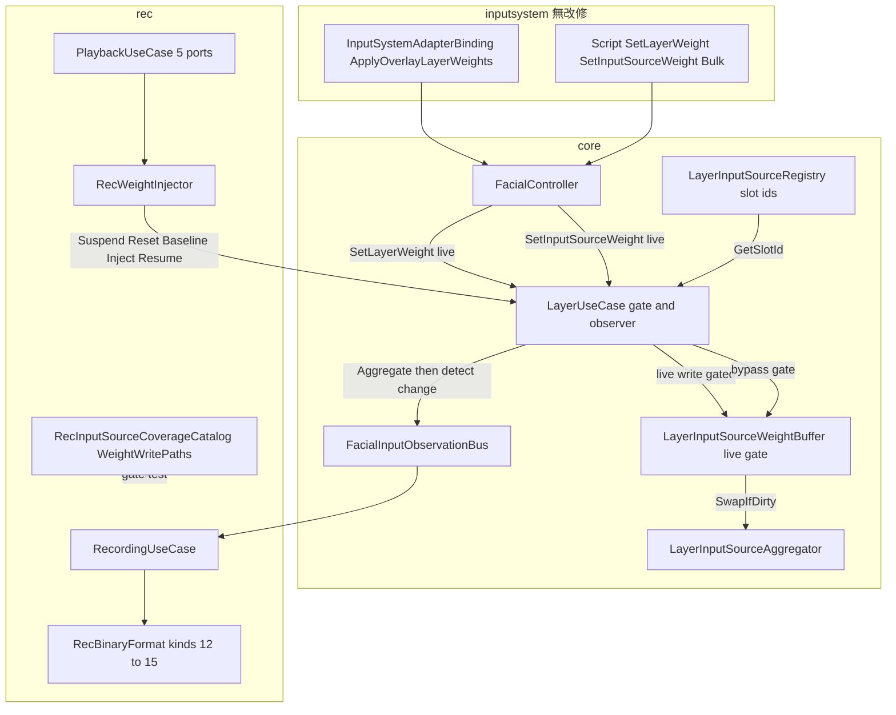
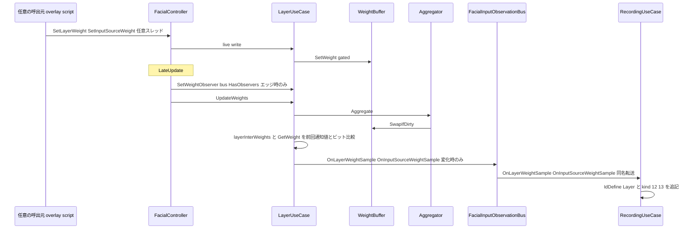
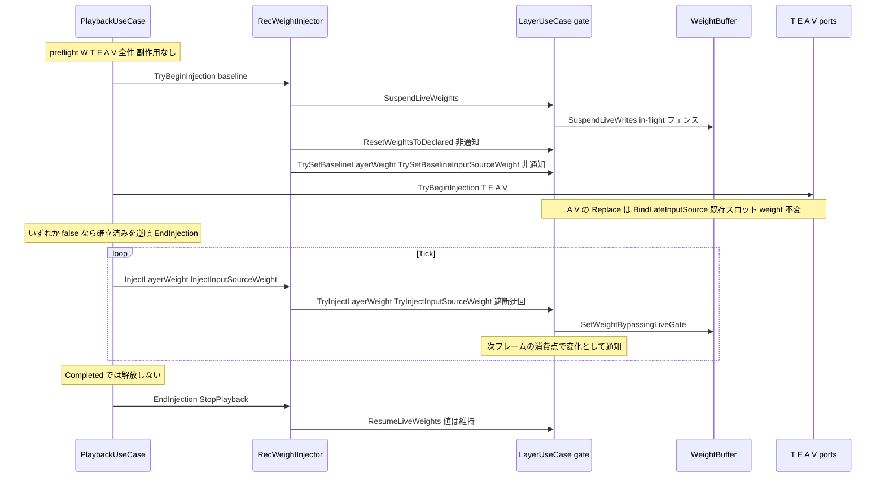
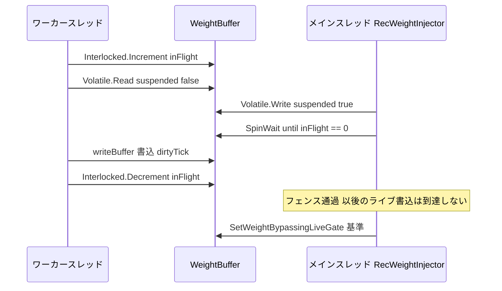
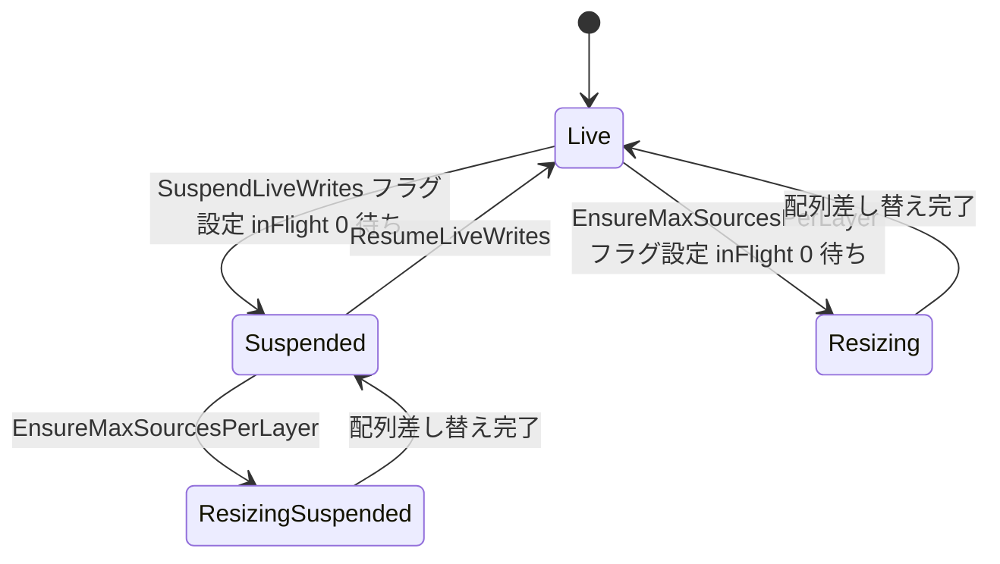

# Technical Design Document — rec-weight-coverage

## Overview

**Purpose**: 本機能は、REC（`com.hidano.facialcontrol.rec`）の記録・基準状態捕捉・再生時遮断・注入・`.fcrec` ラウンドトリップの対象に、第 5 の系統として **レイヤー weight**（inter-layer weight）と **入力源 weight**（(layer, source) スロットの intra-layer weight）のランタイム変更を加える。rec-full-input-coverage（HID-35）が既知制限として残した「weight 経路はライブのまま残る（HID-80）」を解消し、実機症状 HID-137（InputSystem Overlay モードのトリガーが REC 再生中もライブで効く）を構造的に塞ぐ。

**Users**: FacialControl を利用する Unity エンジニアが、ゲームパッドのトリガーで overlay レイヤー weight を動かす構成や、スクリプトで weight を操作する構成を含め、収録どおりのブレンドを再生で完全再現するために利用する。ライブラリ開発者は、weight 書込経路の分類正本とゲートテストにより、weight 経路が再び未対応になった際に機械的に気付く。

**Impact**: core（`com.hidano.facialcontrol`）に weight の観測面（`ILayerWeightObserver`。`LayerUseCase` が消費点で変化検出して通知）、遮断面と注入面と基準確立面（`IWeightInjectionGate`。`LayerUseCase` が実装し、`LayerInputSourceWeightBuffer` がライブ書込ゲートを持つ）を追加する。既存スロットの `BindLateInputSource` は weight を書き換えない契約へ変更する（REC の Replace / 復元が weight を乱さないため）。rec は 5 番目の注入ポート `IWeightInjectionPort` / `RecWeightInjector` を追加し、`.fcrec` は formatVersion 1 のまま kind 12〜15 と `IdDefine` 種別 `Layer` を追加、ヘッダ `flags` bit1（`RecHeaderFlags.WeightBaseline`）を必須化して本 spec 以前の構造を読込段階で確定的に拒否する。inputsystem / osc / lipsync / ifacialmocap / timeline の Runtime は無改修。

### Goals

- weight 経路について、記録・基準状態・遮断・注入・`.fcrec` ラウンドトリップの 5 点をすべて成立させる（部分成立は完成とみなさない。Req 1.4）
- 合成に実際に使われる weight の最終値（clamp 後）を、呼出元・スレッドを問わず消費点で 1 回だけ観測し、同値は通知しない
- 再生中のライブ weight 書込（inputsystem overlay 駆動・スクリプト・バルク・任意スレッド）を core 側だけで遮断し、REC の注入だけを通す
- 5 ポート（W / T / E / A / V）の all-or-nothing 確立と `StopPlayback` 唯一の解放点を維持する
- 毎フレームの定常処理（記録中・再生中）でヒープ確保ゼロ、観測者ゼロ・遮断未使用時は既存コードパスの挙動・性能不変

### Non-Goals

- プロファイルに宣言された既定 weight の編集機能、weight の補間・イージング（即時反映のまま）
- 記録セッション中の `SetProfile` / `LoadCharacter` / `ReloadProfile` を跨ぐ完全な記録保証（既存の既知制限を継承）
- 再生開始後に新規登録された入力源スロットの weight 遮断（開始時スナップショット方式の既知制限を継承。Req 6.7）
- レイヤー名の重複検出・排他 on/off オプション・ランタイム UI・ボーン経路
- 本 spec 以前の構造で書かれた `.fcrec` の読込互換・移行（ヘッダ flags で確定的に拒否し再収録を案内）

## Boundary Commitments

### This Spec Owns

- core の weight 観測面: `ILayerWeightObserver`（core Domain Interfaces）、`IFacialInputObserver.OnLayerWeightSample / OnInputSourceWeightSample`、`IFacialInputObservationBus : ILayerWeightObserver`、`FacialInputObservationBus` の配信、`LayerUseCase.SetWeightObserver` と消費点の変化検出、`FacialController` の observer 着脱
- core の weight 遮断面・注入面・基準確立面: `IWeightInjectionGate`（core Domain Interfaces）と `LayerUseCase` による実装、`LayerInputSourceWeightBuffer` のライブ書込ゲート（`SuspendLiveWrites` / `ResumeLiveWrites` / in-flight フェンス）と遮断迂回書込、`FacialController.WeightInjectionGate` 公開
- スロット同定キーの契約: `WeightSlotIds.ExpressionSlotId`（sourceIdx 0 の予約 id）、sourceIdx ≥ 1 は registry のスロット id（宣言 id）、レイヤーはレイヤー名
- `LayerUseCase.BindLateInputSource` / `UnbindLateInputSource` の weight 書込の遮断中挙動（遮断中は既存スロットの置換で宣言 weight を再適用しない。新規スロットの初期 weight と `UnbindLateInputSource` の詰め直しは構造書込として遮断を迂回。遮断中でないときの挙動は不変）
- プロファイル読込境界（`SystemTextJsonParser` / `FacialCharacterProfileConverter`）でのレイヤー名重複の検出と後続重複の読み捨て（Warning）
- rec の拡張: `RecEventKind` 12〜15、`RecEvent.LayerIdIndex` / `IdDefinitionKind.Layer`、`RecHeaderFlags.WeightBaseline` と `RequiredHeaderFlags`、`RecBaselineState` の weight エントリ、`RecIdTable` のレイヤー id、`RecBinaryFormat` / `RecTimeline` / `RecTimelineSeek` / `RecPlaybackScheduler` / `IRecEventVisitor` の weight 対応、`IWeightInjectionPort` / `RecWeightInjector`、`PlaybackUseCase` の 5 ポート順序（W → T → E → A → V）、`RecordingUseCase` / `RecStreamWriter` / `RecBaselineCapture` / `RecCharacterBinding` の weight 対応
- weight 書込経路の分類正本 `RecInputSourceCoverageCatalog.WeightWritePaths` と網羅性ゲート `RecWeightWritePathCatalogTests`
- 既存 spec 文書（rec-full-input-coverage の requirements / design、rec-recording-playback の design）と rec / timeline パッケージドキュメントの整合修正

### Out of Boundary

- inputsystem / osc / lipsync / ifacialmocap / timeline の Runtime 改修（Req 9.4）。inputsystem の `ApplyOverlayLayerWeights` は無改修で、core の `FacialController.SetLayerWeight` 遮断面に乗る。timeline Editor `RecEventSequenceAdapter` は未対象 kind（12 / 13）をスキップする契約追随のみ
- `LayerBlender` / `LayerInputSourceAggregator` の改修（観測は `LayerUseCase` が `Aggregate` 直後に行う）
- 既存 4 ポート（T / E / A / V）の注入ロジック、`IInjectedInputSource` 占有規則、入力源識別スコープ契約の変更（rec-full-input-coverage の契約を流用する）
- `.fcrec` の `formatVersion` 繰り上げ、旧構造ファイルの読込互換
- レイヤー名重複の検出・拒否（プロファイル検証はスコープ外。重複時は先勝ち解決を前提契約として明記）

### Allowed Dependencies

- rec → core（Domain / Application / Adapters の 3 asmdef）のみ。rec Runtime / rec Tests は拡張パッケージを参照しない（weight 書込経路のカタログは型 FullName + メンバー名の文字列で持つ）
- core → rec の依存禁止。core は `ILayerWeightObserver` / `IWeightInjectionGate` 等の契約のみを公開する
- inputsystem **Tests**（PlayMode asmdef）→ rec Domain / Application / Adapters。`versionDefines` で `com.hidano.facialcontrol.rec` 存在時に `FACIALCONTROL_HAS_REC_MODULE` を定義し、受け入れテストファイルを `#if` で囲む（osc PlayMode asmdef が inputsystem を参照する既存前例に倣う）
- Rec.Domain ← Rec.Application ← Rec.Adapters ← Rec.Editor、core Domain ← Application ← Adapters の asmdef 方向を維持
- 新規外部依存なし（in-flight フェンスは `System.Threading.Interlocked` / `SpinWait`）

### Revalidation Triggers

- `IFacialInputObserver` / `IFacialInputObservationBus` / `IRecEventVisitor` / `RecBaselineState` コンストラクタ / `PlaybackUseCase` コンストラクタの形状変更（本 spec でいずれも拡張する。利用者: `RecordingUseCase`、各 Fake、timeline Editor `BakeSimulationHarness.RecordingObserver` は `IFacialInputObserver` を実装しないため無影響）
- `IWeightInjectionGate` の形状（Suspend / Resume / Reset / Baseline / Inject / Collect / `LayerNamesAreUnique`）と `WeightSlotIds.ExpressionSlotId`（`@expression`）、`ILayerWeightObserver` と `IFacialInputObserver` の weight 2 メソッドが同名であること（bus の同名転送）
- `LayerUseCase.SuspendLiveWeights` の線形化点（レイヤー側フラグ → buffer フェンスの順、buffer フェンスの戻りが線形化点）。レイヤー weight を任意スレッドから書けるよう変更する場合はレイヤー側にもフェンスが必要
- `LayerInputSourceWeightBuffer.SetWeight` の任意スレッド契約と `SuspendLiveWrites` の in-flight フェンス（単純フラグへの退行は Req 5.3 を崩す）
- `LayerUseCase.BindLateInputSource` の遮断中契約（遮断中は既存スロット置換で宣言 weight を再適用しない）。遮断中にも再適用する実装に戻すと Req 6.3 が崩れる
- `LayerInputSourceRegistry.GetSlotId` が Replace 前後で不変であること（PR #46 で確立）、プロファイル読込境界がレイヤー名重複を読み捨てること（`SystemTextJsonParser` / `FacialCharacterProfileConverter`）。読込境界を増やす場合（新しいプロファイル供給源）は同じ重複解決を入れる
- `.fcrec` のレコード kind 追加・レイアウト変更、`RecBinaryFormat.RequiredHeaderFlags`（0x0003）の変更
- `PlaybackUseCase` のポート順（確立 W → T → E → A → V、解放 T → E → A → V → W、ロールバックは確立済みの逆順）。weight ゲートが Replace 型ポート（A / V）の確立と解放を外側から包む配置を崩すと Req 6.3 が崩れる
- `RecInputSourceCoverageCatalog.WeightWritePaths` のエントリ形状。weight を書く core API の追加・改名・削除は同時にカタログを更新しないとゲートが失敗する

## Architecture

### Existing Architecture Analysis

- **weight の消費点は 2 箇所**: `LayerUseCase.UpdateWeights` は `_aggregator.Aggregate(deltaTime, _layerPriorities, _layerInterWeights, _layerInputScratch)` を 1 回呼ぶ。`AggregateInternal` 冒頭の `_weightBuffer.SwapIfDirty()` で任意スレッドからの入力源 weight 書込がこのフレームの read buffer に確定し、以後 `GetWeight(l, s)` が返す値が加重和に使われる。レイヤー weight は `_layerInterWeights[l]` が `LayerBlender.LayerInput.Weight` に無加工で載る。`Aggregate` 直後に両者を読めば「合成に実際に使われた最終値」である（Req 2.3 / 2.4）
- **ライブ書込の入口は 3 つ**: 入力源 weight は `LayerInputSourceWeightBuffer.SetWeight`（即時書込 + `Interlocked.Increment(_dirtyTick)`、任意スレッド）と `BulkScope.SetWeight → CommitBulk`（pending dict の一括 flush）。レイヤー weight は `LayerUseCase.SetLayerWeight`（`Dictionary` と `float[]` を直接書く。メインスレッド前提の既存契約）。`FacialController.SetLayerWeight / SetInputSourceWeight / BeginInputSourceWeightBatch` はこれらへの薄い委譲、inputsystem の `ApplyOverlayLayerWeights` は `OnLateTick` から `FacialController.SetLayerWeight` を毎フレーム呼ぶのみ。この 3 入口に遮断を置けば拡張パッケージ無改修で全呼出元を遮断できる（Req 5.4）
- **スロット同定キー**: `LayerInputSourceRegistry._slotIds` は宣言 id（registry キー）を保持し `GetSlotId(l, s)` で読める。`TryReplaceSource` はスロット id を変えない（rec-full-input-coverage「入力源識別スコープ」5）。sourceIdx 0（`LayerExpressionSource`）はスロット id が `source.Id = "input"` で inputsystem の予約 slug `input` と文字列衝突するため、weight の同定には使えない
- **`BindLateInputSource` の weight 書込**: 既存スロットの置換後に `_weightBuffer.SetWeight(layerIdx, existingIdx, weight)` で宣言 weight を再書込している（ライブの late-bind 契約。`BindLateInputSource_AppliesDeclaredWeight_ScalesOutput` 等が固定）。REC の注入体装着・原本復元はこの経路（`Replace` → Subscribe → `FacialController.HandleLayerInputSourceRebound` → `BindLateInputSource`）に乗るため、遮断が無いと注入済み weight を上書きする。`UnbindLateInputSource` は後続スロットの weight を詰め直す（構造書込）
- **レイヤー名の重複**: `FacialProfile` コンストラクタ・`SystemTextJsonParser`・`FacialCharacterProfileConverter` のいずれもレイヤー名の重複を検証していない。`SetLayerWeight` / `FindLayerByName` / `_groupedByLayer` は先勝ちで解決する。既存の重複解決の流儀は「Warning + 確定的な解決」（`inputSources` 重複 id は last-wins、`gaze.channels` 重複 id は後続読み捨て）で、例外にはしない
- **既存ゲートのパターン**: `ExpressionUseCase : IExpressionActivationGate`（Suspend / Resume / Inject / Reset / Collect、`FacialController.ExpressionActivationGate` で公開）と `RecExpressionInjector`（`CanBegin` = gate 解決可、`TryBegin` = Suspend → Reset、`End` = Resume）。weight ゲートはこの形を `LayerUseCase` に写す
- **4 ポートのトランザクション**: `PlaybackUseCase.StartPlayback` は `IInjectionPort[]` を同一ループで preflight → 確立 → 失敗時逆順ロールバック。確立と `StopPlayback` 解放は同順（T → E → A → V）
- **`.fcrec`**: ヘッダ `flags` bit0 は必須化済み（bit1〜15 予約）。weight 値は float 1 個で、既存の float ペイロード区画（`RecTimeline._payloadByEvent`、`RecEventChunkQueue` の float 区画、`RecEvent.PayloadFloatCount`）に載せられる。`RecEvent.IdDefinitionKind` は Source / Expression の 2 種

### Architecture Pattern & Boundary Map



**Architecture Integration**:

- **Selected pattern**: 既存所有者の拡張 + 契約の新設（gap analysis Option C）。weight の状態所有者（`LayerUseCase` の `_layerInterWeights`、`LayerInputSourceWeightBuffer`）は変えず、観測・遮断・注入・基準確立の 4 面を `IWeightInjectionGate` 1 本と `ILayerWeightObserver` 1 本に束ね、REC 側は 5 番目のポート `RecWeightInjector` に閉じる
- **Domain boundaries**: 「何が weight の変化か」（消費点でのビット比較）と「どの書込を遮断するか」（ライブ入口 3 つ）は core が所有し rec を知らない。「いつ遮断し何を基準にするか」は `RecWeightInjector` が所有する。「どう永続化するか」（kind 12〜15、`IdDefine` Layer）は rec Domain が所有する
- **Existing patterns preserved**: `HasObservers` エッジでの observer 着脱、Suspend / Resume / Inject / Reset / Collect のゲート形、`IInjectionPort` の preflight → 確立 → 逆順ロールバック、`StopPlayback` 唯一の解放点、warn-once、ヘッダ flags による旧構造拒否、`IdDefine` による文字列 id の索引化
- **New components rationale**: `ILayerWeightObserver`（weight 専用の観測契約。`ILayerSourceValueObserver` の pre-weight 値契約と混同させない）、`IWeightInjectionGate`（weight の 4 面を 1 契約に）、`RecWeightInjector` / `IWeightInjectionPort`（5 番目のポート）、`WeightWritePaths`（型集合では捕捉できない書込 API の分類正本）
- **Steering compliance**: 依存内向き、Domain は Unity 型非依存（`UnityEngine.Debug` のみ容認）、Unity 標準ログのみ、毎フレーム GC ゼロ、UI 追加なし

### Dependency Direction（破ってはならない）

```
core Domain（契約: ILayerWeightObserver / IWeightInjectionGate / WeightSlotIds / LayerWeightEntry / InputSourceWeightEntry、LayerInputSourceWeightBuffer のゲート）
  ← core Application（LayerUseCase: IWeightInjectionGate 実装・消費点の変化検出・observer 委譲）
    ← core Adapters（FacialController: WeightInjectionGate 公開・observer 着脱）
Rec.Domain（RecEvent / RecEventKind / RecHeaderFlags / RecBaselineState / RecIdTable / RecBinaryFormat / RecTimelineSeek / IWeightInjectionPort / Catalog）
  ← Rec.Application（RecordingUseCase / PlaybackUseCase）
    ← Rec.Adapters（RecWeightInjector / RecBaselineCapture / RecStreamWriter / RecCharacterBinding）
inputsystem Runtime → core（無改修）。inputsystem Tests PlayMode → rec（受け入れテストのみ、versionDefines 付き）
timeline Editor → Rec.Domain（RecEventSequenceAdapter は kind 12 / 13 をスキップ）
```

### weight 対象の識別契約（Req 2.6）

| 対象 | キー | 由来 | Replace 前後 |
|------|------|------|--------------|
| レイヤー weight | `layerName`（`LayerDefinition.Name`） | `FacialProfile.Layers` | 不変（プロファイル再構築で別インスタンスになっても同名は同一対象） |
| 入力源 weight（sourceIdx 0） | `(layerName, WeightSlotIds.ExpressionSlotId)` = `(layerName, "@expression")` | 予約 id。`ExpressionActivationSource.ReservedId` と同じ文字列（系1 の消費アダプタ `LayerExpressionSource` がこのスロット） | 不変 |
| 入力源 weight（sourceIdx ≥ 1） | `(layerName, slotId)`、`slotId = LayerInputSourceRegistry.GetSlotId(l, s)`（宣言 id = `InputSourceRegistry` キー） | レイヤー宣言 / late-bind の宣言 id | 不変（`TryReplaceSource` はスロット id を変えない） |

- **レイヤー名の一意性はプロファイル読込境界で確立する**（設計レビュー 1 回目の指摘 2 への対応）。`SystemTextJsonParser`（JSON → `FacialProfile`）と `FacialCharacterProfileConverter`（SO → `FacialProfile`）はレイヤー名の重複を検出し、**後続の重複レイヤーを読み捨てて Warning を 1 回出す**（既存の `gaze.channels` 重複 id・`inputSources` 重複 id と同じ「警告 + 確定的な解決」の流儀。例外にはしない）。これにより `FacialController` が実行時に持つ `FacialProfile.Layers` のレイヤー名は常に一意で、`(layerName)` / `(layerName, slotId)` が全対象を一意に指す
- **重複が残るプロファイルでは REC を開始しない**（設計レビュー 2 回目の指摘 2 への対応）: `FacialProfile` を直接構築したテスト等で重複名が残っている場合、`IWeightInjectionGate.LayerNamesAreUnique` が false になり、`RecWeightInjector.CanBeginInjection` は reason（`profile has duplicate layer names; weight targets cannot be identified`）付きで false を返して**再生開始を拒否**し、`RecCharacterBinding.StartRecording` も Warning を出して**録画開始を拒否**する。したがって REC の記録・基準・注入はレイヤー名が一意なプロファイルでしか動かず、「一方の weight が記録から失われる」状態は起きない。`LayerUseCase` の weight 面の名前解決自体は `SetLayerWeight` と同じ先勝ちで確定的だが、REC からは到達しない
- 予約 id `@expression` は registry の id 文字集合 `[a-zA-Z0-9_.\-:]` に `@` を含まないため、宣言 id と衝突しない。`.fcrec` の Source id 表には既に seed 済み。同一レイヤー内のスロット id は `LayerInputSourceRegistry.TryAddSource` が重複を拒否し、JSON の `inputSources` 重複はパーサが last-wins で解決するため、レイヤー内で一意
- `UnbindLateInputSource` の compact でスロット index は動くが、キーはスロット id なので対象は変わらない。`LayerUseCase` は compact 後に当該レイヤーの「前回通知値」を未観測へ戻し、次フレームで現在値を通知する

### Technology Stack

| Layer | Choice / Version | Role in Feature | Notes |
|-------|------------------|-----------------|-------|
| Runtime | Unity 6000.3.19f1 / C# | 実行基盤 | 対象 Unity プロジェクトは `FacialControl/` |
| core | `com.hidano.facialcontrol` Domain / Application / Adapters asmdef | weight 観測面・遮断面・注入面・基準確立面 | `System.Threading.Interlocked` / `SpinWait` で in-flight フェンス。新規外部依存なし |
| rec | `com.hidano.facialcontrol.rec` Domain / Application / Adapters asmdef | 記録・再生・永続化・分類正本 | `.fcrec` formatVersion 1 据え置き、ヘッダ flags bit1 必須化 |
| inputsystem | `com.hidano.facialcontrol.inputsystem` Tests PlayMode asmdef | overlay 受け入れテスト | Runtime 無改修。Tests asmdef に rec 参照 + `versionDefines` |
| Test | com.unity.test-framework 1.6.0 + `Hidano.FacialControl.Testing` | Small / Medium 属性 | スレッドを使う競合テストは Medium（EditMode） |

## File Structure Plan

### core（`FacialControl/Packages/com.hidano.facialcontrol/`）

```
Runtime/Domain/
├── Interfaces/
│   ├── ILayerWeightObserver.cs            # 新規: weight 変化の観測契約（レイヤー / 入力源）
│   ├── IWeightInjectionGate.cs            # 新規: weight の遮断・基準確立・注入・収集の契約 + WeightSlotIds
│   └── IFacialInputObservationBus.cs      # 変更（Domain/Adapters）: ILayerWeightObserver を継承
├── Adapters/
│   └── IFacialInputObserver.cs            # 変更: OnLayerWeightSample / OnInputSourceWeightSample
├── Models/
│   ├── LayerWeightEntry.cs                # 新規: (LayerName, Weight) readonly struct
│   └── InputSourceWeightEntry.cs          # 新規: (LayerName, SlotId, Weight) readonly struct
└── Services/
    ├── FacialInputObservationBus.cs       # 変更: 2 メソッドの配信（HasObservers 早期 return・例外隔離）
    └── LayerInputSourceWeightBuffer.cs    # 変更: ライブ書込ゲート（Suspend / Resume / in-flight フェンス）、SetWeightBypassingLiveGate、CommitBulk の遮断
Runtime/Application/UseCases/
└── LayerUseCase.cs                        # 変更: IWeightInjectionGate 実装、消費点の変化検出と observer 通知、SetLayerWeight のゲート、BindLateInputSource / UnbindLateInputSource の weight 契約、宣言 weight 配列
Runtime/Adapters/Playable/
└── FacialController.cs                    # 変更: WeightInjectionGate 公開、HasObservers エッジで SetWeightObserver 着脱
Runtime/Adapters/Json/SystemTextJsonParser.cs                              # 変更: layers のレイヤー名重複を検出し後続を読み捨て（Warning）
Runtime/Adapters/ScriptableObject/Serializable/FacialCharacterProfileConverter.cs  # 変更: 同上（SO → FacialProfile）
Tests/EditMode/Application/LayerUseCaseTests.cs            # 追記 [SmallTest]: 観測・遮断・注入・基準・BindLate 契約・重複名フォールバック
Tests/EditMode/Adapters/Json/SystemTextJsonParserTests.cs  # 追記 [SmallTest]: レイヤー名重複の読み捨て
Tests/EditMode/Adapters/ScriptableObject/FacialCharacterProfileConverterTests.cs  # 追記 [SmallTest]: 同上
Tests/Small/Domain/LayerInputSourceWeightBufferTests.cs    # 追記 [SmallTest]: ゲート、bypass、bulk 破棄
Tests/EditMode/Domain/LayerInputSourceWeightBufferConcurrencyTests.cs  # 新規 [MediumTest]: ワーカースレッド書込と Suspend の競合
Tests/Small/Domain/Services/FacialInputObservationBusTests.cs          # 追記 [SmallTest]: 新 2 メソッド
```

### rec（`FacialControl/Packages/com.hidano.facialcontrol.rec/`）

```
Runtime/Domain/
├── Models/
│   ├── RecEventKind.cs                    # 変更: 12 LayerWeightSample / 13 InputSourceWeightSample / 14 BaselineLayerWeight / 15 BaselineInputSourceWeight
│   ├── RecEvent.cs                        # 変更: LayerIdIndex、IdDefinitionKind.Layer、新 factory、PayloadFloatCount = 1、IsTimedEvent
│   ├── RecHeaderFlags.cs                  # 変更: WeightBaseline = 0x0002
│   ├── RecBaselineState.cs                # 変更: LayerWeightEntries / InputSourceWeightEntries（重複拒否）、TryGetLayerWeight / TryGetInputSourceWeight
│   ├── RecTimeline.cs                     # 変更: LayerIds、kind 12 / 13 の index 検証、PayloadFloatCount = 1 の検証
│   └── RecInputSourceCoverageCatalog.cs   # 変更: WeightWritePaths（RecWeightWritePathEntry）、既存エントリの理由文更新
├── Interfaces/
│   └── IWeightInjectionPort.cs            # 新規（IInjectionPort 継承）
└── Services/
    ├── RecBinaryFormat.cs                 # 変更: RequiredHeaderFlags = 0x0003、IdDefine Layer、kind 12〜15 の serialize / deserialize、基準重複拒否
    ├── RecIdTable.cs                      # 変更: LayerIds、GetOrAddLayerId / TryGetLayerId / TryGetLayerIndex、CreateSeeded の weight seed
    ├── RecPlaybackScheduler.cs            # 変更: IRecEventVisitor に 2 メソッド追加、Dispatch
    └── RecTimelineSeek.cs                 # 変更: kind 12 / 13 の畳み込み
Runtime/Application/UseCases/
├── RecordingUseCase.cs                    # 変更: 2 observer メソッド、layer id の IdDefine、1 float ペイロード
└── PlaybackUseCase.cs                     # 変更: 5 ポート（W → T → E → A → V）、新 Visit、CreateFilteredBaseline の weight 引継ぎ
Runtime/Adapters/
├── Playback/RecWeightInjector.cs          # 新規: IWeightInjectionPort（CanBegin = gate 解決可、TryBegin = Suspend → Reset → 基準、Inject、End = Resume）
├── Recording/RecBaselineCapture.cs        # 変更: weight gate から Collect
├── Recording/RecStreamWriter.cs           # 変更: IdDefine Layer と kind 14 / 15 の書込、CountBaselineRecords
└── Playable/RecCharacterBinding.cs        # 変更: RecWeightInjector 構築、5 ポート、基準捕捉に gate を渡す
Tests/EditMode/
├── RecWeightInjectorTests.cs              # 新規 [SmallTest]
├── RecWeightWritePathCatalogTests.cs      # 新規 [SmallTest]: 書込経路カタログの実在・重複・理由ゲート
└── （既存 RecBinaryFormatTests / RecIdTableTests / RecBaselineStateTests / RecTimelineSeekTests / RecPlaybackSchedulerTests / RecordingUseCaseTests / PlaybackUseCaseTests / PlaybackUseCaseFourPortTests / RecStreamWriterTests / RecBaselineCaptureTests / RecCharacterBindingTests / RecInputSourceCoverageCatalogTests へ追記）
Tests/PlayMode/
├── RecCharacterBindingPlayModeTests.cs    # 追記 [MediumTest]: weight の完全再現・遮断・引き継ぎ・Replace 不変・途中再生・旧ファイル拒否
└── RecGcZeroGateTests.cs                  # 追記 [MediumTest]: weight 記録・再生の GC ゼロ、NullWeightInjectionPort
```

### Modified Files（その他）

- `FacialControl/Packages/com.hidano.facialcontrol.inputsystem/Tests/PlayMode/Hidano.FacialControl.InputSystem.Tests.PlayMode.asmdef` — `Hidano.FacialControl.Rec.Domain / Application / Adapters` を参照に追加、`versionDefines` に `com.hidano.facialcontrol.rec` → `FACIALCONTROL_HAS_REC_MODULE`
- `FacialControl/Packages/com.hidano.facialcontrol.inputsystem/Tests/PlayMode/Integration/InputSystemOverlayRecPlaybackTests.cs` — 新規 `[MediumTest]`（`#if FACIALCONTROL_HAS_REC_MODULE`）: 実 `FacialController` + Overlay binding + 仮想 Gamepad + `RecCharacterBinding` の記録→再生（Req 10.2 / HID-137 受け入れ）
- `FacialControl/Packages/com.hidano.facialcontrol.timeline/Editor/RecEventSequenceAdapter.cs` — kind 12 / 13 を Export 対象外としてスキップ（例外を投げない）
- 文書: `.kiro/specs/rec-full-input-coverage/design.md` / `requirements.md`、`.kiro/specs/rec-recording-playback/design.md`、rec `README.md` / `Documentation~/README.md` / `CHANGELOG.md`、timeline `README.md`

## System Flows

### 記録フロー（weight の消費点観測）



- **消費粒度（Req 2.4）**: 比較は `Aggregate` 直後に 1 回。同一フレーム内の複数書込は read buffer / `_layerInterWeights` の最終値だけが比較対象になる
- **同値非通知（Req 2.5）**: `BitConverter.SingleToInt32Bits` の一致で判定。前回通知値の番兵は `float.NaN`（clamp 後の実効値は NaN にならない）
- **observer 接続時の同期**: `SetWeightObserver(非 null)` は前回通知値を現在値（`_layerInterWeights`、`GetWeight` の read 側）へ通知なしで同期する。基準捕捉（`RecBaselineCapture`）は同じフレームの Update で同じ値を読むため、接続直後のフレームは変化分だけが時刻付きで記録される（analog 観測と同じ性質。同一フレームの LateUpdate までに届いた書込は t≈0 の時刻付きイベントになる）

### 再生フロー（5 ポートの all-or-nothing と weight ゲート）



- **順序（Req 5.5 / 6.3 / 6.4）**: 確立は **W → T → E → A → V**、`StopPlayback` の解放は **T → E → A → V → W**（weight ゲートが Replace 型ポート A / V の確立と解放を外側から包む）。既存 4 ポートの相対順序（確立・解放とも T → E → A → V）は不変。W を外側に置く理由: A / V の Replace（注入体装着・原本復元）は `BindLateInputSource` に乗り、ライブ契約では既存スロットに宣言 weight を再適用する。遮断中はこの再適用を行わないため、Replace が注入済み / 停止時点の weight を乱さない（Req 6.3）。ロールバックは確立済みポートの逆順（例: A で失敗 → E → T → W）。`PlaybackUseCase` は確立順配列と解放順配列を分けて持つ（既存の単一配列ループを 2 配列に拡張）
- **W の確立手順**: `SuspendLiveWeights()`（false = 既に遮断中 → `TryBeginInjection` は false。他者が weight ゲートを使うことは無いため通常は true）→ `ResetWeightsToDeclared()`（全レイヤー 1.0、全スロットは宣言 weight、sourceIdx 0 は 1.0。通知なし）→ baseline の `LayerWeightEntries` / `InputSourceWeightEntries` を `TrySetBaseline*`（通知なし。未知の対象は warn-once）→ true
- **注入（Req 6.1 / 6.2）**: `TryInject*` は遮断を迂回して通常の clamp・反映タイミング（次 `SwapIfDirty`）で書く。前回通知値は更新しないため、次フレームの消費点で変化として観測される（再生中の再記録に注入イベントが残る。Req 3.5）
- **解放（Req 5.6 / 5.7）**: `EndInjection` は `ResumeLiveWeights()` のみ。weight 値は維持し自動復元しない。自然完了（Completed）では呼ばれない。解放順で W が最後なので、A / V の原本復元に伴う `BindLateInputSource` は遮断中に走り、停止時点の weight を変えない

### ライブ書込ゲートの原子性（Req 5.3）



- `SuspendLiveWrites` が返った時点で、フラグを見てから書込に入っていたライブ書込（単発・bulk commit とも）はすべて完了しており、以後のライブ書込はフラグで拒否される。したがって基準書込がライブ書込に上書きされない
- スピンは有界（既定 1 ms 相当の `SpinWait` 反復）。上限到達時は Warning を 1 回出して続行する（ワーカーが `SetWeight` / `CommitBulk` 内で長時間停止することは構造上無い）
- `CommitBulk` も in-flight カウンタに参加する（increment → フラグ確認 → flush + `_dirtyTick` → decrement）。フラグが立っていれば pending を破棄してプールへ返し、`_dirtyTick` を進めない。**遮断前に開いた bulk スコープを遮断後に commit した場合も破棄**する（スコープ内の個別 `SetWeight` は蓄積のみで副作用がないため、判定は commit 時の 1 回）
- レイヤー weight（`LayerUseCase.SetLayerWeight`）はメインスレッド専用（既存契約を明文化）。`_liveWeightsSuspended` の bool 1 個で遮断する

#### 同期プロトコル（weight バッファと周辺操作の状態遷移）



| 操作 | 呼出スレッド | in-flight フェンス | Live | Suspended | Resizing |
|------|------------|-------------------|------|-----------|----------|
| `SetWeight`（ライブ） | 任意 | 参加（increment → フラグ確認 → 書込 → decrement） | 書込 | 破棄（値・dirty 不変） | 破棄（次の書込で回復。従来は未定義動作） |
| `BulkScope.SetWeight` | 任意 | 不参加（スコープ私有の pending dict へ蓄積のみ） | 蓄積 | 蓄積 | 蓄積 |
| `BulkScope.Dispose`（CommitBulk） | 任意 | 参加 | flush + dirty 1 回 | 破棄 | 破棄 |
| `SetWeightBypassingLiveGate` | メインのみ（`LayerUseCase` の基準・注入・構造書込） | 不参加（メイン直列） | 書込 | 書込 | 呼ばない（resize は `BindLateInputSource` 内で完了してから書く） |
| `SwapIfDirty` / `GetWeight` | メインのみ（`Aggregate` / 収集） | 不参加 | 既存どおり | 既存どおり | 呼ばない（同一メインスレッド上で resize は原子的に完了する） |
| `SuspendLiveWrites` / `ResumeLiveWrites` | メインのみ（REC） | Suspend がフェンスの待ち側 | → Suspended | 冪等 | 待ってから遷移（同一スレッドなので実際には直列） |
| `EnsureMaxSourcesPerLayer`（resize） | メインのみ（`BindLateInputSource`） | Resizing フラグを立て in-flight 0 を待ってから配列差し替え | → Resizing → Live | → ResizingSuspended → Suspended | — |
| registry の Add / Replace / Remove、`BindLateInputSource` / `UnbindLateInputSource` | メインのみ（既存契約） | — | 既存どおり | 置換は weight を書かない、新規・compact は bypass | — |
| REC ライフサイクル（`TryBeginInjection` / `Inject*` / `EndInjection`） | メインのみ（`RecCharacterBinding.Update`） | Suspend 経由 | — | — | — |

- **原則**: ワーカースレッドから到達し得るのは「ライブ書込」（`SetWeight` / `CommitBulk`）だけで、両者は同じ in-flight カウンタに参加する。状態を変える操作（Suspend / Resume / resize / 構造書込 / Swap）はすべてメインスレッドで直列に行われるため、相互の競合は存在せず、唯一の競合はワーカーのライブ書込 × メインの状態遷移で、それをフェンスが閉じる
- **レイヤー weight と入力源 weight の線形化点**: `LayerUseCase.SuspendLiveWeights()` は「レイヤー側フラグ → buffer の `SuspendLiveWrites`（フェンス）」の順で両系統を止め、`SuspendLiveWrites` の戻りを共通の線形化点とする（「LayerUseCase → 遮断と線形化点」）。レイヤー weight のライブ書込はメインスレッド専用のため同一スレッドの逐次順で、入力源 weight はフェンスで、それぞれ「線形化点以後のライブ書込は反映されない」が成立する。`RecWeightInjector.TryBeginInjection` はこの戻りの後にのみ `ResetWeightsToDeclared` / `TrySetBaseline*` を呼ぶ
- **検証（追加）**: `LayerUseCaseTests.SuspendLiveWeights_ThenLayerAndSourceLiveWrites_NeitherReachesNextAggregate`（同一テスト内でレイヤー weight とスロット weight の両方をライブ書込し、どちらも基準値のまま）と `LayerInputSourceWeightBufferConcurrencyTests`（d）: ワーカーがスロット weight を連打する中で `LayerUseCase.SuspendLiveWeights` → 基準設定（レイヤー + スロット）→ `UpdateWeights` → 両系統が基準値、を反復
- **resize**: 既存コードは「`SetWeight` / `GetWeight` との同時実行は想定しない」としていたが、本 spec で resize も Resizing フラグ + in-flight 0 待ちの同じフェンスで保護し、resize 中に到達したライブ書込は破棄する（未定義動作から確定的な破棄へ。late-bind は低頻度で窓は数マイクロ秒）。Suspended 中の resize は Suspended を維持する
- **検証**: `LayerInputSourceWeightBufferConcurrencyTests`（Medium）で (a) 単発ライブ書込連打 × Suspend → 基準設定 → Swap → 読取が基準値、(b) bulk commit 連打 × Suspend で同じ、(c) ライブ書込連打 × resize で例外・配列破壊なし・既存 weight が保持される、を反復検証する

## Requirements Traceability

| Requirement | Summary | Components | Interfaces | Flows |
|-------------|---------|------------|------------|-------|
| 1.1 | weight 書込経路の列挙と分類 | 本書「weight 書込経路分類表」、`RecInputSourceCoverageCatalog.WeightWritePaths` | `RecWeightWritePathEntry` | — |
| 1.2 | 拡張側呼出元の列挙 | 同表（`InputSystemAdapterBinding.ApplyOverlayLayerWeights` → `FacialController.SetLayerWeight`） | — | 記録フロー |
| 1.3 | 明示的除外の根拠 | 同表の理由列（InjectionPath / StructuralWrite / Initialization） | `RecWeightWritePathExclusionReason` | — |
| 1.4 | 対象経路の 5 点成立 | 全コンポーネント | — | 両フロー |
| 2.1 | レイヤー weight 観測面 | `LayerUseCase`（消費点比較）、`FacialInputObservationBus` | `ILayerWeightObserver.OnLayerWeightSample` → `IFacialInputObserver.OnLayerWeightSample`（同名転送） | 記録フロー |
| 2.2 | 入力源 weight 観測面 | 同上 | `ILayerWeightObserver.OnInputSourceWeightSample` → `IFacialInputObserver.OnInputSourceWeightSample` | 記録フロー |
| 2.3 | clamp 後の実効値・呼出元非依存 | `LayerUseCase`（`_layerInterWeights` / `GetWeight` を読む） | — | 記録フロー |
| 2.4 | 消費粒度・フレーム内畳み込み | `LayerUseCase.UpdateWeights`（`Aggregate` 直後に 1 回） | — | 記録フロー |
| 2.5 | 同値非通知 | `LayerUseCase`（前回通知値配列、ビット比較） | — | 記録フロー |
| 2.6 | 安定したスロット識別子 | 本書「weight 対象の識別契約」、`WeightSlotIds`、`LayerInputSourceRegistry.GetSlotId`、`SystemTextJsonParser` / `FacialCharacterProfileConverter` のレイヤー名重複読み捨て、`IWeightInjectionGate.LayerNamesAreUnique` による REC 開始拒否（`RecWeightInjector.CanBeginInjection` / `RecCharacterBinding.StartRecording`） | `WeightSlotIds.ExpressionSlotId`、`LayerNamesAreUnique` | — |
| 2.7 | 観測のみ | `LayerUseCase` は比較と通知のみ、書き戻しなし | — | — |
| 3.1–3.2 | 時刻付き記録 | `RecordingUseCase.OnLayerWeightSample / OnInputSourceWeightSample`（kind 12 / 13） | `IFacialInputObserver` | 記録フロー |
| 3.3 | 無変化で記録増なし | `LayerUseCase` の変化検出 | — | 記録フロー |
| 3.4 | float ビット保存 | `RecBinaryFormat`（f32 生ビット）、`RecordingUseCase`（量子化なし） | — | — |
| 3.5 | 再生中の注入も記録 | `TryInject*` は前回通知値を更新しないため消費点で変化として通知 | — | 再生フロー |
| 4.1–4.2 | 基準捕捉（全レイヤー・全スロット） | `RecBaselineCapture`、`IWeightInjectionGate.CollectLayerWeights / CollectInputSourceWeights` | `LayerWeightEntry` / `InputSourceWeightEntry` | — |
| 4.3 | 基準先行 | `RecStreamWriter.Open`、`RecBinaryFormat` の基準先行不変条件（kind 14 / 15 は 12 / 13 より前） | — | — |
| 4.4 | 再生開始時に基準確立 | `RecWeightInjector.TryBeginInjection` | `IWeightInjectionGate.TrySetBaseline*` | 再生フロー |
| 4.5 | 基準外の確定値 | `IWeightInjectionGate.ResetWeightsToDeclared`（宣言値） | — | 再生フロー |
| 4.6 | 基準確立の非通知 | `ResetWeightsToDeclared` / `TrySetBaseline*` は前回通知値も更新 | — | 再生フロー |
| 5.1 | 遮断面（冪等） | `IWeightInjectionGate.SuspendLiveWeights / ResumeLiveWeights`、`LayerInputSourceWeightBuffer.SuspendLiveWrites / ResumeLiveWrites` | — | 再生フロー |
| 5.2 | レイヤー weight のライブ書込遮断 | `LayerUseCase.SetLayerWeight`（`_liveWeightsSuspended` で no-op） | — | 再生フロー |
| 5.3 | 入力源 weight のライブ書込遮断（任意スレッド・bulk） | `LayerInputSourceWeightBuffer.SetWeight` / `CommitBulk`（in-flight フェンス参加、遮断中は破棄）、resize も同フェンス | — | ゲート原子性フロー、同期プロトコル |
| 5.4 | 拡張無改修で遮断 | 遮断点はライブ入口 3 つ（`SetLayerWeight` / `SetWeight` / `CommitBulk`） | — | — |
| 5.5 | 遮断 → 基準確立 | `RecWeightInjector.TryBeginInjection` の手順、W がポート先頭 | — | 再生フロー |
| 5.6 | 停止時は値維持・遮断解除 | `RecWeightInjector.EndInjection` = `ResumeLiveWeights` のみ | — | 再生フロー |
| 5.7 | Completed で解放しない | `PlaybackUseCase`（既存規則） | — | 再生フロー |
| 5.8 | 常時有効・オプションなし | 設定項目を設けない | — | — |
| 6.1 | 遮断迂回の注入経路 | `IWeightInjectionGate.TryInject*`、`LayerInputSourceWeightBuffer.SetWeightBypassingLiveGate` | — | 再生フロー |
| 6.2 | 時刻到達で注入 | `PlaybackUseCase.VisitLayerWeightSample / VisitInputSourceWeightSample` → `IWeightInjectionPort` | `IRecEventVisitor` | 再生フロー |
| 6.3 | Replace / 復元で weight 不変 | `LayerUseCase.BindLateInputSource`（遮断中は既存スロット置換で宣言 weight を再適用しない）+ `PlaybackUseCase` の順序（W が A / V を外側から包む） | — | 再生フロー注記 |
| 6.4 | 5 種の一貫順序・all-or-nothing | `PlaybackUseCase`（確立 W → T → E → A → V、解放 T → E → A → V → W、逆順ロールバック） | `IInjectionPort` | 再生フロー |
| 6.5 | 依存未解決で開始拒否 | `RecWeightInjector.CanBeginInjection`（gate null → false） | `IInjectionPort.CanBeginInjection` | 再生フロー |
| 6.6 | 未知対象のスキップ・warn-once | `RecWeightInjector`（`TryInject*` / `TrySetBaseline*` false → id 単位 1 回の Warning） | — | — |
| 6.7 | 新規スロットは遮断対象外 | `LayerUseCase.BindLateInputSource`（新規スロット初期 weight は構造書込） | — | — |
| 7.1–7.2 | ラウンドトリップ | `RecBinaryFormat`、`RecTimeline`、`RecStreamWriter`、`RecFileReader` | — | — |
| 7.3 | formatVersion 1 据え置き | `RecBinaryFormat.CurrentFormatVersion = 1`（在置き追加） | — | — |
| 7.4 | 旧構造の確定的拒否 | `RecHeaderFlags.WeightBaseline`、`RecBinaryFormat.RequiredHeaderFlags = 0x0003`、`TryRead` ヘッダ検査 | — | — |
| 7.5 | weight 無変化でも基準を書く | `RecBaselineCapture`（全レイヤー・全スロット）、`RecStreamWriter.WriteBaseline` | — | — |
| 7.6 | 途中再生の畳み込み | `RecTimelineSeek.BuildBaselineAt`（kind 12 / 13） | — | — |
| 7.7 | timeline REC Export の継続読取 | timeline Editor `RecEventSequenceAdapter`（kind 12 / 13 スキップ） | — | — |
| 7.8 | core リーダーは未知 kind をスキップしない | `RecBinaryFormat.TryRead`（既存規則維持） | — | — |
| 8.1 | 分類正本の更新 | `RecInputSourceCoverageCatalog`（既存エントリの理由文更新 + `WeightWritePaths`）、rec-full-input-coverage design の分類表 | — | — |
| 8.2 | weight 経路の分類保持 | `RecInputSourceCoverageCatalog.WeightWritePaths` | `RecWeightWritePathEntry` | — |
| 8.3 | 陳腐化で失敗 | `RecWeightWritePathCatalogTests`（型 + メンバーの reflection 実在検査） | — | — |
| 8.4 | 既存検査の維持 | `RecInputSourceCoverageCatalogTests` 無変更（件数 assert は理由文更新のみで不変） | — | — |
| 8.5 | EditMode / Small / CI | `[SmallTest]`、reflection のみ | — | — |
| 9.1 | 面の追加に限定 | core 変更は観測・遮断・注入・基準の面と `BindLateInputSource` の weight 契約のみ | — | — |
| 9.2 | 未使用時ゼロコスト | observer null で比較ループなし、ゲートは `Volatile.Read` + Interlocked 2 回 | — | — |
| 9.3 | core は rec 非依存 | 契約のみ core | — | — |
| 9.4 | 拡張 Runtime 無改修 | inputsystem Tests と timeline Editor のみ | — | — |
| 9.5 | 毎フレーム GC ゼロ | 事前確保配列、文字列は registry / profile の既存参照、1 float スクラッチ | — | — |
| 9.6 | 10 体スケール | per-FC の `LayerUseCase` / bus / injector | — | — |
| 9.7 | 標準ログのみ | warn-once、カスタム例外なし | — | — |
| 10.1–10.10 | 受け入れ検証 | Testing Strategy 節 | — | — |
| 11.1–11.7 | 文書整合 | Components「Documentation」 | — | — |

## Components and Interfaces

### Summary

| Component | Domain/Layer | Intent | Req Coverage | Key Dependencies | Contracts |
|-----------|--------------|--------|--------------|------------------|-----------|
| ILayerWeightObserver / IFacialInputObserver / Bus 拡張 | core Domain | weight 変化の観測配信契約 | 2.1–2.2, 3.1–3.2 | FacialInputObservationBus (P0) | Event |
| IWeightInjectionGate + WeightSlotIds + Entry 構造体 | core Domain | weight の遮断・基準・注入・収集の契約と識別子 | 2.6, 4.1–4.6, 5.1, 6.1 | — | Service |
| LayerInputSourceWeightBuffer（改修） | core Domain | ライブ書込ゲート（in-flight フェンス）、遮断迂回書込、bulk 破棄 | 5.1, 5.3, 6.1, 9.2 | — | State |
| LayerUseCase（改修） | core Application | IWeightInjectionGate 実装、消費点の変化検出・通知、SetLayerWeight ゲート、BindLate 契約 | 2.1–2.7, 4.5–4.6, 5.2, 6.1, 6.3, 6.7 | WeightBuffer (P0), Registry (P0) | Service, State |
| FacialController（改修） | core Adapters | gate 公開、observer 着脱 | 2.1, 9.2 | LayerUseCase (P0), Bus (P0) | State |
| RecEvent / RecEventKind / RecHeaderFlags / RecBaselineState / RecTimeline / RecIdTable | rec Domain | weight レコードと基準のモデル、レイヤー id 表 | 4.1–4.3, 7.1–7.5 | — | State |
| RecBinaryFormat（改修） | rec Domain | kind 12〜15 / IdDefine Layer の serialize / deserialize、flags 必須化 | 7.1–7.5, 7.8 | RecIdTable (P0) | Batch |
| RecTimelineSeek（改修） | rec Domain | weight の畳み込み | 7.6 | — | Service |
| IWeightInjectionPort | rec Domain | 5 番目のポート契約 | 6.1–6.2, 6.4 | IInjectionPort (P0) | Service |
| RecInputSourceCoverageCatalog.WeightWritePaths | rec Domain | weight 書込経路の分類正本 | 1.1–1.3, 8.1–8.2 | — | State |
| RecordingUseCase（改修） | rec Application | weight 観測の正規化（IdDefine Layer、kind 12 / 13） | 3.1–3.5 | IRecEventSink (P0) | Service |
| PlaybackUseCase（改修） | rec Application | 5 ポート順序、新 Visit | 5.5–5.7, 6.2, 6.4–6.5 | 5 ポート (P0) | Service, State |
| RecWeightInjector | rec Adapters | W ポート実装 | 4.4–4.6, 5.1, 5.5–5.6, 6.1–6.2, 6.5–6.6 | IWeightInjectionGate (P0) | Service |
| RecBaselineCapture / RecStreamWriter / RecCharacterBinding（改修） | rec Adapters | 基準捕捉・書込・配線 | 4.1–4.3, 7.5 | FacialController (P0) | Service |
| RecWeightWritePathCatalogTests | rec Tests | 書込経路カタログのゲート | 8.3–8.5 | Catalog (P0) | — |
| InputSystemOverlayRecPlaybackTests | inputsystem Tests | overlay 受け入れ（HID-137） | 10.2 | rec (P0) | — |
| timeline Editor 追随 | timeline Editor | kind 12 / 13 スキップ | 7.7 | Rec.Domain (P0) | — |
| Documentation | docs | 既存 spec / README の整合 | 11.1–11.7 | — | — |

### core Domain

#### ILayerWeightObserver / IFacialInputObserver / IFacialInputObservationBus 拡張

| Field | Detail |
|-------|--------|
| Intent | weight の変化を 1 体スコープの観測バスへ流す契約 |
| Requirements | 2.1, 2.2, 3.1, 3.2 |

**Responsibilities & Constraints**
- `ILayerWeightObserver`（core Domain Interfaces）は `LayerUseCase` が変化検出後に呼ぶ観測契約。`IFacialInputObservationBus` がこれを継承し、**同名の** `IFacialInputObserver` の 2 メソッドへ配信する（`ITriggerEventObserver.OnTriggerOn` → `IFacialInputObserver.OnTriggerOn` と同じ「同名転送」の配線。メソッド名は producer 側・consumer 側とも `OnLayerWeightSample` / `OnInputSourceWeightSample` の 1 組に統一し、`*Changed` 等の別名は設けない）
- コールバックはメインスレッド（`LateUpdate` の `UpdateWeights` 内）で同期発火。文字列は profile / registry が保持する参照をそのまま渡す（毎フレーム alloc なし）
- `FacialInputObservationBus` は `HasObservers` 早期 return、`_publishDepth` による遅延適用、例外隔離を既存メソッドと同じ形で実装する
- **既存実装への互換方針**: `IFacialInputObserver` / `IFacialInputObservationBus` に default 実装（default interface method / adapter 基底）は設けず、**全実装を同時更新**する（Runtime 実装は `RecordingUseCase` と `FacialInputObservationBus` の 2 つ、残りは各パッケージのテスト Fake）。rec-full-input-coverage で VP / 系1 を足したときと同じ方針（preview 段階の破壊的変更）

**Contracts**: Event [x]

##### Event Contract
```csharp
namespace Hidano.FacialControl.Domain.Interfaces
{
    /// <summary>消費点で確定した weight の変化を観測する契約。LayerUseCase が変化時のみ呼ぶ（producer 側）。</summary>
    public interface ILayerWeightObserver
    {
        void OnLayerWeightSample(string layerName, float weight);
        void OnInputSourceWeightSample(string layerName, string slotId, float weight);
    }
}

namespace Hidano.FacialControl.Domain.Adapters
{
    public interface IFacialInputObserver
    {
        // 既存 6 メソッドに加えて（consumer 側。bus が ILayerWeightObserver の同名メソッドをそのまま転送する）
        void OnLayerWeightSample(string layerName, float weight);
        void OnInputSourceWeightSample(string layerName, string slotId, float weight);
    }

    public interface IFacialInputObservationBus : ITriggerEventObserver, IExpressionActivationObserver, ILayerWeightObserver
    {
        // 既存どおり。ILayerWeightObserver の 2 メソッドが publish 入口になる
    }
}
```

| 発火元 | producer 契約（core → bus） | consumer 契約（bus → 観測者） | 引数 | タイミング |
|--------|---------------------------|-----------------------------|------|-----------|
| `LayerUseCase.UpdateWeights`（`Aggregate` 直後、変化時のみ） | `ILayerWeightObserver.OnLayerWeightSample` | `IFacialInputObserver.OnLayerWeightSample` | `layerName`、clamp 後の実効 weight | 同一フレーム内、レイヤー昇順 |
| 同上 | `ILayerWeightObserver.OnInputSourceWeightSample` | `IFacialInputObserver.OnInputSourceWeightSample` | `layerName`、`slotId`（sourceIdx 0 は `@expression`）、clamp 後の実効 weight | 同一フレーム内、レイヤー昇順 → スロット昇順 |

- Ordering / delivery: 変化したものだけ、1 対象につきフレームあたり高々 1 回。基準確立（`ResetWeightsToDeclared` / `TrySetBaseline*`）は発火しない。注入（`TryInject*`）は次フレームの消費点で発火する

#### IWeightInjectionGate / WeightSlotIds / LayerWeightEntry / InputSourceWeightEntry

| Field | Detail |
|-------|--------|
| Intent | weight の遮断・基準確立・注入・収集を 1 契約に束ね、rec が core の実装型を知らずに扱えるようにする |
| Requirements | 2.6, 4.1, 4.2, 4.4, 4.5, 4.6, 5.1, 5.2, 5.6, 6.1, 6.6 |

**Responsibilities & Constraints**
- `IExpressionActivationGate` と同型。メインスレッド専用（`RecCharacterBinding.Update` から呼ばれる）
- 「基準」系（`ResetWeightsToDeclared` / `TrySetBaseline*`）は値を書き、同時に前回通知値も更新する（観測者非通知）。「注入」系（`TryInject*`）は値だけを書く（次の消費点で変化として通知）
- 未知のレイヤー名 / スロット id は false（呼出側が warn-once）。clamp は通常経路と同じ

**Contracts**: Service [x]

##### Service Interface
```csharp
namespace Hidano.FacialControl.Domain.Interfaces
{
    /// <summary>weight スロット同定キーの予約 id。</summary>
    public static class WeightSlotIds
    {
        /// <summary>sourceIdx 0（LayerExpressionSource）のスロット id。系1 の予約 id と同じ文字列。</summary>
        public const string ExpressionSlotId = ExpressionActivationSource.ReservedId; // "@expression"
    }

    /// <summary>レイヤー weight / 入力源 weight の遮断・基準確立・注入・収集の契約（メインスレッド専用）。</summary>
    public interface IWeightInjectionGate
    {
        bool IsLiveWeightSuspended { get; }
        /// <summary>プロファイルのレイヤー名が一意か。false なら weight 対象を名前で一意に識別できないため、REC は録画・再生を開始しない。</summary>
        bool LayerNamesAreUnique { get; }
        /// <summary>ライブ weight 書込を遮断する。戻り後、進行中だったライブ書込は反映されない。既に遮断中なら false。</summary>
        bool SuspendLiveWeights();
        /// <summary>遮断を解除する。weight 値は維持する。遮断中でなければ false。</summary>
        bool ResumeLiveWeights();
        /// <summary>全レイヤー weight を 1、全スロット weight を宣言値（sourceIdx 0 は 1）に戻す。観測者へ通知しない。</summary>
        void ResetWeightsToDeclared();
        /// <summary>基準としてレイヤー weight を設定する（遮断迂回・観測者非通知）。未知のレイヤー名は false。</summary>
        bool TrySetBaselineLayerWeight(string layerName, float weight);
        /// <summary>基準として入力源 weight を設定する（遮断迂回・観測者非通知）。未知の (layer, slot) は false。</summary>
        bool TrySetBaselineInputSourceWeight(string layerName, string slotId, float weight);
        /// <summary>遮断を迂回してレイヤー weight を書く。次の消費点で変化として観測される。未知のレイヤー名は false。</summary>
        bool TryInjectLayerWeight(string layerName, float weight);
        /// <summary>遮断を迂回して入力源 weight を書く。次の消費点で変化として観測される。未知の (layer, slot) は false。</summary>
        bool TryInjectInputSourceWeight(string layerName, string slotId, float weight);
        /// <summary>現在の実効レイヤー weight を全レイヤーぶん収集する（基準捕捉用。非毎フレーム）。</summary>
        void CollectLayerWeights(List<LayerWeightEntry> buffer);
        /// <summary>現在の実効入力源 weight を全スロットぶん収集する（基準捕捉用。非毎フレーム）。</summary>
        void CollectInputSourceWeights(List<InputSourceWeightEntry> buffer);
    }
}

namespace Hidano.FacialControl.Domain.Models
{
    public readonly struct LayerWeightEntry { public string LayerName { get; } public float Weight { get; } }
    public readonly struct InputSourceWeightEntry { public string LayerName { get; } public string SlotId { get; } public float Weight { get; } }
}
```
- Preconditions: `FacialController` 初期化済み（`FacialController.WeightInjectionGate` は未初期化なら null）
- Postconditions: `SuspendLiveWeights` 後は `SetLayerWeight` / `SetInputSourceWeight` / bulk commit が no-op。`Collect*` は `_layerInterWeights` と weight buffer の read 側（直近 `SwapIfDirty` 後の値）を返す
- Invariants: `TrySetBaseline*` / `TryInject*` の値は 0〜1 に clamp。対象が存在しないとき状態は変化しない

#### LayerInputSourceWeightBuffer（改修: ライブ書込ゲート）

| Field | Detail |
|-------|--------|
| Intent | 任意スレッドからのライブ書込を遮断し、遮断迂回の書込を提供する |
| Requirements | 5.1, 5.3, 6.1, 9.2 |

**Responsibilities & Constraints**
- `SetWeight`（ライブ）: `Interlocked.Increment(ref _liveWritersInFlight)` → `Volatile.Read(ref _liveSuspended) != 0` なら書かずに return → 既存どおり clamp・書込・`_dirtyTick` → `Interlocked.Decrement`。既存の任意スレッド契約を維持
- `SuspendLiveWrites()`: `Volatile.Write(ref _liveSuspended, 1)` → `SpinWait` で `_liveWritersInFlight == 0` を待つ（有界。既定 1 ms 相当の反復。上限到達は Warning 1 回で続行）。冪等（既に遮断中なら何もしない）。`ResumeLiveWrites()`: フラグを 0 に戻す。`IsLiveWriteSuspended` を公開
- `SetWeightBypassingLiveGate(l, s, w)`: フラグを見ずに書く（clamp・`_dirtyTick` は同じ）。core 内部（`LayerUseCase` の基準・注入・構造書込。メインスレッド）専用であることを XML doc に明記し、カタログで InjectionPath / StructuralWrite として分類する
- `CommitBulk`: in-flight カウンタに参加し、フラグが立っていれば pending を `Clear` してプールへ返し、書込も `_dirtyTick` も行わない。`BulkScope.SetWeight` は従来どおり蓄積のみ
- `EnsureMaxSourcesPerLayer`（resize）: Resizing フラグを立て in-flight 0 を待ってから配列を差し替える。resize 中に到達したライブ書込は破棄（System Flows「同期プロトコル」）。呼出はメインスレッドの late-bind のみ（既存）

**Contracts**: State [x]

##### State Management
- State model: `_liveSuspended`（int、0 / 1）、`_resizing`（int、0 / 1）、`_liveWritersInFlight`（int）。遷移は `SuspendLiveWrites` / `ResumeLiveWrites` / `EnsureMaxSourcesPerLayer` のみ（メインスレッド）
- Concurrency: `SetWeight` / `CommitBulk` はロックフリーで in-flight カウンタに参加。`SuspendLiveWrites` と resize の in-flight フェンスにより「状態遷移が返った後にライブ書込が到達しない」を保証（System Flows「ライブ書込ゲートの原子性」「同期プロトコル」）

### core Application

#### LayerUseCase（改修: IWeightInjectionGate 実装・消費点観測・weight 契約）

| Field | Detail |
|-------|--------|
| Intent | weight の状態所有者として、観測（変化検出）・遮断・基準・注入・識別の実装を担う |
| Requirements | 2.1–2.7, 4.5, 4.6, 5.2, 6.1, 6.3, 6.7, 9.1, 9.2, 9.5 |

**Responsibilities & Constraints**
- **観測**: `SetWeightObserver(ILayerWeightObserver observer)`。非 null を設定した時点で前回通知値を現在値に同期（通知なし）。`UpdateWeights` は `_aggregator.Aggregate(...)` の直後、observer が非 null のときだけ `NotifyWeightChanges()` を実行する: 各レイヤー `l` について `_layerInterWeights[l]` を `_lastNotifiedLayerWeights[l]` とビット比較し、不一致なら更新して `OnLayerWeightSample(layerName, w)`。各スロット `(l, s)`（`s < _registry.GetSourceCountForLayer(l)`、`GetSource` 非 null）について `_weightBuffer.GetWeight(l, s)` を `_lastNotifiedSlotWeights[l * max + s]` と比較し、不一致なら `OnInputSourceWeightSample(layerName, SlotKey(l, s), w)`。`SlotKey(0)` は `WeightSlotIds.ExpressionSlotId`、`s ≥ 1` は `_registry.GetSlotId(l, s)`。配列は `BuildAggregatorPipeline` で事前確保し `float.NaN` で初期化、`BindLateInputSource` の容量拡張時に再確保（非毎フレーム）
- **遮断と線形化点**: `SetLayerWeight` は `_liveWeightsSuspended` なら no-op（`_layerWeights` 辞書も更新しない）。`SuspendLiveWeights()` は (1) `_liveWeightsSuspended = true`、(2) `_weightBuffer.SuspendLiveWrites()`（in-flight フェンス）の順に行い、**(2) の戻りが両系統に共通の線形化点**になる: レイヤー weight のライブ書込はメインスレッド専用（既存契約の明文化）なので同一スレッドの逐次順により (1) 以後の `SetLayerWeight` は必ずフラグを見る。入力源 weight のライブ書込は任意スレッドだが、(2) の戻り時点で進行中の書込は完了済みで、以後はフラグで拒否される。したがって `SuspendLiveWeights()` が返った後に基準を書けば、どちらの系統のライブ書込にも上書きされない（Req 5.5）。`ResumeLiveWeights()` は逆順（buffer → フラグ）。レイヤー weight を任意スレッドから書く契約は設けない（`_layerInterWeights` / `_layerWeights` は非スレッドセーフ）
- **基準**: `ResetWeightsToDeclared()` は全 `l` に `_layerInterWeights[l] = 1f`、全スロットに `SetWeightBypassingLiveGate(l, s, _declaredSlotWeights[l * max + s])`（s = 0 は 1f）、前回通知値も同じ値に更新。`TrySetBaseline*` は対象解決 → bypass 書込 → 前回通知値更新
- **注入**: `TryInject*` は対象解決 → `_layerInterWeights[l] = clamp(w)` / `SetWeightBypassingLiveGate` → 前回通知値は更新しない
- **収集**: `Collect*` は `_layerInterWeights` と `GetWeight(l, s)`（read 側）を列挙
- **宣言 weight の保持**: `_declaredSlotWeights`（flat 配列）を `BuildAggregatorPipeline` で宣言値から埋め、`BindLateInputSource` の新規スロット追加・既存スロット置換（宣言 weight の更新）・`UnbindLateInputSource` の compact で追随させる
- **`BindLateInputSource` の遮断中挙動**: 遮断中でないときは従来どおり（既存スロットの置換で宣言 weight を再適用、新規スロットは初期 weight）。**遮断中**（`_liveWeightsSuspended`）は既存スロットの置換で weight を**書かない**（注入済み / 停止時点の値を維持。宣言 weight は `_declaredSlotWeights` にだけ記録し、次の `ResetWeightsToDeclared` で使う）。新規スロット（`TryAddSource`）の初期 weight は遮断中でも `SetWeightBypassingLiveGate` で書き（構造書込。Req 6.7）、`_declaredSlotWeights` と前回通知値（NaN）を拡張する。`UnbindLateInputSource` の詰め直しも bypass で行い、当該レイヤーの前回通知値を NaN に戻す
- **レイヤー名の一意性フラグ**: `BuildAggregatorPipeline` で `LayerNamesAreUnique` を計算する（`IWeightInjectionGate` で公開）。false のとき REC は録画・再生とも開始を拒否する（`RecCharacterBinding` / `RecWeightInjector`）。名前による解決（基準・注入）は `SetLayerWeight` と同じ先勝ちで確定的だが、REC から到達するのは一意なプロファイルだけ。読込境界の重複読み捨てにより実行時プロファイルでは通常 true
- **既存挙動の維持**: observer 未設定・遮断未使用時、`UpdateWeights` に増えるのは null チェック 1 回、`SetLayerWeight` に bool 比較 1 回、`BindLateInputSource` に bool 比較 1 回

**Contracts**: Service [x] / State [x]

##### Service Interface
```csharp
public class LayerUseCase : IDisposable, IWeightInjectionGate
{
    public void SetLayerWeight(string layer, float weight);        // 既存。ライブ。遮断中は no-op。メインスレッド専用
    public void SetInputSourceWeight(int layerIdx, int sourceIdx, float weight); // 既存。ライブ。任意スレッド。遮断中は no-op
    public LayerInputSourceWeightBuffer.BulkScope BeginInputSourceWeightBatch(); // 既存。commit 時に遮断判定
    public void SetWeightObserver(ILayerWeightObserver observer);   // 新規。非 null 設定時に前回通知値を現在値へ同期（非通知）
    public void BindLateInputSource(int layerIdx, string declaredId, IInputSource source, float weight); // 既存。遮断中でなければ従来どおり。遮断中は既存スロット置換で weight を書かず、新規スロットの初期 weight のみ構造書込
    // IWeightInjectionGate の全メソッド（上記契約）
}
```

##### State Management
- State model: `_layerInterWeights[]`（既存）、weight buffer（既存）、`_lastNotifiedLayerWeights[]` / `_lastNotifiedSlotWeights[]`（NaN = 未観測）、`_declaredSlotWeights[]`、`_liveWeightsSuspended`、`_weightObserver`
- Persistence & consistency: `SetProfile` / `BuildAggregatorPipeline` で全配列を再確保し `_liveWeightsSuspended` を false に戻す（再生中の再初期化は既存の既知制限。`RecCharacterBinding.EnsurePlaybackSession` は registry 変化でセッションを作り直す）
- Concurrency: 観測・基準・注入・`SetLayerWeight` はメインスレッド。`SetInputSourceWeight` は buffer のゲートに委ねる

### core Adapters

#### FacialController（改修）

| Field | Detail |
|-------|--------|
| Intent | gate の公開と observer の着脱 |
| Requirements | 2.1, 9.2 |

**Responsibilities & Constraints**
- `public IWeightInjectionGate WeightInjectionGate => _isInitialized ? _layerUseCase : null;`
- `LateUpdate` の `HasObservers` エッジ検出（既存の VP sampler 着脱と同じ分岐）で `_layerUseCase.SetWeightObserver(hasObservers ? _inputObservationBus : null)`
- `SetLayerWeight` / `SetInputSourceWeight` / `BeginInputSourceWeightBatch` は無改修（委譲先で遮断）

**Contracts**: State [x]

### rec Domain

#### RecEvent / RecEventKind / RecHeaderFlags / RecBaselineState / RecTimeline / RecIdTable

| Field | Detail |
|-------|--------|
| Intent | weight レコード・基準・レイヤー id のモデル |
| Requirements | 4.1–4.3, 7.1–7.5 |

**Responsibilities & Constraints**
- `RecEventKind`: `LayerWeightSample = 12`、`InputSourceWeightSample = 13`、`BaselineLayerWeight = 14`、`BaselineInputSourceWeight = 15`
- `RecEvent`: `LayerIdIndex`（ushort）を追加。`IdDefinitionKind.Layer = 3`。factory `CreateLayerWeightSample(t, layerIdx)`、`CreateInputSourceWeightSample(t, layerIdx, slotIdx)`（slot は `SourceIdIndex` に載せる）、`CreateBaselineLayerWeight(layerIdx)`、`CreateBaselineInputSourceWeight(layerIdx, slotIdx)`。`PayloadFloatCount` はこの 4 kind で 1。`IsTimedEvent` は 12 / 13 を含む
- `RecHeaderFlags`: `WeightBaseline = 0x0002`
- `RecBaselineState`: `LayerWeightEntries: IReadOnlyList<LayerWeightEntry>`、`InputSourceWeightEntries: IReadOnlyList<InputSourceWeightEntry>` を追加（6 引数コンストラクタ。既存 4 引数 / 2 引数は空で委譲）。同一レイヤー名 / 同一 (layer, slot) の重複は `ArgumentException`。`TryGetLayerWeight(layerName, out float)` / `TryGetInputSourceWeight(layerName, slotId, out float)`
- `RecTimeline`: `LayerIds: IReadOnlyList<string>` を追加（新コンストラクタ引数。既存シグネチャは空で委譲）。kind 12 / 13 の `LayerIdIndex < LayerIds.Count`、13 の `SourceIdIndex < SourceIds.Count` を検証。ペイロードは `PayloadFloatCount = 1` の既存検証に乗る
- `RecIdTable`: `LayerIds`、`GetOrAddLayerId` / `TryGetLayerId` / `TryGetLayerIndex`、`AddDefinedId` の `Layer` 分岐。`CreateSeeded` は `LayerWeightEntries` と `InputSourceWeightEntries` のレイヤー名を Layer 表へ、`InputSourceWeightEntries.SlotId` を Source 表へ seed する（`@expression` は既存 seed）。記録側（`RecordingUseCase`）とライター側（`RecStreamWriter`）が同じ順序になる既存規則を維持

**Contracts**: State [x]

#### RecBinaryFormat（改修）

| Field | Detail |
|-------|--------|
| Intent | kind 12〜15 と IdDefine Layer の serialize / deserialize、ヘッダ flags 必須化 |
| Requirements | 7.1–7.5, 7.8, 4.3 |

**Responsibilities & Constraints**
- `RequiredHeaderFlags = (ushort)(RecHeaderFlags.FullInputBaseline | RecHeaderFlags.WeightBaseline)`（0x0003）、`DefaultFlags` 同値。`TryRead` のヘッダ検査文言: `REC file header flags 0x{flags:X4} lack the required bits 0x0003 (FullInputBaseline | WeightBaseline); re-record with the current version.`
- IdDefine の `idKind = 3` を書き・読む（`RecIdTable.AddDefinedId`）。不明な idKind は既存どおりエラー
- 基準先行不変条件に kind 14 / 15 を含める（`IsBaselineKind`）。同一レイヤーの kind 14 重複、同一 (layer, slot) の kind 15 重複は読込エラー
- `GetSerializedSize` / `GetMaxRecordSize` / `GetEventRecordSize` に新 kind を追加。`Write` は基準セクションで kind 11 の後に 14 → 15 を書く
- 未知 kind はエラー（既存規則）

**Contracts**: Batch [x]

##### Physical layout（追加レコード）
| kind | Record | Payload |
|------|--------|---------|
| 12 | LayerWeightSample | f64 t, u16 layerIdx, f32 weight（15 byte） |
| 13 | InputSourceWeightSample | f64 t, u16 layerIdx, u16 slotIdx（Source id 表）, f32 weight（17 byte） |
| 14 | BaselineLayerWeight | u16 layerIdx, f32 weight（7 byte） |
| 15 | BaselineInputSourceWeight | u16 layerIdx, u16 slotIdx, f32 weight（9 byte） |
| 1 | IdDefine（既存） | u16 idIndex, u8 idKind（3 = Layer を追加）, u16 utf8Len, bytes |

#### RecTimelineSeek（改修）

| Field | Detail |
|-------|--------|
| Intent | 途中再生の weight 畳み込み |
| Requirements | 7.6 |

**Responsibilities & Constraints**
- baseline の `LayerWeightEntries` / `InputSourceWeightEntries` を辞書（出現順保持）に積み、`foldCount` 件のイベントのうち kind 12 / 13 を順に適用して最終値を基準にする。既存の 4 系統と同じ構造
- 注意: `RecTimeline.LayerIds` / `SourceIds` から名前を解決する

#### IWeightInjectionPort

| Field | Detail |
|-------|--------|
| Intent | 5 番目のポート契約 |
| Requirements | 6.1, 6.2, 6.4 |

##### Service Interface
```csharp
namespace Hidano.FacialControl.Rec.Domain.Interfaces
{
    public interface IWeightInjectionPort : IInjectionPort
    {
        // TryBeginInjection: gate を Suspend → ResetWeightsToDeclared → baseline の weight を TrySetBaseline*。gate 未解決 / Suspend 失敗なら false（副作用なし）
        void InjectLayerWeight(string layerName, float weight);
        void InjectInputSourceWeight(string layerName, string slotId, float weight);
        // EndInjection: ResumeLiveWeights のみ（値は維持）。冪等
    }
}
```

#### RecInputSourceCoverageCatalog.WeightWritePaths

| Field | Detail |
|-------|--------|
| Intent | weight 書込経路の分類正本（型集合では捕捉できない API を型 + メンバー名で列挙） |
| Requirements | 1.1–1.3, 8.1, 8.2 |

**Responsibilities & Constraints**
- `RecWeightWritePathEntry(string typeFullName, string memberName, string assemblyName, RecWeightWritePathClassification classification, RecWeightWritePathExclusionReason exclusionReason, string reason)`。`classification`: `Gated`（観測・遮断対象の経路に乗る）/ `Excluded`。`exclusionReason`: `None / InjectionPath / StructuralWrite / Initialization`
- エントリは本書「weight 書込経路分類表」と 1:1
- 既存エントリの理由文を更新: `OverlayInputSource`（「レイヤー weight はライブのまま残る（HID-80）」→「レイヤー weight は rec-weight-coverage の遮断面で遮断・注入される」）、`InputActionAnalogSource` の許容 referrer 理由（「overlay layer weight 駆動」→「overlay layer weight 駆動（core の weight 遮断面に乗る）」）。件数は不変

**Contracts**: State [x]

### rec Application

#### RecordingUseCase（改修）

| Field | Detail |
|-------|--------|
| Intent | weight 観測を kind 12 / 13 へ正規化 |
| Requirements | 3.1–3.5, 9.5 |

**Responsibilities & Constraints**
- `OnLayerWeightSample(layerName, weight)`: `EnsureLayerIdDefined(layerName)`（未定義なら `IdDefine(Layer)` を先に追記）→ `AppendEvent(CreateLayerWeightSample(t, layerIdx), _weightScratch(1 float))`
- `OnInputSourceWeightSample(layerName, slotId, weight)`: layer id と slot source id を定義 → `CreateInputSourceWeightSample`
- `_weightScratch = new float[1]` を事前確保。変化判定は core が行い、本クラスは比較しない

#### PlaybackUseCase（改修）

| Field | Detail |
|-------|--------|
| Intent | 5 ポート順序と weight の Visit |
| Requirements | 5.5–5.7, 6.2, 6.4, 6.5 |

**Responsibilities & Constraints**
- 5 ポートコンストラクタ `PlaybackUseCase(IWeightInjectionPort weightPort, ITriggerInjectionPort, IExpressionInjectionPort, IAnalogInjectionPort, IValueProviderInjectionPort)` を正とする。**既存の 4 ポートコンストラクタと 2 ポートコンストラクタは残し、内部の `NullWeightInjectionPort`（private sealed、`CanBeginInjection` は常に true、`TryBeginInjection` は true、Inject / End は no-op。既存 `NullExpressionInjectionPort` と同形）へ委譲する source 互換**として扱う。XML doc に「weight 遮断・注入を行わない互換コンストラクタ。本番配線（`RecCharacterBinding`）は 5 ポートを使う」と明記する。weight 対応の再生を得られるのは 5 ポート構成だけで、これを `RecCharacterBindingTests.EnsurePlaybackSession_ConstructsWeightInjector`（reflection で `_weightInjector` 非 null）と `PlaybackUseCaseTests.FourPortConstructor_UsesNullWeightPort`（4 ポート構成では weight の Visit が no-op）で固定する。既存の `PlaybackUseCaseFourPortTests` / `RecGcZeroGateTests` の Fake は変更不要（委譲で動く）
- 確立順配列 `establishOrder = { weight, trigger, expression, analog, valueProvider }`（名前 `"weight"`, `"trigger"`, `"expression"`, `"analog"`, `"valueProvider"`）と解放順配列 `releaseOrder = { trigger, expression, analog, valueProvider, weight }` を持つ。preflight は確立順で全件 → 確立順に `TryBeginInjection` → 失敗時は確立済みを逆順 `EndInjection`。`StopPlayback` と `Completed` からの再開時の全解放は解放順で `EndInjection`。それ以外の手順・不変条件は rec-full-input-coverage「再生開始のトランザクション」と同一
- `VisitLayerWeightSample(layerName, weight)` → `_weightPort.InjectLayerWeight`、`VisitInputSourceWeightSample(layerName, slotId, weight)` → `_weightPort.InjectInputSourceWeight`
- `CreateFilteredBaseline` は weight エントリを無加工で引き継ぐ（expressionId と無関係）

##### State Management
- Invariant: `State != Idle` ⇔ 5 ポート全てが確立済み。`Completed` では解放しない

### rec Adapters

#### RecWeightInjector

| Field | Detail |
|-------|--------|
| Intent | W ポートの実装 |
| Requirements | 4.4–4.6, 5.1, 5.5, 5.6, 6.1, 6.2, 6.5, 6.6 |

**Responsibilities & Constraints**
- `RecWeightInjector(Func<IWeightInjectionGate> resolveGate)`
- `CanBeginInjection`: `resolveGate() != null`（false なら reason = `"weight injection requires an initialised FacialController (WeightInjectionGate is null)"`）かつ `gate.LayerNamesAreUnique`（false なら reason = `"profile has duplicate layer names; weight targets cannot be identified"`）。副作用なし
- `TryBeginInjection(baseline)`: `EndInjection()` → gate 解決（null → false）→ `SuspendLiveWeights()`（false → false。この時点で副作用なし）→ `_gate = gate` → `ResetWeightsToDeclared()` → `baseline.LayerWeightEntries` を `TrySetBaselineLayerWeight`、`InputSourceWeightEntries` を `TrySetBaselineInputSourceWeight`（false は id 単位 warn-once: `Playback skipped weight baseline for '{layer}' / '{layer}/{slot}' because the target does not exist in the current profile.`）→ true
- `InjectLayerWeight` / `InjectInputSourceWeight`: `_gate` 非 null なら `TryInject*`、false は id 単位 warn-once
- `EndInjection`: `_gate?.ResumeLiveWeights()`、`_gate = null`。冪等
- Begin は非毎フレームのため warn-once セットの確保を許容。Inject は alloc なし（警告は初回のみ）

#### RecBaselineCapture / RecStreamWriter / RecCharacterBinding（改修）

| Field | Detail |
|-------|--------|
| Intent | 基準捕捉・書込・5 ポート配線 |
| Requirements | 4.1–4.3, 7.5, 6.4 |

**Responsibilities & Constraints**
- `RecBaselineCapture.Capture(registry, expressionGate, weightGate, blendShapeCount)`: `weightGate?.CollectLayerWeights(list)` / `CollectInputSourceWeights(list)` を `RecBaselineState` に写す（null gate なら空）
- `RecStreamWriter.WriteBaseline`: Layer の IdDefine を Source / Expression の後に書き、kind 14 / 15 を kind 11 の後に書く。`CountBaselineRecords` に加算
- `RecCharacterBinding.EnsurePlaybackSession`: `new RecWeightInjector(() => controller.WeightInjectionGate)` を構築し 5 ポートで `PlaybackUseCase` を生成。`StartRecording` は `controller.WeightInjectionGate` を `Capture` に渡す。gate が非 null で `LayerNamesAreUnique` が false なら `StartRecording` は Warning（`REC recording was ignored because the profile has duplicate layer names.`）を出して false を返す（録画も再生も開始しないことで、重複プロファイルに対する REC の挙動を「明示的に無効」に固定する）

### rec Tests

#### RecWeightWritePathCatalogTests

| Field | Detail |
|-------|--------|
| Intent | weight 書込経路カタログの実在・重複・理由を機械的に検査する |
| Requirements | 8.3, 8.4, 8.5 |

**Responsibilities & Constraints**
- `[SmallTest]`。`TestAssemblyCatalog.FindProjectProductAssemblies()` でロード済み product アセンブリを列挙し、各エントリの `TypeFullName` を `Type` へ、`MemberName` を `GetMember(name, BindingFlags.Public | NonPublic | Instance | Static)` へ解決できなければ型名 / メンバー名付きで失敗（陳腐化）。`AssemblyName` は `ProductAssemblies` に宣言済みであること
- 重複（型 + メンバー）、`Excluded` で `exclusionReason == None`、理由空を失敗にする
- 既存 `RecInputSourceCoverageCatalogTests` は変更しない（Req 8.4）

### inputsystem Tests

#### InputSystemOverlayRecPlaybackTests

| Field | Detail |
|-------|--------|
| Intent | HID-137 の受け入れ: Overlay トリガーの記録→再生でブレンド出力が一致し、再生中のライブトリガーが効かない |
| Requirements | 10.2 |

**Responsibilities & Constraints**
- `[MediumTest]` PlayMode、`#if FACIALCONTROL_HAS_REC_MODULE`。実 `FacialController`（`FacialCharacterProfileSO` 派生の TestSO に `InputSystemAdapterBinding`（Overlay、`overlaySlot` 宣言済み、`overlayTargetLayer = "overlay"`）を持たせる）+ 仮想 `Gamepad`（`InputSystem.AddDevice`、`InputTestFixture` 相当の `Set(gamepad.rightTrigger, v)`）+ `RecCharacterBinding`
- シナリオ: 録画開始 → トリガー 0 → 1 → 0.5 と数フレーム → 停止 → トリガー 0 → 読込 → 再生 → フレームごとの `BlendedOutputSpan`（`LayerUseCase` 経由）と `GetInputSourceWeightsSnapshot` / レイヤー weight が記録時系列と一致 → 再生中にトリガーを 1 にしても overlay レイヤー weight と出力が変わらない → 停止後にトリガー 1 で weight が追従する

### timeline Editor（契約追随）

#### RecEventSequenceAdapter

- `TryConvertEvent` の未対象 kind 分岐に `LayerWeightSample` / `InputSourceWeightSample` を加え false を返す（例外を投げない）。README の REC Export 節に「weight の kind（12 / 13）は Export 対象外として無視される」を追記（Req 7.7 / 11.7）

### Documentation（Req 11）

- 11.1 `.kiro/specs/rec-full-input-coverage/design.md`: Non-Goals 1 / Out of Boundary 1 / 直参照経路 (2) / 分類表の前提文と #4・#17 の理由 / 既知制限 1 に「rec-weight-coverage により上書き（weight 経路は観測・遮断・注入の対象）」を付記（削除せず上書き注記）
- 11.2 `.kiro/specs/rec-full-input-coverage/requirements.md`: Boundary Context の Out of scope、Req 1.3 の前提、Req 10.7 に同様の付記
- 11.3 `.kiro/specs/rec-recording-playback/design.md`: 「残る未到達は inputsystem overlay binding の layer weight 駆動のみ（HID-80）」の 2 箇所に上書き注記
- 11.4 / 11.5 / 11.6 rec `README.md` / `Documentation~/README.md`: 既知制限 1（HID-80）を削除し（11.4）、記録内容の表に「weight（レイヤー weight / 入力源 weight。消費点で clamp 後の実効値を変化時のみ）」を追加、kind 表に 12〜15、ヘッダ flags bit1、「再生中の入力遮断」に weight（遮断 → 宣言値リセット → 基準確立 → 注入、停止時は値維持）を記載（11.5）、既知制限に「再生開始後に新規登録されたスロットの weight は遮断対象外」「レイヤー名はプロファイル内で一意が前提」を追加（11.6）。`CHANGELOG.md` に変更を記載
- 11.7 timeline `README.md`: REC Export の無視 kind に 12 / 13 を追加

## Data Models

### Domain Model

- **集約ルート**: `RecTimeline` = `RecBaselineState`（5 系の基準）+ 時刻付きイベント列 + id 表（Source / Expression / Layer）。不変条件（基準先行・単調非減少・id 先行定義）を新 kind へ拡張
- **weight の状態**: レイヤーごとの float、(layer, slot) ごとの float。イベントは「変化後の実効値」。基準は全レイヤー・全スロットの実効値
- **分類正本**: `RecInputSourceCoverageEntry` の集合（型）と `RecWeightWritePathEntry` の集合（型 + メンバー）

### Physical Data Model（`.fcrec`。formatVersion = 1 のまま）

| offset | size | field | 値 |
|--------|------|-------|-----|
| 6 | 2 | flags（u16 LE） | bit0 `FullInputBaseline` と **bit1 `WeightBaseline`** を必須（writer は 0x0003 を書き、reader は欠落を読込エラーにする）。bit2〜15 予約 |

- マーカーの意味: bit1 は「基準セクションに kind 14 / 15 を持ち得、イベント列に kind 12 / 13 を含み得、`IdDefine` に `Layer` 種別を含み得る writer が書いた」ことの自己識別。weight の基準は全レイヤー・全スロットについて必ず書かれるため、レイヤーを持つプロファイルでは kind 14 が常に ≥ 1 件現れるが、拒否判定はレコード内容に依存させずヘッダで完結させる（HID-35 と同じ方式）
- 本 spec 以前の構造（flags = 0x0001）は `TryRead` がヘッダ検査で false を返し、レコード走査に進まない。再収録を案内する
- 逆方向（新ファイルを旧リーダーで読む）は旧リーダーが bit1 を検証せずヘッダを通過し、`IdDefine` の idKind 3 または kind 12〜15 で `Unknown ... kind` エラーになる（既存挙動）

### Data Contracts & Integration

- core ↔ rec の統合面は `IFacialInputObserver`（8 メソッド）と 5 注入ポート。weight の識別子は「レイヤー名」と「(レイヤー名, スロット id)」で、スロット id は当該 FC の `InputSourceRegistry` キー、sourceIdx 0 は `@expression`。FC を跨ぐ同一性は定義しない
- rec ↔ timeline Editor は `RecTimeline`。timeline は kind 2 / 3 / 4 のみ変換する

## Error Handling

### Error Strategy
Unity 標準ログのみ・カスタム例外なし・warn-once を維持。毎フレーム発生し得る事象はログを出さない。

### Error Categories and Responses
- **遮断中のライブ weight 書込**（`SetLayerWeight` / `SetInputSourceWeight` / bulk commit）: 無視・値不変・観測者非通知・ログなし（trigger / 系1 ゲートと同一）
- **in-flight フェンスの上限到達**: `SuspendLiveWrites` が Warning 1 回（`LayerInputSourceWeightBuffer: live writers did not drain within the suspend window.`）を出して続行
- **再生開始 preflight 不合格**（gate 未解決 = FC 未初期化、またはレイヤー名重複）: `PlaybackUseCase` が失敗ポート名と reason を 1 件の `LogError` に列挙し false。どのポートも確立しない（既存規則）
- **レイヤー名重複のプロファイルでの録画開始**: `RecCharacterBinding.StartRecording` が Warning 1 回で false（録画セッションを作らない）
- **読込境界のレイヤー名重複**: `SystemTextJsonParser` / `FacialCharacterProfileConverter` が後続の重複レイヤーを読み捨て Warning 1 回（既存の重複解決と同じ流儀）
- **確立途中の失敗**（`SuspendLiveWeights` が false 等）: 確立済みポートを逆順 `EndInjection`、`LogError` 1 回、false、`Idle`
- **未知のレイヤー名 / スロット id**（基準・注入）: `RecWeightInjector` が id 単位 1 回の Warning を出してスキップ。再生は継続（Req 6.6）
- **id の重複**: `RecBaselineState` 構築時の重複 → `ArgumentException`、`RecBinaryFormat.TryRead` の同一対象 kind 14 / 15 重複 → false + エラー文字列（`Duplicate BaselineLayerWeight record for layer index N.` 等）、`RecIdTable.AddDefinedId` の同一 id 別 index → `InvalidOperationException`
- **`.fcrec` 読込**: ヘッダ flags の必須ビット欠落（0x0003 未満） / 未知 kind / 未知 idKind / 基準レコードが時刻付きより後 / kind 12〜15 の長さ不一致 / index 範囲外 → `TryRead` false + エラー文字列、`RecFileReader` が LogError、`RecCharacterBinding.Load` は再生を開始しない。core のリーダーは未知 kind をスキップしない（Req 7.8）
- **ゲートテスト失敗**: 陳腐化した型 / メンバー、重複、理由空、除外区分欠落を名前付きで列挙し、修正先 `RecInputSourceCoverageCatalog.WeightWritePaths` を文言に含める

### Monitoring
- `SuspendLiveWrites` / `ResumeLiveWrites` はログを出さない（毎再生で発生する正常系）。`RecWeightInjector` の warn-once が監査ログを兼ねる

## Testing Strategy

TDD（Red-Green-Refactor）厳守。`{Target}Tests.cs`、`{Method}_{Condition}_{Expected}`、全 fixture に `[SmallTest]` / `[MediumTest]` を 1 つ付け `SizedTestFixture` を継承する（`docs/testing.md`）。core の観測・遮断・注入と rec の記録・再生・永続化は Fake（Fake gate / Fake ポート / Fake observer / 手組み `LayerUseCase`）だけで EditMode 検証し、MonoBehaviour ライフサイクル・フレーム進行・InputSystem・実 I/O を要するものだけを PlayMode に置く（10.9）。

### Unit Tests（Small / EditMode）
1. core `LayerInputSourceWeightBufferTests`（追記）: `SetWeight_WhileLiveWritesSuspended_DoesNotChangeReadValue`、`SetWeightBypassingLiveGate_WhileSuspended_ChangesReadValueAfterSwap`、`CommitBulk_WhileSuspended_DiscardsPendingAndDoesNotAdvanceDirty`、`SuspendLiveWrites_Twice_IsIdempotent`、`ResumeLiveWrites_ThenSetWeight_IsVisibleAfterSwap`（5.1, 5.3, 6.1）
2. core `LayerInputSourceWeightBufferConcurrencyTests`（新規 `[MediumTest]`、EditMode。スレッドを使うため Small にしない）: (a) ワーカー 4 本が `SetWeight` を連打する中で `SuspendLiveWrites` → `SetWeightBypassingLiveGate(基準)` → `SwapIfDirty` → `GetWeight` が基準値であることを 200 回反復、(b) ワーカーが `BeginBulk` → `BulkScope.SetWeight` → `Dispose` を連打する中で同じ手順（遮断前に開いたスコープの遮断後 commit が破棄される）、(c) ワーカーが `SetWeight` を連打する中で `EnsureMaxSourcesPerLayer` を繰り返し、例外・配列破壊なし・既存スロット weight が保持される（5.3 / 5.5 の原子性、同期プロトコル）
2b. core `LayerInputSourceWeightBufferTests`（追記）: `EnsureMaxSourcesPerLayer_WhileSuspended_KeepsSuspended`、`CommitBulk_ScopeOpenedBeforeSuspend_IsDiscarded`（同期プロトコル）
3. core `LayerUseCaseTests`（追記）: `UpdateWeights_WeightObserverSet_NotifiesLayerWeightOnChangeOnly`、`UpdateWeights_SameFrameMultipleSetLayerWeight_NotifiesFinalValueOnce`、`UpdateWeights_SetInputSourceWeightFromBulk_NotifiesConsumedValueOnce`、`UpdateWeights_UnchangedWeights_DoesNotNotify`、`SetWeightObserver_Attach_SyncsWithoutNotifying`、`UpdateWeights_SlotZero_NotifiesWithExpressionSlotId`、`UpdateWeights_DeclaredSlot_NotifiesWithDeclaredSlotId`、`SetLayerWeight_WhileSuspended_IsNoOp`、`TryInjectLayerWeight_WhileSuspended_AppliesAndNotifiesNextFrame`、`TrySetBaselineLayerWeight_DoesNotNotify`、`ResetWeightsToDeclared_RestoresDeclaredValuesWithoutNotifying`、`TryInjectInputSourceWeight_UnknownSlot_ReturnsFalse`、`CollectInputSourceWeights_ReturnsAllSlotsWithStableKeys`、`BindLateInputSource_ReplacingExistingId_WhileNotSuspended_AppliesDeclaredWeight`（既存挙動の固定）、`BindLateInputSource_ReplacingExistingId_WhileSuspended_KeepsCurrentWeight`（6.3）、`BindLateInputSource_NewSlotWhileSuspended_AppliesDeclaredWeight`（6.7）、`UnbindLateInputSource_WhileSuspended_CompactsWeightsAndRenotifiesRemainingSlots`、`LayerNamesAreUnique_DuplicateLayerNames_ReturnsFalse`、`LayerNamesAreUnique_UniqueLayerNames_ReturnsTrue`（2.6）、`UpdateWeights_NoObserver_DoesNotTouchNotificationArrays`（9.2）（2.1–2.7, 4.5, 4.6, 5.2, 6.1, 6.3, 6.7）
3b. core `SystemTextJsonParserTests` / `FacialCharacterProfileConverterTests`（追記）: `Parse_DuplicateLayerNames_KeepsFirstAndWarns`（後続の重複レイヤーが読み捨てられ、`FacialProfile.Layers` の名前が一意、Warning 1 回）（2.6）
3c. rec `RecWeightInjectorTests` / `RecCharacterBindingTests`（追記）: `CanBeginInjection_DuplicateLayerNames_ReturnsFalseWithReason`、`StartRecording_DuplicateLayerNames_WarnsAndReturnsFalse`（2.6, 6.5）
4. core `FacialInputObservationBusTests`（追記）: 新 2 メソッドの HasObservers 早期 return・遅延適用・例外隔離（2.1, 2.2）
5. rec `RecEventTests` / `RecBaselineStateTests`（追記）: 新 factory の `PayloadFloatCount == 1`、`IsTimedEvent`、`Constructor_DuplicateLayerWeight_ThrowsArgumentException`、`Constructor_DuplicateInputSourceWeight_ThrowsArgumentException`、`TryGetLayerWeight_KnownLayer_ReturnsValue`（4.1, 4.2, 7.1）
6. rec `RecIdTableTests`（追記）: `CreateSeeded_WeightBaseline_SeedsLayerIdsAndSlotIds`、`AddDefinedId_LayerKind_RoundTrips`（7.1）
7. rec `RecBinaryFormatTests`（追記）: `Serialize_WeightBaselineAndSamples_RoundTripsBitExact`（float ビット一致、負 0 / 非正規化数を含む）、`WriteHeader_Always_SetsFullInputAndWeightBaselineFlags`、`TryRead_HeaderWithoutWeightBaselineFlag_ReturnsError`（flags = 0x0001 の新構造バイト列 → false、エラーに `WeightBaseline` を含む）、`TryRead_FullInputCoverageFileWithoutWeightKinds_ReturnsError`（旧構造の手組みバイト列が構造上読めても拒否）、`TryRead_WeightBaselineAfterTimedRecord_ReturnsError`、`TryRead_DuplicateBaselineLayerWeight_ReturnsError`、`TryRead_LayerIdDefine_RoundTrips`、`TryRead_WeightSampleWithUnknownLayerIndex_ReturnsError`（7.1–7.5, 7.8, 4.3）
8. rec `RecStreamWriterTests`（追記）: `Open_WeightBaseline_WritesLayerIdDefinesAndKinds14And15BeforeTimedRecords`（4.3, 7.5）
9. rec `RecTimelineSeekTests`（追記）: `BuildBaselineAt_FoldsLayerAndSlotWeightsToLastValue`（7.6）
10. rec `RecordingUseCaseTests`（追記）: `OnLayerWeightSample_DefinesLayerIdThenAppendsKind12`、`OnInputSourceWeightSample_AppendsKind13WithSlotSourceId`、`OnLayerWeightSample_SteadyState_AllocatesZero`（3.1, 3.2, 9.5）
11. rec `RecPlaybackSchedulerTests`（追記）: kind 12 / 13 の Dispatch（6.2）
12. rec `PlaybackUseCaseTests` / `PlaybackUseCaseFourPortTests`（追記。Fake 5 ポート）: `StartPlayback_WhenLoaded_EstablishesInWeightTriggerExpressionAnalogValueProviderOrder`、`StopPlayback_ReleasesTriggerExpressionAnalogValueProviderThenWeight`（W が最後）、`StartPlayback_FromCompleted_ReleasesWeightLastBeforeReestablishing`、`StartPlayback_WeightPreflightFails_NoPortBegun`、`StartPlayback_SecondPortFails_RollsBackWeightPort`、`StartPlayback_FifthPortFails_RollsBackFourInReverseOrder`、`FourPortConstructor_UsesNullWeightPort`（既存の T → E → A → V 相対順序テストは不変）（6.3, 6.4, 6.5）
13. rec `RecWeightInjectorTests`（新規）: `CanBeginInjection_GateUnresolved_ReturnsFalseWithReason`、`TryBeginInjection_GateUnresolved_ReturnsFalseWithoutSuspending`、`TryBeginInjection_Resolved_SuspendsThenResetsThenAppliesBaseline`（呼出順を Fake gate で記録）、`TryBeginInjection_UnknownBaselineTarget_WarnsOnceAndContinues`、`InjectLayerWeight_Unknown_WarnsOnce`、`EndInjection_ResumesAndIsIdempotent`（4.4–4.6, 5.1, 5.5, 5.6, 6.5, 6.6）
14. rec `RecBaselineCaptureTests`（追記）: `Capture_WithWeightGate_IncludesAllLayersAndSlots`、`Capture_NullWeightGate_HasEmptyWeightEntries`（4.1, 4.2）
15. rec `RecCharacterBindingTests`（追記）: `EnsurePlaybackSession_ConstructsWeightInjector`（reflection で `_weightInjector` 非 null。5 ポート配線の固定）（6.4）
16. rec `RecWeightWritePathCatalogTests`（新規）: `WeightWritePaths_EveryEntry_TypeAndMemberExist`、`WeightWritePaths_NoDuplicateTypeMember`、`WeightWritePaths_Excluded_HaveReasonAndCategory`、`WeightWritePaths_StaleEntry_FailsWithTypeAndMemberName`（人工エントリ）、`Entries_OverlayAndInputActionReasons_ReferenceWeightCoverage`（8.1–8.3）。既存 `RecInputSourceCoverageCatalogTests` は無変更で緑（8.4）
17. timeline `RecToTimelineExporterTests`（追記）: `Export_RecWithWeightKinds_IgnoresThemAndExportsRemaining`（7.7）

### Integration Tests（Medium / PlayMode）
1. rec `RecCharacterBindingPlayModeTests`（追記）: `RecordingAndPlayback_LayerAndSlotWeightChanges_ReplayBlendedOutputFromFrameZero`（レイヤー weight と入力源 weight を変える操作列を記録→停止→読込→再生で `BlendedOutputSpan` がフレーム 0 から一致。10.1）、`Playback_LiveSetLayerWeightAndSetInputSourceWeightAndBulk_DoNotAffectOutput`（10.3）、`StopPlayback_KeepsStopTimeWeightsThenLiveWritesApply`（10.4）、`StartPlayback_WithNonDefaultLiveWeights_EstablishesBaselineAndDiscardsLive`（10.5）、`Playback_ValueProviderReplaceAndRestore_DoesNotChangeSlotWeights`（10.6）、`Playback_FromOffset_EstablishesFoldedWeights`、`Load_PreWeightCoverageFile_IsRejected`（10.7）、`StartPlayback_WeightGateUnresolved_NoPartialExclusivity`（10.8）
2. inputsystem `InputSystemOverlayRecPlaybackTests`（新規）: `OverlayTrigger_RecordThenPlayback_ReplaysLayerWeightAndBlocksLiveTrigger`（10.2 / HID-137 受け入れ）
3. 既存スイート全緑（10.10）: `FacialControllerGcZeroGateTests`、`RecGcZeroGateTests`、rec-recording-playback / rec-playback-input-exclusivity / rec-full-input-coverage の受け入れテスト、inputsystem `InputSystemAdapterBindingIntegrationTests`
4. rec `RecFileReaderTests`（既存 Medium）: `TryRead_FileWithoutWeightBaselineFlag_LogsErrorAndReturnsFalse`（7.4）

### Performance / Regression
1. `RecGcZeroGateTests` 追記: 全レイヤー weight と全スロット weight を毎フレーム変化させる記録・再生の定常フレームで GC 確保ゼロ（9.5）。`NullWeightInjectionPort` Fake を追加
2. `FacialControllerGcZeroGateTests` 継続緑: 観測者ゼロ時に `UpdateWeights` の通知ループが走らないこと（9.2）

## Performance & Scalability

- **未使用時コスト**（9.2）: `UpdateWeights` に null チェック 1 回、`SetLayerWeight` に bool 比較 1 回、`SetWeight` に Interlocked 2 回 + `Volatile.Read` 1 回
- **記録中**（9.5）: レイヤー数 + スロット数のビット比較（典型 3 レイヤー × 数スロット）。通知は変化時のみ、1 float のスクラッチ
- **再生中**: `TryInject*` は対象解決（レイヤー名の線形探索 + `FindSourceIndex`）と 1 書込。レイヤー数・スロット数は 1 桁〜2 桁
- **10 体**（9.6）: 状態はすべて per-FC

## Migration Strategy

- `.fcrec` formatVersion 1 の在置き変更（HID-35 Gate A の決定を継承。Req 7.3 / 7.4）。ヘッダ flags の必須ビットを 0x0003 に広げ、HID-35 以降・本 spec 以前の構造（flags = 0x0001）を `TryRead` のヘッダ検査で確定的に拒否する。読込互換・移行は提供せず再収録を案内する（rec README に記載）
- API の破壊的変更（preview 段階で許容。すべて同一リポジトリ内で同時改修）: `IFacialInputObserver`（2 メソッド追加。実装: `RecordingUseCase`、各 Fake）、`IFacialInputObservationBus`（`ILayerWeightObserver` 継承。実装: `FacialInputObservationBus`、各 Fake）、`IRecEventVisitor`（2 メソッド追加）、`RecBaselineState` / `RecTimeline` コンストラクタ（既存シグネチャは委譲で維持）、`PlaybackUseCase` コンストラクタ（5 ポートを追加。4 / 2 ポートは互換）、`RecBaselineCapture.Capture`（gate 引数追加）
- 挙動の変更（既存の正常系は不変）: `LayerUseCase.BindLateInputSource` は weight 遮断中に限り既存スロット置換で宣言 weight を再適用しない。`SystemTextJsonParser` / `FacialCharacterProfileConverter` はレイヤー名重複を読み捨てる（従来は重複のまま構築され、先勝ち解決と `_groupedByLayer` の上書きが混在していた）

## weight 書込経路分類表（Req 1.1–1.3 の成果物。`RecInputSourceCoverageCatalog.WeightWritePaths` と 1:1）

| # | 型 FullName | メンバー | アセンブリ | 分類 | 除外区分 | 理由 / 根拠 |
|---|---|---|---|---|---|---|
| 1 | `Hidano.FacialControl.Adapters.Playable.FacialController` | `SetLayerWeight` | Hidano.FacialControl.Adapters | Gated | — | `LayerUseCase.SetLayerWeight` への委譲。inputsystem overlay（`InputSystemAdapterBinding.ApplyOverlayLayerWeights`）とスクリプトの入口 |
| 2 | `Hidano.FacialControl.Application.UseCases.LayerUseCase` | `SetLayerWeight` | Hidano.FacialControl.Application | Gated | — | レイヤー weight のライブ書込入口。遮断中は no-op。消費点（`UpdateWeights`）で観測 |
| 3 | `Hidano.FacialControl.Adapters.Playable.FacialController` | `SetInputSourceWeight` | Hidano.FacialControl.Adapters | Gated | — | `LayerUseCase.SetInputSourceWeight` への委譲 |
| 4 | `Hidano.FacialControl.Application.UseCases.LayerUseCase` | `SetInputSourceWeight` | Hidano.FacialControl.Application | Gated | — | `LayerInputSourceWeightBuffer.SetWeight` への委譲 |
| 5 | `Hidano.FacialControl.Domain.Services.LayerInputSourceWeightBuffer` | `SetWeight` | Hidano.FacialControl.Domain | Gated | — | 入力源 weight のライブ書込の単一入口（任意スレッド）。in-flight フェンス付きで遮断。消費点で観測 |
| 6 | `Hidano.FacialControl.Adapters.Playable.FacialController` | `BeginInputSourceWeightBatch` | Hidano.FacialControl.Adapters | Gated | — | `LayerUseCase.BeginInputSourceWeightBatch` への委譲 |
| 7 | `Hidano.FacialControl.Application.UseCases.LayerUseCase` | `BeginInputSourceWeightBatch` | Hidano.FacialControl.Application | Gated | — | `LayerInputSourceWeightBuffer.BeginBulk` への委譲 |
| 8 | `Hidano.FacialControl.Domain.Services.LayerInputSourceWeightBuffer+BulkScope` | `SetWeight` | Hidano.FacialControl.Domain | Gated | — | pending への蓄積のみ。`Dispose`（CommitBulk）時に遮断判定し、遮断中は破棄 |
| 9 | `Hidano.FacialControl.Domain.Services.LayerInputSourceWeightBuffer` | `SetWeightBypassingLiveGate` | Hidano.FacialControl.Domain | Excluded | InjectionPath | REC の基準・注入・構造書込が使う迂回入口。ライブの呼出元は使わない（core 内部専用） |
| 10 | `Hidano.FacialControl.Application.UseCases.LayerUseCase` | `TryInjectLayerWeight` / `TryInjectInputSourceWeight` / `TrySetBaselineLayerWeight` / `TrySetBaselineInputSourceWeight` / `ResetWeightsToDeclared` | Hidano.FacialControl.Application | Excluded | InjectionPath | `IWeightInjectionGate` の注入・基準面。再生中の注入は次の消費点で観測され、再記録に残る |
| 11 | `Hidano.FacialControl.Application.UseCases.LayerUseCase` | `BindLateInputSource` | Hidano.FacialControl.Application | Excluded | StructuralWrite | 宣言由来の構造値。遮断中は既存スロットの置換で weight を書かず（Req 6.3）、新規スロットの初期 weight（宣言値）のみ書く。新規スロットは開始時スナップショット外（Req 6.7）。遮断中でないときの再適用はライブ契約そのまま |
| 12 | `Hidano.FacialControl.Application.UseCases.LayerUseCase` | `UnbindLateInputSource` | Hidano.FacialControl.Application | Excluded | StructuralWrite | 残るスロットの weight を詰め直すだけで新しい値を生まない。詰め直し後に当該レイヤーを再観測する |
| 13 | `Hidano.FacialControl.Application.UseCases.LayerUseCase` | `BuildAggregatorPipeline` | Hidano.FacialControl.Application | Excluded | Initialization | プロファイル構築 / `SetProfile` の初期値（レイヤー 1、sourceIdx 0 は 1、宣言スロットは宣言 weight）。再初期化は記録セッションを跨ぐ既知制限 |
| 14 | `Hidano.FacialControl.Adapters.AdapterBindings.InputSystem.InputSystemAdapterBinding` | `ApplyOverlayLayerWeights` | Hidano.FacialControl.InputSystem | Gated | — | 拡張側の呼出元（Req 1.2）。#1 を毎 LateTick 呼ぶだけで生の weight 配列に触れない。core の遮断面に乗る |

集計: Gated 9（core 8 + 呼出元 1）、Excluded 5（InjectionPath 2、StructuralWrite 2、Initialization 1）。Excluded の 5 件はいずれも「REC 自身の処理」か「宣言由来の構造値」であり、ブレンド完全再現を損なわない（Req 1.3）。Gated の全経路について Req 2〜7 が成立する（Req 1.4）。

## 既知制限（文書化対象）

1. 再生開始後に新規登録された入力源スロットの weight は遮断対象外（開始時スナップショット方式。宣言 weight で late-bind される）
2. レイヤー名が重複するプロファイルは、JSON / SO の読込時に後続の重複レイヤーが読み捨てられる（Warning）。読込境界を通らない `FacialProfile` 直接構築で重複が残る場合、REC は録画・再生とも開始を拒否する（weight 対象を名前で一意に識別できないため）
3. ライブ書込ゲートの in-flight フェンスは有界スピン。resize（late-bind の容量拡張）中に到達したライブ書込は破棄される（従来の未定義動作を確定的な破棄に置き換えたもの。窓は数マイクロ秒）
4. レイヤー weight の `SetLayerWeight` はメインスレッド専用（既存契約の明文化）
5. 基準捕捉・観測者接続は Update 時点の read 側の値を読む。同一フレームの LateUpdate までに届いた weight 書込は t≈0 の時刻付きイベントとして記録される（analog / VP と同じ性質）
6. 再生中の記録には weight の注入イベントも残る
7. `.fcrec` formatVersion 1 の在置き変更: 本 spec 以前の構造（ヘッダ flags = 0x0001）は読込拒否。再収録で対処する

## Supporting References

- 検討過程・代替案: `.kiro/specs/rec-weight-coverage/research.md`（gap analysis と「設計フェーズ research」）
  - 消費点の実コード確認、ライブ入口 3 つと in-flight フェンス、`BindLateInputSource` の weight 契約変更、スロット同定キー、ポート順、`.fcrec` レコード、カタログの載せ方、overlay 受け入れテストの配置
- 継承する契約: `.kiro/specs/rec-full-input-coverage/design.md`（`IInjectionPort` と再生開始のトランザクション、入力源識別スコープ、ヘッダ flags 方式）
