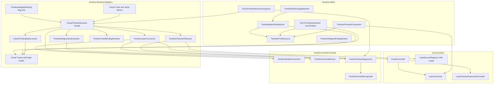
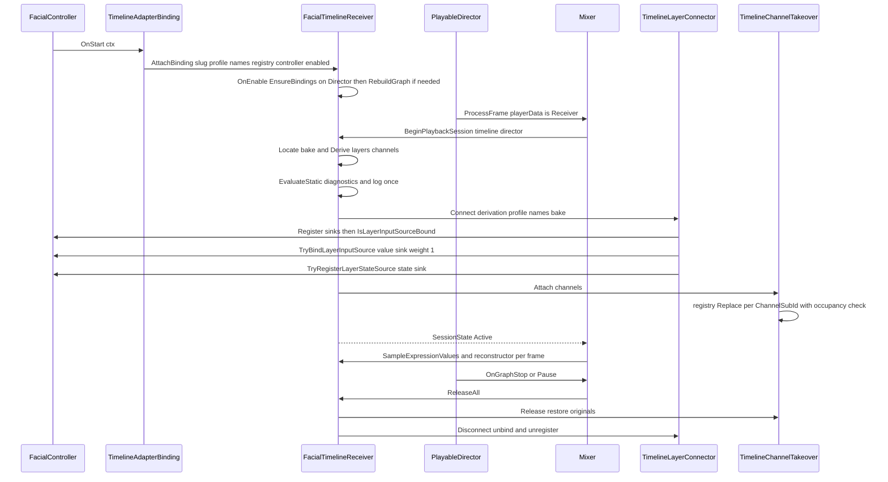
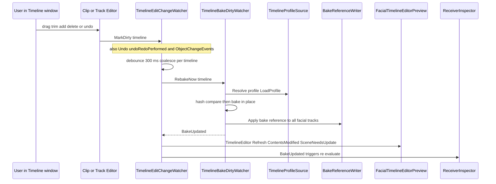
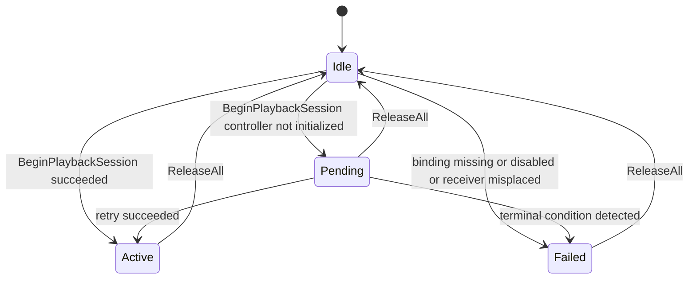
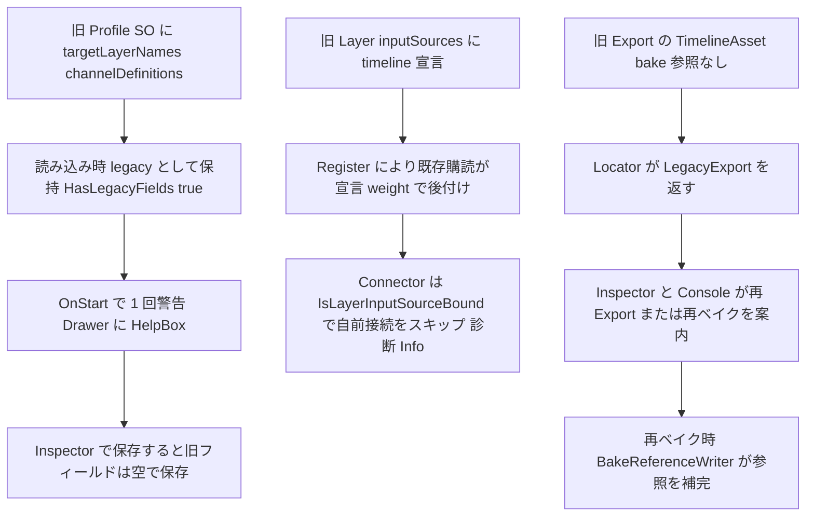

# Technical Design: timeline-playback-ux

- 対象 Unity プロジェクト: `FacialControl/`（Unity 6000.3.19f1）
- 主変更パッケージ: `FacialControl/Packages/com.hidano.facialcontrol.timeline`（Runtime / Editor / Tests）
- 限定変更パッケージ: `FacialControl/Packages/com.hidano.facialcontrol`（core。FacialController のレイヤー接続 API、LayerUseCase の接続済み判定、Layer2ActiveExpressionProvider の増減 API、InvalidIdValidator の動的 id 許容、Domain マーカー interface 1 つ）
- 入力: `requirements.md`（承認扱い）、`research.md` §2〜§11（Gap 分析と Gate A 判定）
- パス表記: 本文のファイルパスは Unity プロジェクト `FacialControl/` からの相対

## Overview

**Purpose**: REC で録画した表情・目線を REC Export の TimelineAsset として Play モードで再現するまでの手順を「REC Export → Director に TimelineAsset をセット → Receiver を FacialController に追加」の 4 手順に縮め、Profile SO / Layer.inputSources / BakeAsset / Track binding / Export ウィンドウに分散していた設定を TimelineAsset からの導出と FacialTimelineReceiver への集約で不要化する。欠落した手順は Console と Receiver Inspector に明示し、無言で止まる経路を残さない。

**Users**: Unity エンジニア（VTuber 配信・ゲーム内演出で Timeline 再生を使う開発者）。Timeline の内部構造（Bake / sink / inputSources）を知らずに使えることを前提にする。

**Impact**: `TimelineAdapterBinding` は Slug と有効/無効フラグだけの「受信許可フラグ」に格下げされ、再生に必要なレイヤー / チャネル / Bake / Track binding はすべて再生セッション開始時に `FacialTimelineReceiver` が TimelineAsset と Profile から導出・自動接続する。Edit モードでは Clip 編集を変更検知 + デバウンスで自動再ベイクし、Edit プレビューは Runtime と同じ Profile ソースと同じ合成パイプライン（`LayerUseCase` → `LayerBlender`）で描画する。core には「宣言の無い入力源をレイヤーへ接続 / 解放 / 判定する」public API を追加するが、既存 binding の接続経路（`ResolveLayerInputSourcesFromRegistry` / `HandleLayerInputSourceRebound`）は変更しない。

### Goals

- 4 手順だけで Expression（トリガー）・Analog・Gaze の 3 種が Play モードで再現される（受け入れ条件 1）
- Clip を動かした直後に Edit プレビューと次の Play 再生が新しいタイミングになる（受け入れ条件 2）
- 手順欠落時に Console または Receiver Inspector に欠落項目と直し方が出る。診断は Runtime 側の状態値として保持し、テストはログ文言ではなく状態値で検証する（受け入れ条件 3、Req 11.4）
- REC Export の出力をそのまま使う PlayMode end-to-end テストで上記を固定する（受け入れ条件 4）
- 毎フレーム処理のヒープ確保ゼロを維持する（セッション開始時の確保は許容）

### Non-Goals

- レイヤー weight / 入力源 weight のランタイム変更の REC 対応（並走 spec `rec-weight-coverage`。core の `LayerUseCase` weight API、`FacialController.SetLayerWeight` / `SetInputSourceWeight`、rec パッケージ、`InputSystemAdapterBinding.ApplyOverlayLayerWeights` には触れない）
- `.fcrec` フォーマットの拡張（gaze 広告情報の追加等）
- 系1 / 系2 の active 取得統合そのもの（backlog M-25）。本仕様は後付け系2 を `_layer2Provider` へ反映する最小限の API 追加に留める
- `AnalogExpressionInputSource` / `AnalogBlendShapeInputSource` の registry 再解決（§Architecture D3 で backlog 送りと判定）
- 新しいトラック / Clip 種別、ランタイム UI

## Boundary Commitments

### This Spec Owns

- `com.hidano.facialcontrol.timeline` の再生セッションモデル: TimelineAsset からのレイヤー / チャネル導出、sink の生成と `FacialController` への接続・解放、Analog / Gaze の乗っ取り（takeover）と復元、Bake の自動解決と鮮度判定、Track binding の自動設定、診断状態モデル
- Timeline 側の id 規約: sink id（`TimelineSinkIdConvention`）、`ChannelSubId` の形式（REC の source id `slug:sub` をそのまま保持）、Bake 参照の置き場（Track 側 `IFacialTimelineBakeHolder`）
- Timeline Editor: Receiver Inspector（UI Toolkit）、Clip 編集の変更検知と自動再ベイク、Edit プレビューの合成（`TimelinePreviewCompositor`）、REC Export ウィンドウと Exporter の出力契約（TimelineAsset 1 つで完結）
- core に追加する public 契約の定義と安定化: `FacialController.TryBindLayerInputSource` 系 5 メソッド、`LayerUseCase.IsLateInputSourceBound`、`Layer2ActiveExpressionProvider.AddSource / RemoveSource`、`IAdapterBindingDynamicInputs`、`InvalidIdValidator` の動的 prefix 許容、`FacialController.CollectBlendShapeNames` の public static 化

### Out of Boundary

- 既存 binding（OSC / InputSystem / LipSync / iFacialMocap）の接続挙動。`ResolveLayerInputSourcesFromRegistry` / `SubscribeDeclaredLayerInputSources` / `HandleLayerInputSourceRebound` は変更しない
- REC 記録・再生（rec パッケージ）の挙動。Timeline の sink が registry へ Replace されると REC の `AnalogObservationSampler` がそれを観測するが、これは既存契約の結果であり本仕様で変更しない
- `LayerInputSourceAggregator` の長さ不一致防御（Req 8.8 は timeline 側の mask 長統一で満たす。core 側防御は backlog 候補として記録）
- Profile SO Inspector の一般的な binding 一覧 UI（`AdapterBindingsListView`）。Timeline binding 用 PropertyDrawer は timeline Editor 側に置き、core 側は既存の Drawer 検出機構をそのまま使う
- Timeline ウィンドウの描画・検証表示（`FacialTimelineValidator` / TrackEditor の errorText）は Profile ソース統一（Req 4.5）以外は変更しない

### Allowed Dependencies

- timeline Runtime asmdef → core `Hidano.FacialControl.Domain` / `Application` / `Adapters`、`Unity.Timeline`（既存）
- timeline Editor asmdef → 上記 + `Hidano.FacialControl.Editor`（新規参照。PropertyDrawer の `IAdapterBindingHeaderSummaryProvider` と Routing ロジック型のため）+ `Hidano.FacialControl.Rec.*`（既存）+ `Unity.Timeline.Editor`（既存）
- timeline Tests.Shared asmdef → timeline Runtime + `Hidano.FacialControl.Rec.Domain` / `Rec.Adapters`（新規参照。`.fcrec` fixture 生成ヘルパー共有のため）
- timeline Tests.PlayMode asmdef → 上記 + `Hidano.FacialControl.Application` + `Hidano.FacialControl.Rec.*`（新規参照）
- 依存方向の禁止事項: core → timeline を参照しない。timeline Runtime → timeline Editor を参照しない（既存 `FacialTimelineEditorPreviewBridge` の delegate 橋渡しを維持）。Domain 配下は UnityEngine 型を増やさない（本パッケージ Domain は既に `Unity.Timeline` 型を扱うため、TimelineAsset を受ける純粋関数は Domain/Services に置く）

### Revalidation Triggers

- `FacialController` の新 API 署名や前提条件（`IsInitialized` 必須、レイヤー名解決規則）が変わったとき → `TimelineLayerConnector` と e2e テストを再検証
- `TimelineSinkIdConvention` の規則変更（名前優先 / index フォールバック）→ 旧 Profile の `timeline:` 宣言との互換（Req 3.3）、Routing エディタの許容規則（Req 2.5）を再検証
- `IFacialTimelineBakeHolder` の置き場（Track 側）を変えるとき → Exporter / DirtyWatcher / Locator / 旧形式判定（Req 10.7）を同時に更新
- `FacialCharacterProfileSO.LoadProfile()` の優先順位（JSON 優先）が変わるとき → `TimelineProfileSource` と Bake 鮮度判定を再検証
- `rec-weight-coverage` が `LayerUseCase.BindLateInputSource` の weight 列の扱いを変えるとき → `UnbindLayerInputSource` の復元順序を再検証

## Architecture

### Existing Architecture Analysis

research.md §2 に棚卸し済み。設計に直接影響する事実のみ再掲する。

- `TimelineAdapterBinding.OnStart` が Profile の `targetLayerNames` / `channelDefinitions` から sink を作り、`FacialTimelineReceiver.Configure(...)` に tuple 列で渡す。sink の BlendShape 名は OnStart 時点の `_receiver.BakeAsset` で固定される
- Mixer（`FacialTrackMixerBehaviour` / `FacialValueMixerBehaviour`）は Director の generic binding（`playerData`）からしか Receiver を解決できない。`FacialValueTrack` には `[TrackBindingType]` が無い
- core の後付け接続は `LayerUseCase.BindLateInputSource(layerIdx, declaredId, source, weight)` / `UnbindLateInputSource` が既存で、`FacialController` の public 面には無い。`_layer2Provider` は `PopulateLayer2Provider` で一括 `SetSources` されるだけで増減 API が無い
- `TimelineStateEventCollector.Collect(rootTrack)` は子トラック（`{layer} Lane n`）を root のレイヤー名で畳んでいる（確認済み）。`TimelineBakeService.Bake` と `FacialTimelineHashCalculator` も `GetOutputTracks()`（root）を起点に走査する
- `TimelineExpressionStateSink` の `ContributeMask` 長は 0。`LayerInputSourceAggregator.AggregateInternal` は `layerMask.Or(source.ContributeMask)` を長さ検査なしで呼ぶため、state sink がレイヤーに接続され Expression が ON になると `ArgumentException` になる経路が実在する（research.md §5）
- `GazeSourceIdConvention.IsValidChannelId` は `:` を含む id を拒否する。Export は `ChannelSubId` に REC の source id（`osc:gaze`）を書く
- Profile ソース: Runtime は `FacialCharacterProfileSO.LoadProfile()`（StreamingAssets の profile.json 優先）、Editor 系（Bake / Validator / Exporter / Preview）は `BuildFallbackProfile()`（SO）
- `IAdapterBindingDefaultLayerInputs` は `AdapterBindingsListView`（binding 追加時の inputSources 自動追加）と `AutoWireService` が参照しており、Timeline binding が実装すると副作用が出る
- `scripts/check-test-sizes.ps1` は Small で `AddComponent<FacialTimelineReceiver>` / `AssetDatabase` / `EditorApplication` / `[UnityTest]` を禁止している

### Architecture Pattern & Boundary Map

research.md §6 の **Option B（責務分割）** を採用し、tasks の依存順は **Option C の段階順** に従う。



**Architecture Integration**

- Selected pattern: 既存の Receiver を「ファサード」に留め、導出 / 解決 / 接続 / 乗っ取り / 診断を Unity 非依存寄りの小さなサービスへ分割する。導出・id 規約・診断モデルは Domain に置き EditMode（Small 可能なものは Small）で単体テストする
- Domain / feature boundaries: core は「接続 / 解放 / 判定」の口だけを提供し、何を接続するかは timeline が決める。timeline Editor は Runtime の診断状態を読むだけで、判定ロジックを持たない
- Existing patterns preserved: Gaze 乗っ取り（`registry.Replace` + `IInjectedInputSource` 占有規則 + 参照同一性で復元）、`_legacyGazeConfigs` 方式の legacy フィールド、`MissingBakeWarnings` 方式の 1 回警告、`AdapterBindingsListView` の Drawer 検出、UI Toolkit Editor
- New components rationale: 下表「確定した設計判断」参照
- Steering compliance: クリーンアーキテクチャ（Unity 依存は Adapters / Editor）、asmdef 依存方向、Unity 標準ログのみ、UI Toolkit、毎フレーム GC ゼロ、`{Target}Tests.cs` への追記

### 段階順（tasks の依存指針。research.md §6 Option C）

| 段 | 含めるもの | 完了基準 |
|---|---|---|
| 第 1 段 | core API（D2）/ Req 8.8 修正と再現テスト / `TimelineSinkIdConvention` / `TimelineChannelDeriver` / `FacialTimelineBakeLocator` + Track 側 bake holder / `TimelineTrackBindingResolver` / `TimelineLayerConnector` / `TimelineChannelTakeover`（Analog + Gaze）/ 診断モデルと `TimelineDiagnosticsEvaluator` / Receiver ファサード化と Mixer の isPlaying 分岐 / binding 格下げ（legacy フィールド）/ `TimelineProfileSource` / Exporter の bake 参照書き込み / e2e PlayMode テスト | 受け入れ条件 (1)(3)(4) が e2e と診断テストで緑 |
| 第 2 段 | `FacialTimelineReceiverInspector` / `TimelineAdapterBindingDrawer` / `TimelineEditChangeWatcher` / `TimelineBakeDirtyWatcher` のダイアログ撤去と `RebakeNow` / `BakeUpdated` / Undo・SetDirty | 受け入れ条件 (2) のうち「次の Play 再生」と Inspector 表示 |
| 第 3 段 | `TimelinePreviewCompositor`（Edit/Play 一致）/ Gaze プレビューの id 解決 / REC Export ウィンドウ整理と Exporter 署名変更 / README・Documentation~ 更新 | 受け入れ条件 (2) の「Edit プレビュー」と Req 7 / 10 の全テスト緑 |

### 確定した設計判断（requirements.md が「設計が判定し根拠を文書化する」とした項目）

詳細な比較は research.md §12 に記録する。design.md 単体で判断が追えるよう結論と根拠をここに置く。

| ID | 対象 Req | 決定 | 根拠（要約） |
|---|---|---|---|
| D1 | 2.3 | レイヤー導出は `timeline.GetOutputTracks()` の root `FacialExpressionTrack` のみ。子トラック（`{layer} Lane n`）は `TimelineStateEventCollector` が既に親レイヤー名へ畳むため導出対象外。チャネル導出は root `FacialValueTrack` の `ChannelSubId` / `ChannelKind` / クリップ `Axes.Length` の最大値。sink id は **名前優先・index フォールバック**: レイヤー名が `[a-zA-Z0-9_.-]` のみで `:` を含まず `timeline:{name}:state` が 64 文字以内なら `timeline:{name}`、それ以外は `timeline:layer{index}`（index は Profile のレイヤー index）。フォールバック時は診断 `LayerSinkIdFallback`（Info）に表示 | ASCII 名では既存 README / 旧 Profile 宣言 / 既存テストの id と互換を保ち（Req 3.3 の重複判定が成立する）、非 ASCII 名でも `InputSourceId.Parse` が例外にならず衝突しない。サニタイズ名は「感情」「表情」が同じ空文字に潰れるため不採用 |
| D2 | 3.1 / 3.8 / 8.8 | `timeline:{layer}` 値 sink は `FacialController.TryBindLayerInputSource(layer, id, sink, weight: 1f)` でレイヤー入力源へ接続。`timeline:{layer}:state` sink は **レイヤー入力源に接続しない**。`FacialController.TryRegisterLayerStateSource(layer, id, sink)` で `_layer2Provider`（overlay suppress の active provider）と REC 観測（`UpdateObservedTriggerSource`）へ登録する。両 sink は registry にも `Register(slug, sub)` する（旧 Profile の宣言があれば既存の購読経路で declared weight のまま後付けされ、connector は `IsLayerInputSourceBound` が true のとき自前接続をスキップ = Req 3.3）。Req 8.8 は `TimelineExpressionStateSink` の `ContributeMask` 長を `ctx.BlendShapeNames.Count`（全 false）に揃えて修正し、先に `TimelineExpressionStateSinkTests` で `ArgumentException` を再現する | state sink は値を持たず（`BlendShapeCount=0`）レイヤー接続は `layerWeightSum` を汚すだけで BlendShape に寄与しない。実用途は active provider と観測なので接続先を分ける。旧宣言で `:state` をレイヤーに書いたユーザーが Req 8.8 の経路を踏むため mask 長統一は必須。Aggregator 側防御は core の許容範囲外として backlog へ |
| D3 | 3.4 / 3.5 | Analog チャネルは Gaze と同じ **registry Replace 乗っ取り**。takeover 先 id は `ChannelSubId`（= REC の source id）そのまま。`TimelineAnalogInputSource` を `IInjectedInputSource` 化し占有規則を共有する。直接参照を保持する `AnalogExpressionInputSource` / `AnalogBlendShapeInputSource` への core 側再解決は **本仕様では行わず**、診断 `AnalogTakeoverAttached`（Info。「registry を購読しない消費者には反映されない」注記付き）を表示し backlog へ送る。解決不可（source 未登録 / 他注入者占有）は `AnalogSourceNotFound` / `AnalogOccupied` を Console に 1 回出し他チャネルを継続 | REC 再生（`RecAnalogInjector`）も同じ Replace 方式で同じ制約を持ち、Timeline は REC 再現を目的とするため「REC と同じ到達範囲」が妥当な到達点。core 消費者の構築経路は `InputSystemAdapterBinding` にあり並走 spec と衝突する |
| D4 | 3.7 / 10.4 | `ChannelSubId` は REC の source id（`slug:sub`、例 `osc:gaze` / `osc:gaze.left`）を **そのまま保持**。Gaze takeover 先 = `ChannelSubId` そのもの。`GazeSourceIdConvention.TryParse` は側（Shared/Left/Right）とチャネル id の分類・診断表示にだけ使い、解析不能でも registry に存在すれば takeover する（`useDistinctLeftRight` の明示 source id を許容）。`IsValidChannelId` は core で変更せず、binding 側のチャネル id 検証は channelDefinitions 撤去に伴い消える。`TimelineAdapterBinding` は `IGazeSourceProvider` を実装しない（乗っ取りは「提供」ではない） | Export が既に書いている id を正とすれば takeover 先の導出が一意になり、Profile の `providerSlug` / active slug 列挙に依存する曖昧さ（research.md C4）が消える |
| D5 | 4.1 / 4.4 / 4.7 / 10.7 | Bake 参照は **Track 側**。`FacialExpressionTrack` / `FacialValueTrack` が `IFacialTimelineBakeHolder`（`[SerializeField, HideInInspector] FacialTimelineBakeAsset bake`）を実装し、Exporter と DirtyWatcher が再ベイク後に全 Facial トラック（root + 子）へ同じサブアセット参照を書く（`BakeReferenceWriter`）。Runtime は `FacialTimelineBakeLocator.Locate(timeline, overrideBake)` が `GetOutputTracks()` + 子を走査し最初の非 null を返す。異なる Bake が混在すれば `Conflict`（最初の root を採用し Warning）。Facial トラックがあるのに参照が無ければ `LegacyExport`（Req 10.7）。Bake サブアセットには `HideFlags.HideInHierarchy` を付け Project ウィンドウから隠す（`AssetDatabase.LoadAllAssetsAtPath` は隠しサブアセットも返すため既存の `FindBakeAsset` は動く。実装時に Unity 上で確認） | Marker 方式は markerTrack の生成と Timeline ウィンドウでの可視化が必要、専用 TrackAsset は行として見える。Track フィールドは Editor API なしで Runtime から辿れ、トラック順の変更に強い |
| D6 | 4.5 / 7.5 | Editor 系（Bake / IsStale / Validator / Exporter / Preview compositor）の Profile ソースを Runtime と同じ `FacialCharacterProfileSO.LoadProfile()`（StreamingAssets の profile.json 優先、無ければ SO）へ揃える。`TimelineProfileSource.Resolve(so)` に一元化し、profile.json の `LastWriteTimeUtc` と SO instanceID をキーにキャッシュして Timeline ウィンドウ再描画ごとのファイル I/O を避ける | Bake ハッシュに `profile.Expressions` が入るため、JSON と SO が食い違えば Runtime 側で常に HashMismatch になる。JSON ファースト方針（steering）とも一致 |
| D7 | 5.1〜5.6 / 1.6 | Director 解決順: (1) Receiver の `director` SerializeField（任意上書き）→ (2) 同 GameObject の `PlayableDirector` → (3) 親階層 → (4) シーン走査（`FindObjectsByType<PlayableDirector>(Include, None)`）で `playableAsset` が Facial トラックを持つ TimelineAsset の Director のうち、いずれかの Facial トラックの generic binding が自分（または自分の GameObject）を指すもの。(4) で候補が 2 つ以上なら `DirectorAmbiguous`（Error。上書きフィールドの設定を案内）。走査はセッション開始時と Inspector 評価時のみ。Play 中は Mixer が `playable.GetGraph().GetResolver()` から得た Director を正とし、別 Director が同じ Receiver で `BeginPlaybackSession` を呼んだら `SessionConflict`（1 Receiver 1 セッション）。Track binding の自動設定（Req 1.6）は `TimelineTrackBindingResolver.EnsureBindings` が「binding 未設定の Facial トラック」にだけ自分を設定し、他オブジェクトが設定済みなら `TrackBindingForeign` を記録して触らない。Play モードは Receiver の `OnEnable` で実行し、Director のグラフが既に有効なら `RebuildGraph()`。Edit モードは Inspector 評価時に `Undo.RecordObject(director)` + `SetDirty` 付きで実行する。診断は Runtime 側 `FacialTimelineDiagnostics`（enum コード + 件名 + 重大度、`Revision` と `Changed` イベント）に集約し、Inspector は読むだけ。Inspector 更新トリガは `Undo.undoRedoPerformed` / `EditorApplication.hierarchyChanged` / `ObjectChangeEvents.changesPublished`（Director・Profile SO・Receiver に関する変更のみ）/ `TimelineEditChangeWatcher.BakeUpdated` / `FacialTimelineDiagnostics.Changed`（Play 中）/ `playModeStateChanged`。再描画は `schedule.Execute(...).ExecuteLater(100)` で合流させる | Mixer は binding 済みトラックしか Receiver を呼ばないため、自動 binding はグラフ構築前（OnEnable / Inspector 評価）に済ませる必要がある。Director の `playableAsset` 変更を直接通知する API は無いため ObjectChangeEvents と再描画時再評価で拾う |
| D8 | 6.1〜6.7 / 9.1 | 変更検知は 3 経路の組み合わせ: (a) `ClipEditor.OnClipChanged` / `TrackEditor.OnTrackChanged` / `OnCreate`（既存 `FacialExpressionClipEditor` / `FacialExpressionTrackEditor` / `FacialValueClipEditor` に override 追加、`FacialValueTrackEditor` を新設。Timeline ウィンドウでの移動・トリム・追加を即時に拾う）、(b) `Undo.undoRedoPerformed`（Undo/Redo と削除）、(c) `ObjectChangeEvents.changesPublished` の `ChangeAssetObjectProperties` / `DestroyAssetObject` で対象が Facial トラック・Clip・TimelineAsset のもの（Inspector からの `ExpressionId` / `ChannelKind` 編集、スクリプト編集）。すべて `TimelineEditChangeWatcher.MarkDirty(timeline)` に合流し、**デバウンス 300 ms**（`EditorApplication.update` + `EditorApplication.timeSinceStartup`）後にハッシュ比較 → 不一致なら `TimelineBakeDirtyWatcher.RebakeNow(timeline)`。実行中に再度 MarkDirty されたら完了後に 1 回だけ再実行（Req 6.5）。再ベイク完了で `BakeUpdated` を発火し `TimelineEditor.Refresh(RefreshReason.ContentsModified | RefreshReason.SceneNeedsUpdate)` を呼ぶ（Req 6.2）。`EnteredEditMode` のダイアログと `RepairRunResult.HasDialog` は撤去し、Play 中に検出した HashMismatch の修復は Edit 復帰時に無言で実行して Console に Info を 1 行出す。失敗時は Console に理由を出し前回 Bake を保持（既存 `created` のみ破棄ロジック）。Undo / SetDirty: Director の binding と `Receiver.BakeAsset` などシーン側オブジェクトの変更は `Undo.RecordObject` + `EditorUtility.SetDirty`。Bake サブアセットと Track の bake 参照は内部キャッシュなので Undo スタックに載せず `SetDirty` のみ | Timeline のドラッグは OnClipChanged をマウス移動ごとに発火するため即時再ベイクは不可。300 ms は入力間隔（約 16 ms）より十分長く、ユーザーが「待ち」と感じる閾値より短い。Bake を Undo に載せると Undo でキャッシュだけ巻き戻り鮮度判定と矛盾する |
| D9 | 7.1 / 7.4 / 7.6 | Edit プレビューは Editor 側に **オフラインの `LayerUseCase` + `ExpressionUseCase`** を持つ `TimelinePreviewCompositor` で合成する。Profile は `TimelineProfileSource.Resolve`、ホスト BlendShape 名は `FacialController.CollectBlendShapeNames(controller.SkinnedMeshRenderers)`（public static 化）、入力源は Play と同じ `TimelineBakedValueSink`（Bake から名前取得）+ `TimelineExpressionStateSink`（`TimelineEventStateReconstructor.JumpTo(t)` で状態復元）を `TryBindLayerInputSource` と同じ weight 1 で `BindLateInputSource` した構成。時刻 t ごとに sink へ Bake 値を書き `UpdateWeights(0f)` → `GetBlendedOutput()` → `SkinnedMeshRendererBlendShapeWriter` で描く。これにより `LayerBlender` の優先度 / レイヤー weight / overlay / override mask / base expression の規則を Editor で再実装しない。Gaze プレビューは `ValueChannelBake.Sub`（REC source id）→ `GazeSourceIdConvention.TryParse` のチャネル id、または `GazeChannel.sourceIdLeft / Right` との完全一致で解決（index 結合を廃止）。**一致の定義**: 同一 TimelineAsset・同一 Profile（LoadProfile）・同一ホストメッシュ・Timeline 以外の live 入力なし・レイヤー weight 既定（1）・Base Expression 既定。比較時刻は 0、各 Clip の start / end の ±1 サンプル（1/60 s）、各 Clip の中点、Timeline の duration。許容誤差は BlendShape 正規化値で 1e-4（renderer の 0〜100 スケールでは 0.01。既存 `TimelineLiveEquivalenceIntegrationTests.LinearTolerance` と同値）、Gaze は目ボーン `localRotation` の各成分で 1e-3 | `LayerUseCase` は Application 層で Domain `LayerBlender` を内包する。Timeline のみの入力では遷移を持つ入力源が値を出さないため、dt=0 での評価が Play の LateUpdate 結果と一致する。遷移中の時刻は Bake 時に `BakeSimulationHarness` が同じ Aggregator で焼いているため Edit / Play が同じカーブを読む |
| D10 | 8.7 | Play: `BeginPlaybackSession` から `ReleaseAll` までを 1 セッションとし、(Receiver instanceID, 診断コード, 件名) につき 1 回。Edit: 同じキーで **診断エポック**につき 1 回。エポックは (a) `BakeUpdated`、(b) Director の `playableAsset` / binding 変更、(c) ドメインリロード、(d) Play → Edit 復帰でリセット。`TimelineOnceWarningGate`（Domain）が `TryPass(ownerId, code, subject)` / `ResetEpoch()` を提供し、Inspector の表示はゲートに依らず常に現在値を出す | Edit にはセッションが無いため「入力が変わるまで 1 回」を明示する。Bake 更新や配線変更で状況が変われば同じ警告でも再掲する価値がある |
| D11 | 8.8 | 再現テスト: `TimelineExpressionStateSinkTests`（Small。`LayerInputSourceRegistry` + `LayerInputSourceWeightBuffer` + `LayerInputSourceAggregator` に state sink を sourceIdx 0 として直差し → `TriggerOn("smile")` → `Aggregate(0f, span)` が例外を投げないこと、`ContributeMask.Length == blendShapeCount` であること）。修正: `TimelineExpressionStateSink` のコンストラクタに `IReadOnlyList<string> blendShapeNames` を受け、基底へ `blendShapeCount: blendShapeNames.Count` を渡す（値出力は `TryWriteValues` が従来通り何も書かない構造を維持するため、`ContributeMask` は全 false の専用 BitArray を返す） | 修正前に赤を確認する TDD 順序を tasks に固定する。Aggregator 側の防御は core 変更範囲外（backlog） |
| D12 | 11.1〜11.8 | e2e は PlayMode Medium `TimelinePlaybackEndToEndTests`（新規クラス → 新規ファイル可）。fixture は Tests/Shared の `TimelineE2EFixture`（.fcrec 生成 → `RecToTimelineExporter.TryExportTimelineAsset` → アセット化した Profile SO + BlendShape 付きメッシュ + 明示目ボーン → FacialController / Receiver / Director 配置）。Director は `timeUpdateMode = Manual`、`time` 設定 → `Evaluate()` → `yield return null`（LateUpdate 後）で `SkinnedMeshRenderer.GetBlendShapeWeight` を検証。Analog は registry の `osc:lt` が `TimelineAnalogInputSource` に置換され `TryReadScalar` がクリップ値を返すこと + テスト側の registry 購読型 ValueProvider を `TryBindLayerInputSource` で接続して BlendShape 変化まで確認。Gaze は目ボーン回転。配置: 導出 / id 規約 / 診断モデル / Bake 解決 / Locator は EditMode Small（`ScriptableObject.CreateInstance` のみ）、Receiver・Director・AssetDatabase を使うものは EditMode Medium、Director 再生・LateUpdate が要るものは PlayMode Medium | `check-test-sizes.ps1` が Small で `AddComponent<FacialTimelineReceiver>` / `AssetDatabase` / `[UnityTest]` を禁止している。Exporter（Editor asmdef）は PlayMode テスト asmdef から参照可能（既存） |

### Technology Stack

| Layer | Choice / Version | Role in Feature | Notes |
|-------|------------------|-----------------|-------|
| Runtime | Unity 6000.3.19f1 / C# | Timeline Runtime・core Runtime | 既存 |
| Timeline | `com.unity.timeline` 1.8.9 | `PlayableDirector.SetGenericBinding` / `RebuildGraph`、`TimelineAsset.GetOutputTracks`、`TrackAsset.GetChildTracks`、`ClipEditor.OnClipChanged` / `TrackEditor.OnTrackChanged` / `OnCreate`、`TimelineEditor.Refresh(RefreshReason)`、`TimelineEditor.inspectedDirector` | API 存在を 1.8 ドキュメントで確認（research.md §12） |
| Editor | UnityEditor（`ObjectChangeEvents`、`Undo`、`EditorApplication.update`、UI Toolkit `UnityEditor.Editor.CreateInspectorGUI`、`PropertyDrawer.CreatePropertyGUI`） | 変更検知、Undo / Dirty、Receiver Inspector、binding Drawer | 新規依存なし |
| DI / core | VContainer child scope（既存）、`IInputSourceRegistry` | sink の Register / Replace / Subscribe | 既存契約を使用 |
| Tests | `com.unity.test-framework` 1.6.0、`Hidano.FacialControl.Testing`（`[SmallTest]` / `[MediumTest]`、`SizedTestFixture`） | Small / Medium / PlayMode e2e | `pwsh ./scripts/check-test-sizes.ps1` を通す |

## File Structure Plan

### Directory Structure（timeline パッケージ `Packages/com.hidano.facialcontrol.timeline/`）

```
Runtime/
├── Domain/
│   ├── Models/
│   │   ├── TimelineLayerDescriptor.cs        # 導出したレイヤー（名前・Profile index・root トラック）
│   │   ├── TimelineChannelDescriptor.cs      # 導出したチャネル（ChannelSubId・Kind・軸数・トラック）
│   │   └── TimelineDerivation.cs             # 導出結果の集合（未一致トラック名を含む）
│   ├── Diagnostics/
│   │   ├── TimelineDiagnosticCode.cs         # 診断コード enum（テストはこの値で検証）
│   │   ├── TimelineDiagnosticItem.cs         # Area / Code / Severity / Subject / Detail
│   │   ├── FacialTimelineDiagnostics.cs      # 状態モデル（Items / Revision / Changed）
│   │   └── TimelineOnceWarningGate.cs        # 1 セッション・1 エポック 1 回の警告ゲート
│   └── Services/
│       ├── TimelineSinkIdConvention.cs       # sink id 規約（名前優先 / index フォールバック）
│       └── TimelineChannelDeriver.cs         # TimelineAsset + Profile → TimelineDerivation（純粋関数）
├── Adapters/
│   ├── Assets/
│   │   ├── IFacialTimelineBakeHolder.cs      # Track 側 bake 参照の契約
│   │   └── FacialTimelineBakeLocator.cs      # Track 参照 / override から Bake を解決し状態を返す
│   ├── Session/
│   │   ├── TimelineBindingContext.cs         # binding.OnStart が Receiver に渡す readonly struct
│   │   ├── TimelineLayerConnector.cs         # sink 生成・registry 登録・FacialController への接続 / 解放
│   │   ├── TimelineChannelTakeover.cs        # Analog / Gaze の Replace 乗っ取りと復元（既存 Gaze 実装を一般化）
│   │   ├── TimelineTrackBindingResolver.cs   # Director 解決規則と Track binding の自動設定
│   │   └── ITrackBindingWriter.cs            # SetGenericBinding の書込口（Runtime 直書き / Editor は Undo 付き）
│   └── Diagnostics/
│       └── TimelineDiagnosticsEvaluator.cs   # 静的診断（Edit / Play 開始前）の評価
Editor/
├── Inspector/
│   ├── FacialTimelineReceiverInspector.cs    # UI Toolkit CustomEditor
│   └── TimelineAdapterBindingDrawer.cs       # Slug + Enabled のみの PropertyDrawer + ヘッダー要約
├── TimelineEditChangeWatcher.cs              # 変更検知 3 経路の合流 + デバウンス + BakeUpdated
├── TimelineProfileSource.cs                  # LoadProfile() への統一とキャッシュ
├── BakeReferenceWriter.cs                    # 全 Facial トラックへ bake 参照を書く
├── EditorTrackBindingWriter.cs               # ITrackBindingWriter の Undo 付き実装
├── TimelinePreviewCompositor.cs              # オフライン LayerUseCase による Edit 合成
├── TrackEditors/FacialValueTrackEditor.cs    # 新設（OnTrackChanged / OnCreate）
Tests/
├── EditMode/                                 # 既存 {Target}Tests.cs へ追記 + 新規クラスの新規ファイル
├── PlayMode/TimelinePlaybackEndToEndTests.cs # e2e（新規クラス）
├── PlayMode/TimelinePreviewCompositorTests.cs# Edit/Play 一致
└── Shared/
    ├── RecFixtureWriter.cs                   # .fcrec 生成ヘルパー（EditMode / PlayMode 共用）
    └── TimelineE2EFixture.cs                 # メッシュ・Profile SO・Export・配置を束ねる fixture
```

### Modified Files

timeline Runtime:
- `Runtime/Adapters/FacialTimelineReceiver.cs` — ファサード化。`Configure(tuple 列)` と `BeginPlaybackSession(FacialProfile, TimelineAsset)` を撤去し、`AttachBinding(in TimelineBindingContext)` / `BeginPlaybackSession(TimelineAsset, PlayableDirector)` / `EvaluateStaticDiagnostics()` / `Diagnostics` / `SessionState` / `DirectorOverride` を追加。`OnEnable`（Play 時）で Track binding 自動設定。sink 解決 API（`TryGetExpressionSink` 等）は connector / takeover へ委譲して署名維持
- `Runtime/Adapters/AdapterBindings/TimelineAdapterBinding.cs` — `enabled` 追加、`targetLayerNames` / `channelDefinitions` を `[SerializeField, HideInInspector]` の legacy に格下げ（`HasLegacyFields`、1 回警告）。`OnStart` は Slug 検証 → `Enabled` 判定 → Receiver 取得 / 生成（`_ownsReceiver`）→ `AttachBinding`。`Dispose` は `ReleaseAll` + 所有時のみ Destroy。`IGazeSourceProvider` を外し `IAdapterBindingDynamicInputs` を実装
- `Runtime/Playables/FacialTrackMixerBehaviour.cs` / `FacialValueMixerBehaviour.cs` — `!Application.isPlaying` ならプレビューのみで return（Req 7.2）。Play では `receiver.BeginPlaybackSession(timeline, director)` を呼び、sink 未解決は Receiver の診断（`TrackLayerUnmatched` / `AnalogSourceNotFound` 等）に委ねて無言 return を廃止（毎フレームの判定は bool フィールドのキャッシュで GC ゼロ）
- `Runtime/Tracks/FacialExpressionTrack.cs` / `FacialValueTrack.cs` — `IFacialTimelineBakeHolder` 実装。`FacialValueTrack` に `[TrackBindingType(typeof(FacialTimelineReceiver))]`
- `Runtime/Adapters/InputSources/TimelineExpressionStateSink.cs` — `ContributeMask` 長を BlendShape 数に統一（D11）
- `Runtime/Adapters/InputSources/TimelineAnalogInputSource.cs` — `IInjectedInputSource` 実装（`ReplacedSource` / `AttachReplacement` / `ClearReplacement` を `TimelineGazeInputSource` から基底へ移動）

timeline Editor:
- `Editor/TimelineBakeDirtyWatcher.cs` — `DisplayDialog` / `HandleEnteredEditModeNow` のダイアログ分岐 / `RepairRunResult.HasDialog` 撤去。`RebakeNow(TimelineAsset, out string failureReason)` を public 化、`BakeUpdated` イベント追加、`UpdateLoadedReceiverReferences` を Undo + SetDirty 付きに変更、`IsStale` 判定を `TimelineProfileSource` 経由に変更、再ベイク後に `BakeReferenceWriter.Apply` と `HideFlags` 設定
- `Editor/TimelineBakeService.cs` — SO overload を `TimelineProfileSource.Resolve(profileAsset)` 経由に変更
- `Editor/FacialTimelineEditorPreview.cs` — `ApplyBlendShapes` の単純加算を `TimelinePreviewCompositor` 呼び出しに置換、`ApplyGaze` をチャネル id 解決へ変更、Bake を `FacialTimelineBakeLocator` で解決、controller null を 1 回警告（無言 return 廃止）
- `Editor/FacialTimelinePreviewGazeTargets.cs` — index 述語を「チャネル id → Bake」の辞書解決に変更
- `Editor/Validation/FacialTimelineValidator.cs` — `TryResolveProfile` を `TimelineProfileSource` 経由に変更
- `Editor/RecToTimelineExporter.cs` — `TryExportTimelineAsset(recordingPath, profileAsset, outputAssetPath, out result, existingTimeline = null, sourceKindOverrides = null)` に署名変更（`director` / `receiver` 撤去）。Bake 書込後に `BakeReferenceWriter.Apply`。`DetectChannels(readResult, profileAsset)` を追加し行ごとの判定理由を返す。Gaze 判定に `IGazeSourceProvider.GetGazeSourceDeclarations()` を追加
- `Editor/RecTimelineExportWindow.cs` — Director / Receiver の ObjectField と Source Overrides を撤去し、検出結果（source id → kind + 理由）の読み取り専用リストと、Export 完了後の残り手順表示を追加
- `Editor/TrackEditors/FacialExpressionClipEditor.cs` / `FacialExpressionTrackEditor.cs` / `FacialValueClipEditor.cs` — `OnClipChanged` / `OnTrackChanged` / `OnCreate` を override し `TimelineEditChangeWatcher.MarkDirty`。`OnCreate` は兄弟トラックの bake 参照を補完
- `Editor/Hidano.FacialControl.Timeline.Editor.asmdef` — `Hidano.FacialControl.Editor` 参照を追加
- `Tests/Shared/*.asmdef` / `Tests/PlayMode/*.asmdef` — Rec / Application 参照を追加
- `README.md` / `Documentation~/README.md` — 4 手順、診断の読み方、旧設定の移行を更新

core（`Packages/com.hidano.facialcontrol/`）:
- `Runtime/Adapters/Playable/FacialController.cs` — 下記「FacialController 追加 API」5 メソッドと `CollectBlendShapeNames` の public static 化。既存の private 経路は変更しない
- `Runtime/Application/UseCases/LayerUseCase.cs` — `IsLateInputSourceBound(int layerIdx, string id)` 追加
- `Runtime/Application/UseCases/Layer2ActiveExpressionProvider.cs` — `AddSource` / `RemoveSource` 追加（`SetSources` は維持）
- `Runtime/Domain/Adapters/IAdapterBindingDynamicInputs.cs` — 新規マーカー interface
- `Editor/Windows/Routing/Logic/InvalidIdValidator.cs` — `profile.AdapterBindings` のうち `IAdapterBindingDynamicInputs` を実装する binding の `{Slug}:` prefix に一致する id を有効扱い（呼び出し側の変更なし）

## System Flows

### Play モード: 再生セッション開始



Flow-level decisions:
- `BeginPlaybackSession` は複数 Mixer から呼ばれるため冪等。`SessionState` が `Active` なら即 return、`Pending`（Controller 未初期化）なら毎フレーム再試行するがログは出さない（確保も無し）。失敗が確定する条件（binding 無し / 無効 / Receiver が別 GameObject）では `Failed` に遷移し再試行しない
- セッション資源（sink 配列・辞書）は `(TimelineAsset, Bake 参照, Profile 参照)` が同じ間はプールして再利用する。Director の Pause / Resume による `ReleaseAll` → 再 Begin で毎回確保しないための措置
- `Controller.IsInitialized == false` で Begin が呼ばれた場合は `Pending`。FacialController は `OnEnable` で自動初期化するため通常は同フレーム内に解決する

### Edit モード: Clip 編集 → 自動再ベイク → プレビュー / 次の Play へ反映



Flow-level decisions:
- 再ベイク中（`_isRebaking`）に届いた MarkDirty は `_pendingAgain` に畳み、完了後に 1 回だけ再実行する（Req 6.5）
- `EditorApplication.isCompiling` / `isPlayingOrWillChangePlaymode` の間は実行を保留し、復帰後の最初の update で評価する
- 保存時（`OnWillSaveAssets`）と `ExitingEditMode` の既存経路は無言の安全網として残し、通常は Watcher が先に処理するためハッシュ一致で no-op になる

### Receiver セッション状態



## Requirements Traceability

| Requirement | Summary | Components | Interfaces | Flows |
|---|---|---|---|---|
| 1.1 | 4 手順で Expression / Analog / Gaze 再現 | Receiver, Deriver, Locator, Connector, Takeover, TrackBindingResolver | `BeginPlaybackSession`, `TryBindLayerInputSource` | Play セッション開始 |
| 1.2 | 追加の手入力を要求しない | Binding（flag only）, Deriver, Locator, TrackBindingResolver, Exporter | `TimelineBindingContext`, `IFacialTimelineBakeHolder` | 同上 |
| 1.3 | Gaze を同じ手順・診断で扱う | Takeover, Diagnostics | `TimelineChannelTakeover.Attach` | 同上 |
| 1.4 | 毎フレーム GC ゼロ | Receiver（セッションプール）, Mixer | — | §Performance |
| 1.5 | Profile は録画時のまま | Binding, Deriver | `TimelineAdapterBinding.Enabled` | — |
| 1.6 | Facial トラックの binding 自動設定 | TrackBindingResolver, Receiver.OnEnable, Inspector | `EnsureBindings`, `ITrackBindingWriter` | Play セッション開始 |
| 2.1 / 2.2 | Slug + Enabled のみ、PropertyDrawer | Binding, TimelineAdapterBindingDrawer | `IAdapterBindingHeaderSummaryProvider` | — |
| 2.3 | TimelineAsset からの導出規則 | Deriver, SinkIdConvention | `TimelineChannelDeriver.Derive` | D1 |
| 2.4 | 旧フィールドの legacy 保持と 1 回警告 | Binding | `HasLegacyFields` | §Migration |
| 2.5 | `timeline:` id を不正扱いしない | core InvalidIdValidator, `IAdapterBindingDynamicInputs` | `InvalidIdValidator.Validate` | — |
| 2.6 | 無効フラグで何もしない + 診断表示 | Binding, Evaluator | `BindingDisabled` | — |
| 2.7 | binding 無しを 1 回明示 | Evaluator, Gate | `BindingMissing` | — |
| 3.1 | 値 sink の自動接続、state sink の登録先 | Connector, core FacialController API | `TryBindLayerInputSource`, `TryRegisterLayerStateSource` | D2 |
| 3.2 | セッション終了で解放・復元 | Connector, Takeover, Receiver, Mixer | `Disconnect`, `Release`, `ReleaseAll` | Play セッション開始（終了部） |
| 3.3 | 既存宣言を優先しスキップを診断 | Connector | `IsLayerInputSourceBound`, `LayerConnectionSkippedDeclared` | D2 |
| 3.4 / 3.5 | Analog 消費先と解決不可の明示 | Takeover, Diagnostics | `AnalogTakeoverAttached` / `AnalogSourceNotFound` / `AnalogOccupied` | D3 |
| 3.6 / 3.7 | Gaze 乗っ取りと takeover 先の導出 | Takeover | `ChannelSubId` 直使用 | D4 |
| 3.8 | core の接続 / 解放 / 判定 API と `_layer2Provider` 反映 | FacialController, LayerUseCase, Layer2ActiveExpressionProvider | 下記 API | D2 |
| 4.1 / 4.7 | Bake の Runtime 解決と Export 時の参照埋め込み | Locator, Bake holder, Exporter, BakeReferenceWriter | `FacialTimelineBakeLocator.Locate` | D5 |
| 4.2 | BakeAsset は任意上書き | Receiver, Locator | `BakeLocateStatus.OverrideUsed` | — |
| 4.3 | Value sink の名前を Bake から確定 | Connector | `TimelineBakedValueSink` 構築をセッション時に移動 | — |
| 4.4 | 内部キャッシュ化 | DirtyWatcher, Exporter（HideFlags） | — | D5 |
| 4.5 | Bake と Runtime の Profile ソース統一 | TimelineProfileSource | `Resolve` | D6 |
| 4.6 | 鮮度不一致の診断と継続 | Receiver, Diagnostics | `BakeStale` | — |
| 5.1〜5.5 | Receiver 集約と Inspector 診断 | Receiver, Diagnostics, Evaluator, Inspector | `FacialTimelineDiagnostics`, `EvaluateStaticDiagnostics` | D7 |
| 5.6 | UI Toolkit | Inspector | `CreateInspectorGUI` | — |
| 6.1 / 6.5 / 6.7 | 変更検知 + デバウンス + 重複抑止 + Undo/Redo | TimelineEditChangeWatcher, TrackEditors | `MarkDirty`, `OnClipChanged`, `undoRedoPerformed` | Edit フロー, D8 |
| 6.2 / 6.3 | プレビューと次の Play へ反映 | Watcher（Refresh）, Locator（Track 参照） | `BakeUpdated` | Edit フロー |
| 6.4 | ダイアログ撤去 | DirtyWatcher | — | — |
| 6.6 | 失敗理由を Console、前回 Bake 保持 | DirtyWatcher | `RebakeNow(out failureReason)` | — |
| 7.1 / 7.6 | Edit/Play 一致、LayerBlender 再利用 | TimelinePreviewCompositor | `Evaluate(time)` | D9 |
| 7.2 / 7.3 | Edit で BeginPlaybackSession を呼ばない、未構成は 1 回警告 | Mixer, EditorPreview, Gate | — | — |
| 7.4 | Gaze をチャネル id で解決 | EditorPreview, PreviewGazeTargets | — | D9 |
| 7.5 | 同一 Profile ソース | TimelineProfileSource | — | D6 |
| 8.1〜8.5 | 欠落項目の 1 回明示 | Evaluator, Connector, Takeover, Gate | 診断コード | D7 / D10 |
| 8.6 | 無言経路を残さない | Mixer, EditorPreview, Receiver | 診断更新 | — |
| 8.7 | 1 セッション 1 回 | TimelineOnceWarningGate | `TryPass` / `ResetEpoch` | D10 |
| 8.8 | ContributeMask 長 0 の再現と修正 | TimelineExpressionStateSink | — | D11 |
| 8.9 | 問題なし状態の保持 | Diagnostics | `Overall == Ok` | — |
| 9.1 | Undo.RecordObject + SetDirty | EditorTrackBindingWriter, DirtyWatcher, Inspector | `ITrackBindingWriter` | D8 |
| 9.2 / 9.3 | 所有 Receiver のみ破棄 | Binding | `_ownsReceiver` | — |
| 9.4 | 無効化・破棄で全解放 | Receiver | `ReleaseAll` | — |
| 10.1 / 10.2 | Source Overrides の見直し | ExportWindow, Exporter.DetectChannels | `ChannelDetectionReport` | D13（下記） |
| 10.3 | gaze 判定に IGazeSourceProvider 宣言を使う | Exporter | `GetGazeSourceDeclarations` | — |
| 10.4 | id 形式統一 | Deriver, Takeover | `ChannelSubId` 保持 | D4 |
| 10.5 / 10.6 | 出力は TimelineAsset 1 つ、残り手順の表示 | Exporter, ExportWindow | 新署名 | — |
| 10.7 | 旧形式の診断 | Locator, Diagnostics | `BakeLegacyExport` | D5 |
| 11.1〜11.3 | e2e | TimelinePlaybackEndToEndTests, TimelineE2EFixture | — | D12 |
| 11.4 | 診断状態値で検証 | TimelineDiagnosticsEvaluator tests | `TimelineDiagnosticCode` | — |
| 11.5 | Edit/Play 一致テスト | TimelinePreviewCompositorTests | — | D9 |
| 11.6〜11.8 | サイズ属性・ファイル配置・EditMode 優先 | §Testing Strategy | — | — |

D13（Req 10.1 / 10.2 の判定）: Source Overrides（Auto / Analog / Gaze）は **撤去**する。チャネル定義が TimelineAsset から導出される前提では、上書きの効果は Export 時の `FacialValueTrack.ChannelKind` の決定だけであり、Profile の `GazeChannels`（明示 source id）+ `GazeSourceIdConvention` + 各 binding の `IGazeSourceProvider` 宣言 + 2 軸判定で決定的に判定できる。例外的に判定を変えたい場合は Export 後に `FacialValueTrack` Inspector の `ChannelKind` を変えればよく、変更検知が再ベイクする。ウィンドウには REC 読み込み後に「source id / 判定結果 / 理由」の読み取り専用リストを表示し、トリガー専用（Analog イベントを持たない）source は表示しない。Exporter の `sourceKindOverrides` 引数はプログラム / テスト用途として残す。

## Components and Interfaces

| Component | Domain/Layer | Intent | Req Coverage | Key Dependencies (P0/P1) | Contracts |
|---|---|---|---|---|---|
| FacialController 追加 API | core Adapters | 宣言の無い入力源の接続 / 解放 / 判定、系2 の active provider 登録 | 3.1, 3.3, 3.8 | LayerUseCase (P0), Layer2ActiveExpressionProvider (P0) | Service |
| IAdapterBindingDynamicInputs / InvalidIdValidator | core Domain / Editor | 動的 id を持つ binding の prefix 許容 | 2.5 | SourcePortEnumerator (P2) | Service |
| TimelineSinkIdConvention | timeline Domain | sink id 規約 | 2.3 | InputSourceId (P0) | Service |
| TimelineChannelDeriver | timeline Domain | TimelineAsset + Profile → 導出結果 | 2.3, 8.2 | Unity.Timeline (P0) | Service |
| FacialTimelineDiagnostics / Evaluator / Gate | timeline Domain + Adapters | 診断状態モデルと静的評価、1 回警告 | 2.6, 2.7, 5.x, 8.x, 10.7 | — | State, Event |
| FacialTimelineBakeLocator / IFacialTimelineBakeHolder | timeline Adapters | Bake の Runtime 解決 | 4.1, 4.2, 10.7 | Tracks (P0) | Service |
| TimelineTrackBindingResolver / ITrackBindingWriter | timeline Adapters | Director 解決と Track binding 自動設定 | 1.6, 5.2a, 8.5 | PlayableDirector (P0) | Service |
| TimelineLayerConnector | timeline Adapters | sink 生成・registry 登録・FacialController 接続 / 解放 | 3.1〜3.3, 4.3, 8.1 | FacialController API (P0), IInputSourceRegistry (P0) | Service |
| TimelineChannelTakeover | timeline Adapters | Analog / Gaze の Replace 乗っ取りと復元 | 3.4〜3.7 | IInputSourceRegistry (P0) | Service |
| FacialTimelineReceiver | timeline Adapters | ファサード・セッション状態機械 | 1.x, 3.2, 4.6, 5.1, 9.4 | 上記すべて | Service, State |
| TimelineAdapterBinding | timeline Adapters | 受信許可フラグ、Receiver の所有管理 | 2.1, 2.4, 2.6, 9.2, 9.3 | Receiver (P0) | Service |
| Mixers / Tracks | timeline Adapters | Edit/Play 分岐、bake holder、binding type | 7.2, 8.6, 4.1 | Receiver (P0) | — |
| TimelineProfileSource | timeline Editor | Profile ソース統一 | 4.5, 7.5 | FacialCharacterProfileSO (P0) | Service |
| TimelineEditChangeWatcher | timeline Editor | 変更検知・デバウンス・BakeUpdated | 6.x | DirtyWatcher (P0), Timeline Editor API (P0) | Event, Batch |
| TimelineBakeDirtyWatcher（改） | timeline Editor | 再ベイク実行・参照書込・Undo | 6.4, 6.6, 9.1 | TimelineBakeService (P0) | Batch |
| TimelinePreviewCompositor | timeline Editor | Edit 合成（オフライン LayerUseCase） | 7.1, 7.4, 7.6 | LayerUseCase (P0), SkinnedMeshRendererBlendShapeWriter (P0) | Service |
| FacialTimelineReceiverInspector / TimelineAdapterBindingDrawer | timeline Editor | UI Toolkit 表示 | 2.2, 5.x | Diagnostics (P0) | — |
| RecToTimelineExporter / RecTimelineExportWindow（改） | timeline Editor | 出力完結・検出理由表示 | 4.7, 10.x | TimelineBakeService (P0) | Service |

### core Runtime / Editor

#### FacialController 追加 API

| Field | Detail |
|---|---|
| Intent | 宣言（`Layer.inputSources`）の無い入力源をレイヤーへ接続 / 解放し、接続済みかを判定する。系2 入力源を overlay suppress の active provider と REC 観測へ後付け登録する |
| Requirements | 3.1, 3.3, 3.8 |

**Responsibilities & Constraints**
- `_layerUseCase.BindLateInputSource / UnbindLateInputSource` と `_layer2Provider` / `UpdateObservedTriggerSource` の薄い public 口。既存の宣言経路（`ResolveLayerInputSourcesFromRegistry` / `HandleLayerInputSourceRebound`）は呼ばず、変更もしない
- 前提: `IsInitialized == true`。未初期化・レイヤー名不一致・id 不正は `false` を返し `Debug.LogWarning`（例外は投げない）
- `ReloadProfile` / `Cleanup` で LayerUseCase と registry が再構築されると後付け接続は消える。呼び出し側（Receiver）は次のセッション開始時に再接続する

**Dependencies**
- Inbound: TimelineLayerConnector — 接続 / 解放 / 判定（P0）、TimelinePreviewCompositor — 同じ接続規則をオフラインで再現（P1）
- Outbound: LayerUseCase（P0）、Layer2ActiveExpressionProvider（P0）、`_inputObservationBus`（P1）

**Contracts**: Service [x] / API [ ] / Event [ ] / Batch [ ] / State [ ]

##### Service Interface
```csharp
// Hidano.FacialControl.Adapters.Playable.FacialController（追加分）
public bool TryBindLayerInputSource(string layerName, string sourceId, IInputSource source, float weight);
public bool UnbindLayerInputSource(string layerName, string sourceId);
public bool IsLayerInputSourceBound(string layerName, string sourceId);
public bool TryRegisterLayerStateSource(string layerName, string sourceId, ExpressionTriggerInputSourceBase source);
public bool UnregisterLayerStateSource(string layerName, string sourceId);
public static string[] CollectBlendShapeNames(IReadOnlyList<SkinnedMeshRenderer> renderers); // 既存 private の公開

// Hidano.FacialControl.Application.UseCases.LayerUseCase（追加分）
public bool IsLateInputSourceBound(int layerIdx, string id);

// Hidano.FacialControl.Application.UseCases.Layer2ActiveExpressionProvider（追加分）
public void AddSource(string layer, ExpressionTriggerInputSourceBase source);   // 同 (layer, source) は重複追加しない
public bool RemoveSource(string layer, ExpressionTriggerInputSourceBase source);

// Hidano.FacialControl.Domain.Adapters（新規）
public interface IAdapterBindingDynamicInputs { } // マーカー: {Slug}:* の id を実行時に導出して登録する binding
```
- Preconditions: `IsInitialized`、`layerName` が `CurrentProfile.Layers` に存在、`InputSourceId.TryParse(sourceId)` 成功、`source != null`
- Postconditions（Bind）: `LayerUseCase.BindLateInputSource(layerIdx, sourceId, source, weight)` 済み、`UpdateObservedTriggerSource(sourceId, source as ExpressionTriggerInputSourceBase)` 済み、source が系2 なら `_layer2Provider.AddSource` 済み。（RegisterState）: `_layer2Provider.AddSource` と観測登録のみで registry / Aggregator には触れない。（Unbind / Unregister）: 逆操作。Unbind は `IsLateInputSourceBound` が false なら no-op で false
- Invariants: 既存 binding の接続結果（slot 順・weight）は本 API によって変化しない。`InvalidIdValidator` は `IAdapterBindingDynamicInputs` binding の `{Slug}:` prefix に一致する宣言を不正扱いしない

**Implementation Notes**
- Integration: `TryBindLayerInputSource` の weight は `LayerInputSourceWeightBuffer` に焼かれる（既存 `BindLateInputSource` 契約）。`rec-weight-coverage` が weight API を変えても本 API は weight を「初期値」として渡すだけで競合しない
- Validation: core EditMode テスト `FacialControllerTests`（既存 `{Target}Tests.cs`）に Bind → Aggregate 反映、Unbind → 復元、未初期化で false、`IsLayerInputSourceBound` の真偽を追加（Medium。FacialController は AddComponent 禁止 API）。`InvalidIdValidatorTests` に prefix 許容を追加（Small）
- Risks: `Cleanup` 後に Receiver が古い sink の Unbind を呼ぶと false で終わる（警告なし）。Receiver 側は `SessionState` と `controller.IsInitialized` を見て再接続する

### timeline Runtime Domain

#### TimelineSinkIdConvention / TimelineChannelDeriver

| Field | Detail |
|---|---|
| Intent | TimelineAsset と Profile からレイヤー / チャネルを導出し、レイヤーごとの sink id を規約どおりに合成する純粋関数 |
| Requirements | 2.3, 8.2, 10.4 |

**Contracts**: Service [x]

##### Service Interface
```csharp
public static class TimelineSinkIdConvention
{
    public const string StateSuffix = ":state";
    public static bool IsNameAddressable(string layerName);           // [a-zA-Z0-9_.-]+、':' 無し、"timeline:" + name + ":state" が 64 文字以内
    public static InputSourceId ComposeValueId(AdapterSlug slug, string layerName, int layerIndex, out bool usedIndexFallback);
    public static InputSourceId ComposeStateId(AdapterSlug slug, string layerName, int layerIndex, out bool usedIndexFallback);
}

public readonly struct TimelineLayerDescriptor
{
    public string LayerName { get; }        // root FacialExpressionTrack.name
    public int LayerIndex { get; }          // Profile のレイヤー index。未一致は -1
    public FacialExpressionTrack RootTrack { get; }
    public bool IsMatched => LayerIndex >= 0;
}

public readonly struct TimelineChannelDescriptor
{
    public string ChannelSubId { get; }     // REC の source id をそのまま保持
    public FacialValueChannelKind Kind { get; }
    public int AxisCount { get; }           // クリップ Axes.Length の最大値（0 なら無効）
    public FacialValueTrack Track { get; }
}

public sealed class TimelineDerivation
{
    public IReadOnlyList<TimelineLayerDescriptor> Layers { get; }     // 一致したレイヤーのみ
    public IReadOnlyList<string> UnmatchedTrackNames { get; }         // Req 8.2 の診断用
    public IReadOnlyList<TimelineChannelDescriptor> Channels { get; } // ChannelSubId 重複は先勝ちで後続を Invalid に記録
    public IReadOnlyList<string> InvalidChannelSubIds { get; }
    public bool HasFacialTracks { get; }
}

public static class TimelineChannelDeriver
{
    public static TimelineDerivation Derive(TimelineAsset timeline, FacialProfile profile);
}
```
- Preconditions: `timeline != null`。`profile` は `default` 可（レイヤー一致なしとして扱い全トラックを Unmatched にする。Edit 診断で Profile 未解決の場合に使う）
- Postconditions: 子トラックは `Layers` に現れない。`Layers` の順序は root トラック順。確保はすべて呼び出し時（セッション開始 / 診断評価）に閉じる
- Invariants: 同じ入力に対して決定的。`Derive` は Unity オブジェクトを生成・変更しない

**Implementation Notes**
- Validation: `TimelineChannelDeriverTests` / `TimelineSinkIdConventionTests`（Small。`ScriptableObject.CreateInstance<TimelineAsset>` と `CreateTrack` のみ）
- Risks: 非 ASCII レイヤー名の index フォールバックは Profile のレイヤー順に依存する。Profile でレイヤーを並べ替えると id が変わるが、sink id はセッション内部識別子であり永続化しないため影響は診断表示のみ

#### FacialTimelineDiagnostics / TimelineDiagnosticsEvaluator / TimelineOnceWarningGate

| Field | Detail |
|---|---|
| Intent | 診断を Runtime 側の状態値として保持し、Inspector とテストがログ文言に依存せず参照できるようにする。1 回警告の基準を一元化する |
| Requirements | 2.6, 2.7, 4.6, 5.2〜5.5, 8.1〜8.9, 10.7, 11.4 |

**Contracts**: State [x] / Event [x] / Service [x]

##### State Management
```csharp
public enum TimelineDiagnosticSeverity { Info = 0, Ok = 1, Warning = 2, Error = 3 }

public enum TimelineDiagnosticArea
{
    Director, TrackBinding, Bake, ProfileBinding, LayerMatch, LayerConnection, Analog, Gaze, Placement, Session
}

public enum TimelineDiagnosticCode
{
    Ok,
    DirectorMissing, TimelineNotBound, DirectorAmbiguous,
    TrackBindingAutoAssigned, TrackBindingForeign,
    BakeFresh, BakeMissing, BakeStale, BakeLegacyExport, BakeReferenceConflict, BakeOverrideUsed,
    BindingMissing, BindingDisabled, BindingLegacyFields, BindingSlugInvalid,
    TrackLayerUnmatched, LayerSinkIdFallback,
    LayerConnected, LayerConnectionSkippedDeclared, LayerConnectionFailed,
    AnalogTakeoverAttached, AnalogSourceNotFound, AnalogOccupied, AnalogAxisCountInvalid,
    GazeTakeoverAttached, GazeSourceNotFound, GazeOccupied,
    ReceiverNotOnControllerObject, ControllerMissing, ControllerNotInitialized,
    SessionConflict
}

public readonly struct TimelineDiagnosticItem
{
    public TimelineDiagnosticArea Area { get; }
    public TimelineDiagnosticCode Code { get; }
    public TimelineDiagnosticSeverity Severity { get; }
    public string Subject { get; }   // トラック名 / レイヤー名 / ChannelSubId / source id
    public string Detail { get; }    // 直し方（日本語）。Inspector と Console で同じ文を使う
}

public sealed class FacialTimelineDiagnostics
{
    public IReadOnlyList<TimelineDiagnosticItem> Items { get; }
    public int Revision { get; }
    public TimelineDiagnosticSeverity Overall { get; }   // Items の最大重大度。Items が空なら Ok
    public bool HasErrors { get; }
    public event Action Changed;
    public bool Contains(TimelineDiagnosticCode code);
    public bool Contains(TimelineDiagnosticCode code, string subject);
    internal void ReplaceArea(TimelineDiagnosticArea area, ReadOnlySpan<TimelineDiagnosticItem> items); // Revision++ / Changed
    internal void Clear();
}

public sealed class TimelineOnceWarningGate
{
    public bool TryPass(int ownerInstanceId, TimelineDiagnosticCode code, string subject); // 初回のみ true
    public void ResetEpoch();                                                          // Edit エポック / Play セッション境界で呼ぶ
}

public static class TimelineDiagnosticsEvaluator
{
    public static void EvaluateStatic(FacialTimelineReceiver receiver, FacialTimelineDiagnostics target, TimelineStaticEvaluationContext context);
}

public readonly struct TimelineStaticEvaluationContext
{
    public PlayableDirector Director { get; }
    public TimelineAsset Timeline { get; }
    public FacialController Controller { get; }
    public FacialCharacterProfileSO ProfileSource { get; }
    public FacialProfile Profile { get; }          // Edit は TimelineProfileSource 経由で Editor が渡す。Runtime は controller.CurrentProfile
    public bool HasProfile { get; }
    public BakeLocateResult Bake { get; }
    public TimelineDerivation Derivation { get; }
}
```
- State model: Area 単位で差し替える（静的評価は Director / TrackBinding / Bake / ProfileBinding / LayerMatch / Placement、セッション評価は LayerConnection / Analog / Gaze / Session）。Revision は差し替えごとに増加
- Persistence & consistency: シリアライズしない（Receiver の `[NonSerialized]`）。Edit では Inspector 評価のたびに再計算、Play ではセッション開始時 + 接続結果で更新
- Concurrency: メインスレッドのみ

**Implementation Notes**
- Integration: Console 出力は `Detail` をそのまま使い、`TimelineOnceWarningGate.TryPass` が true のときだけ `Debug.LogWarning / LogError(context: receiver)` を出す。Severity `Error` は再生停止を伴う項目（BindingMissing / BindingDisabled / ReceiverNotOnControllerObject / DirectorMissing / TimelineNotBound / DirectorAmbiguous / SessionConflict）、`Warning` は部分継続（BakeMissing / BakeStale / TrackLayerUnmatched / AnalogSourceNotFound / GazeSourceNotFound / Occupied / TrackBindingForeign / BakeLegacyExport / BindingLegacyFields）、`Info` は正常系の補足（AutoAssigned / SkippedDeclared / SinkIdFallback / TakeoverAttached / OverrideUsed）
- Validation: `TimelineDiagnosticsEvaluatorTests`（EditMode Medium。GameObject + Receiver + Director を組み、各欠落ケースで `Contains(code)` を検証 = Req 11.4）、`TimelineOnceWarningGateTests`（Small）
- Risks: 診断件数が増えると Inspector が長くなる。Area ごとに Foldout、`Ok` は 1 行に畳む

### timeline Runtime Adapters

#### FacialTimelineBakeLocator / IFacialTimelineBakeHolder

| Field | Detail |
|---|---|
| Intent | Editor API を使わず TimelineAsset から Bake を解決し、旧形式・競合・上書きを状態として返す |
| Requirements | 4.1, 4.2, 10.7 |

**Contracts**: Service [x]

##### Service Interface
```csharp
public interface IFacialTimelineBakeHolder
{
    FacialTimelineBakeAsset Bake { get; set; }   // [SerializeField, HideInInspector] を Track 側に持つ
}

public enum BakeLocateStatus { Found, OverrideUsed, Missing, LegacyExport, Conflict }

public readonly struct BakeLocateResult
{
    public BakeLocateStatus Status { get; }
    public FacialTimelineBakeAsset Bake { get; }  // Missing / LegacyExport では null
}

public static class FacialTimelineBakeLocator
{
    public static BakeLocateResult Locate(TimelineAsset timeline, FacialTimelineBakeAsset overrideBake);
}
```
- Preconditions: `timeline` は null 可（`Missing`）
- Postconditions: `overrideBake != null` なら `OverrideUsed`。それ以外は root + 子トラックの holder を走査し、非 null 参照が 1 種類なら `Found`、2 種類以上なら `Conflict`（最初の root の参照を返す）、Facial トラックが存在して参照が全て null なら `LegacyExport`、Facial トラック自体が無ければ `Missing`
- Invariants: アセットを変更しない

**Implementation Notes**
- Integration: Exporter と DirtyWatcher は再ベイク後に `BakeReferenceWriter.Apply(timeline, bake)` で全 holder に同じ参照を書き、`bake.hideFlags |= HideFlags.HideInHierarchy`。Timeline ウィンドウで新規作成された Facial トラックは `TrackEditor.OnCreate` が兄弟の参照を補完し、次の再ベイクでも上書きされる
- Validation: `FacialTimelineBakeLocatorTests`（Small）、`FacialTimelineTrackAssetTests`（既存に holder のシリアライズ往復を追記）
- Risks: `HideInHierarchy` を付けたサブアセットが Project ウィンドウでどう見えるかは実機確認（research.md §8-3）。見えてもユーザー操作は不要なので受け入れ条件には影響しない

#### TimelineTrackBindingResolver / ITrackBindingWriter

| Field | Detail |
|---|---|
| Intent | Director の解決規則（D7）と Facial トラック generic binding の自動設定 |
| Requirements | 1.6, 5.2a, 8.5 |

**Contracts**: Service [x]

##### Service Interface
```csharp
public enum DirectorResolveStatus { Override, SameObject, Parent, SceneUnique, Ambiguous, NotFound }

public interface ITrackBindingWriter
{
    void SetGenericBinding(PlayableDirector director, TrackAsset track, UnityEngine.Object value);
}

public readonly struct TrackBindingReport
{
    public int Assigned { get; }                          // 本呼び出しで設定した数
    public int AlreadyBound { get; }                      // 既に自分を指していた数
    public IReadOnlyList<TrackAsset> BoundToOther { get; } // 他オブジェクトが設定済み（触らない）
}

public static class TimelineTrackBindingResolver
{
    public static PlayableDirector ResolveDirector(FacialTimelineReceiver receiver, out DirectorResolveStatus status);
    public static TrackBindingReport EnsureBindings(PlayableDirector director, TimelineAsset timeline, FacialTimelineReceiver receiver, ITrackBindingWriter writer);
    public static bool HasFacialTracks(TimelineAsset timeline);
}
```
- Preconditions: `EnsureBindings` は `director.playableAsset is TimelineAsset`
- Postconditions: Facial トラック（root + 子）のうち binding が null のものにだけ `writer.SetGenericBinding(director, track, receiver)`。Runtime 実装（`RuntimeTrackBindingWriter`）は直接呼び、Editor 実装（`EditorTrackBindingWriter`）は `Undo.RecordObject(director, "Bind Facial Timeline tracks")` + `EditorUtility.SetDirty(director)` を伴う
- Invariants: 他オブジェクトを指す binding を上書きしない。`Assigned > 0` かつ `director.playableGraph.IsValid()` のときは呼び出し側（Receiver.OnEnable）が `RebuildGraph()` を行う

**Implementation Notes**
- Validation: `TimelineTrackBindingResolverTests`（EditMode Medium。Director / Receiver を GameObject に配置し、解決順と Ambiguous、`BoundToOther` 非上書きを検証）
- Risks: シーン走査（4）はコストがあるが Edit 診断時とセッション開始時のみ。Play 中の毎フレームには走らない

#### TimelineLayerConnector

| Field | Detail |
|---|---|
| Intent | 導出結果から sink を生成し registry に登録、FacialController へ接続 / 解放する。既存宣言の有無で接続をスキップし診断を記録する |
| Requirements | 3.1, 3.2, 3.3, 4.3, 8.1 |

**Contracts**: Service [x]

##### Service Interface
```csharp
public sealed class TimelineLayerConnector : IDisposable
{
    public TimelineLayerConnector(FacialController controller, IInputSourceRegistry registry, AdapterSlug slug, int maxStackDepth = 16);

    public void Connect(
        TimelineDerivation derivation,
        FacialProfile profile,
        IReadOnlyList<string> hostBlendShapeNames,
        FacialTimelineBakeAsset bake,                 // null 可（値 sink は空の名前集合で生成し、値再生は無効）
        FacialTimelineDiagnostics diagnostics);

    public void Disconnect();                          // 自前で Bind したものだけ Unbind、全 sink を Unregister、Invalidate / TriggerOff

    public bool TryGetValueSink(string layerName, out TimelineBakedValueSink sink);
    public bool TryGetStateSink(string layerName, out TimelineExpressionStateSink sink);
    public IReadOnlyList<string> ConnectedLayerNames { get; }
}
```
- Preconditions: `controller.IsInitialized`、`derivation.Layers` は一致済みレイヤーのみ
- Postconditions（Connect、レイヤーごと）: (1) `TimelineSinkIdConvention` で value / state id を合成（フォールバック時 `LayerSinkIdFallback`）。(2) `TimelineBakedValueSink(valueId, hostBlendShapeNames, bakedNames(layer))` と `TimelineExpressionStateSink(stateId, maxStackDepth, layer.ExclusionMode, hostBlendShapeNames, profile)` を生成（セッションプールにあれば再利用）。(3) `registry.Register(slug, sub, sink)` を両方に行う（旧 Profile に宣言があれば core の購読経路が宣言 weight で後付けする）。(4) `controller.IsLayerInputSourceBound(layer, valueId)` が true なら `LayerConnectionSkippedDeclared`、false なら `TryBindLayerInputSource(layer, valueId, valueSink, 1f)` → 成功で `LayerConnected`、失敗で `LayerConnectionFailed`。(5) state sink は `IsLayerInputSourceBound(layer, stateId)` が false のときのみ `TryRegisterLayerStateSource(layer, stateId, stateSink)`（宣言でレイヤー接続済みなら core の経路が観測と `_layer2Provider` 以外を担うため、provider 登録のみ追加で行う）
- Postconditions（Disconnect）: Bind したレイヤーを `UnbindLayerInputSource` / `UnregisterLayerStateSource`、全 sink を `registry.Unregister(slug, sub)`（宣言経路は null 通知で自動 Unbind される）、`TriggerOff` / `Invalidate`
- Invariants: 接続前のレイヤー入力源構成（slot 順・weight）が Disconnect 後に復元される（`UnbindLateInputSource` の weight 詰め契約に依存）

**Implementation Notes**
- Integration: `maxStackDepth` は既存既定 16 を維持。ホスト BlendShape 名は `TimelineBindingContext.BlendShapeNames`（= `ctx.BlendShapeNames`）
- Validation: `TimelineLayerConnectorTests`（EditMode Medium。FacialController を Fake Profile で初期化し、Connect → Aggregate 反映、既存宣言ありでスキップ、Disconnect で復元を検証）。PlayMode e2e で実レンダラ反映
- Risks: `Register` 時に同 id が残っていると registry が LogError を出す。Disconnect を `ReleaseAll` / `OnDisable` / `OnDestroy` / Mixer 停止の全経路で必ず通し、二重 Disconnect は no-op にする

#### TimelineChannelTakeover

| Field | Detail |
|---|---|
| Intent | Analog / Gaze チャネルを `ChannelSubId` の registry エントリへ Replace で乗っ取り、セッション終了時に原本を復元する（既存 `AttachGazeTakeovers` / `ReleaseGazeTakeover` の一般化） |
| Requirements | 3.4, 3.5, 3.6, 3.7 |

**Contracts**: Service [x]

##### Service Interface
```csharp
public sealed class TimelineChannelTakeover : IDisposable
{
    public TimelineChannelTakeover(IInputSourceRegistry registry, AdapterSlug slug);
    public void Attach(IReadOnlyList<TimelineChannelDescriptor> channels, FacialTimelineDiagnostics diagnostics);
    public void Release();
    public bool TryGetAnalogSink(string channelSubId, out TimelineAnalogInputSource sink);
    public bool TryGetGazeSink(string channelSubId, out TimelineGazeInputSource sink);
    public IReadOnlyList<TimelineTakeoverEntry> Entries { get; }   // Inspector 表示用（Play 中）
}

public readonly struct TimelineTakeoverEntry
{
    public string ChannelSubId { get; }
    public FacialValueChannelKind Kind { get; }
    public bool IsAttached { get; }
    public TimelineDiagnosticCode Status { get; }
}
```
- Preconditions: `ChannelSubId` が `InputSourceId` として妥当。`AxisCount > 0`（Analog）。Gaze は `AxisCount == 2` を前提とし、不足分は 0 で埋める
- Postconditions（Attach、チャネルごと）: `registry.TryResolve(channelSubId)` 失敗 → `AnalogSourceNotFound` / `GazeSourceNotFound`（Warning、1 回）。既存が `IInjectedInputSource` → `AnalogOccupied` / `GazeOccupied`（Warning、1 回）。成功 → sink（`TimelineAnalogInputSource(axisCount)` または `TimelineGazeInputSource`、ともに `IInjectedInputSource`）に原本を退避し `registry.Replace(slug', sub', sink)`（slug' / sub' は `ChannelSubId` を最初の `:` で分割）→ `AnalogTakeoverAttached` / `GazeTakeoverAttached`（Info）
- Postconditions（Release）: 参照同一性を確認して原本を `Replace` で戻す（既存契約どおり。他者占有なら Warning + スキップ）
- Invariants: Timeline sink を独自 id で別途 `Register` しない（takeover が登録そのもの）

**Implementation Notes**
- Integration: `GazeSourceIdConvention.TryParse(channelSubId)` は Inspector 表示（チャネル id と側）にのみ使用。Gaze の目ボーン反映は core の `SubscribeGazeInputSources` → `SetupGazeBoneProvider` の既存購読で届く
- Validation: `TimelineChannelTakeoverTests`（Small。Fake registry で Replace / 占有 / 復元を検証。既存 `FacialTimelineReceiverTests` の gaze 乗っ取りテストを移管）
- Risks: D3 のとおり直接参照型消費者には届かない。Inspector の `AnalogTakeoverAttached` 行に「registry を購読しない消費者（InputSystem の analog expression / blendshape）には反映されません」を表示し backlog に登録する

#### FacialTimelineReceiver（ファサード）

| Field | Detail |
|---|---|
| Intent | Timeline 再生に関わる設定・状態・診断の唯一の集約点。セッション状態機械と各サービスの束ね |
| Requirements | 1.x, 3.2, 4.2, 4.6, 5.1, 5.5, 8.x, 9.4 |

**Contracts**: Service [x] / State [x]

##### Service Interface
```csharp
public enum TimelineSessionState { Idle, Pending, Active, Failed }

public readonly struct TimelineBindingContext
{
    public AdapterSlug Slug { get; }
    public FacialProfile Profile { get; }
    public IReadOnlyList<string> BlendShapeNames { get; }
    public IInputSourceRegistry Registry { get; }
    public FacialController Controller { get; }
    public bool Enabled { get; }
}

public sealed class FacialTimelineReceiver : MonoBehaviour
{
    [SerializeField] private PlayableDirector director;        // 任意上書き（D7 の解決順 1）
    [SerializeField] private FacialTimelineBakeAsset bakeAsset; // 任意上書き（Req 4.2）

    public PlayableDirector DirectorOverride { get; set; }
    public FacialTimelineBakeAsset BakeAsset { get; set; }
    public FacialTimelineDiagnostics Diagnostics { get; }
    public TimelineSessionState SessionState { get; }
    public TimelineAsset ActiveTimeline { get; }
    public PlayableDirector ActiveDirector { get; }
    public BakeLocateResult LastBakeLocate { get; }
    public IReadOnlyList<TimelineTakeoverEntry> TakeoverEntries { get; }
    public IReadOnlyList<string> ConnectedLayerNames { get; }

    internal void AttachBinding(in TimelineBindingContext context);  // TimelineAdapterBinding.OnStart から
    internal void DetachBinding();                                   // TimelineAdapterBinding.Dispose から（ReleaseAll を含む）

    public void BeginPlaybackSession(TimelineAsset timeline, PlayableDirector director);
    public void ReleaseAll();
    public void EvaluateStaticDiagnostics();                         // Edit / Play 共通。Editor は Profile を TimelineProfileSource で渡す overload を使う
    public void EvaluateStaticDiagnostics(FacialProfile profile, bool hasProfile);

    // Mixer 向け（署名維持）
    public bool TryGetExpressionSink(string layerName, out TimelineExpressionStateSink sink);
    public bool TryGetExpressionValueSink(string layerName, out TimelineBakedValueSink sink);
    public void SampleExpressionValues(string layerName, double timeSeconds);
    public bool TryGetAnalogSink(string channelSubId, out TimelineAnalogInputSource sink);
    public bool TryGetGazeSink(string channelSubId, out TimelineGazeInputSource sink);
}
```
- Preconditions（BeginPlaybackSession）: Play モード。`timeline != null`
- Postconditions: `SessionState` が `Active` / `Pending` / `Failed` のいずれかになり、Diagnostics の LayerConnection / Analog / Gaze / Session Area が更新される。`Active` では `TryGet*` が解決可能。`Failed` 条件: binding 未 Attach（`BindingMissing` または `ReceiverNotOnControllerObject`）、`Enabled == false`（`BindingDisabled`）、別 timeline のセッションが Active（`SessionConflict`）
- Postconditions（ReleaseAll）: Takeover.Release → Connector.Disconnect → sink の Invalidate / TriggerOff → `SessionState = Idle`、Gate の Play エポックをリセット
- Invariants: 1 Receiver 1 セッション。`OnDisable` / `OnDestroy` は `ReleaseAll`。`OnEnable`（Play）は Director 解決 → `EnsureBindings`（Runtime writer）→ 必要なら `RebuildGraph`。`Start`（Play）は `EvaluateStaticDiagnostics` を実行し Error / Warning を 1 回ずつ Console に出す（Req 2.7 / 8.4 / 8.5 の「Play 開始時」）

**Implementation Notes**
- Integration: `SampleExpressionValues` の Bake → sink バッファのバインディング構築（既存 `BuildExpressionBakePlayback`）はセッション開始時に全レイヤー分を先行構築し、ProcessFrame 中の辞書追加を無くす
- Validation: `FacialTimelineReceiverTests`（既存 Medium。`Configure` 依存テストを `AttachBinding` + `BeginPlaybackSession(timeline, director)` に書き換え、状態遷移と `Diagnostics.Contains` で検証。`LogAssert.Expect(Regex)` は状態値アサートへ置換）
- Risks: `AttachBinding` は FacialController の初期化中（child scope build）に呼ばれるため、その時点では `controller.IsInitialized == false`。Receiver は context を保持するだけで接続は Begin まで遅延する

#### TimelineAdapterBinding（格下げ）

| Field | Detail |
|---|---|
| Intent | 「Timeline からの受信を有効にする」フラグ。Receiver の取得 / 生成と所有管理 |
| Requirements | 2.1, 2.4, 2.6, 9.2, 9.3 |

**Contracts**: Service [x]

```csharp
[Serializable]
[FacialAdapterBinding(displayName: "Timeline")]
public sealed class TimelineAdapterBinding : AdapterBindingBase, IAdapterBindingDynamicInputs
{
    [SerializeField] private bool enabled = true;
    [SerializeField, HideInInspector] private List<string> targetLayerNames;                       // legacy
    [SerializeField, HideInInspector] private List<TimelineValueChannelConfig> channelDefinitions; // legacy

    public bool Enabled { get; set; }
    public bool HasLegacyFields { get; }          // どちらかが非空
    public FacialTimelineReceiver Receiver { get; }
    public bool OwnsReceiver { get; }

    public override void OnStart(in AdapterBuildContext ctx);  // Slug 検証 → legacy 1 回警告 → Enabled 判定 → Receiver 取得 or AddComponent → AttachBinding
    public override void Dispose();                              // Receiver.DetachBinding → OwnsReceiver のときだけ Destroy
}
```
- Postconditions（OnStart、Enabled == false）: Receiver を生成せず、既存 Receiver があれば `AttachBinding(context with Enabled=false)` だけ行い診断 `BindingDisabled` を出せるようにする
- Invariants: `targetLayerNames` / `channelDefinitions` の値は読み取り専用で再生に影響しない。`TimelineValueChannelConfig` 型は legacy デシリアライズのため残す

**Implementation Notes**
- Validation: `TimelineAdapterBindingTests`（既存。reflection で legacy フィールドを埋めて `HasLegacyFields` と 1 回警告の挙動を確認、`Dispose` の所有判定 2 ケースに書き換え）

#### Mixers / Tracks の変更

- `FacialTrackMixerBehaviour` / `FacialValueMixerBehaviour`: `!Application.isPlaying` のとき `FacialTimelineEditorPreviewBridge.ApplyPreview` のみ呼んで return。Play では `receiver.BeginPlaybackSession(timeline, director)` → `SessionState != Active` なら return（診断は Receiver 側が保持済み）。sink 解決失敗は Receiver の診断にすでに `TrackLayerUnmatched` / `AnalogSourceNotFound` 等として記録されているため Mixer 自身はログを出さない（毎フレーム呼ばれるため）
- `FacialExpressionTrack` / `FacialValueTrack`: `IFacialTimelineBakeHolder` 実装。`FacialValueTrack` に `[TrackBindingType(typeof(FacialTimelineReceiver))]` を付け Director Inspector に binding 欄を出す
- `TimelineExpressionStateSink(InputSourceId id, int maxStackDepth, ExclusionMode exclusionMode, IReadOnlyList<string> blendShapeNames, FacialProfile profile)`: `ContributeMask` 長 = `blendShapeNames.Count`（全 false）。`TryWriteValues` は基底の遷移状態判定のみで値は書かない（従来どおり）

### timeline Editor

#### TimelineProfileSource

```csharp
public static class TimelineProfileSource
{
    public static FacialProfile Resolve(FacialCharacterProfileSO profileAsset);   // so.LoadProfile() をキャッシュ付きで返す
    public static bool TryResolveForTimeline(TimelineAsset timeline, out FacialCharacterProfileSO profileAsset, out FacialProfile profile);
    public static void InvalidateCache(FacialCharacterProfileSO profileAsset);
}
```
- キャッシュキー: SO instanceID + `GetStreamingAssetsProfilePath(so.name)` の `File.Exists` / `LastWriteTimeUtc` + SO の `EditorUtility.IsDirty` 状態。`AssetModificationProcessor.OnWillSaveAssets` で Profile SO / profile.json が保存されたら無効化
- `TryResolveForTimeline`: 既存 DirtyWatcher の解決順（Bake の `ProfileAssetGuid` → Director にバインドされた Receiver の `FacialController.CharacterSO` → `TimelineEditor.inspectedDirector`）を 1 箇所にまとめる
- 利用側: `TimelineBakeService.Bake(timeline, FacialCharacterProfileSO)` / `IsStale` 呼び出し、`FacialTimelineValidator.TryResolveProfile`、`RecToTimelineExporter`、`TimelinePreviewCompositor`、`TimelineDiagnosticsEvaluator`（Edit 側 overload）

#### TimelineEditChangeWatcher

**Contracts**: Event [x] / Batch [x]

```csharp
[InitializeOnLoad]
public static class TimelineEditChangeWatcher
{
    public static double DebounceSeconds { get; set; } = 0.3d;  // テストから短縮可
    public static event Action<TimelineAsset, FacialTimelineBakeAsset> BakeUpdated;
    public static event Action<TimelineAsset, string> RebakeFailed;

    public static void MarkDirty(TimelineAsset timeline);        // TrackEditor / ClipEditor / Undo / ObjectChangeEvents から
    public static void FlushNow();                               // テスト用: デバウンスを待たず実行
    public static bool IsPending(TimelineAsset timeline);
}
```
- Trigger: D8 の 3 経路。`ObjectChangeEvents` は `ObjectChangeKind.ChangeAssetObjectProperties` / `DestroyAssetObject` / `CreateAssetObject` のうち対象が `FacialExpressionTrack` / `FacialValueTrack` / `FacialExpressionClip` / `FacialValueClip` / `TimelineAsset` のものだけを拾う（`EditorUtility.InstanceIDToObject` で型判定）
- Input / validation: `AssetDatabase.GetAssetPath(timeline)` が空（未保存の一時アセット）なら対象外
- Output: `TimelineBakeDirtyWatcher.RebakeNow(timeline, out failureReason)` → 成功で `BakeUpdated` + `TimelineEditor.Refresh(RefreshReason.ContentsModified | RefreshReason.SceneNeedsUpdate)`、失敗で `RebakeFailed` + `Debug.LogWarning`
- Idempotency & recovery: Timeline ごとに `(lastMarkTime, isRebaking, pendingAgain)` を持ち、再ベイクは同時に 1 本。ハッシュ一致なら再ベイクせず `BakeUpdated` も出さない

#### TimelineBakeDirtyWatcher（改）

```csharp
public static class TimelineBakeDirtyWatcher
{
    public static bool RebakeNow(TimelineAsset timeline, out string failureReason);              // Profile は TimelineProfileSource.TryResolveForTimeline
    public static bool RebakeNow(TimelineAsset timeline, FacialCharacterProfileSO profileAsset, out string failureReason);
    public static string[] OnWillSaveAssets(string[] paths);                                     // 既存（安全網）
    internal static void ProcessOpenSceneTimelinesNow();                                         // 既存（ExitingEditMode）
    internal static RepairRunResult TryRepairPendingSessionIssuesNow();                          // 既存。ダイアログ無し、Info ログ 1 行
}
```
- 変更点: `DisplayDialog` / `HandleEnteredEditModeNow` のダイアログ分岐 / `RepairRunResult.HasDialog` 撤去。`UpdateLoadedReceiverReferences` は `Undo.RecordObject(receiver)` + `SetDirty`。再ベイク後に `BakeReferenceWriter.Apply` と `HideFlags`。鮮度判定は `TimelineProfileSource.Resolve` の Profile で `TimelineBakeService.IsStale`

#### TimelinePreviewCompositor

| Field | Detail |
|---|---|
| Intent | Edit プレビューを Play と同じ合成パイプライン（オフライン `LayerUseCase`）で描く |
| Requirements | 7.1, 7.4, 7.6 |

**Contracts**: Service [x]

```csharp
internal sealed class TimelinePreviewCompositor : IDisposable
{
    public TimelinePreviewCompositor(FacialController controller, FacialProfile profile, FacialTimelineBakeAsset bake, TimelineAsset timeline);
    public bool Matches(FacialController controller, FacialProfile profile, FacialTimelineBakeAsset bake, TimelineAsset timeline); // キャッシュ再利用判定
    public void Evaluate(double timeSeconds);        // sink へ Bake 値を書き → UpdateWeights(0f) → GetBlendedOutput → renderer へ書く
    public void EvaluateGaze(double timeSeconds, IReadOnlyList<GazeChannel> gazeChannels, BoneTransformResolver resolver, GazeEyeBoneFallback fallback, List<FacialTimelinePreviewEyeTarget> buffer);
}
```
- 構成: `blendShapeNames = FacialController.CollectBlendShapeNames(controller.SkinnedMeshRenderers)`、`expressionUseCase = new ExpressionUseCase(profile)`、`layerUseCase = new LayerUseCase(profile, expressionUseCase, blendShapeNames)`、レイヤーごとに `TimelineBakedValueSink` + `TimelineExpressionStateSink` を `BindLateInputSource(layerIdx, id, sink, 1f)`、`TimelineEventStateReconstructor.SetEvents(bake.StateEvents)`、`writer = new SkinnedMeshRendererBlendShapeWriter(renderers, blendShapeNames)`
- `Evaluate(t)`: 各レイヤーの `ExpressionBakes` カーブを `t` で評価し value sink に `SetValue`、`reconstructor.JumpTo(t, stateSink)`、`layerUseCase.UpdateWeights(0f)`、`layerUseCase.GetBlendedOutput()` を writer へ
- Gaze: `ValueChannelBake.Sub` → `GazeSourceIdConvention.TryParse` のチャネル id または `GazeChannel.sourceIdLeft / sourceIdRight` と一致したチャネルを駆動（index 結合廃止）
- キャッシュ: `FacialTimelineEditorPreview` が controller instanceID ごとに保持し、`Matches` が false なら作り直す。`BakeUpdated` で破棄

**Implementation Notes**
- Validation: `TimelinePreviewCompositorTests`（PlayMode Medium。同じ fixture で Edit 合成と Director 再生の renderer 値を D9 の時刻集合・許容誤差で比較）
- Risks: `LayerUseCase` の公開コンストラクタと `BindLateInputSource` に依存する。`rec-weight-coverage` が weight 列の初期化を変えた場合は weight 1 の前提を再確認する

#### FacialTimelineReceiverInspector / TimelineAdapterBindingDrawer

Summary-only（UI。新しい境界を導入しない）。
- Inspector: `[CustomEditor(typeof(FacialTimelineReceiver))]`、`CreateInspectorGUI` で (a) 上書きフィールド（Director / BakeAsset）、(b) Area ごとの Foldout に `TimelineDiagnosticItem` を Severity アイコン + Subject + Detail で表示、(c) Play 中はセッション状態・接続レイヤー・takeover 一覧、(d) 操作ボタン「トラック binding を今設定」（`EnsureBindings` を Editor writer で実行）、「今再ベイク」（`TimelineBakeDirtyWatcher.RebakeNow`）。更新トリガは D7。Edit 評価は `TimelineProfileSource.TryResolveForTimeline` で Profile を解決して `EvaluateStaticDiagnostics(profile, hasProfile)` を呼ぶ
- Drawer: `[CustomPropertyDrawer(typeof(TimelineAdapterBinding))]`、Slug フィールド + Enabled トグル + legacy フィールドが残っていれば HelpBox（「旧フィールドは再生に使われません。保存すると消えます」）。`IAdapterBindingHeaderSummaryProvider` でヘッダー要約「Timeline / 有効」

#### RecToTimelineExporter / RecTimelineExportWindow（改）

```csharp
public static bool TryExportTimelineAsset(
    string recordingPath,
    FacialCharacterProfileSO profileAsset,
    string outputAssetPath,
    out ExportResult result,
    TimelineAsset existingTimeline = null,
    IReadOnlyDictionary<string, FacialValueChannelKind> sourceKindOverrides = null);   // director / receiver 引数を撤去

public enum ChannelDetectionReason { ExplicitGazeSourceId, ConventionGazeChannel, GazeProviderDeclaration, NonTwoAxisSamples, DefaultAnalog, Overridden }

public readonly struct ChannelDetection
{
    public string SourceId { get; }
    public FacialValueChannelKind Kind { get; }
    public ChannelDetectionReason Reason { get; }
    public int AxisCount { get; }
}

public static IReadOnlyList<ChannelDetection> DetectChannels(RecBinaryFormat.ReadResult readResult, FacialCharacterProfileSO profileAsset);
```
- Gaze 判定順: (1) `GazeChannel.sourceIdLeft / sourceIdRight` と完全一致 → Gaze（`ExplicitGazeSourceId`）、(2) `GazeSourceIdConvention.TryParse` のチャネル id が `GazeChannels` に存在 → Gaze（`ConventionGazeChannel`）、(3) Profile の各 binding の `IGazeSourceProvider.GetGazeSourceDeclarations()` に（slug, channelId）が一致、またはワイルドカード宣言の slug と一致 → Gaze（`GazeProviderDeclaration`）、(4) 上記で Gaze でもサンプル軸数が 2 でなければ Analog（`NonTwoAxisSamples`、Warning 継続）、(5) それ以外 Analog（`DefaultAnalog`）
- Export 後: Bake サブアセット生成 / 更新 → `BakeReferenceWriter.Apply` → `HideFlags` → 保存。Window は `SetStatus` に「次の手順: 1) PlayableDirector に TimelineAsset をセット 2) FacialController と同じ GameObject に FacialTimelineReceiver を追加」を表示
- Profile は `TimelineProfileSource.Resolve(profileAsset)`

## Data Models

### Domain Model

- **再生セッション（集約ルート: FacialTimelineReceiver）**: `TimelineAsset` × `PlayableDirector` × `TimelineBindingContext` から導出される一時的な集約。構成要素は `TimelineDerivation`（レイヤー / チャネル）、`BakeLocateResult`、接続済み sink 群、takeover エントリ、診断。永続化しない。不変条件: 1 Receiver 1 セッション、Disconnect / Release で接続前の状態に戻る
- **Bake（値オブジェクト、永続）**: `FacialTimelineBakeAsset`（TimelineAsset のサブアセット、既存スキーマ不変）。所有は TimelineAsset。参照は各 Facial トラックの `IFacialTimelineBakeHolder`
- **診断（値オブジェクト）**: `TimelineDiagnosticItem` の集合。Area 単位で置換される
- **id 規約（値オブジェクト）**: `TimelineSinkIdConvention` が合成する `InputSourceId`。`ChannelSubId` は REC の source id を保持する不変文字列

### Logical Data Model

- `FacialExpressionTrack` / `FacialValueTrack` に `bake: FacialTimelineBakeAsset`（HideInInspector）を追加。同一 TimelineAsset 内の全 Facial トラックは同じサブアセットを指す（整合は `BakeReferenceWriter` が保証、不整合は `Conflict` 診断）
- `FacialTimelineReceiver` に `director: PlayableDirector`（任意）を追加。既存 `bakeAsset` は上書き用に意味を変更
- `TimelineAdapterBinding` に `enabled: bool`（既定 true）を追加。`targetLayerNames` / `channelDefinitions` は HideInInspector で残置（読み取り専用）
- Bake のスキーマ（`SourceHashHex` / `ProfileAssetGuid` / `SampleRate` / `ExpressionBakes` / `ValueBakes` / `StateEvents`）は変更しない。`ValueChannelBake.Sub` は `ChannelSubId`（REC source id）と同じ文字列

### Data Contracts & Integration

- registry への登録 id: `timeline:{layer}` / `timeline:{layer}:state`（または `timeline:layer{index}` 系）。Replace 先 id: `ChannelSubId` そのまま
- `InvalidIdValidator` の許容規則: `IAdapterBindingDynamicInputs` binding の `{Slug}:` prefix
- Exporter の出力契約: TimelineAsset 1 つ（root `FacialExpressionTrack` = レイヤー名、子 `{layer} Lane n`、root `FacialValueTrack` = source id 名 + `ChannelSubId` + `ChannelKind`、Bake サブアセット、全 Facial トラックの bake 参照）。Director / Receiver への副作用なし

## Error Handling

### Error Strategy

- ユーザー構成の欠落は **例外ではなく診断 + Unity 標準ログ**（steering）。例外は呼び出し契約違反（null 引数等）のみ
- 1 原因 1 回: Play はセッション、Edit はエポック（D10）。Inspector はゲートに依らず現在値を表示
- Graceful degradation: Bake 無し → 状態（トリガー）再生は継続し値再生のみ無効。トラック名不一致 → 該当トラックのみスキップ。Analog / Gaze の takeover 失敗 → 該当チャネルのみ無効。鮮度不一致 → 継続 + Warning

### Error Categories and Responses

| 分類 | 例 | 応答 |
|---|---|---|
| 構成欠落（Error、再生停止） | BindingMissing / BindingDisabled / ReceiverNotOnControllerObject / DirectorMissing / TimelineNotBound / DirectorAmbiguous / SessionConflict | `SessionState = Failed`、Console に 1 回 Error（直し方付き）、Inspector に要対応 |
| 部分欠落（Warning、部分継続） | BakeMissing / BakeStale / BakeLegacyExport / TrackLayerUnmatched / Analog・Gaze の NotFound・Occupied / TrackBindingForeign / BindingLegacyFields / BakeReferenceConflict | 該当部分のみ無効化、Console に 1 回 Warning、Inspector に要対応 |
| 情報（Info） | TrackBindingAutoAssigned / LayerConnectionSkippedDeclared / LayerSinkIdFallback / TakeoverAttached / BakeOverrideUsed | Inspector のみ（Console には出さない） |
| Editor 処理失敗 | 再ベイク失敗（Profile 解決不可 / 例外） | Console に理由、前回 Bake 保持、`RebakeFailed` イベント |
| 契約違反 | null 引数、Dispose 済み registry | `ArgumentNullException` 等（既存どおり） |

### Monitoring

- `FacialTimelineDiagnostics.Revision` と `Changed` で Inspector が追従。e2e / 診断テストは `Contains(code)` で検証
- Console 出力の接頭辞は既存どおり `[FacialTimelineReceiver]` / `[TimelineBakeDirtyWatcher]` / `[TimelineEditChangeWatcher]`。文言は `Detail` と同一（テストは文言に依存しない）

## Testing Strategy

配置原則（Req 11.6〜11.8）: サイズは `scripts/check-test-sizes.ps1` の禁止 API に従う。既存 `{Target}Tests.cs` に追記し、新規クラスのみ新規ファイル。

| 対象 | ファイル | モード / サイズ | 主な検証 |
|---|---|---|---|
| TimelineSinkIdConvention | `Tests/EditMode/TimelineSinkIdConventionTests.cs`（新） | EditMode Small | ASCII 名は名前、非 ASCII / `:` / 長名は index フォールバック、`:state` 合成、64 文字境界 |
| TimelineChannelDeriver | `Tests/EditMode/TimelineChannelDeriverTests.cs`（新） | EditMode Small | root のみ対象、Lane 子トラックを含めない、未一致トラック名、ChannelSubId 重複、軸数最大 |
| TimelineExpressionStateSink（Req 8.8） | `Tests/EditMode/TimelineExpressionStateSinkTests.cs`（既存） | EditMode Small | Registry + Aggregator 直差しで TriggerOn 後の Aggregate が例外を投げない（修正前に赤を確認）、mask 長一致、値を書かない |
| FacialTimelineBakeLocator | `Tests/EditMode/FacialTimelineBakeLocatorTests.cs`（新） | EditMode Small | Found / OverrideUsed / Missing / LegacyExport / Conflict |
| TimelineOnceWarningGate / FacialTimelineDiagnostics | `Tests/EditMode/TimelineOnceWarningGateTests.cs` / `FacialTimelineDiagnosticsTests.cs`（新） | EditMode Small | 1 回通過、ResetEpoch、Area 置換で Revision 増加、Overall |
| TimelineChannelTakeover | `Tests/EditMode/TimelineChannelTakeoverTests.cs`（新） | EditMode Small | Fake registry で Replace / 占有スキップ / 参照同一性復元、ChannelSubId をそのまま使う |
| TimelineLayerConnector | `Tests/EditMode/TimelineLayerConnectorTests.cs`（新） | EditMode Medium | FacialController 初期化後に Connect → Aggregate 反映、既存宣言ありでスキップ診断、Disconnect で slot / weight 復元、state sink が `_layer2Provider` に乗る（overlay suppress 経由で観測） |
| TimelineTrackBindingResolver | `Tests/EditMode/TimelineTrackBindingResolverTests.cs`（新） | EditMode Medium | 解決順 4 段、Ambiguous、未設定のみ設定、他者設定を上書きしない |
| TimelineDiagnosticsEvaluator（Req 11.4） | `Tests/EditMode/TimelineDiagnosticsEvaluatorTests.cs`（新） | EditMode Medium | binding 無効 / Receiver 未配置 / Bake 解決不可 / トラック名不一致 / Receiver 別 GameObject の各ケースで `Contains(code)` |
| FacialTimelineReceiver | `Tests/EditMode/FacialTimelineReceiverTests.cs`（既存） | EditMode Medium | AttachBinding → Begin の状態遷移、Pending 再試行、Failed 条件、ReleaseAll の復元。既存の gaze 乗っ取りテストは Takeover へ移管 |
| TimelineAdapterBinding | `Tests/EditMode/TimelineAdapterBindingTests.cs`（既存） | EditMode Medium | Enabled false で Receiver 非生成、legacy フィールドの 1 回警告、Dispose の所有判定 2 ケース |
| FacialController 追加 API | core `Tests/EditMode/.../FacialControllerTests.cs`（既存） | EditMode Medium | Bind / Unbind / IsBound / RegisterState、未初期化 false、既存宣言の結果が不変 |
| InvalidIdValidator | core `Tests/EditMode/Editor/Windows/Routing/Logic/InvalidIdValidatorTests.cs`（既存） | EditMode Small | `IAdapterBindingDynamicInputs` の prefix 許容 |
| TimelineProfileSource | `Tests/EditMode/TimelineProfileSourceTests.cs`（新） | EditMode Medium | JSON 有無で LoadProfile と同じ結果、キャッシュ無効化 |
| TimelineBakeDirtyWatcher | `Tests/EditMode/TimelineBakeDirtyWatcherTests.cs`（既存） | EditMode Medium | `DisplaysDialog` テストを撤去し「Edit 復帰時に無言で修復・Info ログ」に置換、RebakeNow が全 holder に参照を書く、Receiver 参照更新が Undo 可能 |
| TimelineEditChangeWatcher | `Tests/EditMode/TimelineEditChangeWatcherTests.cs`（新） | EditMode Medium | MarkDirty → FlushNow で再ベイク、ハッシュ一致で no-op、連続 MarkDirty で 1 回、再ベイク中の MarkDirty で完了後 1 回、失敗時に前回 Bake 保持 |
| RecToTimelineExporter / Window | `Tests/EditMode/RecToTimelineExporterTests.cs` / `RecToTimelineExportWorkflowTests.cs`（既存） | EditMode Medium | 新署名、bake 参照が全トラックに入る、`DetectChannels` の理由（Explicit / Convention / ProviderDeclaration / NonTwoAxis / Default）、Director / Receiver 非依存。Window は生成・破棄 smoke のみ |
| FacialTimelineEditorPreview / PreviewGazeTargets | 既存 `FacialTimelinePreviewGazeTargetsTests.cs` | EditMode Small | チャネル id 解決（index 結合の廃止） |
| TimelinePreviewCompositor（Req 11.5） | `Tests/PlayMode/TimelinePreviewCompositorTests.cs`（新） | PlayMode Medium | D9 の時刻集合で Edit 合成と Director 再生の renderer 値が 0.01 以内、Gaze 回転が 1e-3 以内 |
| e2e（Req 11.1〜11.3） | `Tests/PlayMode/TimelinePlaybackEndToEndTests.cs`（新） | PlayMode Medium | 4 手順で Expression / Analog / Gaze 再現、Receiver 同 GO と Director 別 GO の両配置、Clip 移動 + RebakeNow 後のタイミング変化、セッション終了で registry / レイヤー構成が復元 |
| 既存 PlayMode 3 件 | `TimelineLiveEquivalenceIntegrationTests` / `TimelineDegradationIntegrationTests` / `TimelineGcZeroGateTests` | PlayMode Medium | `MutableTargetLayerNames` reflection を撤去し `TimelineChannelDeriver` + Connector を直接組む fixture へ移行。GC ゲートはセッション開始後の ProcessFrame で確保 0 を維持 |

e2e fixture（`Tests/Shared/TimelineE2EFixture.cs`、`RecFixtureWriter.cs`）: BlendShape 2 個以上のメッシュ（`AddBlendShapeFrame`）+ 明示目ボーン（`GazeChannel.leftEyeBonePath / rightEyeBonePath`）、Profile SO（layers: emotion / overlay、expressions: smile、GazeChannels 既定、`AdapterBindings = [TimelineAdapterBinding]`）を `Assets/<guid>/` に保存、`.fcrec` は `RecBinaryFormat.Serialize(RecTimeline)` で trigger（smile）/ analog（`osc:lt` 1 軸）/ gaze（`osc:gaze` 2 軸）を書く。Export は新署名。FacialController は非アクティブ GameObject に `CharacterSO` と `SkinnedMeshRenderers` を設定後に `SetActive(true)`（`OnEnable` 自動初期化）。Analog の消費確認はテスト側の registry 購読型 ValueProvider（Tests/Shared、`IFakeDependency`）を `TryBindLayerInputSource` で接続して行う。生成物は TearDown で削除。

既存テストへの影響は research.md §9 のとおり。`LogAssert.Expect(Regex)` による文言一致は診断状態値アサートへ置き換える（test-policy D 区分）。

## Performance & Scalability

- 毎フレーム（`ProcessFrame` / `SampleExpressionValues` / `LateUpdate`）での確保ゼロを `TimelineGcZeroGateTests` で維持。セッション開始（sink 生成・導出・診断・接続）とシーン走査は開始時に閉じる
- セッション資源は `(TimelineAsset, Bake, Profile)` が同一の間プールし、Pause / Resume の `ReleaseAll` → 再 Begin で再確保しない
- `Pending` の再試行は `controller.IsInitialized` の bool 判定のみ
- Edit: デバウンス 300 ms、ハッシュ比較は FNV-1a（既存）、`TimelineProfileSource` のキャッシュで Validator 再描画時の JSON 読み込みを抑える。Compositor は controller ごとにキャッシュし `BakeUpdated` で破棄

## Migration Strategy



- 旧 Profile フィールド: `[SerializeField, HideInInspector]` で残し再生に使わない。警告は binding インスタンスごと 1 回。物理削除は次のメジャー（preview 外）で検討
- 旧 `timeline:` 宣言: 動作は維持（宣言 weight が優先）。Routing エディタは `IAdapterBindingDynamicInputs` で不正扱いしない。README は宣言不要と案内
- 旧 TimelineAsset: `LegacyExport` 診断。Edit で開けば変更検知 / 保存 / Play 突入のいずれかの再ベイクで参照が補完され自然に新形式へ移行する
- Exporter 署名変更（`director` / `receiver` 撤去）と `FacialTimelineReceiver.Configure` 撤去は preview 段階の破壊的変更として CHANGELOG に記載
- ロールバック: 第 1 段完了時点で旧 Profile・旧 TimelineAsset がそのまま動くことを e2e で確認してから第 2・3 段へ進む

## Open Questions / Risks

- `HideFlags.HideInHierarchy` を付けたサブアセットの Project ウィンドウ表示と `AssetDatabase.LoadAllAssetsAtPath` の挙動（research.md §8-3）。影響は見え方のみで、受け入れ条件に関わらないため実装時に確認
- `ClipEditor.OnClipChanged` が Inspector からの `ExpressionId` 編集で発火しない可能性（research.md §8-2）。`ObjectChangeEvents` 経路で補うため機能的には担保されるが、二重 MarkDirty はデバウンスで吸収する
- `FacialController.ReloadProfile` を Play 中に呼ばれた場合、後付け接続は消え `UnbindLayerInputSource` は false を返す。Receiver は `SessionState` を `Idle` に戻し次の ProcessFrame で再接続する（セッション再構築のため 1 回の確保が発生。通常運用では起きない）
- Analog 直接参照消費者の再解決は backlog へ登録（D3）。Aggregator の mask 長不一致防御も backlog 候補として記録（D2）
- `rec-weight-coverage` との並走: 本仕様は `LayerUseCase.BindLateInputSource / UnbindLateInputSource` の既存契約（weight 列の詰め）に依存する。向こうが weight 列の扱いを変える場合は Revalidation Triggers に従い `TimelineLayerConnectorTests` を再実行する
