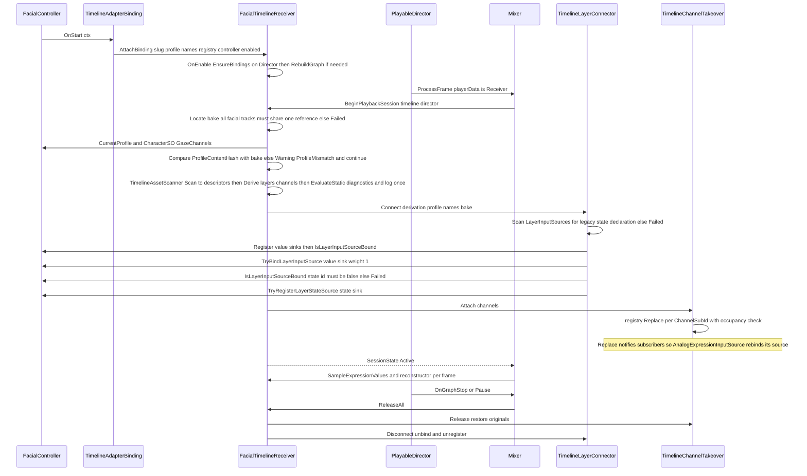
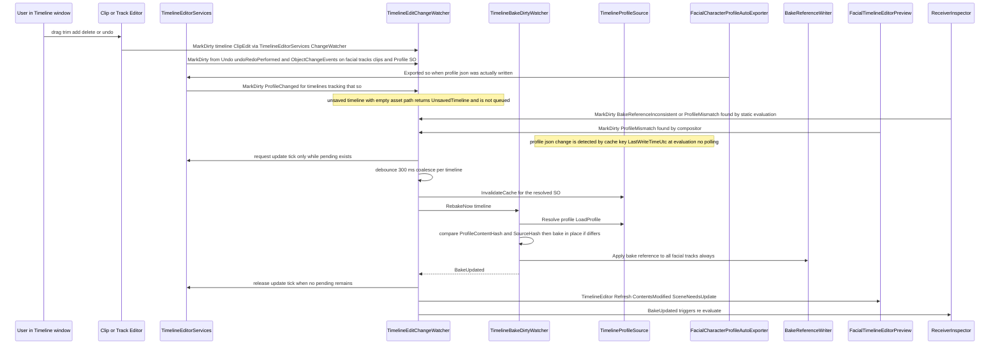
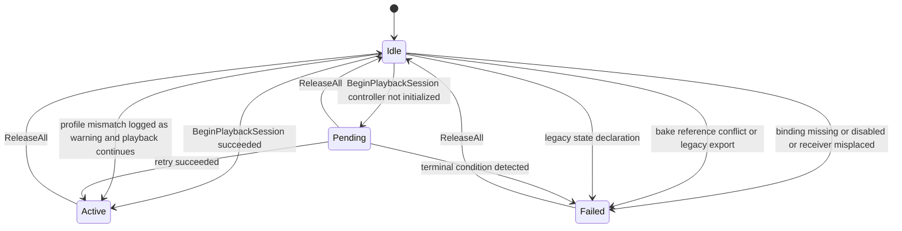
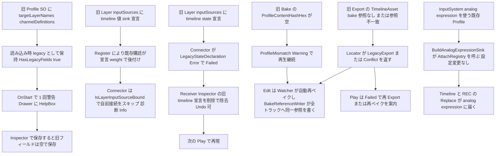

# Technical Design: timeline-playback-ux

- 対象 Unity プロジェクト: `FacialControl/`（Unity 6000.3.19f1）
- 主変更パッケージ: `FacialControl/Packages/com.hidano.facialcontrol.timeline`（Runtime / Editor / Tests）
- 限定変更パッケージ: `FacialControl/Packages/com.hidano.facialcontrol`（core。FacialController のレイヤー接続 API、LayerUseCase の接続済み判定、Layer2ActiveExpressionProvider の増減 API、InvalidIdValidator の動的 id 許容、Domain マーカー interface 1 つ、Domain 公開契約 `IRegistryAttachableAnalogConsumer` と `AnalogExpressionInputSource` / `AnalogBlendShapeInputSource` によるその実装（registry 再解決。D3 改訂 3）、Editor `FacialCharacterProfileAutoExporter` の冪等入口 `ExportIfEnabled(so)` と完了イベント `Exported`（D6 改訂 3））
- 最小変更パッケージ: `FacialControl/Packages/com.hidano.facialcontrol.inputsystem`（`InputSystemAdapterBinding.BuildAnalogExpressionSink` の末尾に registry 再解決の接続呼び出し 1 行のみ。weight 経路 / Overlay 経路には触れない。D3 改訂）
- 入力: `requirements.md`（承認扱い）、`research.md` §2〜§11（Gap 分析と Gate A 判定）
- パス表記: 本文のファイルパスは Unity プロジェクト `FacialControl/` からの相対

## Overview

**Purpose**: REC で録画した表情・目線を REC Export の TimelineAsset として Play モードで再現するまでの手順を「REC Export → Director に TimelineAsset をセット → Receiver を FacialController に追加」の 4 手順に縮め、Profile SO / Layer.inputSources / BakeAsset / Track binding / Export ウィンドウに分散していた設定を TimelineAsset からの導出と FacialTimelineReceiver への集約で不要化する。欠落した手順は Console と Receiver Inspector に明示し、無言で止まる経路を残さない。

**Users**: Unity エンジニア（VTuber 配信・ゲーム内演出で Timeline 再生を使う開発者）。Timeline の内部構造（Bake / sink / inputSources）を知らずに使えることを前提にする。

**Impact**: `TimelineAdapterBinding` は Slug と有効/無効フラグだけの「受信許可フラグ」に格下げされ、再生に必要なレイヤー / チャネル / Bake / Track binding はすべて再生セッション開始時に `FacialTimelineReceiver` が TimelineAsset と Profile から導出・自動接続する。Edit モードでは Clip 編集を変更検知 + デバウンスで自動再ベイクし、Edit プレビューは Runtime と同じ Profile ソースと同じ合成パイプライン（`LayerUseCase` → `LayerBlender`）で描画する。core には「宣言の無い入力源をレイヤーへ接続 / 解放 / 判定する」public API を追加するが、既存 binding の接続経路（`ResolveLayerInputSourcesFromRegistry` / `HandleLayerInputSourceRebound`）は変更しない。

### Goals

- 4 手順だけで Expression（トリガー）・Analog・Gaze の 3 種が Play モードで再現される（受け入れ条件 1）
- Clip を動かした直後に Edit プレビューと次の Play 再生が新しいタイミングになる（受け入れ条件 2）
- 手順欠落時に Console または Receiver Inspector に欠落項目と直し方が出る。診断は Runtime 側の状態値として保持し、テストはログ文言ではなく状態値で検証する（受け入れ条件 3、Req 11.4）
- REC Export の出力をそのまま使う PlayMode end-to-end テストで上記を固定する（受け入れ条件 4）
- Edit プレビューと Play 再生が同一の Profile スナップショットと同一の Bake を読んでいることをハッシュと参照整合で検証し、食い違いは無言で続けない。Bake 参照の不整合は Edit は自動再ベイク、Play は停止 + 直し方の明示。Profile スナップショットの不一致（`ProfileMismatch`）は Edit は stale 表示 + 自動再ベイク、Play は Warning + 再生継続（Bake の値をそのまま使い、Edit 復帰時の無言再ベイクで解消）に落とす。Play 移行前の Profile 同期は、Timeline 側が core AutoExporter の冪等入口 `FacialCharacterProfileAutoExporter.ExportIfEnabled(so)` を **Bake 照合の直前に直列に呼ぶ**ことで `playModeStateChanged` の購読順序に依存させない（D6 改訂 3）。Timeline 側が独自に profile.json を書くことはなく、書き込みが起きるのは AutoExport が有効（`CharacterAssetName` 非空）で内容が変わった場合のみ = 既存 AutoExport と同じ副作用に限定する（Req 1.5 / 4.1 / 4.6 / 7.1 / 7.5 / 11.5）
- Analog チャネルは Play で実際の BlendShape まで届く。core に公開契約 `IRegistryAttachableAnalogConsumer`（`AttachRegistry` / `DetachRegistry`）を定義し、core の Analog 消費者（`AnalogExpressionInputSource` / `AnalogBlendShapeInputSource`）がこれを実装して registry の Replace を追従する。InputSystem 経由で構成した analog expression にも Timeline の値が反映されることを、(a) core 契約の Small テスト + (b) inputsystem パッケージ内の実 `InputSystemAdapterBinding` を通す Replace 追従テスト + (c) timeline の e2e（同形の Fake binding）の 3 段で証明する（Req 3.4 / 3.5 / 11.1 / 11.2。D3 改訂 3）
- 新規コードは timeline Domain に `Unity.Timeline` 型を持ち込まない。TimelineAsset の走査は Adapters の `TimelineAssetScanner` が Unity 非依存の DTO（`TimelineTrackDescriptor`）に写し、Domain の導出 / id 規約 / 診断は DTO と文字列だけを受ける（steering「Domain は Unity 型を使わない」との整合。既存の Domain → `Unity.Timeline` 参照 2 ファイルは既存例外として明記し本仕様では移動しない。Req 1.6 / 2.3 / 7.6。D14）
- 毎フレーム処理のヒープ確保ゼロを維持する（セッション開始時の確保は許容）

### Non-Goals

- レイヤー weight / 入力源 weight のランタイム変更の REC 対応（並走 spec `rec-weight-coverage`。core の `LayerUseCase` weight API、`FacialController.SetLayerWeight` / `SetInputSourceWeight`、rec パッケージ、`InputSystemAdapterBinding` の `ApplyOverlayLayerWeights` / `BuildOverlaySources` / `OverlayBindingRuntime` には触れない）
- `.fcrec` フォーマットの拡張（gaze 広告情報の追加等）
- 系1 / 系2 の active 取得統合そのもの（backlog M-25）。本仕様は後付け系2 を `_layer2Provider` へ反映する最小限の API 追加に留める
- core 外の第三者が実装した Analog 消費者（`IAnalogInputSource` を構築時参照で保持する独自クラス）への到達。本仕様で再解決対応するのは core の 2 消費者（`AnalogExpressionInputSource` / `AnalogBlendShapeInputSource`）と、それを構築する `InputSystemAdapterBinding` の analog expression 経路のみ。第三者は `IRegistryAttachableAnalogConsumer` を実装すれば同じ契約に乗れる（D3 改訂 3）
- `FacialCharacterProfileExporter`（profile.json の内容・パス規約・サンプリング）の変更。`FacialCharacterProfileAutoExporter` には冪等入口 `ExportIfEnabled(so)` と `Exported` イベントを **追加するだけ** で、既存の書き出し契機（`ExitingEditMode` の `ExportAll` / ビルド前）と書き出し内容は変えない。Timeline 側が独自に profile.json を生成・書き込みすることはしない（D6 改訂 3）
- 既存 Domain 配下で `Unity.Timeline` 型を参照している `FacialTimelineHashCalculator` / `TimelineStateEventCollector` を Adapters へ移動すること（既存例外。backlog 候補として記録。本仕様では既存ファイルの変更のみ行う。D14）
- 新しいトラック / Clip 種別、ランタイム UI

## Boundary Commitments

### This Spec Owns

- `com.hidano.facialcontrol.timeline` の再生セッションモデル: TimelineAsset からのレイヤー / チャネル導出、sink の生成と `FacialController` への接続・解放、Analog / Gaze の乗っ取り（takeover）と復元、Bake の自動解決（全 Facial トラックの参照一致要求）と鮮度判定、Profile スナップショットの一致検証（`ProfileContentHash`）、Track binding の自動設定、診断状態モデル
- 旧 Profile の `timeline:{layer}:state` 宣言を非互換（Error、再生停止）として検出・除去する経路（Connector の検出、Receiver Inspector の削除操作）
- Timeline 側の id 規約: sink id（`TimelineSinkIdConvention`）、`ChannelSubId` の形式（REC の source id `slug:sub` をそのまま保持）、Bake 参照の置き場（Track 側 `IFacialTimelineBakeHolder`）
- Timeline Editor: Receiver Inspector（UI Toolkit）、Clip 編集の変更検知と自動再ベイク、Edit プレビューの合成（`TimelinePreviewCompositor`）、REC Export ウィンドウと Exporter の出力契約（TimelineAsset 1 つで完結）
- Timeline Editor の Unity イベント購読の所有権: `TimelineEditorServices`（`[InitializeOnLoad]`）が `ObjectChangeEvents.changesPublished` / `Undo.undoRedoPerformed` / `EditorApplication.update`（dirty 待機中のみ）/ `EditorApplication.playModeStateChanged` / `AssemblyReloadEvents.beforeAssemblyReload` / `EditorApplication.quitting` の購読を一元管理し、`TimelineEditChangeWatcher` と `TimelineBakeDirtyWatcher` へ配送する。Receiver Inspector の購読は Inspector インスタンスが所有する（D7 / D8 改訂）
- core に追加する public 契約の定義と安定化: `FacialController.TryBindLayerInputSource` 系 5 メソッド、`LayerUseCase.IsLateInputSourceBound`、`Layer2ActiveExpressionProvider.AddSource / RemoveSource`、`IAdapterBindingDynamicInputs`、`InvalidIdValidator` の動的 prefix 許容、`FacialController.CollectBlendShapeNames` の public static 化、Domain 公開契約 `IRegistryAttachableAnalogConsumer`（`AttachRegistry(IInputSourceRegistry, AdapterSlug)` / `DetachRegistry()`）とその core 実装 `AnalogExpressionInputSource` / `AnalogBlendShapeInputSource`（registry 購読による analog source の再解決。REC の `RecAnalogInjector` も同じ Replace 経路なので追加作業なしで同じ到達範囲になる）、core Editor `FacialCharacterProfileAutoExporter.ExportIfEnabled(FacialCharacterProfileSO)` / `static event Action<FacialCharacterProfileSO> Exported`（Play 移行前の Profile 同期を購読順序に依存せず直列化する冪等入口。既存の `ExitingEditMode` 購読は内部でこの入口を呼ぶ形に整理し挙動不変。D6 改訂 3）
- Timeline 側の Unity.Timeline 走査境界: `TimelineAssetScanner`（Adapters）が TimelineAsset を Unity 非依存 DTO `TimelineTrackDescriptor` に写し、Domain の `TimelineChannelDeriver` / `TimelineSinkIdConvention` / `FacialTimelineDiagnostics` / `TimelineOnceWarningGate` は DTO と文字列だけを受ける純粋関数として Small テスト可能に保つ（D14）

### Out of Boundary

- 既存 binding（OSC / InputSystem / LipSync / iFacialMocap）の接続挙動。`ResolveLayerInputSourcesFromRegistry` / `SubscribeDeclaredLayerInputSources` / `HandleLayerInputSourceRebound` は変更しない
- `InputSystemAdapterBinding` のうち `BuildAnalogExpressionSink` の末尾（構築済み `_analogExpressionSink` に `AttachRegistry(ctx.InputSourceRegistry, slug)` を 1 回呼ぶ）以外: `BuildAnalogSources` / `TryRegisterAnalogSource`（登録 id と `AnalogInputSourceWrapper` の構造）/ `BuildOverlaySources` / `ApplyOverlayLayerWeights` / `OnLateTick` の weight 経路は並走 spec `rec-weight-coverage` の領域であり変更しない
- REC 記録・再生（rec パッケージ）の挙動。Timeline の sink が registry へ Replace されると REC の `AnalogObservationSampler` がそれを観測するが、これは既存契約の結果であり本仕様で変更しない。`RecAnalogInjector` の Replace が core 消費者へ届くようになるのは core 側再解決の副次効果で、rec のコードは触らない
- profile.json の内容・パス規約（`FacialCharacterProfileExporter`）と AutoExporter の既存契機（`ExitingEditMode` の `ExportAll` / ビルド前 `IPreprocessBuildWithReport`）。Timeline 側は `ExportIfEnabled(so)` を呼ぶだけで、JSON の生成・既存ファイルとの比較・書き込み・`Exported` の発火は AutoExporter が行う。Timeline が独自に JSON を書く経路は持たない
- 既存 Domain の `Unity.Timeline` 参照（`FacialTimelineHashCalculator` / `TimelineStateEventCollector`）の Adapters への移動。既存例外として明記し、backlog 候補とする（`TimelineEventStateReconstructor` は Unity 非依存であることを確認済み）
- `LayerInputSourceAggregator` の長さ不一致防御（Req 8.8 は timeline 側の mask 長統一で満たす。core 側防御は backlog 候補として記録）
- Profile SO Inspector の一般的な binding 一覧 UI（`AdapterBindingsListView`）。Timeline binding 用 PropertyDrawer は timeline Editor 側に置き、core 側は既存の Drawer 検出機構をそのまま使う
- Timeline ウィンドウの描画・検証表示（`FacialTimelineValidator` / TrackEditor の errorText）は Profile ソース統一（Req 4.5）以外は変更しない

### Allowed Dependencies

- timeline Runtime asmdef → core `Hidano.FacialControl.Domain` / `Application` / `Adapters`、`Unity.Timeline`（既存）
- timeline Editor asmdef → 上記 + `Hidano.FacialControl.Editor`（新規参照。PropertyDrawer の `IAdapterBindingHeaderSummaryProvider`、Routing ロジック型、`FacialCharacterProfileAutoExporter.ExportIfEnabled` / `Exported` のため）+ `Hidano.FacialControl.Rec.*`（既存）+ `Unity.Timeline.Editor`（既存）
- timeline Tests.Shared asmdef → timeline Runtime + `Hidano.FacialControl.Domain` / `Application` / `Adapters`（新規参照。Fake binding と Fake analog source のため）+ `Hidano.FacialControl.Rec.Domain` / `Rec.Adapters`（新規参照。`.fcrec` fixture 生成ヘルパー共有のため）
- timeline Tests.PlayMode asmdef → 上記 + `Hidano.FacialControl.Application` + `Hidano.FacialControl.Rec.*`（新規参照）。`Hidano.FacialControl.InputSystem` は参照しない（timeline の `package.json` が inputsystem に依存していないため、テスト asmdef から参照すると inputsystem 未導入環境でコンパイルが壊れる。Analog の消費確認は core の `AnalogExpressionInputSource` を Tests/Shared の Fake binding で構成して行い、実 `InputSystemAdapterBinding` 経路は inputsystem パッケージ自身の PlayMode テストで固定する。D3 改訂 3）
- 依存方向の禁止事項: core → timeline を参照しない。timeline Runtime → timeline Editor を参照しない（既存 `FacialTimelineEditorPreviewBridge` の delegate 橋渡しを維持）。timeline → inputsystem を参照しない
- **timeline Runtime Domain → `Unity.Timeline` / `UnityEngine` 型の参照は既存例外のみ、新規追加禁止**（D14）。timeline Runtime は単一 asmdef（`Hidano.FacialControl.Timeline`）で Domain / Adapters はフォルダ分けのためコンパイラは強制しない。本仕様では (1) 既存例外 = `Runtime/Domain/Services/FacialTimelineHashCalculator.cs`（`TimelineAsset` / `TrackAsset` を走査）と `Runtime/Domain/Services/TimelineStateEventCollector.cs`（`TrackAsset` を走査）の 2 ファイルに限定し、変更は既存ファイル内（ハッシュ対象の拡張）に留める。(2) 新規 Domain ファイル（`TimelineTrackDescriptor` / `TimelineLayerDescriptor` / `TimelineChannelDescriptor` / `TimelineDerivation` / `TimelineChannelDeriver` / `TimelineSinkIdConvention` / 診断モデル / `TimelineOnceWarningGate`）は `using UnityEngine.*` を持たない。(3) `TimelineAsset` / `TrackAsset` / `FacialExpressionTrack` / `FacialValueTrack` / `FacialTimelineBakeAsset` / `PlayableDirector` を受ける処理は `Runtime/Adapters/`（`TimelineAssetScanner` / `FacialTimelineBakeLocator` / `TimelineTrackBindingResolver` / `TimelineDiagnosticsEvaluator` / Connector / Takeover / Receiver）に置く。コードレビューの確認項目にし、`TimelineChannelDeriverTests` 等の Small テストが TimelineAsset を生成せず DTO だけで書けることを担保の証拠とする

### Revalidation Triggers

- `FacialController` の新 API 署名や前提条件（`IsInitialized` 必須、レイヤー名解決規則）が変わったとき → `TimelineLayerConnector` と e2e テストを再検証
- `TimelineSinkIdConvention` の規則変更（名前優先 / index フォールバック）→ 旧 Profile の値 sink 宣言との重複判定（Req 3.3）、旧 `:state` 宣言の検出規則、Routing エディタの許容規則（Req 2.5）を再検証
- `IFacialTimelineBakeHolder` の置き場（Track 側）を変えるとき → Exporter / DirtyWatcher / Locator の一致要求 / 旧形式判定（Req 10.7）を同時に更新
- `FacialCharacterProfileSO.LoadProfile()` の優先順位（JSON 優先）が変わるとき → `TimelineProfileSource` は `LoadProfile()` を呼ぶだけなので追従するが、`ProfileContentHash` の照合テストと「購読順を入れ替えても結果が同じ」DirtyWatcher テストを再検証
- `FacialCharacterProfileAutoExporter.ExportIfEnabled` の冪等契約（有効判定 = `CharacterAssetName` 非空 / 内容が同一なら書かない / 書いたときだけ true と `Exported`）や `ExportProfileJson` の有効判定が変わるとき → `TimelineBakeDirtyWatcher.ProcessOpenSceneTimelinesNow` の直列化（`ExportIfEnabled` → `InvalidateCache` → `Resolve` → 照合）と `TimelineEditorServices` の `Exported` 購読（`MarkDirty(ProfileChanged)`）を再検証（D6 改訂 3）
- `IInputSourceRegistry.Subscribe` の通知契約（Register / Replace で新 source、Unregister で null、通知中の変更は拒否、Unsubscribe 無し）が変わるとき → `IRegistryAttachableAnalogConsumer` の実装（`AttachRegistry` の再解決、`DetachRegistry` の世代ガード）と `TimelineChannelTakeover` の復元を再検証
- timeline Runtime Domain に `Unity.Timeline` / `UnityEngine` 型を参照する新規ファイルを追加しようとするとき → D14 違反。`TimelineAssetScanner` の DTO に項目を足して Adapters 側で吸収する。既存例外 2 ファイル以外への追加は禁止（Allowed Dependencies 参照）
- `rec-weight-coverage` が `InputSystemAdapterBinding.OnStart` の構築順や `BuildAnalogExpressionSink` を触るとき → `AttachRegistry` の呼び出し位置（`_analogExpressionSink` 構築直後）と inputsystem PlayMode の再解決テストを再検証
- `FacialProfile` / `FacialCharacterProfileSO.GazeChannels` にフィールドが増えるとき → `ComputeProfileContentHashHex` の対象に含めるかを判定し、含めるなら既存 Bake が一度 `ProfileMismatch` になる（Edit の自動再ベイクで解消）ことを CHANGELOG に記載
- `rec-weight-coverage` が `LayerUseCase.BindLateInputSource` の weight 列の扱いを変えるとき → `UnbindLayerInputSource` の復元順序を再検証

## Architecture

### Existing Architecture Analysis

research.md §2 に棚卸し済み。設計に直接影響する事実のみ再掲する。

- `TimelineAdapterBinding.OnStart` が Profile の `targetLayerNames` / `channelDefinitions` から sink を作り、`FacialTimelineReceiver.Configure(...)` に tuple 列で渡す。sink の BlendShape 名は OnStart 時点の `_receiver.BakeAsset` で固定される
- Mixer（`FacialTrackMixerBehaviour` / `FacialValueMixerBehaviour`）は Director の generic binding（`playerData`）からしか Receiver を解決できない。`FacialValueTrack` には `[TrackBindingType]` が無い
- core の後付け接続は `LayerUseCase.BindLateInputSource(layerIdx, declaredId, source, weight)` / `UnbindLateInputSource` が既存で、`FacialController` の public 面には無い。`_layer2Provider` は `PopulateLayer2Provider` で一括 `SetSources` されるだけで増減 API が無い
- `TimelineStateEventCollector.Collect(rootTrack)` は子トラック（`{layer} Lane n`）を root のレイヤー名で畳んでいる（確認済み）。`TimelineBakeService.Bake` と `FacialTimelineHashCalculator` も `GetOutputTracks()`（root）を起点に走査する
- `TimelineExpressionStateSink` の `ContributeMask` 長は 0。`LayerInputSourceAggregator.AggregateInternal` は `layerMask.Or(source.ContributeMask)` を長さ検査なしで呼ぶため、state sink がレイヤーに接続され Expression が ON になると `ArgumentException` になる経路が実在する（research.md §5）
- `GazeSourceIdConvention.IsValidChannelId` は `:` を含む id を拒否する。Export は `ChannelSubId` に REC の source id（`osc:gaze`）を書く
- Profile ソース: Runtime は `FacialCharacterProfileSO.LoadProfile()`（StreamingAssets の profile.json 優先）、Editor 系（Bake / Validator / Exporter / Preview）は `BuildFallbackProfile()`（SO）
- `IAdapterBindingDefaultLayerInputs` は `AdapterBindingsListView`（binding 追加時の inputSources 自動追加）と `AutoWireService` が参照しており、Timeline binding が実装すると副作用が出る
- `scripts/check-test-sizes.ps1` は Small で `AddComponent<FacialTimelineReceiver>` / `AssetDatabase` / `EditorApplication` / `[UnityTest]` を禁止している
- Analog 消費経路（実コード確認済み）: `InputSystemAdapterBinding.BuildAnalogExpressionSink` は `_analogSources`（生の `InputActionAnalogSource`）を `sourceId → IAnalogInputSource` 辞書にして `AnalogExpressionInputSource` に渡す。registry には `AnalogInputSourceWrapper`（inputsystem の private nested 型）を `{slug}:{actionName}` で別途 Register している。したがって消費者は wrapper も registry も知らず、registry の Replace は消費者に届かない。`AnalogBlendShapeInputSource` を構築する production コードは存在しない（core のテストのみ）。`InputSourceRegistry.Subscribe(id, handler)` は Register / Replace で新 source、Unregister で null を通知し、Unsubscribe API は無い（購読は registry と同寿命）
- Profile JSON の書き出し（実コード確認済み）: `FacialCharacterProfileAutoExporter`（`Editor/AutoExport/`）は `[InitializeOnLoad]` 静的コンストラクタで `playModeStateChanged` を購読し `ExitingEditMode` に `ExportAll("playmode")` を呼ぶ。`ExportAll` は `AssetDatabase.FindAssets("t:FacialCharacterProfileSO")` の全 SO について `AssetDatabase.SaveAssetIfDirty(so)` → `FacialCharacterProfileExporter.SampleAnimationClipsIntoCachedSnapshots(so, sampler)` → `ExportProfileJson(so)` を順に呼ぶ。`ExportProfileJson` は `so.CharacterAssetName` が空白なら Warning + false（= AutoExport が「無効」な SO はこれだけ）、それ以外は JSON を `File.WriteAllText` で **常に** 書く（既存ファイルとの比較は無い）。完了通知イベントは無い。`TimelineBakeDirtyWatcher` も自身の静的コンストラクタで同イベントを購読しており、両者の呼び出し順は未定義 → 本仕様で AutoExporter に冪等入口 `ExportIfEnabled(so)` と `Exported` イベントを追加し、Timeline 側が直列に呼ぶ（D6 改訂 3）
- timeline Runtime の層構成（実コード確認済み）: 単一 asmdef `Hidano.FacialControl.Timeline`（参照: core Domain / Application / Adapters、`Unity.Timeline`）で Domain / Adapters はフォルダ分け。`Runtime/Domain/Services/` の `FacialTimelineHashCalculator`（`using UnityEngine; using UnityEngine.Timeline;`、`TimelineAsset` を走査）と `TimelineStateEventCollector`（`using UnityEngine.Timeline;`、`TrackAsset` を走査）が Unity 型を参照している。`TimelineEventStateReconstructor` は Unity 非依存。steering（tech.md / structure.md）は「Domain は Unity 型を使わない契約」としており、この 2 ファイルは既存例外として扱う（D14）
- Editor 購読の所有: `TimelineBakeDirtyWatcher`（`playModeStateChanged` / `FacialTimelineReceiver.BakeIssueDetected`）と `FacialTimelineEditorPreview`（bridge delegate）がそれぞれ `[InitializeOnLoad]` で自己登録しており、解除は行っていない

### Architecture Pattern & Boundary Map

research.md §6 の **Option B（責務分割）** を採用し、tasks の依存順は **Option C の段階順** に従う。

```mermaid
graph TB
    subgraph CoreRuntime[core Runtime]
        FC[FacialController]
        LUC[LayerUseCase]
        L2P[Layer2ActiveExpressionProvider]
        REG[InputSourceRegistry child scope]
        AEX[AnalogExpressionInputSource implements IRegistryAttachableAnalogConsumer]
    end

    subgraph CoreEditor[core Editor]
        AEXP[FacialCharacterProfileAutoExporter ExportIfEnabled and Exported]
    end

    subgraph TimelineRuntimeDomain[timeline Runtime Domain no Unity types in new files]
        SID[TimelineSinkIdConvention]
        DTO[TimelineTrackDescriptor DTO]
        DER[TimelineChannelDeriver]
        DIAG[FacialTimelineDiagnostics]
        GATE[TimelineOnceWarningGate]
        PHASH[FacialTimelineHashCalculator ProfileContentHash existing exception]
    end

    subgraph TimelineRuntimeAdapters[timeline Runtime Adapters]
        SCAN[TimelineAssetScanner]
        RCV[FacialTimelineReceiver facade]
        BIND[TimelineAdapterBinding flag only]
        CON[TimelineLayerConnector]
        TAKE[TimelineChannelTakeover]
        LOC[FacialTimelineBakeLocator]
        TBR[TimelineTrackBindingResolver]
        EVAL[TimelineDiagnosticsEvaluator]
        MIX[Facial Track and Value Mixers]
        TRK[Facial Tracks with bake holder]
    end

    subgraph TimelineEditor[timeline Editor]
        SVC[TimelineEditorServices subscription owner]
        INS[FacialTimelineReceiverInspector]
        WATCH[TimelineEditChangeWatcher]
        DIRTY[TimelineBakeDirtyWatcher]
        PSRC[TimelineProfileSource]
        COMP[TimelinePreviewCompositor]
        EXP[RecToTimelineExporter and Window]
        DRW[TimelineAdapterBindingDrawer]
        CLN[LegacyTimelineDeclarationCleaner]
    end

    BIND --> RCV
    MIX --> RCV
    RCV --> SCAN
    SCAN --> TRK
    SCAN --> DTO
    DTO --> DER
    RCV --> DER
    RCV --> LOC
    DIRTY --> AEXP
    AEXP --> SVC
    RCV --> PHASH
    COMP --> PHASH
    DIRTY --> PHASH
    INS --> CLN
    CLN --> SID
    COMP --> LOC
    RCV --> TBR
    RCV --> EVAL
    RCV --> CON
    RCV --> TAKE
    CON --> SID
    CON --> FC
    TAKE --> REG
    REG --> AEX
    FC --> LUC
    FC --> L2P
    SVC --> WATCH
    SVC --> DIRTY
    EVAL --> DIAG
    CON --> DIAG
    TAKE --> DIAG
    DIAG --> GATE
    INS --> RCV
    INS --> DIAG
    WATCH --> DIRTY
    DIRTY --> PSRC
    DIRTY --> TRK
    EXP --> TRK
    EXP --> PSRC
    COMP --> PSRC
    COMP --> LUC
    LOC --> TRK
```



**Architecture Integration**

- Selected pattern: 既存の Receiver を「ファサード」に留め、導出 / 解決 / 接続 / 乗っ取り / 診断を Unity 非依存寄りの小さなサービスへ分割する。`Unity.Timeline` の走査は Adapters の `TimelineAssetScanner` が 1 箇所で行い Unity 非依存 DTO（`TimelineTrackDescriptor`）に写す。導出・id 規約・診断モデルは DTO と文字列だけを受ける Domain の純粋関数として置き、EditMode Small で TimelineAsset を生成せずに単体テストする（D14）
- Profile 同期の直列化: Play 移行前は Timeline 側（`TimelineBakeDirtyWatcher.ProcessOpenSceneTimelinesNow`）が core AutoExporter の冪等入口 `ExportIfEnabled(so)` を先に呼んでから Bake を照合する。`playModeStateChanged` の購読順序に依存せず、JSON の生成・書き込みの所有者は AutoExporter のまま（D6 改訂 3）
- Domain / feature boundaries: core は「接続 / 解放 / 判定」の口だけを提供し、何を接続するかは timeline が決める。timeline Editor は Runtime の診断状態を読むだけで、判定ロジックを持たない
- Existing patterns preserved: Gaze 乗っ取り（`registry.Replace` + `IInjectedInputSource` 占有規則 + 参照同一性で復元）、`_legacyGazeConfigs` 方式の legacy フィールド、`MissingBakeWarnings` 方式の 1 回警告、`AdapterBindingsListView` の Drawer 検出、UI Toolkit Editor
- New components rationale: 下表「確定した設計判断」参照
- Steering compliance: クリーンアーキテクチャ（Unity 依存は Adapters / Editor。timeline Domain の新規ファイルに Unity 型を持ち込まない。既存例外 2 ファイルは明記して据え置き）、asmdef 依存方向、Unity 標準ログのみ、UI Toolkit、毎フレーム GC ゼロ、`{Target}Tests.cs` への追記

### 段階順（tasks の依存指針。research.md §6 Option C）

| 段 | 含めるもの | 完了基準 |
|---|---|---|
| 第 1 段 | core API（D2）/ core 公開契約 `IRegistryAttachableAnalogConsumer` と Analog 消費者の registry 再解決（`AttachRegistry` / `DetachRegistry`、D3 改訂 3）と `InputSystemAdapterBinding.BuildAnalogExpressionSink` の接続 1 行 + inputsystem PlayMode の Replace 追従テスト / Req 8.8 修正と再現テスト / `TimelineAssetScanner` と DTO `TimelineTrackDescriptor`（D14）/ `TimelineSinkIdConvention`（旧 `:state` 宣言の判定を含む）/ `TimelineChannelDeriver`（DTO 入力）/ `FacialTimelineHashCalculator` の `ProfileContentHash` 分離と Bake の `ProfileContentHashHex`（D6）/ `FacialTimelineBakeLocator`（全トラック一致要求）+ Track 側 bake holder / `TimelineTrackBindingResolver` / `TimelineLayerConnector`（`LegacyStateDeclaration` 検出）/ `TimelineChannelTakeover`（Analog + Gaze）/ 診断モデルと `TimelineDiagnosticsEvaluator` / Receiver ファサード化（Bake 参照検証で Failed、`ProfileMismatch` は Warning 継続）と Mixer の isPlaying 分岐 / binding 格下げ（legacy フィールド）/ `TimelineProfileSource` / Exporter の bake 参照書き込み / Tests/Shared の Fake analog binding / e2e PlayMode テスト（Analog → `AnalogExpressionInputSource` → BlendShape を含む） | 受け入れ条件 (1)(3)(4) が e2e と診断テストで緑 |
| 第 2 段 | `TimelineEditorServices`（Editor 購読の一元管理、D8 改訂）/ `FacialTimelineReceiverInspector`（旧 `:state` 宣言の削除ボタンを含む）/ `LegacyTimelineDeclarationCleaner` / `TimelineAdapterBindingDrawer` / `TimelineEditChangeWatcher`（Profile 変更・参照不整合・Profile 不一致を dirty 契機に含む。未保存 Timeline はスキップ）/ `TimelineBakeDirtyWatcher` のダイアログ撤去と `RebakeNow` / `BakeUpdated` / Undo・SetDirty / core `FacialCharacterProfileAutoExporter.ExportIfEnabled` + `Exported` の追加と `ExitingEditMode` の直列化（`ExportIfEnabled(so)` → `InvalidateCache` → `Resolve` → 鮮度照合 → 再ベイク。D6 改訂 3）/ `TimelineEditorServices` の `Exported` 購読 | 受け入れ条件 (2) のうち「次の Play 再生」と Inspector 表示、Req 1.5 / 4.5 / 11.5 の「購読順非依存」テスト |
| 第 3 段 | `TimelinePreviewCompositor`（Edit/Play 一致。`ProfileMismatch` は描画を続けつつ stale を報告し自動再ベイク）/ Gaze プレビューの id 解決 / REC Export ウィンドウ整理と Exporter 署名変更 / README・Documentation~ 更新（`:state` 宣言の削除必須を明記） | 受け入れ条件 (2) の「Edit プレビュー」と Req 7 / 10 の全テスト緑 |

### 確定した設計判断（requirements.md が「設計が判定し根拠を文書化する」とした項目）

詳細な比較は research.md §12 に記録する。design.md 単体で判断が追えるよう結論と根拠をここに置く。

| ID | 対象 Req | 決定 | 根拠（要約） |
|---|---|---|---|
| D1 | 2.3 | レイヤー導出は `timeline.GetOutputTracks()` の root `FacialExpressionTrack` のみ。子トラック（`{layer} Lane n`）は `TimelineStateEventCollector` が既に親レイヤー名へ畳むため導出対象外。チャネル導出は root `FacialValueTrack` の `ChannelSubId` / `ChannelKind` / クリップ `Axes.Length` の最大値。sink id は **名前優先・index フォールバック**: レイヤー名が `[a-zA-Z0-9_.-]` のみで `:` を含まず `timeline:{name}:state` が 64 文字以内なら `timeline:{name}`、それ以外（`layer` + 数字のみの名前を含む。別レイヤーのフォールバック id との衝突を避けるため。2026-10-05 タスク 4.1 レビューで追加）は `timeline:layer{index}`（index は Profile のレイヤー index）。フォールバック時は診断 `LayerSinkIdFallback`（Info）に表示 | ASCII 名では既存 README / 旧 Profile 宣言 / 既存テストの id と互換を保ち（Req 3.3 の重複判定が成立する）、非 ASCII 名でも `InputSourceId.Parse` が例外にならず衝突しない。サニタイズ名は「感情」「表情」が同じ空文字に潰れるため不採用 |
| D2 | 3.1 / 3.3 / 3.8 / 8.8 | `timeline:{layer}` 値 sink は `FacialController.TryBindLayerInputSource(layer, id, sink, weight: 1f)` でレイヤー入力源へ接続。`timeline:{layer}:state` sink は **レイヤー入力源に接続しない**。`FacialController.TryRegisterLayerStateSource(layer, id, sink)` で `_layer2Provider`（overlay suppress の active provider）と REC 観測（`UpdateObservedTriggerSource`）へ登録する。値 sink は registry にも `Register(slug, sub)` する（旧 Profile に値 sink の宣言 `timeline:{layer}` があれば既存の購読経路で declared weight のまま後付けされ、connector は `IsLayerInputSourceBound` が true のとき自前接続をスキップし `LayerConnectionSkippedDeclared`（Info）= Req 3.3）。**旧 `timeline:{layer}:state` 宣言は互換維持しない**: connector はセッション開始時に (a) `profile.LayerInputSources` を静的走査し、`TimelineSinkIdConvention.IsLegacyStateDeclaration(id, slug)`（slug prefix + `:state` 終端。名前形 / index フォールバック形の両方）に一致する宣言があれば何も登録せずに、(b) (a) を通過しても値 sink の `Register` 後に `IsLayerInputSourceBound(layer, stateId)` が true なら登録済みのものを Disconnect して、診断 `LegacyStateDeclaration`（Error、Subject = レイヤー名 + 宣言 id）を記録し `SessionState = Failed` で再生を停止、Console に 1 回「Layer.inputSources から `timeline:{layer}:state` を削除してください（Receiver Inspector の『旧 timeline 宣言を削除』で除去できます）」を出す。Receiver Inspector は Edit で Profile SO の `Layers[].inputSources` を `LegacyTimelineDeclarationCleaner.Scan` で走査して同じ診断を Play 前に表示し、「旧 timeline 宣言を削除」ボタン（`Undo.RecordObject(so)` + `EditorUtility.SetDirty`、`{slug}:*:state` のみ削除。値 sink の `timeline:{layer}` 宣言は weight 指定の意図があり得るため残し Info 表示）を提供する。Req 8.8 は `TimelineExpressionStateSink` の `ContributeMask` 長を `ctx.BlendShapeNames.Count`（全 false）に揃えて修正し、先に `TimelineExpressionStateSinkTests` で `ArgumentException` を再現する。この修正は **多層防御として維持**する（検出をすり抜けて旧宣言経路で接続された瞬間に例外で全出力が止まる事故を防ぐ） | state sink は値を持たず（`BlendShapeCount=0`）レイヤー接続は `layerWeightSum` を汚すだけで BlendShape に寄与しない。実用途は active provider と観測なので接続先を分ける。旧 `:state` 宣言を許容すると、state sink を registry に Register した時点で既存購読経路がそれをレイヤーへ接続し、connector のスキップ判定が「非接続方針」を迂回してしまう（validate-design 1 回目 Critical 2）。宣言の削除をユーザーに求めるコストより、無言で方針が崩れる方が高くつくため非互換とする。Aggregator 側防御は core の許容範囲外として backlog へ |
| D3（改訂 3） | 3.4 / 3.5 / 11.1 / 11.2 | Analog チャネルは Gaze と同じ **registry Replace 乗っ取り**。takeover 先 id は `ChannelSubId`（= REC の source id）そのまま。`TimelineAnalogInputSource` を `IInjectedInputSource` 化し占有規則を共有する。**Replace が実際の表情まで届く契約を本仕様で完結させる**（方式 (2)）: core Domain に公開契約 `IRegistryAttachableAnalogConsumer { void AttachRegistry(IInputSourceRegistry registry, AdapterSlug slug); void DetachRegistry(); bool IsRegistryAttached { get; } }` を定義し、`AnalogExpressionInputSource` / `AnalogBlendShapeInputSource` がこれを実装する（改訂 2 の `AttachRegistry` を interface に昇格。改訂 3）。実装は各 binding の `{slug}:{SourceId}` を `registry.Subscribe` して通知のたびに解決済み binding の `Source` を差し替える（新 source が `IAnalogInputSource` でなければ無視、null（Unregister）なら構築時の source に戻す）。`InputSystemAdapterBinding.BuildAnalogExpressionSink` は `_analogExpressionSink` 構築直後に `AttachRegistry(ctx.InputSourceRegistry, slug)` を 1 回呼ぶ（この 1 行以外 inputsystem は変更しない。`BuildAnalogSources` / `BuildOverlaySources` / `ApplyOverlayLayerWeights` / 登録 id / wrapper 構造は不変）。差し替えは Replace 時（セッション開始 / 終了）のみ発生し毎フレームの確保は無い。診断 `AnalogTakeoverAttached`（Info）は「registry 購読型の消費者に反映」と表示し、注記は不要になる。解決不可（source 未登録 / 他注入者占有）は `AnalogSourceNotFound` / `AnalogOccupied` を Console に 1 回出し他チャネルを継続。**実 InputSystem 経路の証明は 3 段で固定し、パッケージ依存は増やさない**（改訂 3）: (a) core Small `AnalogExpressionInputSourceTests` / `AnalogBlendShapeInputSourceTests` で契約（Replace 追従 / null で復元 / 冪等 / Detach）、(b) inputsystem `Tests/PlayMode/Integration/InputSystemAdapterBindingIntegrationTests.cs`（既存）で実 `InputSystemAdapterBinding.OnStart` → `registry.Replace("{slug}:{actionName}", stubAnalog)` 後に `registry.TryResolve("{slug}:analog-expression")` で得た `AnalogExpressionInputSource` の `TryWriteValues` が stub の値に追従し、`Unregister`（または Replace 元へ戻す）で構築時 source に復元されること（timeline 非依存。REC の `RecAnalogInjector` も同じ Replace 経路なので REC 側の到達も同時に証明される）、(c) timeline e2e は `FakeAnalogAdapterBinding`（core の実 `AnalogExpressionInputSource` を `IRegistryAttachableAnalogConsumer` として `AttachRegistry`）で Timeline Analog クリップ → BlendShape を固定。(a)+(b)+(c) の組で「実 InputSystem 経路」を証明する。timeline のテスト asmdef は inputsystem を参照しない（Allowed Dependencies 不変） | (1) core のみでの解決は不可能: registry に登録されているのは inputsystem の private nested `AnalogInputSourceWrapper` だが、消費者は wrapper ではなく生の `InputActionAnalogSource` を保持しているため、registry 側で wrapper の内側を差し替えても消費者には届かない。消費者は registry / slug を受け取っていないので自力購読もできない。(2) は消費者側の再解決を core に置き、inputsystem 側は構築済み sink へ registry を渡す 1 行で済む。(3)「registry 購読型消費者に限定」は InputSystem の analog expression（最も一般的な Analog 消費者）に Timeline の値が届かず Req 11.1 / 11.2 の「連続値が再現される」を満たせないため不採用。REC の `RecAnalogInjector` も同じ Replace 方式なので、本変更で REC 再生の Analog も core 消費者へ届くようになる（rec 側の変更なし） |
| D4 | 3.7 / 10.4 | `ChannelSubId` は REC の source id（`slug:sub`、例 `osc:gaze` / `osc:gaze.left`）を **そのまま保持**。Gaze takeover 先 = `ChannelSubId` そのもの。`GazeSourceIdConvention.TryParse` は側（Shared/Left/Right）とチャネル id の分類・診断表示にだけ使い、解析不能でも registry に存在すれば takeover する（`useDistinctLeftRight` の明示 source id を許容）。`IsValidChannelId` は core で変更せず、binding 側のチャネル id 検証は channelDefinitions 撤去に伴い消える。`TimelineAdapterBinding` は `IGazeSourceProvider` を実装しない（乗っ取りは「提供」ではない） | Export が既に書いている id を正とすれば takeover 先の導出が一意になり、Profile の `providerSlug` / active slug 列挙に依存する曖昧さ（research.md C4）が消える |
| D5 | 4.1 / 4.2 / 4.4 / 4.7 / 6.3 / 10.7 | Bake 参照は **Track 側**。`FacialExpressionTrack` / `FacialValueTrack` が `IFacialTimelineBakeHolder`（`[SerializeField, HideInInspector] FacialTimelineBakeAsset bake`）を実装し、Exporter と DirtyWatcher が再ベイク後に全 Facial トラック（root + 子）へ同じサブアセット参照を書く（`BakeReferenceWriter`）。Runtime は `FacialTimelineBakeLocator.Locate(timeline, overrideBake)` が `GetOutputTracks()` + 子の全 Facial トラックを走査し、**全 holder が同一の非 null 参照を指すときだけ `Found`** を返す。異なる参照の混在、または一部トラックのみ参照あり（部分欠落）は `Conflict`、全トラック参照なしは `LegacyExport`（Req 10.7）、Facial トラック自体が無ければ `Missing`。`Conflict` / `LegacyExport` の扱い: Play は `SessionState = Failed`（Error、Console 1 回。直し方: Editor で Timeline を開いて保存 / 再 Export / Receiver Inspector の「今再ベイク」）、Edit は `TimelineEditorServices.ChangeWatcher.MarkDirty(timeline, BakeReferenceInconsistent)` → 自動再ベイク → `BakeReferenceWriter.Apply` が全トラックへ同一参照を書いて自己修復する（`RebakeNow` はハッシュ一致で Bake 内容を焼き直さない場合でも参照の修復は必ず行う）。`overrideBake`（`Receiver.BakeAsset` の手動上書き）が指定されていれば Locator の検証結果に関わらず `OverrideUsed` として上書きを採用するが、トラック参照（`Found` の参照、または `Conflict` 時に見つかった非 null 参照のいずれか）と不一致なら `BakeOverrideDiffers`（Warning）を併記する。Bake サブアセットには `HideFlags.HideInHierarchy` を付け Project ウィンドウから隠す（`AssetDatabase.LoadAllAssetsAtPath` は隠しサブアセットも返すため既存の `FindBakeAsset` は動く。実装時に Unity 上で確認） | Marker 方式は markerTrack の生成と Timeline ウィンドウでの可視化が必要、専用 TrackAsset は行として見える。Track フィールドは Editor API なしで Runtime から辿れ、トラック順の変更に強い。「最初の非 null を採用」は走査順に依存して結果が非決定的になる（validate-design 1 回目 Critical 3）。全トラック一致を要求すれば結果は一意で、Edit は自動再ベイクで自己修復し、Play は再ベイク要求で止まるため古い Bake を無言で再生しない |
| D6（改訂 3） | 1.5 / 4.1 / 4.5 / 4.6 / 7.1 / 7.5 / 11.5 | Profile ソースは **単一化 + ハッシュ検証 + Play 移行前の直列同期**。(1) Editor 系（Bake / IsStale / Validator / Exporter / Preview compositor / Edit 診断）は `TimelineProfileSource.Resolve(so)` に一元化し、その中身は `FacialCharacterProfileSO.LoadProfile()`（StreamingAssets の profile.json 優先、無ければ SO）を**そのまま呼ぶ**（優先順位を再実装しない）。キャッシュキーは SO instanceID + profile.json の `Exists` / `LastWriteTimeUtc` + `EditorUtility.IsDirty(so)`。(2) Play 中の Receiver / Connector / Evaluator は **`FacialController.CurrentProfile`（controller が Initialize で読んだ値。既存 public プロパティ、core 追加不要）をそのまま使い、再読込しない**。(3) `FacialTimelineHashCalculator` の Profile 部分を `ComputeProfileContentHashHex(profile, gazeChannels)`（`SchemaVersion` / `Layers` / `LayerInputSources` / `Expressions` / `Slots` / `DefaultOverlays` / `BaseExpression` + SO の `GazeChannels`）として分離し、`SourceHashHex` はこの値を含めて計算する。Bake は `ProfileContentHashHex`（新規フィールド、additive）を保存し既存 `ProfileAssetGuid` も維持する。(4) 照合: Play はセッション開始時に `ComputeProfileContentHashHex(controller.CurrentProfile, controller.CharacterSO.GazeChannels)` と Bake の値を比較、Edit は Compositor / Evaluator が `ComputeProfileContentHashHex(TimelineProfileSource.Resolve(so), so.GazeChannels)` と比較。不一致（空文字も含む）は診断 `ProfileMismatch`（**Warning、継続**。改訂 2）: Play は `SessionState = Active` のまま Bake の値をそのまま再生し、Console に 1 回 Warning（直し方: Edit に戻ると自動で再ベイクされる / 今すぐ直すなら Receiver Inspector の「今再ベイク」）。Inspector には要対応として表示する。Edit は Compositor が描画を止めずに Inspector へ stale を表示し、`TimelineEditorServices.ChangeWatcher.MarkDirty(timeline, ProfileMismatch)` で自動再ベイクする（再ベイク後に解消）。Play 中に検出した `ProfileMismatch` は `EnteredEditMode` の無言再ベイク（D8）で解消する。Profile 一致で `SourceHashHex` のみ不一致なら従来どおり `BakeStale`（Warning、継続。Req 4.6）。`ProfileAssetGuid` の不一致は Edit 側で「別の Profile SO から焼かれた Bake」として `ProfileMismatch` の Detail に併記する（Runtime は GUID を取れないため内容ハッシュのみで判定）。(5) 更新時点（改訂 2）: Profile SO の変更（`ObjectChangeEvents.ChangeAssetObjectProperties` の対象が `FacialCharacterProfileSO` またはその派生）を `MarkDirty(ProfileChanged)` の契機に加える。profile.json の変化はポーリングせず、`TimelineProfileSource` のキャッシュキー（`LastWriteTimeUtc`）が評価時点（Inspector 評価 / Compositor の描画 / `OnWillSaveAssets` / `ExitingEditMode`）で検出し、ハッシュ不一致なら `ProfileMismatch` 経由で `MarkDirty` に合流する（dirty が無い間の `EditorApplication.update` 購読を無くすため。D8 改訂）。**Play 移行前の Profile 同期は購読順序に依存せず直列化する（改訂 3）**: core の `FacialCharacterProfileAutoExporter` に冪等な public 入口 `static bool ExportIfEnabled(FacialCharacterProfileSO so)`（有効な SO = `CharacterAssetName` 非空、すなわち既存 `ExportProfileJson` がスキップしない SO に対してのみ、`SaveAssetIfDirty` → `SampleAnimationClipsIntoCachedSnapshots` → JSON 生成 → 既存 profile.json と文字列比較 → **異なるときだけ** `File.WriteAllText`。書いたら true）と完了イベント `static event Action<FacialCharacterProfileSO> Exported`（書いたときだけ発火）を追加し、既存の `ExportAll` は内部で SO ごとに `ExportIfEnabled` を呼ぶ形に整理する（契機・内容は不変。同一内容のときに書き込みを省くため `LastWriteTimeUtc` が変わらなくなる点だけが差分）。`ExitingEditMode` では `TimelineEditorServices` が `ChangeWatcher.FlushNow()` で保留中の再ベイクを流した後、`TimelineBakeDirtyWatcher.ProcessOpenSceneTimelinesNow()` がシーン上の Director ごとに解決した Profile SO について **まず `FacialCharacterProfileAutoExporter.ExportIfEnabled(so)` を呼び**、その後 `TimelineProfileSource.InvalidateCache(so)` → `Resolve(so)`（= `LoadProfile()` の現在値）→ `ProfileContentHash` 照合 → 不一致なら `RebakeNow`。これにより AutoExporter の `ExportAll` が前後どちらで走っても Bake は常に最新 JSON（= Play の controller が読む内容）で焼かれ、通常経路では `ProfileMatched` になる（AutoExport 無効の SO は JSON が変わらないので何もしない。ユーザーファイルを書くのは AutoExport が有効で内容が変わった場合のみ = 既存 AutoExport と同じ副作用に限定）。Edit 中の `Exported` イベントは `TimelineEditorServices` が購読し、その SO を `TrackProfile` している Timeline に `ChangeWatcher.MarkDirty(timeline, ProfileChanged)` を発行する契機に加える。`ProfileMismatch` の Play 時 Warning + 継続は、上記直列化を通らなかった経路（スクリプトからの Play 開始、Player ビルド、Bake 焼き直し失敗）向けの最終防御として維持する | Bake ハッシュに Profile が入るため、JSON と SO が食い違えば Runtime 側で常に HashMismatch になる。「LoadProfile を再実装しない / Play は controller が保持する値を使う」ことでソース選択の分岐自体を無くし、残る食い違い（JSON 書き出しの遅延、別 Profile から焼いた Bake）は内容ハッシュで検出する（validate-design 1 回目 Critical 1）。JSON ファースト方針（steering）とも一致。初版改訂 1 の「ExitingEditMode で profile.json を先行書き出す」は AutoExporter との購読順を Timeline 側が吸収する代わりにユーザーの Profile ファイルを Timeline が書き換える副作用を持ち、しかも AutoExporter に完了イベントが無いため順序を保証できなかった（validate-design 2 回目 Critical 2）。改訂 2 の「照合のみ・順序非依存」は AutoExport が後順になると Play が `ProfileMismatch` になる経路を残しており、Edit プレビューと Play の一致（Req 7.1 / 11.5）が購読順に左右された（validate-design 3 回目 Critical 1）。改訂 3 は JSON の所有者（AutoExporter）に冪等入口を持たせ、Timeline 側はそれを呼ぶだけにすることで「Timeline が JSON を書かない」と「順序に依存しない」を同時に満たす。Profile の不一致は「Edit プレビューと Play の結果が一致しない可能性がある」ことを示すが、再生する Bake 自体は一意に決まっているため停止ではなく Warning + 継続が妥当（Bake 参照の不整合とは異なる）。既存 Bake は `ProfileContentHashHex` が空のため一度 `ProfileMismatch`（Warning）になり、Edit 評価か `ExitingEditMode` の再ベイクで埋まる |
| D7 | 5.1〜5.6 / 1.6 | Director 解決順: (1) Receiver の `director` SerializeField（任意上書き）→ (2) 同 GameObject の `PlayableDirector` → (3) 親階層 → (4) シーン走査（`FindObjectsByType<PlayableDirector>(Include, None)`）で `playableAsset` が Facial トラックを持つ TimelineAsset の Director のうち、いずれかの Facial トラックの generic binding が自分（または自分の GameObject）を指すもの。(4) で候補が 2 つ以上なら `DirectorAmbiguous`（Error。上書きフィールドの設定を案内）。走査はセッション開始時と Inspector 評価時のみ。Play 中は Mixer が `playable.GetGraph().GetResolver()` から得た Director を正とし、別 Director が同じ Receiver で `BeginPlaybackSession` を呼んだら `SessionConflict`（1 Receiver 1 セッション）。Track binding の自動設定（Req 1.6）は `TimelineTrackBindingResolver.EnsureBindings` が「binding 未設定の Facial トラック」にだけ自分を設定し、他オブジェクトが設定済みなら `TrackBindingForeign` を記録して触らない。Play モードは Receiver の `OnEnable` で実行し、Director のグラフが既に有効なら `RebuildGraph()`。Edit モードは Inspector 評価時に `Undo.RecordObject(director)` + `SetDirty` 付きで実行する。診断は Runtime 側 `FacialTimelineDiagnostics`（enum コード + 件名 + 重大度、`Revision` と `Changed` イベント）に集約し、Inspector は読むだけ。Inspector 更新トリガは `Undo.undoRedoPerformed` / `EditorApplication.hierarchyChanged` / `ObjectChangeEvents.changesPublished`（Director・Profile SO・Receiver に関する変更のみ）/ `TimelineEditorServices.ChangeWatcher.BakeUpdated` / `FacialTimelineDiagnostics.Changed`（Play 中）/ `playModeStateChanged`。**購読の所有権（改訂 2）**: これらの購読は Inspector インスタンスが所有し、`CreateInspectorGUI` で登録、root 要素の `DetachFromPanelEvent` と `OnDisable` で解除する（片方が先に来ても二重解除は no-op）。`TimelineEditorServices` の購読と重複しない（Services は再ベイク配送、Inspector は表示更新のみ）。Edit 評価で `BakeReferenceConflict` / `BakeLegacyExport` / `ProfileMismatch` / `UnsavedTimeline` を検出したときは `TimelineEditorServices.ChangeWatcher.MarkDirty` を呼ぶだけで、Inspector 自身はデバウンスや再ベイクを持たない。再描画は `schedule.Execute(...).ExecuteLater(100)` で合流させる | Mixer は binding 済みトラックしか Receiver を呼ばないため、自動 binding はグラフ構築前（OnEnable / Inspector 評価）に済ませる必要がある。Director の `playableAsset` 変更を直接通知する API は無いため ObjectChangeEvents と再描画時再評価で拾う。Inspector が破棄されても購読が残ると破棄済み `SerializedObject` を掴んで NRE を出す（既存 Editor 拡張で実例あり）ため、購読は Inspector の寿命に閉じる |
| D8（改訂 2） | 6.1〜6.7 / 9.1 / 11.7 | 変更検知は 3 経路の組み合わせ: (a) `ClipEditor.OnClipChanged` / `TrackEditor.OnTrackChanged` / `OnCreate`（既存 `FacialExpressionClipEditor` / `FacialExpressionTrackEditor` / `FacialValueClipEditor` に override 追加、`FacialValueTrackEditor` を新設。Timeline ウィンドウでの移動・トリム・追加を即時に拾う）、(b) `Undo.undoRedoPerformed`（Undo/Redo と削除）、(c) `ObjectChangeEvents.changesPublished` の `ChangeAssetObjectProperties` / `DestroyAssetObject` で対象が Facial トラック・Clip・TimelineAsset のもの（Inspector からの `ExpressionId` / `ChannelKind` 編集、スクリプト編集）。すべて `TimelineEditorServices.ChangeWatcher.MarkDirty(timeline, reason)` に合流し、**デバウンス 300 ms**（`EditorApplication.update` + `EditorApplication.timeSinceStartup`）後にハッシュ比較 → 不一致なら `TimelineBakeDirtyWatcher.RebakeNow(timeline)`。実行中に再度 MarkDirty されたら完了後に 1 回だけ再実行（Req 6.5）。再ベイク完了で `BakeUpdated` を発火し `TimelineEditor.Refresh(RefreshReason.ContentsModified | RefreshReason.SceneNeedsUpdate)` を呼ぶ（Req 6.2）。**購読の所有権と解除条件**: Unity イベントの購読者は `TimelineEditorServices`（`[InitializeOnLoad]` static）だけ。冪等な `EnsureInitialized()`（初期化済みフラグで二重購読を防ぐ）で `ObjectChangeEvents.changesPublished` / `Undo.undoRedoPerformed` / `EditorApplication.playModeStateChanged` を購読し、`EditorApplication.update` は **dirty な Timeline が 1 つ以上ある間だけ**購読する（最後の pending が消えた時点で解除。待機中の空 tick を無くす）。`AssemblyReloadEvents.beforeAssemblyReload` と `EditorApplication.quitting` で `Shutdown()`（全購読解除 + pending 破棄）し、ドメインリロード後は `[InitializeOnLoad]` が `EnsureInitialized()` を呼び直す。TrackEditor / ClipEditor は Editor インスタンスから `TimelineEditorServices.ChangeWatcher.MarkDirty` を呼ぶだけで購読を持たない。`TimelineBakeDirtyWatcher` の静的コンストラクタにある `playModeStateChanged` / `BakeIssueDetected` 購読は撤去し、Services からの呼び出し（`ProcessOpenSceneTimelinesNow` / `TryRepairPendingSessionIssuesNow`）に置き換える。**未保存 Timeline**: `AssetDatabase.GetAssetPath(timeline)` が空（インメモリの TimelineAsset）はサブアセットを保存できないため再ベイク対象外。`MarkDirty` は `MarkDirtyResult.UnsavedTimeline` を返して何も予約せず、Edit の Evaluator が診断 `UnsavedTimeline`（Info、「TimelineAsset を保存すると自動ベイクが有効になります」）を記録する。`EnteredEditMode` のダイアログと `RepairRunResult.HasDialog` は撤去し、Play 中に検出した HashMismatch / `ProfileMismatch` の修復は Edit 復帰時に無言で実行して Console に Info を 1 行出す。失敗時は Console に理由を出し前回 Bake を保持（既存 `created` のみ破棄ロジック）。Undo / SetDirty: Director の binding と `Receiver.BakeAsset` などシーン側オブジェクトの変更は `Undo.RecordObject` + `EditorUtility.SetDirty`。Bake サブアセットと Track の bake 参照は内部キャッシュなので Undo スタックに載せず `SetDirty` のみ | Timeline のドラッグは OnClipChanged をマウス移動ごとに発火するため即時再ベイクは不可。300 ms は入力間隔（約 16 ms）より十分長く、ユーザーが「待ち」と感じる閾値より短い。Bake を Undo に載せると Undo でキャッシュだけ巻き戻り鮮度判定と矛盾する。購読の所有者が分散すると、ドメインリロード後の二重購読（同じ変更で再ベイクが 2 回走る）や、解除されない `EditorApplication.update` が Editor 全体に空 tick を残す（validate-design 2 回目 Critical 3）。所有者を 1 つにして解除条件を明示すれば、テストで「購読数 1 / 解除後 0 / 連打で再ベイク 1 回」を固定できる |
| D9 | 7.1 / 7.4 / 7.6 | Edit プレビューは Editor 側に **オフラインの `LayerUseCase` + `ExpressionUseCase`** を持つ `TimelinePreviewCompositor` で合成する。Profile は `TimelineProfileSource.Resolve`、ホスト BlendShape 名は `FacialController.CollectBlendShapeNames(controller.SkinnedMeshRenderers)`（public static 化）、入力源は Play と同じ `TimelineBakedValueSink`（Bake から名前取得）+ `TimelineExpressionStateSink`（`TimelineEventStateReconstructor.JumpTo(t)` で状態復元）を `TryBindLayerInputSource` と同じ weight 1 で `BindLateInputSource` した構成。時刻 t ごとに sink へ Bake 値を書き `UpdateWeights(0f)` → `GetBlendedOutput()` → `SkinnedMeshRendererBlendShapeWriter` で描く。これにより `LayerBlender` の優先度 / レイヤー weight / overlay / override mask / base expression の規則を Editor で再実装しない。Gaze プレビューは `ValueChannelBake.Sub`（REC source id）→ `GazeSourceIdConvention.TryParse` のチャネル id、または `GazeChannel.sourceIdLeft / Right` との完全一致で解決（index 結合を廃止）。**一致の定義**: 同一 TimelineAsset・同一 Profile スナップショット（Edit は `TimelineProfileSource.Resolve(so)`、Play は `controller.CurrentProfile`。両者の `ProfileContentHash` が Bake の `ProfileContentHashHex` に一致していることを一致保証の前提条件とする。不一致でも Compositor は Bake の値で描画を続け、`ProfileCheck` に `ProfileMismatch` を報告して Inspector 表示と `MarkDirty(ProfileMismatch)` の自動再ベイクを起動する（改訂 2。Play 側も同じ Bake を Warning 継続で再生するため、不一致中も Edit / Play は同じ Bake を読んでいる））・同一 Bake（`FacialTimelineBakeLocator` が `Found` を返す参照。Edit / Play とも同じ Locator を使う）・同一ホストメッシュ・Timeline 以外の live 入力なし・レイヤー weight 既定（1）・Base Expression 既定。比較時刻は 0、各 Clip の start / end の ±1 サンプル（1/60 s）、各 Clip の中点、Timeline の duration。許容誤差は BlendShape 正規化値で 1e-4（renderer の 0〜100 スケールでは 0.01。既存 `TimelineLiveEquivalenceIntegrationTests.LinearTolerance` と同値）、Gaze は目ボーン `localRotation` の各成分で 1e-3 | `LayerUseCase` は Application 層で Domain `LayerBlender` を内包する。Timeline のみの入力では遷移を持つ入力源が値を出さないため、dt=0 での評価が Play の LateUpdate 結果と一致する。遷移中の時刻は Bake 時に `BakeSimulationHarness` が同じ Aggregator で焼いているため Edit / Play が同じカーブを読む |
| D10 | 8.7 | Play: `BeginPlaybackSession` から `ReleaseAll` までを 1 セッションとし、(Receiver instanceID, 診断コード, 件名) につき 1 回。Edit: 同じキーで **診断エポック**につき 1 回。エポックは (a) `BakeUpdated`、(b) Director の `playableAsset` / binding 変更、(c) ドメインリロード、(d) Play → Edit 復帰でリセット。`TimelineOnceWarningGate`（Domain）が `TryPass(ownerId, code, subject)` / `ResetEpoch()` を提供し、Inspector の表示はゲートに依らず常に現在値を出す | Edit にはセッションが無いため「入力が変わるまで 1 回」を明示する。Bake 更新や配線変更で状況が変われば同じ警告でも再掲する価値がある |
| D11 | 8.8 | 再現テスト: `TimelineExpressionStateSinkTests`（Small。`LayerInputSourceRegistry` + `LayerInputSourceWeightBuffer` + `LayerInputSourceAggregator` に state sink を sourceIdx 0 として直差し → `TriggerOn("smile")` → `Aggregate(0f, span)` が例外を投げないこと、`ContributeMask.Length == blendShapeCount` であること）。修正: `TimelineExpressionStateSink` のコンストラクタに `IReadOnlyList<string> blendShapeNames` を受け、基底へ `blendShapeCount: blendShapeNames.Count` を渡す（値出力は `TryWriteValues` が従来通り何も書かない構造を維持するため、`ContributeMask` は全 false の専用 BitArray を返す） | 修正前に赤を確認する TDD 順序を tasks に固定する。Aggregator 側の防御は core 変更範囲外（backlog） |
| D12 | 11.1〜11.8 | e2e は PlayMode Medium `TimelinePlaybackEndToEndTests`（新規クラス → 新規ファイル可）。fixture は Tests/Shared の `TimelineE2EFixture`（.fcrec 生成 → `RecToTimelineExporter.TryExportTimelineAsset` → アセット化した Profile SO + BlendShape 付きメッシュ + 明示目ボーン → FacialController / Receiver / Director 配置）。Director は `timeUpdateMode = Manual`、`time` 設定 → `Evaluate()` → `yield return null`（LateUpdate 後）で `SkinnedMeshRenderer.GetBlendShapeWeight` を検証。Analog は Tests/Shared の `FakeAnalogAdapterBinding`（slug `osc`。`FakeAnalogInputSource` を `osc:lt` に Register し、core の `AnalogExpressionInputSource`（binding: `lt` → Expression `squint`）を構築して `AttachRegistry` を呼び `osc:analog-expression` で Register。InputSystem の `BuildAnalogExpressionSink` と同じ構成）を Profile SO の AdapterBindings に加え、レイヤー `inputSources` に `osc:analog-expression` を宣言した状態で、registry の `osc:lt` が `TimelineAnalogInputSource` に置換され → `AnalogExpressionInputSource` が追従 → `squint` の BlendShape が Analog クリップ値 × Expression 値になることを `SkinnedMeshRenderer.GetBlendShapeWeight` で確認する（Req 11.1 の「連続値」）。セッション終了で `osc:lt` が Fake に戻り BlendShape が 0 に戻ることも確認。Gaze は目ボーン回転。配置: 導出 / id 規約 / 診断モデル / Bake 解決 / Locator は EditMode Small（`ScriptableObject.CreateInstance` のみ）、Receiver・Director・AssetDatabase を使うものは EditMode Medium、Director 再生・LateUpdate が要るものは PlayMode Medium | `check-test-sizes.ps1` が Small で `AddComponent<FacialTimelineReceiver>` / `AssetDatabase` / `[UnityTest]` を禁止している。Exporter（Editor asmdef）は PlayMode テスト asmdef から参照可能（既存） |
| D14 | 1.6 / 2.3 / 7.6 | **新規コードは timeline Domain に `Unity.Timeline` 型を持ち込まない**。`TimelineAsset` の走査（`GetOutputTracks` / `GetChildTracks` / Clip 列挙 / bake holder 読取）は Adapters の `TimelineAssetScanner.Scan(TimelineAsset)` に集約し、Unity 非依存の DTO `TimelineTrackDescriptor { TrackIndex, Kind, Name, ChannelSubId, ChannelKind, MaxAxisCount, HasBakeReference, BakeInstanceId, IsChild, ParentIndex }` の列と、同じ index で並ぶ `TrackAsset` 列（Adapters 専用）を返す。`TimelineChannelDeriver.Derive(IReadOnlyList<TimelineTrackDescriptor>, FacialProfile)` / `TimelineSinkIdConvention` / `FacialTimelineDiagnostics` / `TimelineOnceWarningGate` は DTO と文字列だけを受ける純粋関数として Domain に残す（Small テストで TimelineAsset を生成しない）。`TimelineLayerDescriptor` / `TimelineChannelDescriptor` は Track 参照を持たず `TrackIndex` で Scanner の結果を逆引きする。`FacialTimelineBakeLocator` / `TimelineTrackBindingResolver` / `TimelineDiagnosticsEvaluator`（`TimelineStaticEvaluationContext` を含む）は Adapters（Bake は `UnityEngine.Object`、Director は `PlayableDirector`）。既存 Domain の `FacialTimelineHashCalculator` / `TimelineStateEventCollector` は **既存例外として明記**し本仕様では移動しない（既存ファイル内の変更のみ。backlog 候補）。steering への追記は本 spec の範囲外（完了報告で候補として挙げる） | steering（tech.md / structure.md）は「Domain は Unity 型を使わない契約」であり、改訂 2 の「本パッケージ Domain は既に `Unity.Timeline` を扱うため Domain/Services に置く」は既存違反を前例として新規違反を正当化していた（validate-design 3 回目 Critical 3）。走査を Adapters の 1 箇所に閉じれば、導出・規約・診断は TimelineAsset 無しで Small テストでき、`Unity.Timeline` の API 変更の影響範囲も Scanner に限定される。既存例外 2 ファイルの移動は Mixer / Bake / Validator の呼び出し元が広く本仕様の目的外なので明記して据え置く |

### Technology Stack

| Layer | Choice / Version | Role in Feature | Notes |
|-------|------------------|-----------------|-------|
| Runtime | Unity 6000.3.19f1 / C# | Timeline Runtime・core Runtime | 既存 |
| Timeline | `com.unity.timeline` 1.8.9 | `PlayableDirector.SetGenericBinding` / `RebuildGraph`、`TimelineAsset.GetOutputTracks`、`TrackAsset.GetChildTracks`、`ClipEditor.OnClipChanged` / `TrackEditor.OnTrackChanged` / `OnCreate`、`TimelineEditor.Refresh(RefreshReason)`、`TimelineEditor.inspectedDirector` | API 存在を 1.8 ドキュメントで確認（research.md §12） |
| Editor | UnityEditor（`ObjectChangeEvents`、`Undo`、`EditorApplication.update`、UI Toolkit `UnityEditor.Editor.CreateInspectorGUI`、`PropertyDrawer.CreatePropertyGUI`） | 変更検知、Undo / Dirty、Receiver Inspector、binding Drawer | 新規依存なし |
| DI / core | VContainer child scope（既存）、`IInputSourceRegistry` | sink の Register / Replace / Subscribe | 既存契約を使用 |
| Tests | `com.unity.test-framework` 1.6.0、`Hidano.FacialControl.Testing`（`[SmallTest]` / `[MediumTest]`、`SizedTestFixture`） | Small / Medium / PlayMode e2e | `pwsh ./scripts/check-test-sizes.ps1` を通す |

## File Structure Plan

### Directory Structure（timeline パッケージ `Packages/com.hidano.facialcontrol.timeline/`）

```
Runtime/
├── Domain/
│   ├── Models/                               # すべて Unity 非依存（using UnityEngine.* 禁止。D14）
│   │   ├── TimelineTrackDescriptor.cs        # Scanner が返す DTO（TrackIndex・Kind・Name・ChannelSubId・ChannelKind・MaxAxisCount・HasBakeReference・BakeInstanceId・IsChild・ParentIndex）
│   │   ├── TimelineLayerDescriptor.cs        # 導出したレイヤー（名前・Profile index・TrackIndex）
│   │   ├── TimelineChannelDescriptor.cs      # 導出したチャネル（ChannelSubId・Kind・軸数・TrackIndex）
│   │   └── TimelineDerivation.cs             # 導出結果の集合（未一致トラック名を含む）
│   ├── Diagnostics/
│   │   ├── TimelineDiagnosticCode.cs         # 診断コード enum（テストはこの値で検証）
│   │   ├── TimelineDiagnosticItem.cs         # Area / Code / Severity / Subject / Detail
│   │   ├── FacialTimelineDiagnostics.cs      # 状態モデル（Items / Revision / Changed）
│   │   └── TimelineOnceWarningGate.cs        # 1 セッション・1 エポック 1 回の警告ゲート
│   └── Services/
│       ├── TimelineSinkIdConvention.cs       # sink id 規約（名前優先 / index フォールバック、旧 :state 宣言の判定）
│       ├── TimelineChannelDeriver.cs         # TimelineTrackDescriptor 列 + Profile → TimelineDerivation（純粋関数。TimelineAsset を受けない）
│       ├── FacialTimelineHashCalculator.cs   # 既存。ProfileContentHash を分離（Modified Files 参照）。Unity.Timeline 参照は既存例外（D14）
│       └── TimelineStateEventCollector.cs    # 既存・無変更。Unity.Timeline 参照は既存例外（D14。backlog 候補）
├── Adapters/
│   ├── Timeline/
│   │   └── TimelineAssetScanner.cs           # TimelineAsset → TimelineTrackDescriptor 列 + TrackAsset 列（Unity.Timeline 走査の唯一の置き場）
│   ├── Assets/
│   │   ├── IFacialTimelineBakeHolder.cs      # Track 側 bake 参照の契約
│   │   └── FacialTimelineBakeLocator.cs      # 全 Facial トラックの参照一致を検証して Bake を解決し状態を返す
│   ├── Session/
│   │   ├── TimelineBindingContext.cs         # binding.OnStart が Receiver に渡す readonly struct
│   │   ├── TimelineLayerConnector.cs         # sink 生成・registry 登録・FacialController への接続 / 解放
│   │   ├── TimelineChannelTakeover.cs        # Analog / Gaze の Replace 乗っ取りと復元（既存 Gaze 実装を一般化）
│   │   ├── TimelineTrackBindingResolver.cs   # Director 解決規則と Track binding の自動設定
│   │   └── ITrackBindingWriter.cs            # SetGenericBinding の書込口（Runtime 直書き / Editor は Undo 付き）
│   └── Diagnostics/
│       ├── TimelineStaticEvaluationContext.cs # Evaluator の入力（Director / Timeline / Controller / Bake 等の Unity 型を含むため Adapters）
│       └── TimelineDiagnosticsEvaluator.cs   # 静的診断（Edit / Play 開始前）の評価
Editor/
├── Inspector/
│   ├── FacialTimelineReceiverInspector.cs    # UI Toolkit CustomEditor
│   └── TimelineAdapterBindingDrawer.cs       # Slug + Enabled のみの PropertyDrawer + ヘッダー要約
├── TimelineEditorServices.cs                 # [InitializeOnLoad]。Unity イベント購読の唯一の所有者。ChangeWatcher の生成と DirtyWatcher への配送、EnsureInitialized / Shutdown
├── TimelineEditChangeWatcher.cs              # インスタンス。変更検知（Clip / Undo / ObjectChange / Profile / 参照不整合 / Profile 不一致）の合流 + デバウンス + BakeUpdated。未保存 Timeline はスキップ
├── TimelineProfileSource.cs                  # LoadProfile() をそのまま呼ぶ統一入口とキャッシュ（profile.json の変化はキャッシュキーで検出、ポーリングなし）
├── LegacyTimelineDeclarationCleaner.cs       # Profile SO の旧 timeline:*:state 宣言の走査と Undo 付き削除
├── BakeReferenceWriter.cs                    # 全 Facial トラックへ bake 参照を書く
├── EditorTrackBindingWriter.cs               # ITrackBindingWriter の Undo 付き実装
├── TimelinePreviewCompositor.cs              # オフライン LayerUseCase による Edit 合成
├── TrackEditors/FacialValueTrackEditor.cs    # 新設（OnTrackChanged / OnCreate）
Tests/
├── EditMode/                                 # 既存 {Target}Tests.cs へ追記 + 新規クラスの新規ファイル
├── PlayMode/TimelinePlaybackEndToEndTests.cs # e2e（新規クラス）
├── PlayMode/TimelinePreviewCompositorTests.cs# Edit/Play 一致
└── Shared/
    ├── RecFixtureWriter.cs                   # .fcrec 生成ヘルパー（EditMode / PlayMode 共用）
    ├── FakeAnalogInputSource.cs              # IInputSource + IAnalogInputSource の Fake（値を外から設定できる）
    ├── FakeAnalogAdapterBinding.cs           # Fake analog source と core AnalogExpressionInputSource（AttachRegistry 済み）を登録する Fake binding。InputSystem の構成と同形
    └── TimelineE2EFixture.cs                 # メッシュ・Profile SO・Export・配置を束ねる fixture
```

### Modified Files

timeline Runtime:
- `Runtime/Adapters/FacialTimelineReceiver.cs` — ファサード化。`Configure(tuple 列)` と `BeginPlaybackSession(FacialProfile, TimelineAsset)` を撤去し、`AttachBinding(in TimelineBindingContext)` / `BeginPlaybackSession(TimelineAsset, PlayableDirector)` / `EvaluateStaticDiagnostics()` / `Diagnostics` / `SessionState` / `DirectorOverride` を追加。`OnEnable`（Play 時）で Track binding 自動設定。sink 解決 API（`TryGetExpressionSink` 等）は connector / takeover へ委譲して署名維持
- `Runtime/Adapters/AdapterBindings/TimelineAdapterBinding.cs` — `enabled` 追加、`targetLayerNames` / `channelDefinitions` を `[SerializeField, HideInInspector]` の legacy に格下げ（`HasLegacyFields`、1 回警告）。`OnStart` は Slug 検証 → `Enabled` 判定 → Receiver 取得 / 生成（`_ownsReceiver`）→ `AttachBinding`。`Dispose` は `ReleaseAll` + 所有時のみ Destroy。`IGazeSourceProvider` を外し `IAdapterBindingDynamicInputs` を実装
- `Runtime/Playables/FacialTrackMixerBehaviour.cs` / `FacialValueMixerBehaviour.cs` — `!Application.isPlaying` ならプレビューのみで return（Req 7.2）。Play では `receiver.BeginPlaybackSession(timeline, director)` を呼び、sink 未解決は Receiver の診断（`TrackLayerUnmatched` / `AnalogSourceNotFound` 等）に委ねて無言 return を廃止（毎フレームの判定は bool フィールドのキャッシュで GC ゼロ）
- `Runtime/Tracks/FacialExpressionTrack.cs` / `FacialValueTrack.cs` — `IFacialTimelineBakeHolder` 実装。`FacialValueTrack` に `[TrackBindingType(typeof(FacialTimelineReceiver))]`
- `Runtime/Adapters/InputSources/TimelineExpressionStateSink.cs` — `ContributeMask` 長を BlendShape 数に統一（D11）
- `Runtime/Adapters/InputSources/TimelineAnalogInputSource.cs` — `IInjectedInputSource` 実装（`ReplacedSource` / `AttachReplacement` / `ClearReplacement` を `TimelineGazeInputSource` から基底へ移動）
- `Runtime/Domain/Services/FacialTimelineHashCalculator.cs` — Profile 部分を `ComputeProfileContentHash / ComputeProfileContentHashHex(in FacialProfile, ReadOnlySpan<GazeChannel>)` として分離し、対象を `SchemaVersion` / `Layers` / `LayerInputSources` / `Expressions` / `Slots` / `DefaultOverlays` / `BaseExpression` / `GazeChannels` に拡張。`ComputeHash(timeline, profile, gazeChannels, sampleRate)` は Timeline 構造 + ProfileContentHash + sampleRate で計算する（既存 Bake の `SourceHashHex` は一度不一致になり、自動再ベイクで更新される）
- `Runtime/Adapters/Assets/FacialTimelineBakeAsset.cs` — `ProfileContentHashHex`（string、additive）を追加。既存フィールドは不変

timeline Editor:
- `Editor/TimelineBakeDirtyWatcher.cs` — `[InitializeOnLoad]` と静的コンストラクタの `playModeStateChanged` / `BakeIssueDetected` 購読を撤去（購読は `TimelineEditorServices` へ移動。`OnWillSaveAssets` の `AssetModificationProcessor` 経路は Unity が呼ぶため残す）。`DisplayDialog` / `HandleEnteredEditModeNow` のダイアログ分岐 / `RepairRunResult.HasDialog` 撤去。`RebakeNow(TimelineAsset, out string failureReason)` を public 化、`UpdateLoadedReceiverReferences` を Undo + SetDirty 付きに変更、`IsStale` 判定を `TimelineProfileSource` 経由に変更、再ベイク後（ハッシュ一致で焼き直さない場合も）に `BakeReferenceWriter.Apply` と `HideFlags` 設定。`ProcessOpenSceneTimelinesNow`（`ExitingEditMode`）は解決した Profile SO ごとに **`FacialCharacterProfileAutoExporter.ExportIfEnabled(so)` → `TimelineProfileSource.InvalidateCache(so)` → `Resolve(so)`** の順で現在値を得て鮮度照合し不一致なら再ベイクする（D6 改訂 3）。Timeline 側が独自に profile.json を書く経路は無い
- `Editor/TimelineBakeService.cs` — SO overload を `TimelineProfileSource.Resolve(profileAsset)` 経由に変更。Bake に `ProfileContentHashHex` を書き込み、`IsStale` は `ProfileContentHashHex` → `SourceHashHex` の順に比較して不一致種別（Profile / Timeline）を返す
- `Editor/FacialTimelineEditorPreview.cs` — `ApplyBlendShapes` の単純加算を `TimelinePreviewCompositor` 呼び出しに置換、`ApplyGaze` をチャネル id 解決へ変更、Bake を `FacialTimelineBakeLocator` で解決、controller null を 1 回警告（無言 return 廃止）
- `Editor/FacialTimelinePreviewGazeTargets.cs` — index 述語を「チャネル id → Bake」の辞書解決に変更
- `Editor/Validation/FacialTimelineValidator.cs` — `TryResolveProfile` を `TimelineProfileSource` 経由に変更
- `Editor/RecToTimelineExporter.cs` — `TryExportTimelineAsset(recordingPath, profileAsset, outputAssetPath, out result, existingTimeline = null, sourceKindOverrides = null)` に署名変更（`director` / `receiver` 撤去）。Bake 書込後に `BakeReferenceWriter.Apply`。`DetectChannels(readResult, profileAsset)` を追加し行ごとの判定理由を返す。Gaze 判定に `IGazeSourceProvider.GetGazeSourceDeclarations()` を追加
- `Editor/RecTimelineExportWindow.cs` — Director / Receiver の ObjectField と Source Overrides を撤去し、検出結果（source id → kind + 理由）の読み取り専用リストと、Export 完了後の残り手順表示を追加
- `Editor/TrackEditors/FacialExpressionClipEditor.cs` / `FacialExpressionTrackEditor.cs` / `FacialValueClipEditor.cs` — `OnClipChanged` / `OnTrackChanged` / `OnCreate` を override し `TimelineEditorServices.ChangeWatcher.MarkDirty` を呼ぶ（Editor 側は購読を持たない）。`OnCreate` は兄弟トラックの bake 参照を補完
- `Editor/Hidano.FacialControl.Timeline.Editor.asmdef` — `Hidano.FacialControl.Editor` 参照を追加（PropertyDrawer の `IAdapterBindingHeaderSummaryProvider` のため）
- `Tests/Shared/*.asmdef` — `Hidano.FacialControl.Domain` / `Application` / `Adapters` / `Rec.Domain` / `Rec.Adapters` 参照を追加（Fake binding と `.fcrec` fixture）。`Tests/PlayMode/*.asmdef` — Rec / Application 参照を追加。いずれも `Hidano.FacialControl.InputSystem` は参照しない
- `README.md` / `Documentation~/README.md` — 4 手順、診断の読み方、旧設定の移行を更新

core（`Packages/com.hidano.facialcontrol/`）:
- `Runtime/Adapters/Playable/FacialController.cs` — 下記「FacialController 追加 API」5 メソッドと `CollectBlendShapeNames` の public static 化。既存の private 経路は変更しない
- `Runtime/Application/UseCases/LayerUseCase.cs` — `IsLateInputSourceBound(int layerIdx, string id)` 追加
- `Runtime/Application/UseCases/Layer2ActiveExpressionProvider.cs` — `AddSource` / `RemoveSource` 追加（`SetSources` は維持）
- `Runtime/Domain/Adapters/IAdapterBindingDynamicInputs.cs` — 新規マーカー interface
- `Runtime/Domain/Adapters/IRegistryAttachableAnalogConsumer.cs` — 新規公開契約（`IInputSourceRegistry` と同じ `Domain/Adapters/` に置く。参照は Domain の `IInputSourceRegistry` / `AdapterSlug` のみ）
- `Runtime/Adapters/InputSources/AnalogExpressionInputSource.cs` / `AnalogBlendShapeInputSource.cs` — `IRegistryAttachableAnalogConsumer` を実装（`AttachRegistry(IInputSourceRegistry registry, AdapterSlug slug)` / `DetachRegistry()` / `IsRegistryAttached`）。構築時に解決した各 binding の `Source` を `registry.Subscribe("{slug}:{SourceId}", ...)` の通知で差し替え可能にする（`ResolvedBinding.Source` を差し替え可能なフィールドにする。構築時 source は `OriginalSource` として保持し、null 通知と `DetachRegistry` で戻す）。コンストラクタ署名・`TryWriteValues` の挙動・`ContributeMask` は不変
- `Editor/AutoExport/FacialCharacterProfileAutoExporter.cs` — `public static bool ExportIfEnabled(FacialCharacterProfileSO so)` と `public static event Action<FacialCharacterProfileSO> Exported` を追加。既存 `ExportAll(trigger)` のループ本体（`SaveAssetIfDirty` → `SampleAnimationClipsIntoCachedSnapshots` → `ExportProfileJson`）を `ExportIfEnabled` に移し、`ExportAll` は SO 列挙 + `ExportIfEnabled` 呼び出し + 件数集計 + 例外時 Warning のみにする。JSON の生成は既存 `FacialCharacterProfileExporter.BuildProfileSnapshotDto` / `SystemTextJsonParser.SerializeProfileSnapshot` をそのまま使い、既存ファイルと文字列が一致すれば書かない（`FacialCharacterProfileExporter.ExportProfileJson` 自体は変更しない。`ExportIfEnabled` が比較を行い、異なるときだけ `ExportProfileJson(so)` を呼ぶ）。`[InitializeOnLoad]` と `ExitingEditMode` 購読、`FacialCharacterProfileBuildExporter` は不変
- `Editor/Windows/Routing/Logic/InvalidIdValidator.cs` — `profile.AdapterBindings` のうち `IAdapterBindingDynamicInputs` を実装する binding の `{Slug}:` prefix に一致する id を有効扱い（呼び出し側の変更なし）
- `Tests/EditMode/Editor/AutoExport/FacialCharacterProfileAutoExporterTests.cs`（既存 Medium）— `ExportIfEnabled` の冪等性（同内容 2 回目は false・`LastWriteTimeUtc` 不変・`Exported` 不発火、内容変更後は true・発火 1 回、`CharacterAssetName` 空は false・ファイル無し）を追記

inputsystem（`Packages/com.hidano.facialcontrol.inputsystem/`、最小変更）:
- `Runtime/Adapters/AdapterBindings/InputSystemAdapterBinding.cs` — `BuildAnalogExpressionSink` で `_analogExpressionSink` を構築し `ctx.InputSourceRegistry.Register(slug, AnalogExpressionInputSource.ReservedId, _analogExpressionSink)` した直後に `_analogExpressionSink.AttachRegistry(ctx.InputSourceRegistry, slug)` を 1 回呼ぶ。他のメソッド（`BuildAnalogSources` / `TryRegisterAnalogSource` / `BuildOverlaySources` / `ApplyOverlayLayerWeights` / `OnLateTick` / `Dispose`）と `AnalogInputSourceWrapper` は変更しない（`DetachRegistry` は呼ばない: 消費者と registry は同じ child scope で破棄されるため）
- `Tests/PlayMode/Integration/InputSystemAdapterBindingIntegrationTests.cs`（既存 Medium）— 実 `InputSystemAdapterBinding` を `BindingMode.Analog` の action 1 本（Gamepad スティック binding）で `OnStart` し、`registry.TryResolve("{slug}:analog-expression")` で得た `AnalogExpressionInputSource` について「`registry.Replace(slug, actionName, stubAnalog)` 後に `TryWriteValues` の出力が stub の値 × Expression 値に追従する」「`registry.Unregister(slug, actionName)` で構築時 source の値に戻る」「Replace 元の wrapper へ `Replace` し直しても構築時と同じ値を出す」を追記。既存 SetUp の実 `InputSourceRegistry` を使う（既存 `FakeInputSourceRegistry.Subscribe` は no-op のため通知テストには使わない）
- `Tests/PlayMode/Integration/StubAnalogInputSource.cs` — 新規テストヘルパー（`IInputSource` + `IAnalogInputSource`。外から値を設定できる。timeline Tests/Shared の `FakeAnalogInputSource` とは別 asmdef・別名）

## System Flows

### Play モード: 再生セッション開始



Flow-level decisions:
- `BeginPlaybackSession` は複数 Mixer から呼ばれるため冪等。`SessionState` が `Active` なら即 return、`Pending`（Controller 未初期化）なら毎フレーム再試行するがログは出さない（確保も無し）。失敗が確定する条件（binding 無し / 無効 / Receiver が別 GameObject / Bake 参照の `Conflict` または `LegacyExport` / `LegacyStateDeclaration` / 別 timeline の `SessionConflict`）では `Failed` に遷移し再試行しない。`Failed` の判定順は Director・配置・binding → Bake 参照 → 旧 `:state` 宣言 の順で、最初に見つかった Error だけを Console に出し、Inspector には全件を表示する。Profile ハッシュの照合は Bake 参照の後に行うが結果は Warning であり `Failed` にはしない
- Profile は `controller.CurrentProfile` と `controller.CharacterSO.GazeChannels` を使う。Receiver は `LoadProfile()` を呼ばない（Edit 側の `TimelineProfileSource` と Play 側の controller が同じ `LoadProfile()` の結果を見ていることは `ProfileContentHash` の一致で検証する）
- `BakeStale`（Profile 一致で Timeline 構造のみ不一致）と `ProfileMismatch`（Profile スナップショットの不一致。改訂 2）はどちらも Warning で継続し、Bake の値をそのまま再生する（Req 4.6）。`ProfileMismatch` は「Edit プレビューと一致しない可能性」を示すだけで再生する Bake は一意なので止めない。Edit 復帰時に無言で再ベイクされ解消する
- Analog の takeover（`registry.Replace`）は Subscribe 通知を介して core の `AnalogExpressionInputSource` / `AnalogBlendShapeInputSource` の解決済み source を差し替えるため、InputSystem 経由で構成した analog expression にも同フレームから Timeline の値が反映される（D3 改訂 2）
- セッション資源（sink 配列・辞書）は `(TimelineAsset, Bake 参照, Profile 参照)` が同じ間はプールして再利用する。Director の Pause / Resume による `ReleaseAll` → 再 Begin で毎回確保しないための措置
- `Controller.IsInitialized == false` で Begin が呼ばれた場合は `Pending`。FacialController は `OnEnable` で自動初期化するため通常は同フレーム内に解決する

### Edit モード: Clip 編集 → 自動再ベイク → プレビュー / 次の Play へ反映



Flow-level decisions:
- 再ベイク中（`_isRebaking`）に届いた MarkDirty は `_pendingAgain` に畳み、完了後に 1 回だけ再実行する（Req 6.5）
- `EditorApplication.isCompiling` / `isPlayingOrWillChangePlaymode` の間は実行を保留し、復帰後の最初の update で評価する
- `MarkDirty` の契機は `TimelineDirtyReason` で区別する: `ClipEdit` / `UndoRedo` / `ObjectChange`（Facial トラック・Clip・TimelineAsset）/ `ProfileChanged`（Profile SO の変更、profile.json の更新）/ `BakeReferenceInconsistent`（Locator が `Conflict` / `LegacyExport`）/ `ProfileMismatch`（Compositor / Evaluator の照合不一致）。理由は Console の Info と `BakeUpdated` の引数に含めるだけで処理は共通
- `RebakeNow` はハッシュ一致で Bake 内容を焼き直さない場合でも `BakeReferenceWriter.Apply` を必ず実行する。参照が 1 つでも変わったときは `BakeUpdated` を発火する（`Conflict` の自己修復で次の Play が新しい参照を読むため）
- 保存時（`OnWillSaveAssets`）と `ExitingEditMode` の既存経路は無言の安全網として残し、通常は Watcher が先に処理するためハッシュ一致で no-op になる。`ExitingEditMode` は `TimelineEditorServices` が受け、`ChangeWatcher.FlushNow()` → `TimelineBakeDirtyWatcher.ProcessOpenSceneTimelinesNow()` の順で呼ぶ。後者は Profile SO ごとに **`FacialCharacterProfileAutoExporter.ExportIfEnabled(so)` → `TimelineProfileSource.InvalidateCache(so)` → `Resolve(so)`（= `LoadProfile()` の現在値）→ 照合 → 必要なら `RebakeNow`** の直列で処理する（D6 改訂 3）。`FacialCharacterProfileAutoExporter` の既存 `ExitingEditMode` 購読（`ExportAll`）が先に走っていれば `ExportIfEnabled` は同内容で no-op、後に走っても同内容で no-op になり、Bake は常に Play の controller が読む JSON と同じスナップショットで焼かれる。`ExportIfEnabled` が true を返して `Exported` が発火しても、`ExitingEditMode` 中は `MarkDirty` が `Ignored`（`isPlayingOrWillChangePlaymode`）になり、直列処理側が直接照合するため二重再ベイクは起きない
- Edit 中（Play 遷移外）の `Exported` は `TimelineEditorServices` が受け、`ChangeWatcher.TrackProfile` で当該 SO を登録している Timeline に `MarkDirty(ProfileChanged)` を発行する（Inspector の自動保存や手動 Export で profile.json が変わった直後に再ベイクされる）
- `MarkDirty` は `AssetDatabase.GetAssetPath(timeline)` が空の Timeline（未保存・インメモリ）を予約しない。サブアセットを保存できないため再ベイクの対象外で、Edit の Evaluator が `UnsavedTimeline`（Info）を表示する
- `EditorApplication.update` の購読は pending が 1 つ以上ある間だけ（`TimelineEditorServices.RequestTick()` / `ReleaseTick()`）。待機中の Editor に空 tick を残さない

### Receiver セッション状態



## Requirements Traceability

| Requirement | Summary | Components | Interfaces | Flows |
|---|---|---|---|---|
| 1.1 | 4 手順で Expression / Analog / Gaze 再現 | Receiver, Deriver, Locator, Connector, Takeover, TrackBindingResolver | `BeginPlaybackSession`, `TryBindLayerInputSource` | Play セッション開始 |
| 1.2 | 追加の手入力を要求しない | Binding（flag only）, Deriver, Locator, TrackBindingResolver, Exporter | `TimelineBindingContext`, `IFacialTimelineBakeHolder` | 同上 |
| 1.3 | Gaze を同じ手順・診断で扱う | Takeover, Diagnostics | `TimelineChannelTakeover.Attach` | 同上 |
| 1.4 | 毎フレーム GC ゼロ | Receiver（セッションプール）, Mixer | — | §Performance |
| 1.5 | Profile は録画時のまま。Play は controller が読んだ Profile をそのまま使い、Bake との一致をハッシュで検証。Play 移行前は `ExportIfEnabled(so)` → 照合 の直列化で購読順序に依存しない | Binding, Deriver, Receiver, FacialTimelineHashCalculator, TimelineBakeDirtyWatcher（`ProcessOpenSceneTimelinesNow`）, core FacialCharacterProfileAutoExporter | `TimelineAdapterBinding.Enabled`, `FacialController.CurrentProfile`, `ComputeProfileContentHashHex`, `ExportIfEnabled`, `ProfileMismatch` | Play セッション開始, Edit フロー, D6 |
| 1.6 | Facial トラックの binding 自動設定 | TrackBindingResolver, Receiver.OnEnable, Inspector | `EnsureBindings`, `ITrackBindingWriter` | Play セッション開始 |
| 2.1 / 2.2 | Slug + Enabled のみ、PropertyDrawer | Binding, TimelineAdapterBindingDrawer | `IAdapterBindingHeaderSummaryProvider` | — |
| 2.3 | TimelineAsset からの導出規則（走査は Adapters の Scanner、導出は Domain の純粋関数） | TimelineAssetScanner, Deriver, SinkIdConvention | `TimelineAssetScanner.Scan`, `TimelineChannelDeriver.Derive(IReadOnlyList<TimelineTrackDescriptor>, FacialProfile)` | D1, D14 |
| 2.4 | 旧フィールドの legacy 保持と 1 回警告 | Binding | `HasLegacyFields` | §Migration |
| 2.5 | `timeline:` id を不正扱いしない | core InvalidIdValidator, `IAdapterBindingDynamicInputs` | `InvalidIdValidator.Validate` | — |
| 2.6 | 無効フラグで何もしない + 診断表示 | Binding, Evaluator | `BindingDisabled` | — |
| 2.7 | binding 無しを 1 回明示 | Evaluator, Gate | `BindingMissing` | — |
| 3.1 | 値 sink の自動接続、state sink の登録先 | Connector, core FacialController API | `TryBindLayerInputSource`, `TryRegisterLayerStateSource` | D2 |
| 3.2 | セッション終了で解放・復元 | Connector, Takeover, Receiver, Mixer | `Disconnect`, `Release`, `ReleaseAll` | Play セッション開始（終了部） |
| 3.3 | 既存の値 sink 宣言を優先しスキップを診断。旧 `:state` 宣言は非互換として検出・停止し、Inspector から削除できる | Connector, SinkIdConvention, Inspector, LegacyTimelineDeclarationCleaner | `IsLayerInputSourceBound`, `LayerConnectionSkippedDeclared`, `IsLegacyStateDeclaration`, `LegacyStateDeclaration`, `RemoveStateDeclarations` | Play セッション開始, D2 |
| 3.4 / 3.5 | Analog 消費先（registry Replace → `IRegistryAttachableAnalogConsumer` 実装の再解決で実際の BlendShape に届く）と解決不可の明示。実 InputSystem 経路は (a) core Small + (b) inputsystem PlayMode + (c) timeline e2e の 3 段で証明 | Takeover, core `IRegistryAttachableAnalogConsumer` / AnalogExpressionInputSource / AnalogBlendShapeInputSource, InputSystemAdapterBinding（接続 1 行）, Diagnostics | `AttachRegistry` / `DetachRegistry`, `AnalogTakeoverAttached` / `AnalogSourceNotFound` / `AnalogOccupied` | Play セッション開始, D3 |
| 3.6 / 3.7 | Gaze 乗っ取りと takeover 先の導出 | Takeover | `ChannelSubId` 直使用 | D4 |
| 3.8 | core の接続 / 解放 / 判定 API と `_layer2Provider` 反映 | FacialController, LayerUseCase, Layer2ActiveExpressionProvider | 下記 API | D2 |
| 4.1 / 4.7 | Bake の Runtime 解決（全 Facial トラックの参照一致を要求）と Export 時の参照埋め込み | Locator, Bake holder, Exporter, BakeReferenceWriter | `FacialTimelineBakeLocator.Locate`, `BakeLocateStatus.Found / Conflict` | Play セッション開始, D5 |
| 4.2 | BakeAsset は任意上書き。トラック参照と異なれば Warning | Receiver, Locator | `BakeLocateStatus.OverrideUsed`, `BakeOverrideDiffers` | D5 |
| 4.3 | Value sink の名前を Bake から確定 | Connector | `TimelineBakedValueSink` 構築をセッション時に移動 | — |
| 4.4 | 内部キャッシュ化 | DirtyWatcher, Exporter（HideFlags） | — | D5 |
| 4.5 | Bake と Runtime の Profile ソース統一（Edit は `LoadProfile()` をそのまま呼ぶ、Play は controller の値、両者をハッシュで照合。Play 移行前は AutoExporter の冪等入口 `ExportIfEnabled(so)` を先に呼んでから照合するため購読順序に依存せず、Timeline 側が独自に profile.json を書くことはない） | TimelineProfileSource, FacialTimelineHashCalculator, TimelineBakeService, TimelineBakeDirtyWatcher（`ProcessOpenSceneTimelinesNow`）, core FacialCharacterProfileAutoExporter | `Resolve`, `ComputeProfileContentHashHex`, `ProfileContentHashHex`, `ExportIfEnabled`, `Exported` | D6 |
| 4.6 | 鮮度不一致の診断。Timeline 構造の不一致（`BakeStale`）も Profile スナップショットの不一致（`ProfileMismatch`）も Warning で継続し、Console に 1 回明示 | Receiver, Diagnostics, TimelineBakeService.IsStale | `BakeStale`（Warning、継続）, `ProfileMismatch`（Warning、継続） | D6 |
| 5.1〜5.5 | Receiver 集約と Inspector 診断 | Receiver, Diagnostics, Evaluator, Inspector | `FacialTimelineDiagnostics`, `EvaluateStaticDiagnostics` | D7 |
| 5.6 | UI Toolkit | Inspector | `CreateInspectorGUI` | — |
| 6.1 / 6.5 / 6.7 | 変更検知（Clip 編集 / Undo・Redo / ObjectChange / Profile SO の変更 / Bake 参照不整合 / Profile 不一致）+ デバウンス + 重複抑止。購読は `TimelineEditorServices` が所有し、dirty 待機中のみ update を購読、未保存 Timeline はスキップ | TimelineEditorServices, TimelineEditChangeWatcher, TrackEditors, Evaluator（Edit）, Compositor | `EnsureInitialized` / `Shutdown`, `MarkDirty(timeline, reason)`, `OnClipChanged`, `undoRedoPerformed`, `TrackProfile`, `UnsavedTimeline` | Edit フロー, D6, D8 |
| 6.2 / 6.3 | プレビューと次の Play へ反映。参照不整合は自動再ベイクで全トラックへ同一参照を書き直して自己修復 | Watcher（Refresh）, Locator（全トラック一致）, BakeReferenceWriter | `BakeUpdated`, `RebakeNow`（参照修復は常時） | Edit フロー, D5 |
| 6.4 | ダイアログ撤去 | DirtyWatcher | — | — |
| 6.6 | 失敗理由を Console、前回 Bake 保持 | DirtyWatcher | `RebakeNow(out failureReason)` | — |
| 7.1 / 7.6 | Edit/Play 一致、LayerBlender 再利用。同一 Profile スナップショット・同一 Bake を一致保証の前提条件としてハッシュで検証（不一致でも描画は続け stale を報告） | TimelinePreviewCompositor, FacialTimelineHashCalculator, Locator | `Evaluate(time)`, `ProfileCheck`, `ComputeProfileContentHashHex` | D6, D9 |
| 7.2 / 7.3 | Edit で BeginPlaybackSession を呼ばない、未構成は 1 回警告 | Mixer, EditorPreview, Gate | — | — |
| 7.4 | Gaze をチャネル id で解決 | EditorPreview, PreviewGazeTargets | — | D9 |
| 7.5 | 同一 Profile ソース（Edit は `TimelineProfileSource.Resolve` = `LoadProfile()`、Play は `controller.CurrentProfile`。不一致は `ProfileMismatch` を Inspector に stale 表示し描画は継続、自動再ベイクで解消） | TimelineProfileSource, Compositor, Watcher | `Resolve`, `ProfileCheck`, `MarkDirty(ProfileMismatch)` | D6 |
| 8.1 / 8.2 / 8.4 / 8.5 | 欠落項目の 1 回明示 | Evaluator, Connector, Takeover, Gate | 診断コード | D7 / D10 |
| 8.3 | Bake 解決不可の明示（旧形式 / 参照不整合は Error で停止し再ベイク手順を案内、Facial トラック無しは Missing） | Locator, Receiver, Gate | `BakeLegacyExport`, `BakeReferenceConflict`, `BakeMissing` | D5 |
| 8.6 | 無言経路を残さない | Mixer, EditorPreview, Receiver | 診断更新 | — |
| 8.7 | 1 セッション 1 回 | TimelineOnceWarningGate | `TryPass` / `ResetEpoch` | D10 |
| 8.8 | ContributeMask 長 0 の再現と修正（多層防御として維持）+ 旧 `:state` 宣言経路の遮断 | TimelineExpressionStateSink, Connector | `LegacyStateDeclaration` | D2 / D11 |
| 8.9 | 問題なし状態の保持 | Diagnostics | `Overall == Ok` | — |
| 9.1 | Undo.RecordObject + SetDirty。Editor 側の購読は `TimelineEditorServices` と Inspector インスタンスが所有し、解除条件を持つ | EditorTrackBindingWriter, DirtyWatcher, Inspector, TimelineEditorServices | `ITrackBindingWriter`, `Shutdown` | D7, D8 |
| 9.2 / 9.3 | 所有 Receiver のみ破棄 | Binding | `_ownsReceiver` | — |
| 9.4 | 無効化・破棄で全解放 | Receiver | `ReleaseAll` | — |
| 10.1 / 10.2 | Source Overrides の見直し | ExportWindow, Exporter.DetectChannels | `ChannelDetectionReport` | D13（下記） |
| 10.3 | gaze 判定に IGazeSourceProvider 宣言を使う | Exporter | `GetGazeSourceDeclarations` | — |
| 10.4 | id 形式統一 | Deriver, Takeover | `ChannelSubId` 保持 | D4 |
| 10.5 / 10.6 | 出力は TimelineAsset 1 つ、残り手順の表示 | Exporter, ExportWindow | 新署名 | — |
| 10.7 | 旧形式の診断。Play は Failed で再 Export / 再ベイクを案内、Edit は自動再ベイクで新形式へ移行 | Locator, Diagnostics, Watcher | `BakeLegacyExport`, `MarkDirty(BakeReferenceInconsistent)` | D5 |
| 11.1〜11.3 | e2e（Analog クリップ → `AnalogExpressionInputSource`（Fake binding で InputSystem と同形に構成）→ BlendShape 変化、トラック参照をずらして Failed → `RebakeNow` で復旧するケースを含む）。実 InputSystem 経路は inputsystem パッケージの `InputSystemAdapterBindingIntegrationTests`（Replace 追従）と core 契約テストで補完する 3 段構成 | TimelinePlaybackEndToEndTests, TimelineE2EFixture, FakeAnalogAdapterBinding, inputsystem InputSystemAdapterBindingIntegrationTests | `IRegistryAttachableAnalogConsumer.AttachRegistry` | D3, D12 |
| 11.4 | 診断状態値で検証（旧 `:state` 宣言 / Bake 参照不整合 / Profile 不一致（Warning）/ 未保存 Timeline を含む） | TimelineDiagnosticsEvaluator tests, Receiver tests, Connector tests | `TimelineDiagnosticCode` | — |
| 11.5 | Edit/Play 一致テスト（同一スナップショットで一致。JSON と SO を食い違わせた fixture では Edit は stale 表示 + 再ベイクで解消、Play は Warning + 継続で `Active`） | TimelinePreviewCompositorTests, TimelineProfileSourceTests, FacialTimelineReceiverTests | `ProfileCheck`, `Diagnostics.Contains(ProfileMismatch)`, `SessionState` | D6, D9 |
| 11.6〜11.8 | サイズ属性・ファイル配置・EditMode 優先。Editor 購読の冪等性・解除は `TimelineEditorServicesTests` で固定 | §Testing Strategy, TimelineEditorServices | — | D8 |

D13（Req 10.1 / 10.2 の判定）: Source Overrides（Auto / Analog / Gaze）は **撤去**する。チャネル定義が TimelineAsset から導出される前提では、上書きの効果は Export 時の `FacialValueTrack.ChannelKind` の決定だけであり、Profile の `GazeChannels`（明示 source id）+ `GazeSourceIdConvention` + 各 binding の `IGazeSourceProvider` 宣言 + 2 軸判定で決定的に判定できる。例外的に判定を変えたい場合は Export 後に `FacialValueTrack` Inspector の `ChannelKind` を変えればよく、変更検知が再ベイクする。ウィンドウには REC 読み込み後に「source id / 判定結果 / 理由」の読み取り専用リストを表示し、トリガー専用（Analog イベントを持たない）source は表示しない。Exporter の `sourceKindOverrides` 引数はプログラム / テスト用途として残す。

## Components and Interfaces

| Component | Domain/Layer | Intent | Req Coverage | Key Dependencies (P0/P1) | Contracts |
|---|---|---|---|---|---|
| FacialController 追加 API | core Adapters | 宣言の無い入力源の接続 / 解放 / 判定、系2 の active provider 登録 | 3.1, 3.3, 3.8 | LayerUseCase (P0), Layer2ActiveExpressionProvider (P0) | Service |
| IAdapterBindingDynamicInputs / InvalidIdValidator | core Domain / Editor | 動的 id を持つ binding の prefix 許容 | 2.5 | SourcePortEnumerator (P2) | Service |
| IRegistryAttachableAnalogConsumer / AnalogExpressionInputSource / AnalogBlendShapeInputSource（改） | core Domain 契約 + core Adapters 実装 | registry 購読による analog source の再解決（Replace 追従）の公開契約と実装 | 3.4, 3.5, 11.1, 11.2 | IInputSourceRegistry.Subscribe (P0) | Service |
| InputSystemAdapterBinding（最小変更） | inputsystem Adapters | 構築済み `AnalogExpressionInputSource` に registry を渡す 1 行。実経路の Replace 追従は inputsystem PlayMode テストで固定 | 3.4, 11.1, 11.2 | IRegistryAttachableAnalogConsumer.AttachRegistry (P0) | — |
| FacialCharacterProfileAutoExporter（改） | core Editor | profile.json の冪等な書き出し入口 `ExportIfEnabled(so)` と完了イベント `Exported`。Play 移行前の Profile 同期を Timeline 側から直列に呼べるようにする | 1.5, 4.5, 7.1, 11.5 | FacialCharacterProfileExporter (P0), AssetDatabase (P1) | Service, Event |
| TimelineSinkIdConvention | timeline Domain | sink id 規約 | 2.3 | InputSourceId (P0) | Service |
| TimelineAssetScanner | timeline Adapters | TimelineAsset を Unity 非依存 DTO `TimelineTrackDescriptor` 列に写す（`Unity.Timeline` 走査の唯一の置き場） | 2.3, 4.1, 8.2 | Unity.Timeline (P0), Tracks (P0) | Service |
| TimelineChannelDeriver | timeline Domain | `TimelineTrackDescriptor` 列 + Profile → 導出結果（純粋関数） | 2.3, 8.2 | TimelineTrackDescriptor (P0), TimelineSinkIdConvention (P1) | Service |
| FacialTimelineHashCalculator（改） | timeline Domain | Profile スナップショットの内容ハッシュ（`ProfileContentHash`）の分離と Source ハッシュへの包含 | 1.5, 4.5, 4.6, 7.1, 7.5 | FacialProfile (P0), GazeChannel (P1) | Service |
| FacialTimelineDiagnostics / Evaluator / Gate | timeline Domain + Adapters | 診断状態モデルと静的評価、1 回警告 | 2.6, 2.7, 5.x, 8.x, 10.7 | — | State, Event |
| FacialTimelineBakeLocator / IFacialTimelineBakeHolder | timeline Adapters | Bake の Runtime 解決 | 4.1, 4.2, 10.7 | Tracks (P0) | Service |
| TimelineTrackBindingResolver / ITrackBindingWriter | timeline Adapters | Director 解決と Track binding 自動設定 | 1.6, 5.2a, 8.5 | PlayableDirector (P0) | Service |
| TimelineLayerConnector | timeline Adapters | sink 生成・registry 登録・FacialController 接続 / 解放 | 3.1〜3.3, 4.3, 8.1 | FacialController API (P0), IInputSourceRegistry (P0) | Service |
| TimelineChannelTakeover | timeline Adapters | Analog / Gaze の Replace 乗っ取りと復元 | 3.4〜3.7 | IInputSourceRegistry (P0), core Analog 消費者の再解決 (P0) | Service |
| FacialTimelineReceiver | timeline Adapters | ファサード・セッション状態機械 | 1.x, 3.2, 4.6, 5.1, 9.4 | 上記すべて | Service, State |
| TimelineAdapterBinding | timeline Adapters | 受信許可フラグ、Receiver の所有管理 | 2.1, 2.4, 2.6, 9.2, 9.3 | Receiver (P0) | Service |
| Mixers / Tracks | timeline Adapters | Edit/Play 分岐、bake holder、binding type | 7.2, 8.6, 4.1 | Receiver (P0) | — |
| TimelineProfileSource | timeline Editor | Profile ソース統一 | 4.5, 7.5 | FacialCharacterProfileSO (P0) | Service |
| TimelineEditorServices | timeline Editor | Unity イベント購読の唯一の所有者。ChangeWatcher の生成、DirtyWatcher への配送、tick の要求 / 解放、Shutdown | 6.1, 6.5, 6.7, 9.1, 11.7 | TimelineEditChangeWatcher (P0), TimelineBakeDirtyWatcher (P0), EditorApplication / ObjectChangeEvents / Undo / AssemblyReloadEvents (P0) | Service, Event |
| TimelineEditChangeWatcher | timeline Editor | 変更検知の合流・デバウンス・BakeUpdated（インスタンス。Services が所有） | 6.x | DirtyWatcher (P0), Timeline Editor API (P0), TimelineEditorServices (P0) | Event, Batch |
| TimelineBakeDirtyWatcher（改） | timeline Editor | 再ベイク実行・参照書込・Undo。`ExitingEditMode` の直列同期（`ExportIfEnabled` → `InvalidateCache` → `Resolve` → 照合 → 再ベイク） | 1.5, 4.5, 6.4, 6.6, 9.1 | TimelineBakeService (P0), TimelineProfileSource (P0), FacialCharacterProfileAutoExporter.ExportIfEnabled (P0) | Batch |
| TimelinePreviewCompositor | timeline Editor | Edit 合成（オフライン LayerUseCase） | 7.1, 7.4, 7.6 | LayerUseCase (P0), SkinnedMeshRendererBlendShapeWriter (P0) | Service |
| FacialTimelineReceiverInspector / TimelineAdapterBindingDrawer | timeline Editor | UI Toolkit 表示、旧 `:state` 宣言の削除操作 | 2.2, 3.3, 5.x | Diagnostics (P0), LegacyTimelineDeclarationCleaner (P1) | — |
| LegacyTimelineDeclarationCleaner | timeline Editor | Profile SO の旧 `timeline:*:state` 宣言の走査と Undo 付き削除 | 3.3 | FacialCharacterProfileSO (P0), TimelineSinkIdConvention (P0) | Service |
| RecToTimelineExporter / RecTimelineExportWindow（改） | timeline Editor | 出力完結・検出理由表示 | 4.7, 10.x | TimelineBakeService (P0) | Service |

### core Runtime / Editor

#### FacialController 追加 API

| Field | Detail |
|---|---|
| Intent | 宣言（`Layer.inputSources`）の無い入力源をレイヤーへ接続 / 解放し、接続済みかを判定する。系2 入力源を overlay suppress の active provider と REC 観測へ後付け登録する |
| Requirements | 3.1, 3.3, 3.8 |

**Responsibilities & Constraints**
- `_layerUseCase.BindLateInputSource / UnbindLateInputSource` と `_layer2Provider` / `UpdateObservedTriggerSource` の薄い public 口。既存の宣言経路（`ResolveLayerInputSourcesFromRegistry` / `HandleLayerInputSourceRebound`）は呼ばず、変更もしない
- 前提: `IsInitialized == true`。未初期化・レイヤー名不一致・id 不正は `false` を返し `Debug.LogWarning`（例外は投げない）
- `ReloadProfile` / `Cleanup` で LayerUseCase と registry が再構築されると後付け接続は消える。呼び出し側（Receiver）は次のセッション開始時に再接続する

**Dependencies**
- Inbound: TimelineLayerConnector — 接続 / 解放 / 判定（P0）、TimelinePreviewCompositor — 同じ接続規則をオフラインで再現（P1）
- Outbound: LayerUseCase（P0）、Layer2ActiveExpressionProvider（P0）、`_inputObservationBus`（P1）

**Contracts**: Service [x] / API [ ] / Event [ ] / Batch [ ] / State [ ]

##### Service Interface
```csharp
// Hidano.FacialControl.Adapters.Playable.FacialController（追加分）
public bool TryBindLayerInputSource(string layerName, string sourceId, IInputSource source, float weight);
public bool UnbindLayerInputSource(string layerName, string sourceId);
public bool IsLayerInputSourceBound(string layerName, string sourceId);
public bool TryRegisterLayerStateSource(string layerName, string sourceId, ExpressionTriggerInputSourceBase source);
public bool UnregisterLayerStateSource(string layerName, string sourceId);
public static string[] CollectBlendShapeNames(IReadOnlyList<SkinnedMeshRenderer> renderers); // 既存 private の公開

// Hidano.FacialControl.Application.UseCases.LayerUseCase（追加分）
public bool IsLateInputSourceBound(int layerIdx, string id);

// Hidano.FacialControl.Application.UseCases.Layer2ActiveExpressionProvider（追加分）
public void AddSource(string layer, ExpressionTriggerInputSourceBase source);   // 同 (layer, source) は重複追加しない
public bool RemoveSource(string layer, ExpressionTriggerInputSourceBase source);

// Hidano.FacialControl.Domain.Adapters（新規）
public interface IAdapterBindingDynamicInputs { } // マーカー: {Slug}:* の id を実行時に導出して登録する binding
```
- Preconditions: `IsInitialized`、`layerName` が `CurrentProfile.Layers` に存在、`InputSourceId.TryParse(sourceId)` 成功、`source != null`
- Postconditions（Bind）: `LayerUseCase.BindLateInputSource(layerIdx, sourceId, source, weight)` 済み、`UpdateObservedTriggerSource(sourceId, source as ExpressionTriggerInputSourceBase)` 済み、source が系2 なら `_layer2Provider.AddSource` 済み。（RegisterState）: `_layer2Provider.AddSource` と観測登録のみで registry / Aggregator には触れない。（Unbind / Unregister）: 逆操作。Unbind は `IsLateInputSourceBound` が false なら no-op で false
- Invariants: 既存 binding の接続結果（slot 順・weight）は本 API によって変化しない。`InvalidIdValidator` は `IAdapterBindingDynamicInputs` binding の `{Slug}:` prefix に一致する宣言を不正扱いしない

**Implementation Notes**
- Integration: `TryBindLayerInputSource` の weight は `LayerInputSourceWeightBuffer` に焼かれる（既存 `BindLateInputSource` 契約）。`rec-weight-coverage` が weight API を変えても本 API は weight を「初期値」として渡すだけで競合しない
- Validation: core EditMode テスト `FacialControllerTests`（既存 `{Target}Tests.cs`）に Bind → Aggregate 反映、Unbind → 復元、未初期化で false、`IsLayerInputSourceBound` の真偽を追加（Medium。FacialController は AddComponent 禁止 API）。`InvalidIdValidatorTests` に prefix 許容を追加（Small）
- Risks: `Cleanup` 後に Receiver が古い sink の Unbind を呼ぶと false で終わる（警告なし）。Receiver 側は `SessionState` と `controller.IsInitialized` を見て再接続する

#### IRegistryAttachableAnalogConsumer / AnalogExpressionInputSource / AnalogBlendShapeInputSource（改。registry 再解決）

| Field | Detail |
|---|---|
| Intent | 構築時に直接参照で解決した `IAnalogInputSource` を、registry の Register / Replace / Unregister 通知に追従して差し替える。契約を Domain の公開 interface `IRegistryAttachableAnalogConsumer` として定義し、Timeline / REC の Replace 乗っ取りが実際の BlendShape 出力に届くことを core 側で閉じる。第三者の Analog 消費者も同 interface を実装すれば同じ到達範囲になる |
| Requirements | 3.4, 3.5, 11.1, 11.2 |

**Responsibilities & Constraints**
- 消費者が「どの source id を読むか」は構築時の binding 定義（`SourceId`）のまま。再解決は「その id の registry エントリが差し替わったら読む先を変える」だけで、binding の追加・削除・値変換は行わない
- registry の composite key は `{slug}:{SourceId}`。slug は構築した binding の slug（`InputSystemAdapterBinding` の場合 `ctx` の slug）。消費者は slug を知らないため `AttachRegistry` で受け取る
- `IInputSourceRegistry.Subscribe` に Unsubscribe は無く、購読は registry（child scope）と同寿命。消費者も同じ scope で生成・破棄されるため寿命は一致する
- 差し替えは通知時（セッション開始 / 終了）のみ。`TryWriteValues` の hot path に分岐や確保を増やさない

**Dependencies**
- Inbound: InputSystemAdapterBinding.BuildAnalogExpressionSink — 構築直後に `AttachRegistry`（P0）、Tests/Shared `FakeAnalogAdapterBinding` — 同形の構成（P1）
- Outbound: IInputSourceRegistry.Subscribe（P0）
- 間接: TimelineChannelTakeover / RecAnalogInjector の `registry.Replace` が通知元（P0。両者とも本 API を直接呼ばない）

**Contracts**: Service [x]

##### Service Interface
```csharp
// Hidano.FacialControl.Domain.Adapters（新規。IInputSourceRegistry と同じフォルダ）
public interface IRegistryAttachableAnalogConsumer
{
    /// 構築時に解決した binding ごとに registry.Subscribe($"{slug.Value}:{binding.SourceId}", handler) を 1 回登録する。
    /// handler: 通知 source が IAnalogInputSource なら解決済み Source をそれに差し替える。
    ///          null（Unregister）なら構築時の OriginalSource に戻す。IAnalogInputSource でない非 null は無視（警告なし）。
    void AttachRegistry(IInputSourceRegistry registry, AdapterSlug slug);

    /// 全 binding の Source を OriginalSource に戻し、以後の通知を無視する（IInputSourceRegistry に Unsubscribe が無いため、
    /// 登録済み handler は世代番号で no-op 化する）。IsRegistryAttached は false になる。
    void DetachRegistry();

    bool IsRegistryAttached { get; }
}

// Hidano.FacialControl.Adapters.InputSources: AnalogExpressionInputSource / AnalogBlendShapeInputSource が実装
public sealed class AnalogExpressionInputSource : ValueProviderInputSourceBase, IRegistryAttachableAnalogConsumer { /* 既存メンバは不変 */ }
public sealed class AnalogBlendShapeInputSource : ValueProviderInputSourceBase, IRegistryAttachableAnalogConsumer { /* 既存メンバは不変 */ }
```
- Preconditions: `registry != null`、`slug` が有効。構築時に解決できなかった binding（source 未登録で skip されたもの）は対象外（構築時警告どおり無効のまま。本仕様では「構築後に現れた source を拾う」ことはしない）
- Postconditions（Attach）: 冪等（同じ registry への 2 回目以降は no-op、`IsRegistryAttached == true`。別 registry を渡された場合は `DetachRegistry` 相当を行ってから新 registry に Subscribe）。通知後の `TryWriteValues` は新 source の `IsValid` / `AxisCount` / `TryRead*` を読む。`ContributeMask` は構築時のまま（Expression / BlendShape の対象集合は変わらない）。（Detach）: 全 `Source == OriginalSource`、`IsRegistryAttached == false`、以後の通知で `Source` が変わらない。Attach していない状態の Detach は no-op
- Invariants: コンストラクタ署名・既存の挙動（`AttachRegistry` を呼ばない場合）は不変。再解決で `AxisCount` が binding の `SourceAxis` 未満になった source は既存の `rb.SourceAxis >= source.AxisCount` 判定で skip される。interface は Domain の型（`IInputSourceRegistry` / `AdapterSlug`）だけを参照する

**Implementation Notes**
- Integration: `ResolvedBinding` を `Source`（可変）+ `OriginalSource`（不変）を持つ形にする。`AttachRegistry` 内の Subscribe handler はクロージャで binding index と世代番号を捕まえる（確保は Attach 時の 1 回。`DetachRegistry` は世代番号を進めて旧 handler を no-op 化する）。`InputSystemAdapterBinding.BuildAnalogExpressionSink` は `ctx.InputSourceRegistry.Register(slug, AnalogExpressionInputSource.ReservedId, _analogExpressionSink)` の直後に `_analogExpressionSink.AttachRegistry(ctx.InputSourceRegistry, slug)` を呼ぶ（この 1 行のみ。`Dispose` で `DetachRegistry` は呼ばない: 消費者と registry は同じ child scope で破棄される）。timeline Tests/Shared の `FakeAnalogAdapterBinding` は `IRegistryAttachableAnalogConsumer` 経由で Attach し、`Dispose` で `DetachRegistry` を呼ぶ。`AnalogBlendShapeInputSource` は production の構築経路が無いが、同じ契約を持たせて将来の binding 実装が同形で使えるようにする
- Validation（3 段構成の (a)(b)。(c) は e2e）: **(a) core** EditMode Small `AnalogExpressionInputSourceTests`（`{Target}Tests.cs`。既存ファイルが無いため新規作成）/ 既存 `AnalogBlendShapeInputSourceTests` に追記: Fake registry で `AttachRegistry` → `Replace` 後に `TryWriteValues` が新 source の値を書く、`Unregister`（null）で元の source に戻る、`IAnalogInputSource` でない source の Replace は無視、`AttachRegistry` の 2 回呼びで購読が増えない、`DetachRegistry` 後は Replace 通知を無視し `Source == OriginalSource`、Attach 前は従来どおり、`typeof(IRegistryAttachableAnalogConsumer).IsAssignableFrom` が両クラスで true。**(b) inputsystem** PlayMode Medium `InputSystemAdapterBindingIntegrationTests`（既存）に: `BindingMode.Analog` の action 1 本（`<Gamepad>/leftStick/x` 等）で実 binding を `OnStart`（既存 SetUp の実 `InputSourceRegistry`）→ `registry.TryResolve("{slug}:analog-expression")` を `AnalogExpressionInputSource` にキャスト → `registry.Replace(slug, actionName, stubAnalog)`（stub 値 0.5）→ `TryWriteValues` の対象 BlendShape が 0.5 × Expression 値 → `registry.Unregister(slug, actionName)` → 構築時 source（スティック無入力 = 0）の値に戻る、別ケースで Replace 元の wrapper へ `Replace` し直しても構築時と同じ値。Overlay 経路のテストは変更しない
- Risks: 購読が registry と同寿命のため、registry を使い回して消費者だけ作り直す構成（現状の core には無い）では古い handler が残る（`DetachRegistry` で no-op 化できる）。`FacialController.Cleanup` は registry ごと破棄するため影響しない。Revalidation Triggers に `Subscribe` 契約の変更を登録済み

#### FacialCharacterProfileAutoExporter（改。冪等入口と完了イベント）

| Field | Detail |
|---|---|
| Intent | profile.json の書き出しを「SO 1 つ・冪等・結果を返す」入口として公開し、Play 移行前に Timeline 側が直列に呼べるようにする。既存の契機（`ExitingEditMode` の `ExportAll` / ビルド前）と内容は変えない |
| Requirements | 1.5, 4.5, 7.1, 11.5 |

**Responsibilities & Constraints**
- JSON の所有者は引き続き core（`FacialCharacterProfileExporter` の DTO / シリアライザ / パス規約を使う）。Timeline 側は呼ぶだけ
- 「有効な SO」= 既存 `ExportProfileJson` がスキップしない SO（`so != null` かつ `CharacterAssetName` 非空白かつ `GetStreamingAssetsProfilePath` 非空）。別のフラグは追加しない
- 書き込みは生成 JSON と既存ファイルの文字列が異なるときだけ（ファイル無しは「異なる」）。同一内容では `File.WriteAllText` を省き `LastWriteTimeUtc` を変えない

**Dependencies**
- Inbound: `ExportAll`（既存契機）、timeline `TimelineBakeDirtyWatcher.ProcessOpenSceneTimelinesNow`（P0）
- Outbound: `FacialCharacterProfileExporter.SampleAnimationClipsIntoCachedSnapshots` / `BuildProfileSnapshotDto` / `ExportProfileJson`（P0）、`AssetDatabase.SaveAssetIfDirty`（P1）
- Event consumers: timeline `TimelineEditorServices`（`Exported` → `MarkDirty(ProfileChanged)`）

**Contracts**: Service [x] / Event [x]

##### Service Interface
```csharp
// Hidano.FacialControl.Editor.AutoExport.FacialCharacterProfileAutoExporter（追加分）
public static bool ExportIfEnabled(FacialCharacterProfileSO so);
// 無効（null / CharacterAssetName 空白）→ false、何もしない（既存どおり Warning は ExportProfileJson 側の文言を維持せず、ExportIfEnabled では出さない）。
// 有効 → AssetDatabase.SaveAssetIfDirty(so) → SampleAnimationClipsIntoCachedSnapshots(so, sampler) → JSON 生成 →
//        既存 profile.json と比較 → 異なるときだけ ExportProfileJson(so) → true + Exported(so)。同一なら false。

public static event Action<FacialCharacterProfileSO> Exported;   // ExportIfEnabled が true を返した直後、同期発火（1 回）
public static int ExportAll(string trigger);                      // 既存。ループ本体を ExportIfEnabled に委譲（戻り値 = true の件数）
```
- Preconditions: メインスレッド、Edit モード（`ExitingEditMode` を含む）
- Postconditions: 戻り値 true ⇔ profile.json が書き換わった ⇔ `Exported` が 1 回発火。false のときファイルの `LastWriteTimeUtc` は不変。`ExportAll` の件数・ログ・例外時の継続（Warning + skip）は従来どおり
- Idempotency: 同じ SO 内容で連続して呼ぶと 2 回目以降は false。`ExportAll` → `ExportIfEnabled` の順でも逆順でも 2 回目は no-op

**Implementation Notes**
- Integration: `ExportAll` の `try` ブロック内を `if (ExportIfEnabled(so)) exported++;` に置き換える。`ExportIfEnabled` の例外は呼び出し側（`ExportAll` / DirtyWatcher）が Warning にして継続する。`SaveAssetIfDirty` は既存 `ExportAll` が同じ時点で行っている副作用（未保存編集の確定）であり、`ExportIfEnabled` に移しても契機・対象は変わらない
- Validation: core `FacialCharacterProfileAutoExporterTests`（既存 Medium）に追記: 初回 true + `Exported` 1 回 + ファイル生成、同内容 2 回目 false + 不発火 + `LastWriteTimeUtc` 不変、SO の Expression を変えて true + 発火、`CharacterAssetName` 空（未保存 `CreateInstance` の SO）で false + ファイル無し + 不発火、`ExportAll` の戻り値が `ExportIfEnabled` の true 件数と一致
- Risks: `Exported` の購読者が例外を投げると `ExportAll` の後続 SO に影響する → 発火は `try / catch` で囲み購読者例外を `LogException` にして継続する

### timeline Runtime Domain

#### TimelineSinkIdConvention / TimelineChannelDeriver

| Field | Detail |
|---|---|
| Intent | Scanner が写した `TimelineTrackDescriptor` 列と Profile からレイヤー / チャネルを導出し、レイヤーごとの sink id を規約どおりに合成する純粋関数。Unity 型を受けない（D14） |
| Requirements | 2.3, 8.2, 10.4 |

**Contracts**: Service [x]

##### Service Interface
```csharp
public static class TimelineSinkIdConvention
{
    public const string StateSuffix = ":state";
    public static bool IsNameAddressable(string layerName);           // [a-zA-Z0-9_.-]+、':' 無し、"timeline:" + name + ":state" が 64 文字以内
    public static InputSourceId ComposeValueId(AdapterSlug slug, string layerName, int layerIndex, out bool usedIndexFallback);
    public static InputSourceId ComposeStateId(AdapterSlug slug, string layerName, int layerIndex, out bool usedIndexFallback);
    public static bool IsLegacyStateDeclaration(string declaredId, AdapterSlug slug);   // "{slug}:" で始まり ":state" で終わる宣言（名前形 / index フォールバック形の双方）
}

public enum TimelineTrackKind { Expression, Value }

public readonly struct TimelineTrackDescriptor          // Scanner が返す DTO。Unity 型を含まない
{
    public int TrackIndex { get; }                      // Scanner 結果内の index（Adapters が TrackAsset へ逆引きする鍵）
    public TimelineTrackKind Kind { get; }
    public string Name { get; }                         // TrackAsset.name
    public string ChannelSubId { get; }                 // Value のみ。REC の source id をそのまま保持
    public FacialValueChannelKind ChannelKind { get; }  // Value のみ（timeline Tracks の enum。Unity 非依存）
    public int MaxAxisCount { get; }                    // Value のみ。クリップ Axes.Length の最大値（0 なら無効）
    public bool HasBakeReference { get; }               // IFacialTimelineBakeHolder.Bake != null
    public int BakeInstanceId { get; }                  // 参照の同一性比較用（null は 0）
    public bool IsChild { get; }                        // GetChildTracks 由来（{layer} Lane n）
    public int ParentIndex { get; }                     // IsChild のとき親の TrackIndex、root は -1
}

public readonly struct TimelineLayerDescriptor
{
    public string LayerName { get; }        // root Expression トラックの Name
    public int LayerIndex { get; }          // Profile のレイヤー index。未一致は -1
    public int TrackIndex { get; }          // 対応する TimelineTrackDescriptor.TrackIndex
    public bool IsMatched => LayerIndex >= 0;
}

public readonly struct TimelineChannelDescriptor
{
    public string ChannelSubId { get; }     // REC の source id をそのまま保持
    public FacialValueChannelKind Kind { get; }
    public int AxisCount { get; }           // MaxAxisCount（0 なら無効）
    public int TrackIndex { get; }          // 対応する TimelineTrackDescriptor.TrackIndex
}

public sealed class TimelineDerivation
{
    public IReadOnlyList<TimelineLayerDescriptor> Layers { get; }     // 一致したレイヤーのみ
    public IReadOnlyList<string> UnmatchedTrackNames { get; }         // Req 8.2 の診断用
    public IReadOnlyList<TimelineChannelDescriptor> Channels { get; } // ChannelSubId 重複は先勝ちで後続を Invalid に記録
    public IReadOnlyList<string> InvalidChannelSubIds { get; }
    public bool HasFacialTracks { get; }
}

public static class TimelineChannelDeriver
{
    public static TimelineDerivation Derive(IReadOnlyList<TimelineTrackDescriptor> tracks, FacialProfile profile);
}
```
- Preconditions: `tracks != null`（空なら `HasFacialTracks == false`）。`profile` は `default` 可（レイヤー一致なしとして扱い全トラックを Unmatched にする。Edit 診断で Profile 未解決の場合に使う）
- Postconditions: `IsChild == true` のトラックは `Layers` に現れない。`Layers` の順序は root トラック順（`TrackIndex` 昇順）。`Channels` は root の `Value` トラックのみ。確保はすべて呼び出し時（セッション開始 / 診断評価）に閉じる。`IsLegacyStateDeclaration` は `InputSourceId.TryParse` に失敗する文字列には false を返す
- Invariants: 同じ入力に対して決定的。`Derive` は Unity オブジェクトに触れない（`using UnityEngine.*` を持たない。D14）

**Implementation Notes**
- Integration: 呼び出し側（Receiver / Evaluator / Compositor）は `TimelineAssetScanner.Scan(timeline)` の `Tracks` を渡し、`TrackIndex` で同結果の `TrackAssets` へ逆引きする
- Validation: `TimelineChannelDeriverTests` / `TimelineSinkIdConventionTests`（Small。**DTO 列を手組みし TimelineAsset を生成しない**。root のみ対象 / `IsChild` を含めない / 未一致トラック名 / `ChannelSubId` 重複 / 軸数最大 / 空列。`IsLegacyStateDeclaration` は名前形 / index 形 / 値 sink 宣言（false）/ 他 slug（false）を検証）
- Risks: 非 ASCII レイヤー名の index フォールバックは Profile のレイヤー順に依存する。Profile でレイヤーを並べ替えると id が変わるが、sink id はセッション内部識別子であり永続化しないため影響は診断表示のみ

#### FacialTimelineHashCalculator（改）

| Field | Detail |
|---|---|
| Intent | Profile スナップショットの内容ハッシュを Timeline 構造から分離し、Edit（`LoadProfile()`）と Play（`controller.CurrentProfile`）が同じスナップショットを読んでいることを Bake を介して検証可能にする |
| Requirements | 1.5, 4.5, 4.6, 7.1, 7.5 |

**Contracts**: Service [x]

##### Service Interface
```csharp
public static class FacialTimelineHashCalculator
{
    public static ulong ComputeProfileContentHash(in FacialProfile profile, ReadOnlySpan<GazeChannel> gazeChannels);
    public static string ComputeProfileContentHashHex(in FacialProfile profile, ReadOnlySpan<GazeChannel> gazeChannels);
    public static ulong ComputeHash(TimelineAsset timeline, in FacialProfile profile, ReadOnlySpan<GazeChannel> gazeChannels, float sampleRate = DefaultSampleRate);
    public static string ComputeHashHex(TimelineAsset timeline, in FacialProfile profile, ReadOnlySpan<GazeChannel> gazeChannels, float sampleRate = DefaultSampleRate);
}
```
- Preconditions: `profile` は `default` 不可（呼び出し側が `HasProfile` を保証）。`gazeChannels` は空可
- Postconditions: `ProfileContentHash` は `SchemaVersion` / `Layers`（Name / Priority / ExclusionMode、順序込み）/ `LayerInputSources`（id と weight、レイヤー順）/ `Expressions`（既存どおり id 順ソート）/ `Slots` / `DefaultOverlays` / `BaseExpression` / `GazeChannels`（id / sourceIdLeft / sourceIdRight / 目ボーンパス、順序込み）を FNV-1a 64 で畳む。`ComputeHash` は Timeline 構造 + `ProfileContentHash` + `sampleRate`。同じ入力に対して決定的
- Invariants: Runtime asmdef に置き Editor API を使わない。本クラスは **既存例外**（`TimelineAsset` / `TrackAsset` を走査する既存 Domain ファイル。D14）であり、本仕様の変更は既存ファイル内でのハッシュ対象拡張と `ProfileContentHash` の分離に留める。`GazeChannel`（core Adapters の `[Serializable]` 型）を受ける overload もこの既存例外ファイル内に置く。Adapters への移動は backlog 候補として記録し、新規 Domain ファイルには Unity 型を持ち込まない

**Implementation Notes**
- Integration: `TimelineBakeService.Bake` は `ProfileContentHashHex` と `SourceHashHex` の両方を Bake に書く。`IsStale(timeline, so)` は `ProfileContentHashHex` → `SourceHashHex` の順に比較し `BakeStaleReason { None, ProfileChanged, TimelineChanged }` を返す。Receiver / Evaluator / Compositor は同じ順で比較し `ProfileMismatch` / `BakeStale` を割り当てる
- Validation: `FacialTimelineHashCalculatorTests`（既存 Small に追記。Layers / LayerInputSources / GazeChannels の変更でハッシュが変わる、Expressions の順序に依存しない、Timeline のみ変更で `ProfileContentHash` が不変）
- Risks: `FacialProfile` / `GazeChannel` にフィールドが増えると対象の見直しが要る（Revalidation Triggers 参照）。既存 Bake は `SourceHashHex` の計算式変更で一度 stale になり自動再ベイクで更新される

#### FacialTimelineDiagnostics / TimelineDiagnosticsEvaluator / TimelineOnceWarningGate

| Field | Detail |
|---|---|
| Intent | 診断を Runtime 側の状態値として保持し、Inspector とテストがログ文言に依存せず参照できるようにする。1 回警告の基準を一元化する |
| Requirements | 2.6, 2.7, 4.6, 5.2〜5.5, 8.1〜8.9, 10.7, 11.4 |

**Contracts**: State [x] / Event [x] / Service [x]

##### State Management
```csharp
public enum TimelineDiagnosticSeverity { Info = 0, Ok = 1, Warning = 2, Error = 3 }

public enum TimelineDiagnosticArea
{
    Director, TrackBinding, Bake, Profile, ProfileBinding, LayerMatch, LayerConnection, Analog, Gaze, Placement, Session
}

public enum TimelineDiagnosticCode
{
    Ok,
    DirectorMissing, TimelineNotBound, DirectorAmbiguous,
    TrackBindingAutoAssigned, TrackBindingForeign,
    BakeFresh, BakeMissing, BakeStale, BakeLegacyExport, BakeReferenceConflict, BakeOverrideUsed, BakeOverrideDiffers, UnsavedTimeline,
    ProfileMatched, ProfileMismatch,
    BindingMissing, BindingDisabled, BindingLegacyFields, BindingSlugInvalid,
    TrackLayerUnmatched, LayerSinkIdFallback,
    LayerConnected, LayerConnectionSkippedDeclared, LayerConnectionFailed, LegacyStateDeclaration,
    AnalogTakeoverAttached, AnalogSourceNotFound, AnalogOccupied, AnalogAxisCountInvalid,
    GazeTakeoverAttached, GazeSourceNotFound, GazeOccupied,
    ReceiverNotOnControllerObject, ControllerMissing, ControllerNotInitialized,
    SessionConflict
}

public readonly struct TimelineDiagnosticItem
{
    public TimelineDiagnosticArea Area { get; }
    public TimelineDiagnosticCode Code { get; }
    public TimelineDiagnosticSeverity Severity { get; }
    public string Subject { get; }   // トラック名 / レイヤー名 / ChannelSubId / source id
    public string Detail { get; }    // 直し方（日本語）。Inspector と Console で同じ文を使う
}

public sealed class FacialTimelineDiagnostics
{
    public IReadOnlyList<TimelineDiagnosticItem> Items { get; }
    public int Revision { get; }
    public TimelineDiagnosticSeverity Overall { get; }   // Items の最大重大度。Items が空なら Ok
    public bool HasErrors { get; }
    public event Action Changed;
    public bool Contains(TimelineDiagnosticCode code);
    public bool Contains(TimelineDiagnosticCode code, string subject);
    internal void ReplaceArea(TimelineDiagnosticArea area, ReadOnlySpan<TimelineDiagnosticItem> items); // Revision++ / Changed
    internal void Clear();
}

public sealed class TimelineOnceWarningGate
{
    public bool TryPass(int ownerInstanceId, TimelineDiagnosticCode code, string subject); // 初回のみ true
    public void ResetEpoch();                                                          // Edit エポック / Play セッション境界で呼ぶ
}

public static class TimelineDiagnosticsEvaluator
{
    public static void EvaluateStatic(FacialTimelineReceiver receiver, FacialTimelineDiagnostics target, TimelineStaticEvaluationContext context);
}

public readonly struct TimelineStaticEvaluationContext
{
    public PlayableDirector Director { get; }
    public TimelineAsset Timeline { get; }
    public FacialController Controller { get; }
    public FacialCharacterProfileSO ProfileSource { get; }
    public FacialProfile Profile { get; }          // Edit は TimelineProfileSource 経由で Editor が渡す。Runtime は controller.CurrentProfile
    public bool HasProfile { get; }
    public BakeLocateResult Bake { get; }
    public TimelineDerivation Derivation { get; }
}
```
- State model: Area 単位で差し替える（静的評価は Director / TrackBinding / Bake / ProfileBinding / LayerMatch / Placement、セッション評価は LayerConnection / Analog / Gaze / Session）。Revision は差し替えごとに増加
- Persistence & consistency: シリアライズしない（Receiver の `[NonSerialized]`）。Edit では Inspector 評価のたびに再計算、Play ではセッション開始時 + 接続結果で更新
- Concurrency: メインスレッドのみ

**Implementation Notes**
- Integration: Console 出力は `Detail` をそのまま使い、`TimelineOnceWarningGate.TryPass` が true のときだけ `Debug.LogWarning / LogError(context: receiver)` を出す。Severity `Error` は再生停止を伴う項目（BindingMissing / BindingDisabled / ReceiverNotOnControllerObject / DirectorMissing / TimelineNotBound / DirectorAmbiguous / SessionConflict / **BakeReferenceConflict / BakeLegacyExport / LegacyStateDeclaration**）、`Warning` は部分継続（BakeMissing / BakeStale / **ProfileMismatch**（改訂 2。Bake の値で再生継続）/ BakeOverrideDiffers / TrackLayerUnmatched / AnalogSourceNotFound / GazeSourceNotFound / Occupied / TrackBindingForeign / BindingLegacyFields）、`Info` は正常系の補足（AutoAssigned / SkippedDeclared / SinkIdFallback / TakeoverAttached / OverrideUsed / ProfileMatched / BakeFresh / **UnsavedTimeline**（未保存 Timeline は自動ベイク対象外。保存を案内））。Edit モードでは BakeReferenceConflict / BakeLegacyExport / ProfileMismatch は `TimelineEditorServices.ChangeWatcher.MarkDirty` の契機でもあり、Inspector は「自動再ベイク中」を併記する（LegacyStateDeclaration は自動修復せず削除ボタンを提示、UnsavedTimeline は MarkDirty しない）
- `TimelineStaticEvaluationContext` には `IReadOnlyList<GazeChannel> GazeChannels`（`ProfileSource.GazeChannels`）と `string ExpectedProfileContentHashHex`（Bake の値）を含め、Evaluator が Profile Area（`ProfileMatched` / `ProfileMismatch`）と Bake Area（Locator の状態 + `BakeStale`）を埋める。Edit では `TimelineProfileSource.Resolve(so)` の結果を、Play では `controller.CurrentProfile` を `Profile` に渡す
- Validation: `TimelineDiagnosticsEvaluatorTests`（EditMode Medium。GameObject + Receiver + Director を組み、各欠落ケース + 旧 `:state` 宣言 / Bake 参照不整合 / Profile 不一致（Severity が Warning であること）/ 未保存 Timeline（`UnsavedTimeline` Info、`ChangeWatcher.IsPending` が false のまま）で `Contains(code)` を検証 = Req 11.4）、`TimelineOnceWarningGateTests`（Small）
- Risks: 診断件数が増えると Inspector が長くなる。Area ごとに Foldout、`Ok` は 1 行に畳む

### timeline Runtime Adapters

#### TimelineAssetScanner

| Field | Detail |
|---|---|
| Intent | `Unity.Timeline` の走査（`GetOutputTracks` / `GetChildTracks` / Clip 列挙 / bake holder 読取）を 1 箇所に閉じ、Domain が受ける Unity 非依存 DTO と、Adapters が逆引きする `TrackAsset` 列を同じ index で返す |
| Requirements | 2.3, 4.1, 8.2 |

**Contracts**: Service [x]

##### Service Interface
```csharp
public readonly struct TimelineScanResult
{
    public IReadOnlyList<TimelineTrackDescriptor> Tracks { get; }   // Domain へ渡す DTO 列
    public IReadOnlyList<TrackAsset> TrackAssets { get; }           // Adapters 専用。Tracks[i] に対応する実トラック
    public bool HasFacialTracks => Tracks.Count > 0;
}

public static class TimelineAssetScanner
{
    public static TimelineScanResult Scan(TimelineAsset timeline);  // null → 空の結果
    public static TimelineScanResult Empty { get; }
}
```
- Preconditions: `timeline` は null 可（空結果）
- Postconditions: `GetOutputTracks()` の順に root の `FacialExpressionTrack` / `FacialValueTrack` を列挙し、各 root の直後に `GetChildTracks()` の Facial トラックを `IsChild = true` / `ParentIndex = root の index` で並べる。Facial 以外のトラックは含めない。`MaxAxisCount` は `FacialValueTrack` の全 `FacialValueClip` の `Axes.Length` 最大値。`HasBakeReference` / `BakeInstanceId` は `IFacialTimelineBakeHolder.Bake` から読む。確保は呼び出し時に閉じる（セッション開始 / 診断評価時のみ呼ぶ）
- Invariants: アセットを変更しない。同じ入力に決定的。`TimelineAssetScanner` 以外の新規コードは `TimelineAsset.GetOutputTracks` / `TrackAsset.GetChildTracks` を直接呼ばない（既存例外 `FacialTimelineHashCalculator` / `TimelineStateEventCollector` / Mixer / Bake 系は対象外）

**Implementation Notes**
- Integration: Receiver の `BeginPlaybackSession` と Evaluator / Compositor は `Scan` → `TimelineChannelDeriver.Derive(result.Tracks, profile)`。`FacialTimelineBakeLocator.Locate` も内部で `Scan` を使い `TrackAssets` の holder を比較する（Locator の公開署名は `Locate(TimelineAsset, FacialTimelineBakeAsset)` のまま）。`TimelineTrackBindingResolver.EnsureBindings` も `TrackAssets` を走査対象にする
- Validation: `TimelineAssetScannerTests`（EditMode Small。`ScriptableObject.CreateInstance<TimelineAsset>` + `CreateTrack` のみ。root / 子の順序と `ParentIndex`、Facial 以外の除外、`MaxAxisCount`、bake holder の有無と `BakeInstanceId`、null 入力）
- Risks: `Unity.Timeline` の API 変更（`GetChildTracks` の挙動等）の影響は本クラスと既存例外 2 ファイルに限定される

#### FacialTimelineBakeLocator / IFacialTimelineBakeHolder

| Field | Detail |
|---|---|
| Intent | Editor API を使わず TimelineAsset から Bake を解決する。全 Facial トラックの参照一致を要求し、旧形式・不整合・上書きを決定的な状態として返す |
| Requirements | 4.1, 4.2, 6.3, 8.3, 10.7 |

**Contracts**: Service [x]

##### Service Interface
```csharp
public interface IFacialTimelineBakeHolder
{
    FacialTimelineBakeAsset Bake { get; set; }   // [SerializeField, HideInInspector] を Track 側に持つ
}

public enum BakeLocateStatus { Found, OverrideUsed, Missing, LegacyExport, Conflict }

public readonly struct BakeLocateResult
{
    public BakeLocateStatus Status { get; }
    public FacialTimelineBakeAsset Bake { get; }       // 採用した Bake。Missing / LegacyExport / Conflict では null（OverrideUsed では override）
    public FacialTimelineBakeAsset TrackBake { get; }  // トラック参照が一致したときの参照（Found / OverrideUsed で一致していれば非 null）
    public int HolderCount { get; }                    // 走査した Facial トラック数（root + 子）
    public int NullHolderCount { get; }                // 参照が null のトラック数
    public int DistinctReferenceCount { get; }         // 非 null 参照の種類数
    public bool OverrideDiffers { get; }               // OverrideUsed かつ override がいずれかのトラック参照と異なる
}

public static class FacialTimelineBakeLocator
{
    public static BakeLocateResult Locate(TimelineAsset timeline, FacialTimelineBakeAsset overrideBake);
}
```
- Preconditions: `timeline` は null 可（`Missing`）
- Postconditions: root + 子の全 Facial トラック（`FacialExpressionTrack` / `FacialValueTrack`）の holder を走査する。`HolderCount == 0` → `Missing`。`NullHolderCount == HolderCount` → `LegacyExport`。`DistinctReferenceCount == 1 && NullHolderCount == 0` → `Found`（`Bake = TrackBake`）。それ以外（異なる参照の混在、または一部トラックのみ参照あり）→ `Conflict`（`Bake = null`。走査順に依存する採用は行わない）。`overrideBake != null` のときは上記の検証を実行したうえで `Status = OverrideUsed`、`Bake = overrideBake`、`OverrideDiffers = (DistinctReferenceCount > 0 && いずれかのトラック参照 != overrideBake) || NullHolderCount > 0`
- Invariants: アセットを変更しない。同じ入力に対して決定的（走査順に依存する結果を返さない）

**Implementation Notes**
- Integration: Receiver は `Found` / `OverrideUsed` のみ再生を続け、`Conflict` / `LegacyExport` は `SessionState = Failed`（`BakeReferenceConflict` / `BakeLegacyExport`、Error、Console 1 回。Detail: 「Editor で Timeline を開いて保存するか再 Export してください。Receiver Inspector の『今再ベイク』でも修復できます」）。`OverrideUsed` で `OverrideDiffers` なら `BakeOverrideDiffers`（Warning）を併記。Edit の Evaluator は `Conflict` / `LegacyExport` を見つけたら `TimelineEditorServices.ChangeWatcher.MarkDirty(timeline, BakeReferenceInconsistent)` を呼び、再ベイク後の `BakeReferenceWriter.Apply(timeline, bake)` が全 holder に同じ参照を書いて自己修復する（`RebakeNow` はハッシュ一致でも Apply を実行する）。Exporter も Export 後に Apply。`bake.hideFlags |= HideFlags.HideInHierarchy`。Timeline ウィンドウで新規作成された Facial トラックは `TrackEditor.OnCreate` が兄弟の参照を補完し（補完できない場合は次の Locate が `Conflict` を返し自動再ベイクで埋まる）、次の再ベイクでも上書きされる
- Validation: `FacialTimelineBakeLocatorTests`（Small）: Found / Missing / LegacyExport / Conflict（異なる参照の混在）/ Conflict（部分欠落: 一部トラックのみ null）/ OverrideUsed（トラック参照と一致 → `OverrideDiffers == false`）/ OverrideUsed + 不一致 / OverrideUsed + 部分欠落、走査順を入れ替えても同じ結果。`FacialTimelineTrackAssetTests`（既存に holder のシリアライズ往復を追記）
- Risks: `HideInHierarchy` を付けたサブアセットが Project ウィンドウでどう見えるかは実機確認（research.md §8-3）。見えてもユーザー操作は不要なので受け入れ条件には影響しない

#### TimelineTrackBindingResolver / ITrackBindingWriter

| Field | Detail |
|---|---|
| Intent | Director の解決規則（D7）と Facial トラック generic binding の自動設定 |
| Requirements | 1.6, 5.2a, 8.5 |

**Contracts**: Service [x]

##### Service Interface
```csharp
public enum DirectorResolveStatus { Override, SameObject, Parent, SceneUnique, Ambiguous, NotFound }

public interface ITrackBindingWriter
{
    void SetGenericBinding(PlayableDirector director, TrackAsset track, UnityEngine.Object value);
}

public readonly struct TrackBindingReport
{
    public int Assigned { get; }                          // 本呼び出しで設定した数
    public int AlreadyBound { get; }                      // 既に自分を指していた数
    public IReadOnlyList<TrackAsset> BoundToOther { get; } // 他オブジェクトが設定済み（触らない）
}

public static class TimelineTrackBindingResolver
{
    public static PlayableDirector ResolveDirector(FacialTimelineReceiver receiver, out DirectorResolveStatus status);
    public static TrackBindingReport EnsureBindings(PlayableDirector director, TimelineAsset timeline, FacialTimelineReceiver receiver, ITrackBindingWriter writer);
    public static bool HasFacialTracks(TimelineAsset timeline);
}
```
- Preconditions: `EnsureBindings` は `director.playableAsset is TimelineAsset`
- Postconditions: Facial トラック（root + 子）のうち binding が null のものにだけ `writer.SetGenericBinding(director, track, receiver)`。Runtime 実装（`RuntimeTrackBindingWriter`）は直接呼び、Editor 実装（`EditorTrackBindingWriter`）は `Undo.RecordObject(director, "Bind Facial Timeline tracks")` + `EditorUtility.SetDirty(director)` を伴う
- Invariants: 他オブジェクトを指す binding を上書きしない。`Assigned > 0` かつ `director.playableGraph.IsValid()` のときは呼び出し側（Receiver.OnEnable）が `RebuildGraph()` を行う

**Implementation Notes**
- Validation: `TimelineTrackBindingResolverTests`（EditMode Medium。Director / Receiver を GameObject に配置し、解決順と Ambiguous、`BoundToOther` 非上書きを検証）
- Risks: シーン走査（4）はコストがあるが Edit 診断時とセッション開始時のみ。Play 中の毎フレームには走らない

#### TimelineLayerConnector

| Field | Detail |
|---|---|
| Intent | 導出結果から sink を生成し registry に登録、FacialController へ接続 / 解放する。既存宣言の有無で接続をスキップし診断を記録する |
| Requirements | 3.1, 3.2, 3.3, 4.3, 8.1 |

**Contracts**: Service [x]

##### Service Interface
```csharp
public enum ConnectOutcome { Connected, LegacyStateDeclaration, ControllerNotInitialized }

public sealed class TimelineLayerConnector : IDisposable
{
    public TimelineLayerConnector(FacialController controller, IInputSourceRegistry registry, AdapterSlug slug, int maxStackDepth = 16);

    public ConnectOutcome Connect(
        TimelineDerivation derivation,
        FacialProfile profile,                        // controller.CurrentProfile と同じ値。LayerInputSources の静的走査に使う
        IReadOnlyList<string> hostBlendShapeNames,
        FacialTimelineBakeAsset bake,                 // null 可（値 sink は空の名前集合で生成し、値再生は無効）
        FacialTimelineDiagnostics diagnostics);

    public void Disconnect();                          // 自前で Bind したものだけ Unbind、登録した値 sink を Unregister、Invalidate / TriggerOff

    public bool TryGetValueSink(string layerName, out TimelineBakedValueSink sink);
    public bool TryGetStateSink(string layerName, out TimelineExpressionStateSink sink);
    public IReadOnlyList<string> ConnectedLayerNames { get; }
}
```
- Preconditions: `controller.IsInitialized`、`derivation.Layers` は一致済みレイヤーのみ、`profile` は `controller.CurrentProfile` と同じ値
- Postconditions（Connect）: (0) **旧 `:state` 宣言の静的検出**: `profile.LayerInputSources` の全宣言を `TimelineSinkIdConvention.IsLegacyStateDeclaration(id, slug)` で走査し、1 件でも一致すれば何も登録せずに `LegacyStateDeclaration`（Error、Subject = レイヤー名 + 宣言 id、Detail = 「Layer.inputSources から `{id}` を削除してください。Receiver Inspector の『旧 timeline 宣言を削除』で除去できます」）を記録して `Connect` を中断する（戻り値 `ConnectOutcome.LegacyStateDeclaration`）。(1)〜(5) はレイヤーごと: (1) `TimelineSinkIdConvention` で value / state id を合成（フォールバック時 `LayerSinkIdFallback`）。(2) `TimelineBakedValueSink(valueId, hostBlendShapeNames, bakedNames(layer))` と `TimelineExpressionStateSink(stateId, maxStackDepth, layer.ExclusionMode, hostBlendShapeNames, profile)` を生成（セッションプールにあれば再利用）。(3) **値 sink のみ** `registry.Register(slug, sub, valueSink)`（旧 Profile に値 sink の宣言があれば core の購読経路が宣言 weight で後付けする）。state sink は registry に Register しない（旧宣言経路で接続される口を物理的に無くす。REC 観測と `_layer2Provider` への登録は (5) の core API 経由で足りる）。(4) `controller.IsLayerInputSourceBound(layer, valueId)` が true なら `LayerConnectionSkippedDeclared`（Info）、false なら `TryBindLayerInputSource(layer, valueId, valueSink, 1f)` → 成功で `LayerConnected`、失敗で `LayerConnectionFailed`。(5) **動的検出**: `IsLayerInputSourceBound(layer, stateId)` が true（静的走査をすり抜けた経路でレイヤーに接続されている）なら、ここまでに登録・接続したものを全て Disconnect して `LegacyStateDeclaration` を記録し中断。false なら `TryRegisterLayerStateSource(layer, stateId, stateSink)`
- Postconditions（Disconnect）: Bind したレイヤーを `UnbindLayerInputSource` / `UnregisterLayerStateSource`、登録した値 sink を `registry.Unregister(slug, sub)`（宣言経路は null 通知で自動 Unbind される）、`TriggerOff` / `Invalidate`
- Invariants: 接続前のレイヤー入力源構成（slot 順・weight）が Disconnect 後に復元される（`UnbindLateInputSource` の weight 詰め契約に依存）。state sink がレイヤー入力源へ接続された状態で `Connect` が `Connected` を返すことはない

**Implementation Notes**
- Integration: `maxStackDepth` は既存既定 16 を維持。ホスト BlendShape 名は `TimelineBindingContext.BlendShapeNames`（= `ctx.BlendShapeNames`）。Receiver は `ConnectOutcome.LegacyStateDeclaration` を `SessionState = Failed` に写す。Req 8.8 の mask 長統一は本検出の多層防御として維持する（検出を素通りして接続された場合でも例外で全出力が止まらない）
- Validation: `TimelineLayerConnectorTests`（EditMode Medium。FacialController を Fake Profile で初期化し、Connect → Aggregate 反映、値 sink の既存宣言ありでスキップ Info、**旧 `:state` 宣言ありで `LegacyStateDeclaration` + 何も登録されていない（registry / レイヤー構成が不変）**、index フォールバック形の `:state` 宣言でも検出、Disconnect で復元を検証）。PlayMode e2e で実レンダラ反映
- Risks: `Register` 時に同 id が残っていると registry が LogError を出す。Disconnect を `ReleaseAll` / `OnDisable` / `OnDestroy` / Mixer 停止の全経路で必ず通し、二重 Disconnect は no-op にする

#### TimelineChannelTakeover

| Field | Detail |
|---|---|
| Intent | Analog / Gaze チャネルを `ChannelSubId` の registry エントリへ Replace で乗っ取り、セッション終了時に原本を復元する（既存 `AttachGazeTakeovers` / `ReleaseGazeTakeover` の一般化） |
| Requirements | 3.4, 3.5, 3.6, 3.7 |

**Contracts**: Service [x]

##### Service Interface
```csharp
public sealed class TimelineChannelTakeover : IDisposable
{
    public TimelineChannelTakeover(IInputSourceRegistry registry, AdapterSlug slug);
    public void Attach(IReadOnlyList<TimelineChannelDescriptor> channels, FacialTimelineDiagnostics diagnostics);
    public void Release();
    public bool TryGetAnalogSink(string channelSubId, out TimelineAnalogInputSource sink);
    public bool TryGetGazeSink(string channelSubId, out TimelineGazeInputSource sink);
    public IReadOnlyList<TimelineTakeoverEntry> Entries { get; }   // Inspector 表示用（Play 中）
}

public readonly struct TimelineTakeoverEntry
{
    public string ChannelSubId { get; }
    public FacialValueChannelKind Kind { get; }
    public bool IsAttached { get; }
    public TimelineDiagnosticCode Status { get; }
}
```
- Preconditions: `ChannelSubId` が `InputSourceId` として妥当。`AxisCount > 0`（Analog）。Gaze は `AxisCount == 2` を前提とし、不足分は 0 で埋める
- Postconditions（Attach、チャネルごと）: `registry.TryResolve(channelSubId)` 失敗 → `AnalogSourceNotFound` / `GazeSourceNotFound`（Warning、1 回）。既存が `IInjectedInputSource` → `AnalogOccupied` / `GazeOccupied`（Warning、1 回）。成功 → sink（`TimelineAnalogInputSource(axisCount)` または `TimelineGazeInputSource`、ともに `IInjectedInputSource`）に原本を退避し `registry.Replace(slug', sub', sink)`（slug' / sub' は `ChannelSubId` を最初の `:` で分割）→ `AnalogTakeoverAttached` / `GazeTakeoverAttached`（Info）
- Postconditions（Release）: 参照同一性を確認して原本を `Replace` で戻す（既存契約どおり。他者占有なら Warning + スキップ）
- Invariants: Timeline sink を独自 id で別途 `Register` しない（takeover が登録そのもの）

**Implementation Notes**
- Integration: `GazeSourceIdConvention.TryParse(channelSubId)` は Inspector 表示（チャネル id と側）にのみ使用。Gaze の目ボーン反映は core の `SubscribeGazeInputSources` → `SetupGazeBoneProvider` の既存購読で届く。Analog の反映は `registry.Replace` の Subscribe 通知で core の `AnalogExpressionInputSource` / `AnalogBlendShapeInputSource`（`AttachRegistry` 済み）が解決済み source を差し替えることで届く（D3 改訂 2）。Takeover 自身は消費者を知らず、Replace 以外のことをしない
- Validation: `TimelineChannelTakeoverTests`（Small。Fake registry で Replace / 占有 / 復元を検証。既存 `FacialTimelineReceiverTests` の gaze 乗っ取りテストを移管。加えて「Fake registry に `AttachRegistry` 済みの `AnalogExpressionInputSource` を置き、Attach → `TryWriteValues` がクリップ値を反映、Release → 元の値に戻る」を Small で固定）
- Risks: `AttachRegistry` を呼ばない第三者の Analog 消費者（core 外の独自実装）には届かない。これは Non-Goals に明記し、Inspector の `AnalogTakeoverAttached` 行は「registry 購読型の消費者に反映」とだけ表示する。InputSystem の analog expression は本仕様で購読型になるため注記の対象外

#### FacialTimelineReceiver（ファサード）

| Field | Detail |
|---|---|
| Intent | Timeline 再生に関わる設定・状態・診断の唯一の集約点。セッション状態機械と各サービスの束ね |
| Requirements | 1.x, 3.2, 4.2, 4.6, 5.1, 5.5, 8.x, 9.4 |

**Contracts**: Service [x] / State [x]

##### Service Interface
```csharp
public enum TimelineSessionState { Idle, Pending, Active, Failed }

public readonly struct TimelineBindingContext
{
    public AdapterSlug Slug { get; }
    public FacialProfile Profile { get; }
    public IReadOnlyList<string> BlendShapeNames { get; }
    public IInputSourceRegistry Registry { get; }
    public FacialController Controller { get; }
    public bool Enabled { get; }
}

public sealed class FacialTimelineReceiver : MonoBehaviour
{
    [SerializeField] private PlayableDirector director;        // 任意上書き（D7 の解決順 1）
    [SerializeField] private FacialTimelineBakeAsset bakeAsset; // 任意上書き（Req 4.2）

    public PlayableDirector DirectorOverride { get; set; }
    public FacialTimelineBakeAsset BakeAsset { get; set; }
    public FacialTimelineDiagnostics Diagnostics { get; }
    public TimelineSessionState SessionState { get; }
    public TimelineAsset ActiveTimeline { get; }
    public PlayableDirector ActiveDirector { get; }
    public BakeLocateResult LastBakeLocate { get; }
    public IReadOnlyList<TimelineTakeoverEntry> TakeoverEntries { get; }
    public IReadOnlyList<string> ConnectedLayerNames { get; }

    internal void AttachBinding(in TimelineBindingContext context);  // TimelineAdapterBinding.OnStart から
    internal void DetachBinding();                                   // TimelineAdapterBinding.Dispose から（ReleaseAll を含む）

    public void BeginPlaybackSession(TimelineAsset timeline, PlayableDirector director);
    public void ReleaseAll();
    public void EvaluateStaticDiagnostics();                         // Edit / Play 共通。Editor は Profile を TimelineProfileSource で渡す overload を使う
    public void EvaluateStaticDiagnostics(FacialProfile profile, bool hasProfile);

    // Mixer 向け（署名維持）
    public bool TryGetExpressionSink(string layerName, out TimelineExpressionStateSink sink);
    public bool TryGetExpressionValueSink(string layerName, out TimelineBakedValueSink sink);
    public void SampleExpressionValues(string layerName, double timeSeconds);
    public bool TryGetAnalogSink(string channelSubId, out TimelineAnalogInputSource sink);
    public bool TryGetGazeSink(string channelSubId, out TimelineGazeInputSource sink);
}
```
- Preconditions（BeginPlaybackSession）: Play モード。`timeline != null`
- Postconditions: `SessionState` が `Active` / `Pending` / `Failed` のいずれかになり、Diagnostics の Bake / Profile / LayerConnection / Analog / Gaze / Session Area が更新される。`Active` では `TryGet*` が解決可能。`Failed` 条件（判定順）: (1) binding 未 Attach（`BindingMissing` または `ReceiverNotOnControllerObject`）、`Enabled == false`（`BindingDisabled`）、別 timeline のセッションが Active（`SessionConflict`）、(2) `FacialTimelineBakeLocator.Locate(timeline, BakeAsset)` が `Conflict` / `LegacyExport`（`BakeReferenceConflict` / `BakeLegacyExport`）、(3) `Connector.Connect` が `LegacyStateDeclaration`。**Warning で継続する条件**（改訂 2）: `ComputeProfileContentHashHex(controller.CurrentProfile, controller.CharacterSO.GazeChannels) != bake.ProfileContentHashHex` → `ProfileMismatch`（Warning。Detail: 「Bake が現在の Profile と異なるスナップショットから作られています。Bake の値で再生を続けます。Edit に戻ると自動で再ベイクされます（今すぐ直す場合は Receiver Inspector の『今再ベイク』）」）、Profile 一致で `SourceHashHex` のみ不一致 → `BakeStale`（Warning）。いずれも `SessionState = Active` で Bake の値をそのまま再生し、Console に 1 回、Inspector に要対応として表示する
- Profile の取得元: `controller.CurrentProfile`（`TimelineBindingContext.Profile` と同じ値）。Receiver は `LoadProfile()` / `BuildFallbackProfile()` を呼ばない
- Postconditions（ReleaseAll）: Takeover.Release → Connector.Disconnect → sink の Invalidate / TriggerOff → `SessionState = Idle`、Gate の Play エポックをリセット
- Invariants: 1 Receiver 1 セッション。`OnDisable` / `OnDestroy` は `ReleaseAll`。`OnEnable`（Play）は Director 解決 → `EnsureBindings`（Runtime writer）→ 必要なら `RebuildGraph`。`Start`（Play）は `EvaluateStaticDiagnostics` を実行し Error / Warning を 1 回ずつ Console に出す（Req 2.7 / 8.4 / 8.5 の「Play 開始時」）

**Implementation Notes**
- Integration: `SampleExpressionValues` の Bake → sink バッファのバインディング構築（既存 `BuildExpressionBakePlayback`）はセッション開始時に全レイヤー分を先行構築し、ProcessFrame 中の辞書追加を無くす
- Validation: `FacialTimelineReceiverTests`（既存 Medium。`Configure` 依存テストを `AttachBinding` + `BeginPlaybackSession(timeline, director)` に書き換え、状態遷移と `Diagnostics.Contains` で検証。`LogAssert.Expect(Regex)` は状態値アサートへ置換）
- Risks: `AttachBinding` は FacialController の初期化中（child scope build）に呼ばれるため、その時点では `controller.IsInitialized == false`。Receiver は context を保持するだけで接続は Begin まで遅延する

#### TimelineAdapterBinding（格下げ）

| Field | Detail |
|---|---|
| Intent | 「Timeline からの受信を有効にする」フラグ。Receiver の取得 / 生成と所有管理 |
| Requirements | 2.1, 2.4, 2.6, 9.2, 9.3 |

**Contracts**: Service [x]

```csharp
[Serializable]
[FacialAdapterBinding(displayName: "Timeline")]
public sealed class TimelineAdapterBinding : AdapterBindingBase, IAdapterBindingDynamicInputs
{
    [SerializeField] private bool enabled = true;
    [SerializeField, HideInInspector] private List<string> targetLayerNames;                       // legacy
    [SerializeField, HideInInspector] private List<TimelineValueChannelConfig> channelDefinitions; // legacy

    public bool Enabled { get; set; }
    public bool HasLegacyFields { get; }          // どちらかが非空
    public FacialTimelineReceiver Receiver { get; }
    public bool OwnsReceiver { get; }

    public override void OnStart(in AdapterBuildContext ctx);  // Slug 検証 → legacy 1 回警告 → Enabled 判定 → Receiver 取得 or AddComponent → AttachBinding
    public override void Dispose();                              // Receiver.DetachBinding → OwnsReceiver のときだけ Destroy
}
```
- Postconditions（OnStart、Enabled == false）: Receiver を生成せず、既存 Receiver があれば `AttachBinding(context with Enabled=false)` だけ行い診断 `BindingDisabled` を出せるようにする
- Invariants: `targetLayerNames` / `channelDefinitions` の値は読み取り専用で再生に影響しない。`TimelineValueChannelConfig` 型は legacy デシリアライズのため残す

**Implementation Notes**
- Validation: `TimelineAdapterBindingTests`（既存。reflection で legacy フィールドを埋めて `HasLegacyFields` と 1 回警告の挙動を確認、`Dispose` の所有判定 2 ケースに書き換え）

#### Mixers / Tracks の変更

- `FacialTrackMixerBehaviour` / `FacialValueMixerBehaviour`: `!Application.isPlaying` のとき `FacialTimelineEditorPreviewBridge.ApplyPreview` のみ呼んで return。Play では `receiver.BeginPlaybackSession(timeline, director)` → `SessionState != Active` なら return（診断は Receiver 側が保持済み）。sink 解決失敗は Receiver の診断にすでに `TrackLayerUnmatched` / `AnalogSourceNotFound` 等として記録されているため Mixer 自身はログを出さない（毎フレーム呼ばれるため）
- `FacialExpressionTrack` / `FacialValueTrack`: `IFacialTimelineBakeHolder` 実装。`FacialValueTrack` に `[TrackBindingType(typeof(FacialTimelineReceiver))]` を付け Director Inspector に binding 欄を出す
- `TimelineExpressionStateSink(InputSourceId id, int maxStackDepth, ExclusionMode exclusionMode, IReadOnlyList<string> blendShapeNames, FacialProfile profile)`: `ContributeMask` 長 = `blendShapeNames.Count`（全 false）。`TryWriteValues` は基底の遷移状態判定のみで値は書かない（従来どおり）

### timeline Editor

#### TimelineProfileSource

```csharp
public static class TimelineProfileSource
{
    public static FacialProfile Resolve(FacialCharacterProfileSO profileAsset);   // so.LoadProfile() をキャッシュ付きで返す
    public static bool TryResolveForTimeline(TimelineAsset timeline, out FacialCharacterProfileSO profileAsset, out FacialProfile profile);
    public static void InvalidateCache(FacialCharacterProfileSO profileAsset);
}
```
- `Resolve(so)` の中身は `so.LoadProfile()` の呼び出しだけで、StreamingAssets / SO の優先順位やパス規則を再実装しない（Runtime の `FacialController.Initialize` と同じコードパス）。Editor 側で Profile を `BuildFallbackProfile()` から直接取る経路は本仕様で全て `Resolve` に置き換える
- キャッシュキー: SO instanceID + `GetStreamingAssetsProfilePath(so.name)` の `File.Exists` / `LastWriteTimeUtc` + SO の `EditorUtility.IsDirty` 状態。`AssetModificationProcessor.OnWillSaveAssets` で Profile SO / profile.json が保存されたら無効化。`TimelineEditChangeWatcher` は再ベイク直前に `InvalidateCache(so)` を呼ぶ
- `TryResolveForTimeline`: 既存 DirtyWatcher の解決順（Bake の `ProfileAssetGuid` → Director にバインドされた Receiver の `FacialController.CharacterSO` → `TimelineEditor.inspectedDirector`）を 1 箇所にまとめる
- profile.json の変化はポーリングしない。キャッシュキーに `LastWriteTimeUtc` が入っているため、評価時点（Inspector 評価 / Compositor の描画 / `OnWillSaveAssets` / `ExitingEditMode`）で `Resolve` が新しい内容を返し、ハッシュ不一致が `ProfileMismatch` → `MarkDirty(ProfileMismatch)` に合流する（D6 改訂 2 / D8 改訂 2）。`Resolve` は読むだけで profile.json を書かない
- 利用側: `TimelineBakeService.Bake(timeline, FacialCharacterProfileSO)` / `IsStale` 呼び出し、`FacialTimelineValidator.TryResolveProfile`、`RecToTimelineExporter`、`TimelinePreviewCompositor`、`TimelineDiagnosticsEvaluator`（Edit 側 overload）
- Play 中は使わない: Receiver / Connector / Play 側 Evaluator は `controller.CurrentProfile` を使う。Edit と Play が同じスナップショットを見ていることは `ProfileContentHash` の一致で検証する（D6）

#### TimelineEditorServices

| Field | Detail |
|---|---|
| Intent | timeline Editor の Unity イベント購読の唯一の所有者。`TimelineEditChangeWatcher` を生成・保持し、`TimelineBakeDirtyWatcher` の Play 遷移処理を配送する。購読の登録・解除条件を 1 箇所に固定する |
| Requirements | 6.1, 6.5, 6.7, 9.1, 11.7 |

**Responsibilities & Constraints**
- 購読対象（固定 6）: `ObjectChangeEvents.changesPublished`、`Undo.undoRedoPerformed`、`EditorApplication.playModeStateChanged`、`AssemblyReloadEvents.beforeAssemblyReload`、`EditorApplication.quitting`、`FacialCharacterProfileAutoExporter.Exported`（D6 改訂 3）。`EditorApplication.update` は `ChangeWatcher` が pending を持つ間だけ（`RequestTick` / `ReleaseTick` の参照カウント）
- 購読しないもの: TrackEditor / ClipEditor コールバック（Editor インスタンスが `ChangeWatcher.MarkDirty` を直接呼ぶ）、Receiver Inspector の表示更新（Inspector が自分で購読・解除）、`AssetModificationProcessor.OnWillSaveAssets`（Unity が静的メソッドを呼ぶ既存経路）、`FacialTimelineEditorPreviewBridge` の delegate 登録（既存 `FacialTimelineEditorPreview` のまま）
- `TimelineBakeDirtyWatcher` は購読を持たない静的サービスになる（`ProcessOpenSceneTimelinesNow` / `TryRepairPendingSessionIssuesNow` / `RebakeNow` は Services または Watcher から呼ばれる）

**Dependencies**
- Inbound: TrackEditors / ClipEditors / Inspector / Evaluator / Compositor — `ChangeWatcher.MarkDirty`（P0）
- Outbound: TimelineEditChangeWatcher（P0）、TimelineBakeDirtyWatcher（P0）、UnityEditor イベント（P0）

**Contracts**: Service [x] / Event [x]

##### Service Interface
```csharp
[InitializeOnLoad]
public static class TimelineEditorServices
{
    public static TimelineEditChangeWatcher ChangeWatcher { get; }   // EnsureInitialized 後は非 null
    public static bool IsInitialized { get; }
    public static int ActiveSubscriptionCount { get; }                // テスト用: 現在登録している Unity イベント購読の数（update を含む）

    public static void EnsureInitialized();   // 冪等。初期化済みなら no-op。ChangeWatcher 生成 + 固定 6 購読（Unity イベント 5 + AutoExporter.Exported）
    public static void Shutdown();            // 全購読解除（update 含む）+ ChangeWatcher.Dispose（pending 破棄）。beforeAssemblyReload / quitting から呼ぶ。テストからも呼べる

    internal static void RequestTick();       // ChangeWatcher: 最初の pending で update を購読
    internal static void ReleaseTick();       // ChangeWatcher: pending が 0 になったら update を解除
}
```
- Preconditions: メインスレッド。`Shutdown` 後に `EnsureInitialized` を呼ぶと再初期化（ドメインリロード相当）
- Postconditions（EnsureInitialized）: 固定購読が各 1 件、`ChangeWatcher` が新規インスタンス。2 回目以降は何も変わらない（`ActiveSubscriptionCount` 不変）。（Shutdown）: `ActiveSubscriptionCount == 0`、`ChangeWatcher.IsPending(any) == false`、以降の Unity イベントで再ベイクが走らない
- 配送規則: `changesPublished` → 対象型の判定（`EditorUtility.InstanceIDToObject`）→ `ChangeWatcher.MarkDirty(timeline, ObjectChange | ProfileChanged)`。`undoRedoPerformed` → 開いている Timeline（`TimelineEditor.inspectedAsset`）と追跡中 Timeline を `UndoRedo` で MarkDirty。`FacialCharacterProfileAutoExporter.Exported(so)` → `ChangeWatcher.TrackProfile` の逆引きで当該 SO を使う Timeline を `ProfileChanged` で MarkDirty（`isPlayingOrWillChangePlaymode` 中は `Ignored` になり、`ExitingEditMode` の直列処理が代わりに照合する）。`playModeStateChanged`: `ExitingEditMode` → `ChangeWatcher.FlushNow()` → `TimelineBakeDirtyWatcher.ProcessOpenSceneTimelinesNow()`（内部で SO ごとに `ExportIfEnabled` → 照合 → 再ベイク）、`EnteredEditMode` → `TimelineBakeDirtyWatcher.TryRepairPendingSessionIssuesNow()`（無言、Info 1 行）+ `TimelineOnceWarningGate` のエポックリセット、`ExitingPlayMode` → pending 破棄（Play 中の MarkDirty は捨てる）
- Invariants: Unity イベントの購読者は本クラスのみ（timeline Editor asmdef 内の他クラスが `EditorApplication.update` / `ObjectChangeEvents` / `Undo.undoRedoPerformed` / `playModeStateChanged` を購読しないことをコードレビューの確認項目にする。Inspector の購読は `CreateInspectorGUI` / `DetachFromPanelEvent` に閉じた例外）

**Implementation Notes**
- Integration: `[InitializeOnLoad]` 静的コンストラクタは `EnsureInitialized()` を呼ぶだけ。`Shutdown` は `beforeAssemblyReload` / `quitting` 両方から呼ばれても二重解除が no-op になるようフラグで守る
- Validation: `TimelineEditorServicesTests`（EditMode Medium、新規クラス）: `EnsureInitialized` を 2 回呼んでも `ActiveSubscriptionCount` が不変、`Shutdown` で 0 になり `MarkDirty` 後の `FlushNow` でも再ベイクが走らない、`Shutdown` → `EnsureInitialized`（ドメインリロード相当）後に 1 回の変更で再ベイクが 1 回だけ、未保存 Timeline（`CreateInstance` のみ）は `MarkDirty` が `UnsavedTimeline` を返し pending にならない、`MarkDirty` を 10 回連打して `FlushNow` → `RebakeNow` 呼び出しが 1 回（`TimelineBakeDirtyWatcher` の再ベイク口を Fake に差し替えられる `IRebakeExecutor` を Watcher に注入）、pending が無い間は update 購読が無い（`ActiveSubscriptionCount` が固定 6 のまま）、`FacialCharacterProfileAutoExporter.ExportIfEnabled(so)` で実際に JSON が書かれると `TrackProfile` 済み Timeline が `IsPending` になる（Edit 中）
- Risks: `TimelineEditor.inspectedAsset` は Timeline ウィンドウが閉じていると null。Undo の対象 Timeline を取れない場合は追跡中（`TrackProfile` 済み）の全 Timeline を MarkDirty し、ハッシュ一致で no-op に落とす

#### TimelineEditChangeWatcher

**Contracts**: Event [x] / Batch [x]

```csharp
public sealed class TimelineEditChangeWatcher : IDisposable        // TimelineEditorServices が所有。static ではない
{
    public TimelineEditChangeWatcher(IRebakeExecutor rebake, Func<double> clock);   // 既定は TimelineBakeDirtyWatcher.RebakeNow と EditorApplication.timeSinceStartup
    public double DebounceSeconds { get; set; } = 0.3d;              // テストから短縮可
    public event Action<TimelineAsset, FacialTimelineBakeAsset, TimelineDirtyReason> BakeUpdated;
    public event Action<TimelineAsset, string> RebakeFailed;

    public MarkDirtyResult MarkDirty(TimelineAsset timeline, TimelineDirtyReason reason);  // TrackEditor / ClipEditor / Services / Evaluator / Compositor から
    public void TrackProfile(TimelineAsset timeline, FacialCharacterProfileSO profileAsset); // Timeline が解決した Profile SO を登録（SO 変更 → Timeline の逆引き）
    public void Tick();                                               // Services の update から。デバウンス経過分を実行
    public void FlushNow();                                           // デバウンスを待たず全 pending を実行（ExitingEditMode / テスト）
    public bool IsPending(TimelineAsset timeline);
    public int PendingCount { get; }
    public void Dispose();                                            // pending 破棄 + ReleaseTick
}

public enum MarkDirtyResult { Queued, Coalesced, UnsavedTimeline, Ignored }   // Ignored: null / 非 Facial Timeline / Play 中
public enum TimelineDirtyReason { ClipEdit, UndoRedo, ObjectChange, ProfileChanged, BakeReferenceInconsistent, ProfileMismatch }

public interface IRebakeExecutor { RebakeOutcome Rebake(TimelineAsset timeline, out FacialTimelineBakeAsset bake, out string failureReason); }
```
- Trigger: D8 の 3 経路 + Profile SO 変更 + 検証系 2 経路。`ObjectChangeEvents` の型判定と配送は `TimelineEditorServices` が行い、Watcher は `MarkDirty` を受けるだけ。profile.json の変化は `TimelineProfileSource` のキャッシュキーで評価時点に検出する（ポーリング無し。D6 改訂 2）。`BakeReferenceInconsistent` / `ProfileMismatch` は Edit 側 Evaluator と Compositor が検出時に呼ぶ
- Input / validation: `AssetDatabase.GetAssetPath(timeline)` が空（未保存・インメモリ）は `UnsavedTimeline` を返し予約しない。`EditorApplication.isPlayingOrWillChangePlaymode` 中は `Ignored`。最初の `Queued` で `TimelineEditorServices.RequestTick()`、`PendingCount` が 0 になったら `ReleaseTick()`
- Output: `TimelineProfileSource.InvalidateCache(so)` → `rebake.Rebake(timeline, ...)` → 成功（Bake 焼き直し、または参照修復のみ）で `BakeUpdated(timeline, bake, reason)` + `TimelineEditor.Refresh(RefreshReason.ContentsModified | RefreshReason.SceneNeedsUpdate)`、失敗で `RebakeFailed` + `Debug.LogWarning`。`reason` が `BakeReferenceInconsistent` / `ProfileMismatch` / `ProfileChanged` のときは Console に Info を 1 行（「Timeline `X` を再ベイクしました（理由: …）」。D10 のエポック内で 1 回）
- Idempotency & recovery: Timeline ごとに `(lastMarkTime, isRebaking, pendingAgain, reasons)` を持ち、再ベイクは同時に 1 本。ハッシュ一致かつ参照が全て一致なら何もせず `BakeUpdated` も出さない。ハッシュ一致でも参照が不一致なら `BakeReferenceWriter.Apply` のみ行い `BakeUpdated` を出す。`isCompiling` 中は実行を保留し復帰後の最初の `Tick` で評価する

#### TimelineBakeDirtyWatcher（改）

```csharp
public static class TimelineBakeDirtyWatcher                       // [InitializeOnLoad] と静的コンストラクタの購読を撤去。購読は TimelineEditorServices が持つ
{
    public static RebakeOutcome RebakeNow(TimelineAsset timeline, out FacialTimelineBakeAsset bake, out string failureReason);   // Profile は TimelineProfileSource.TryResolveForTimeline
    public static RebakeOutcome RebakeNow(TimelineAsset timeline, FacialCharacterProfileSO profileAsset, out FacialTimelineBakeAsset bake, out string failureReason);
    public static string[] OnWillSaveAssets(string[] paths);                                     // 既存（安全網。AssetModificationProcessor が呼ぶ）
    public static void ProcessOpenSceneTimelinesNow();                                           // ExitingEditMode。Services から呼ばれる
    public static RepairRunResult TryRepairPendingSessionIssuesNow();                            // EnteredEditMode。ダイアログ無し、Info ログ 1 行。Services から呼ばれる
}

public enum RebakeOutcome { NoChange, ReferencesRepaired, Rebaked, Failed }
```
- 変更点: `[InitializeOnLoad]` / `playModeStateChanged` / `FacialTimelineReceiver.BakeIssueDetected` の購読を撤去（Play 中の HashMismatch / `ProfileMismatch` は Receiver の `Diagnostics` を `TryRepairPendingSessionIssuesNow` が Edit 復帰時に走査する）。`DisplayDialog` / `HandleEnteredEditModeNow` のダイアログ分岐 / `RepairRunResult.HasDialog` 撤去。`UpdateLoadedReceiverReferences` は `Undo.RecordObject(receiver)` + `SetDirty`。再ベイク後（ハッシュ一致で焼き直さない場合も）に `BakeReferenceWriter.Apply` と `HideFlags`。鮮度判定は `TimelineProfileSource.Resolve` の Profile で `TimelineBakeService.IsStale`（`ProfileContentHashHex` → `SourceHashHex` の順）
- `ProcessOpenSceneTimelinesNow`（`ExitingEditMode`、改訂 3）: シーン上の Director から解決した各 (Timeline, Profile SO) について、SO ごとに 1 回 **`FacialCharacterProfileAutoExporter.ExportIfEnabled(so)`**（同一 SO を複数 Timeline が使う場合も 1 回。例外は Warning にして継続）→ `TimelineProfileSource.InvalidateCache(so)` → `Resolve(so)`（= `so.LoadProfile()` の現在値。JSON があれば JSON、無ければ SO）でハッシュ照合し、`IsStale` または Locator が `Conflict` / `LegacyExport` なら `RebakeNow`。JSON の生成・比較・書き込みは AutoExporter が行い、Timeline 側は呼ぶだけ。`FacialCharacterProfileAutoExporter` の既存 `ExitingEditMode` 購読（`ExportAll`）との購読順に依存しない: 先に `ExportAll` が走れば `ExportIfEnabled` は同内容で no-op、後に走っても `ExportAll` 側が同内容で no-op になり、どちらの順でも Bake は Play の controller が読む JSON と同じスナップショットで焼かれ `ProfileMatched` になる。`ProfileMismatch` の Warning 継続はこの直列化を通らない経路（スクリプトからの Play 開始、Player ビルド、再ベイク失敗）の最終防御として維持し、`EnteredEditMode` の `TryRepairPendingSessionIssuesNow` が無言で再ベイクする
- `BakeUpdated` は `ReferencesRepaired` / `Rebaked` で発火（Watcher 側）。`RebakeNow` の `IRebakeExecutor` 既定実装はこの静的メソッドを呼ぶ薄いアダプタ

#### TimelinePreviewCompositor

| Field | Detail |
|---|---|
| Intent | Edit プレビューを Play と同じ合成パイプライン（オフライン `LayerUseCase`）で描く |
| Requirements | 7.1, 7.4, 7.6 |

**Contracts**: Service [x]

```csharp
internal sealed class TimelinePreviewCompositor : IDisposable
{
    public TimelinePreviewCompositor(FacialController controller, FacialCharacterProfileSO profileAsset, FacialProfile profile, FacialTimelineBakeAsset bake, TimelineAsset timeline);
    public bool Matches(FacialController controller, FacialCharacterProfileSO profileAsset, FacialProfile profile, FacialTimelineBakeAsset bake, TimelineAsset timeline); // キャッシュ再利用判定
    public TimelineDiagnosticCode ProfileCheck { get; }   // Ok / ProfileMismatch。構築時に ComputeProfileContentHashHex(profile, profileAsset.GazeChannels) と bake.ProfileContentHashHex を比較。描画の可否には使わない（stale 表示と MarkDirty の契機）
    public bool CanRender { get; }                        // Bake が Found / OverrideUsed で解決できたときだけ true（ProfileCheck には依存しない）
    public void Evaluate(double timeSeconds);        // CanRender のときだけ: sink へ Bake 値を書き → UpdateWeights(0f) → GetBlendedOutput → renderer へ書く
    public void EvaluateGaze(double timeSeconds, IReadOnlyList<GazeChannel> gazeChannels, BoneTransformResolver resolver, GazeEyeBoneFallback fallback, List<FacialTimelinePreviewEyeTarget> buffer);
}
```
- 構成: `profile = TimelineProfileSource.Resolve(profileAsset)`（呼び出し側が渡す）、`bake = FacialTimelineBakeLocator.Locate(timeline, receiver.BakeAsset)` が `Found` / `OverrideUsed` のもの、`blendShapeNames = FacialController.CollectBlendShapeNames(controller.SkinnedMeshRenderers)`、`expressionUseCase = new ExpressionUseCase(profile)`、`layerUseCase = new LayerUseCase(profile, expressionUseCase, blendShapeNames)`、レイヤーごとに `TimelineBakedValueSink` + `TimelineExpressionStateSink` を `BindLateInputSource(layerIdx, id, sink, 1f)`、`TimelineEventStateReconstructor.SetEvents(bake.StateEvents)`、`writer = new SkinnedMeshRendererBlendShapeWriter(renderers, blendShapeNames)`
- `Evaluate(t)`: 各レイヤーの `ExpressionBakes` カーブを `t` で評価し value sink に `SetValue`、`reconstructor.JumpTo(t, stateSink)`、`layerUseCase.UpdateWeights(0f)`、`layerUseCase.GetBlendedOutput()` を writer へ
- `ProfileMismatch` 時（改訂 2）: 描画は Bake の値で続ける（Play 側も同じ Bake を Warning 継続で再生するため、Edit / Play は不一致中も同じ値を出す）。`FacialTimelineEditorPreview` が `TimelineEditorServices.ChangeWatcher.MarkDirty(timeline, ProfileMismatch)` を呼び、Receiver の `Diagnostics`（Profile Area）へ `ProfileMismatch`（Warning、「自動再ベイク中」併記）を書いて Inspector に stale を表示させる。再ベイク完了（`BakeUpdated`）で Compositor は破棄・再構築され `ProfileCheck` が `Ok` に戻る。Locator が `Conflict` / `LegacyExport` のときは Bake が一意に決まらないため描画せず（`CanRender == false`、前フレームの値も上書きしない）`MarkDirty(BakeReferenceInconsistent)`
- Gaze: `ValueChannelBake.Sub` → `GazeSourceIdConvention.TryParse` のチャネル id または `GazeChannel.sourceIdLeft / sourceIdRight` と一致したチャネルを駆動（index 結合廃止）
- キャッシュ: `FacialTimelineEditorPreview` が controller instanceID ごとに保持し、`Matches` が false なら作り直す。`BakeUpdated` で破棄

**Implementation Notes**
- Validation: `TimelinePreviewCompositorTests`（PlayMode Medium。同じ fixture で Edit 合成と Director 再生の renderer 値を D9 の時刻集合・許容誤差で比較。**同一スナップショット**（SO 保存 → profile.json 書き出し → 再ベイク）で一致すること、**JSON と SO を意図的に食い違わせた fixture**（profile.json の Expression 値だけを書き換える）で Compositor が `ProfileCheck == ProfileMismatch` を返しつつ `CanRender == true` で Bake の値を描き、同じ fixture の Play セッションが `Diagnostics.Contains(ProfileMismatch)`（Warning）+ `SessionState == Active` で同じ Bake の値を出すこと（不一致中も Edit / Play の renderer 値が一致）、`MarkDirty(ProfileMismatch)` → 再ベイク後に両方が `Ok` になること）
- Risks: `LayerUseCase` の公開コンストラクタと `BindLateInputSource` に依存する。`rec-weight-coverage` が weight 列の初期化を変えた場合は weight 1 の前提を再確認する

#### FacialTimelineReceiverInspector / TimelineAdapterBindingDrawer

Summary-only（UI。新しい境界を導入しない）。
- Inspector: `[CustomEditor(typeof(FacialTimelineReceiver))]`、`CreateInspectorGUI` で (a) 上書きフィールド（Director / BakeAsset。BakeAsset がトラック参照と異なれば `BakeOverrideDiffers` を隣に表示）、(b) Area ごとの Foldout に `TimelineDiagnosticItem` を Severity アイコン + Subject + Detail で表示、(c) Play 中はセッション状態・接続レイヤー・takeover 一覧、(d) 操作ボタン「トラック binding を今設定」（`EnsureBindings` を Editor writer で実行）、「今再ベイク」（`TimelineBakeDirtyWatcher.RebakeNow`）、**「旧 timeline 宣言を削除」**（`LegacyTimelineDeclarationCleaner.RemoveStateDeclarations(so, slug)`。Edit で `LegacyStateDeclaration` が 1 件以上あるときだけ有効）。更新トリガは D7（`ObjectChangeEvents` の Profile SO 変更を含む）。**購読の所有**: `CreateInspectorGUI` で `Undo.undoRedoPerformed` / `EditorApplication.hierarchyChanged` / `ObjectChangeEvents.changesPublished` / `TimelineEditorServices.ChangeWatcher.BakeUpdated` / `target.Diagnostics.Changed` / `EditorApplication.playModeStateChanged` を登録し、root の `DetachFromPanelEvent` と `OnDisable` で解除する（どちらが先でも二重解除は no-op。破棄済み `SerializedObject` を掴まないため `target == null` ガードを各ハンドラの先頭に置く）。Edit 評価は `TimelineProfileSource.TryResolveForTimeline` で Profile を解決して `EvaluateStaticDiagnostics(profile, hasProfile)` を呼び、その中で `LegacyTimelineDeclarationCleaner.Scan` の結果を LayerConnection Area に（`:state` 宣言は `LegacyStateDeclaration` Error、値 sink 宣言は `LayerConnectionSkippedDeclared` Info「宣言 weight が優先されます」）、Locator / ProfileContentHash の結果を Bake / Profile Area に写す。`BakeReferenceConflict` / `BakeLegacyExport` / `ProfileMismatch`（Warning）を検出したら `TimelineEditorServices.ChangeWatcher.MarkDirty` を呼び、行に「自動再ベイク中」を併記する。`MarkDirty` が `UnsavedTimeline` を返したら Bake Area に `UnsavedTimeline`（Info、保存を案内）を出す
- Drawer: `[CustomPropertyDrawer(typeof(TimelineAdapterBinding))]`、Slug フィールド + Enabled トグル + legacy フィールドが残っていれば HelpBox（「旧フィールドは再生に使われません。保存すると消えます」）。`IAdapterBindingHeaderSummaryProvider` でヘッダー要約「Timeline / 有効」

#### LegacyTimelineDeclarationCleaner

| Field | Detail |
|---|---|
| Intent | Profile SO の `Layers[].inputSources` から旧 `timeline:*:state` 宣言を見つけ、Undo 可能に削除する。値 sink 宣言は列挙のみ |
| Requirements | 3.3 |

**Contracts**: Service [x]

```csharp
public readonly struct LegacyTimelineDeclaration
{
    public string LayerName { get; }
    public string DeclaredId { get; }
    public bool IsStateDeclaration { get; }   // true: 削除対象、false: 値 sink 宣言（Info のみ）
}

public static class LegacyTimelineDeclarationCleaner
{
    public static IReadOnlyList<LegacyTimelineDeclaration> Scan(FacialCharacterProfileSO profileAsset, AdapterSlug slug);
    public static int RemoveStateDeclarations(FacialCharacterProfileSO profileAsset, AdapterSlug slug);   // 削除件数
}
```
- Preconditions: `profileAsset != null`。`slug` は Profile 内の `TimelineAdapterBinding.Slug`（無ければ既定 `timeline`）
- Postconditions（Remove）: `Undo.RecordObject(profileAsset, "Remove legacy timeline state declarations")` → `SerializedObject` 経由で `IsStateDeclaration == true` の要素だけを削除 → `ApplyModifiedProperties` + `EditorUtility.SetDirty`。値 sink 宣言とその weight は変更しない。削除後に `TimelineProfileSource.InvalidateCache(profileAsset)`
- Invariants: `Scan` は SO を変更しない。判定は `TimelineSinkIdConvention.IsLegacyStateDeclaration` と同一（Connector の Play 検出と Inspector の Edit 検出がずれない）

**Implementation Notes**
- Integration: 削除後は Profile SO の `FlushAutoExport` 経路（既存 Inspector の保存処理）か次の Play 突入時の AutoExport で profile.json に反映される。Watcher は SO 変更を `ProfileChanged` として拾い再ベイクする
- Validation: `LegacyTimelineDeclarationCleanerTests`（EditMode Medium。`AssetDatabase` で SO を作り、`:state` 宣言 2 件 + 値 sink 宣言 1 件 → `Scan` が 3 件（state 2）、`RemoveStateDeclarations` が 2 を返し値 sink 宣言と weight が残る、`Undo.PerformUndo` で 3 件に戻る）
- Risks: Profile SO の inputSources の SerializedProperty パスは core の `LayerSerializable` 定義に依存する。core 側で構造が変わったら Revalidation Triggers に従い本テストを再実行する

#### RecToTimelineExporter / RecTimelineExportWindow（改）

```csharp
public static bool TryExportTimelineAsset(
    string recordingPath,
    FacialCharacterProfileSO profileAsset,
    string outputAssetPath,
    out ExportResult result,
    TimelineAsset existingTimeline = null,
    IReadOnlyDictionary<string, FacialValueChannelKind> sourceKindOverrides = null);   // director / receiver 引数を撤去

public enum ChannelDetectionReason { ExplicitGazeSourceId, ConventionGazeChannel, GazeProviderDeclaration, NonTwoAxisSamples, DefaultAnalog, Overridden }

public readonly struct ChannelDetection
{
    public string SourceId { get; }
    public FacialValueChannelKind Kind { get; }
    public ChannelDetectionReason Reason { get; }
    public int AxisCount { get; }
}

public static IReadOnlyList<ChannelDetection> DetectChannels(RecBinaryFormat.ReadResult readResult, FacialCharacterProfileSO profileAsset);
```
- Gaze 判定順: (1) `GazeChannel.sourceIdLeft / sourceIdRight` と完全一致 → Gaze（`ExplicitGazeSourceId`）、(2) `GazeSourceIdConvention.TryParse` のチャネル id が `GazeChannels` に存在 → Gaze（`ConventionGazeChannel`）、(3) Profile の各 binding の `IGazeSourceProvider.GetGazeSourceDeclarations()` に（slug, channelId）が一致、またはワイルドカード宣言の slug と一致 → Gaze（`GazeProviderDeclaration`）、(4) 上記で Gaze でもサンプル軸数が 2 でなければ Analog（`NonTwoAxisSamples`、Warning 継続）、(5) それ以外 Analog（`DefaultAnalog`）
- Export 後: Bake サブアセット生成 / 更新 → `BakeReferenceWriter.Apply` → `HideFlags` → 保存。Window は `SetStatus` に「次の手順: 1) PlayableDirector に TimelineAsset をセット 2) FacialController と同じ GameObject に FacialTimelineReceiver を追加」を表示
- Profile は `TimelineProfileSource.Resolve(profileAsset)`

## Data Models

### Domain Model

- **再生セッション（集約ルート: FacialTimelineReceiver）**: `TimelineAsset` × `PlayableDirector` × `TimelineBindingContext` から導出される一時的な集約。構成要素は `TimelineDerivation`（レイヤー / チャネル）、`BakeLocateResult`、接続済み sink 群、takeover エントリ、診断。永続化しない。不変条件: 1 Receiver 1 セッション、Disconnect / Release で接続前の状態に戻る
- **Bake（値オブジェクト、永続）**: `FacialTimelineBakeAsset`（TimelineAsset のサブアセット。`ProfileContentHashHex` を additive に追加、他は既存スキーマ不変）。所有は TimelineAsset。参照は各 Facial トラックの `IFacialTimelineBakeHolder` で、不変条件「同一 TimelineAsset 内の全 Facial トラックは同一の Bake を指す」を `BakeReferenceWriter` が保証し、`FacialTimelineBakeLocator` が検証する
- **Profile スナップショット（値オブジェクト）**: `FacialProfile`（struct）+ SO の `GazeChannels`。同一性は `ProfileContentHash` で定義する。Edit は `TimelineProfileSource.Resolve(so)`、Play は `FacialController.CurrentProfile` が保持し、Bake の `ProfileContentHashHex` が「焼いたときのスナップショット」を表す
- **診断（値オブジェクト）**: `TimelineDiagnosticItem` の集合。Area 単位で置換される
- **id 規約（値オブジェクト）**: `TimelineSinkIdConvention` が合成する `InputSourceId`。`ChannelSubId` は REC の source id を保持する不変文字列

### Logical Data Model

- `FacialExpressionTrack` / `FacialValueTrack` に `bake: FacialTimelineBakeAsset`（HideInInspector）を追加。同一 TimelineAsset 内の全 Facial トラックは同じサブアセットを指す（整合は `BakeReferenceWriter` が保証。混在・部分欠落は `Conflict`、全 null は `LegacyExport` として Play は停止、Edit は自動再ベイクで修復）
- `FacialTimelineReceiver` に `director: PlayableDirector`（任意）を追加。既存 `bakeAsset` は上書き用に意味を変更（トラック参照と異なれば `BakeOverrideDiffers`）
- `TimelineAdapterBinding` に `enabled: bool`（既定 true）を追加。`targetLayerNames` / `channelDefinitions` は HideInInspector で残置（読み取り専用）
- Bake のスキーマ: `ProfileContentHashHex`（string、空文字 = 旧 Bake で不一致扱い）を追加。`SourceHashHex` の計算式は Timeline 構造 + `ProfileContentHash` + `SampleRate` に変わる（既存 Bake は一度 stale になる）。`ProfileAssetGuid` / `SampleRate` / `ExpressionBakes` / `ValueBakes` / `StateEvents` は変更しない。`ValueChannelBake.Sub` は `ChannelSubId`（REC source id）と同じ文字列
- Profile SO の `Layers[].inputSources` に残る `timeline:*:state` 宣言は本仕様以降「不正な構成」として扱い、`LegacyTimelineDeclarationCleaner` で削除する。`timeline:{layer}` 値 sink 宣言は有効な構成（宣言 weight が優先）

### Data Contracts & Integration

- registry への登録 id: `timeline:{layer}` / `timeline:{layer}:state`（または `timeline:layer{index}` 系）。Replace 先 id: `ChannelSubId` そのまま
- `InvalidIdValidator` の許容規則: `IAdapterBindingDynamicInputs` binding の `{Slug}:` prefix
- Exporter の出力契約: TimelineAsset 1 つ（root `FacialExpressionTrack` = レイヤー名、子 `{layer} Lane n`、root `FacialValueTrack` = source id 名 + `ChannelSubId` + `ChannelKind`、Bake サブアセット、全 Facial トラックの bake 参照）。Director / Receiver への副作用なし

## Error Handling

### Error Strategy

- ユーザー構成の欠落は **例外ではなく診断 + Unity 標準ログ**（steering）。例外は呼び出し契約違反（null 引数等）のみ
- 1 原因 1 回: Play はセッション、Edit はエポック（D10）。Inspector はゲートに依らず現在値を表示
- Graceful degradation: トラック名不一致 → 該当トラックのみスキップ。Analog / Gaze の takeover 失敗 → 該当チャネルのみ無効。鮮度不一致（Timeline 構造のみの `BakeStale`、Profile スナップショットの `ProfileMismatch`）→ Bake の値で継続 + Warning（改訂 2。Edit 復帰時に無言で再ベイク）。Facial トラックが無い（`BakeMissing`）→ 再生対象なしとして Warning
- 停止を選ぶ基準: 「どの Bake を再生するかが一意に決まらない」場合は継続しない（`BakeReferenceConflict` / `BakeLegacyExport`）。「D2 の非接続方針を迂回する構成」も継続しない（`LegacyStateDeclaration`）。いずれも Edit では自動再ベイク（LegacyStateDeclaration は削除ボタン）で直せる。`ProfileMismatch` は再生する Bake が一意に決まっているため停止理由にしない（Edit プレビューとの不一致の可能性は Warning と Inspector で明示する）
- 整合性検証の順序: Bake 参照の一致（Locator）→ Profile スナップショットの一致（`ProfileContentHash`）→ 旧 `:state` 宣言の不在（Connector）。Edit / Play とも同じ順で同じ関数を使い、結果が食い違う経路を作らない
- Editor 側の購読は `TimelineEditorServices`（再ベイク配送）と Inspector インスタンス（表示更新）だけが所有し、`beforeAssemblyReload` / `quitting` / `DetachFromPanelEvent` で解除する。未保存 Timeline は再ベイク対象外として `UnsavedTimeline`（Info）を出す

### Error Categories and Responses

| 分類 | 例 | 応答 |
|---|---|---|
| 構成欠落（Error、再生停止） | BindingMissing / BindingDisabled / ReceiverNotOnControllerObject / DirectorMissing / TimelineNotBound / DirectorAmbiguous / SessionConflict / **LegacyStateDeclaration**（旧 `timeline:{layer}:state` 宣言。直し方: Receiver Inspector「旧 timeline 宣言を削除」） | `SessionState = Failed`、Console に 1 回 Error（直し方付き）、Inspector に要対応 |
| Bake 参照不整合（Error、Play は停止 / Edit は自動再ベイク） | **BakeReferenceConflict**（参照の混在・部分欠落）/ **BakeLegacyExport**（全トラック参照なし。旧 Export） | Play: `SessionState = Failed`、Console に 1 回 Error（直し方: Editor で Timeline を開いて保存 / 再 Export / 「今再ベイク」）。Edit: Compositor は描画せず、`TimelineEditorServices.ChangeWatcher.MarkDirty` → 再ベイク（参照修復を含む）→ 解消。Inspector に「自動再ベイク中」 |
| 鮮度不一致（Warning、継続 + 自動修復。改訂 2） | **ProfileMismatch**（Bake の `ProfileContentHashHex` と現在の Profile スナップショットの不一致）/ BakeStale（Timeline 構造のみの不一致） | Play: `SessionState = Active` のまま Bake の値で再生、Console に 1 回 Warning（直し方: Edit に戻ると自動再ベイク / 「今再ベイク」）、Inspector に要対応。Edit: Compositor は描画を続け、Inspector に stale 表示 + `MarkDirty` → 再ベイク → 解消。Play 中に検出したものは `EnteredEditMode` で無言再ベイク（Info 1 行） |
| 部分欠落（Warning、部分継続） | BakeMissing / BakeOverrideDiffers / TrackLayerUnmatched / Analog・Gaze の NotFound・Occupied / TrackBindingForeign / BindingLegacyFields | 該当部分のみ無効化、Console に 1 回 Warning、Inspector に要対応 |
| 情報（Info） | TrackBindingAutoAssigned / LayerConnectionSkippedDeclared（値 sink の旧宣言。宣言 weight 優先）/ LayerSinkIdFallback / TakeoverAttached / BakeOverrideUsed / ProfileMatched / BakeFresh / UnsavedTimeline（未保存 Timeline は自動ベイク対象外。保存を案内） | Inspector のみ（Console には出さない） |
| Editor 処理失敗 | 再ベイク失敗（Profile 解決不可 / 例外） | Console に理由、前回 Bake 保持、`RebakeFailed` イベント |
| 契約違反 | null 引数、Dispose 済み registry | `ArgumentNullException` 等（既存どおり） |

### Monitoring

- `FacialTimelineDiagnostics.Revision` と `Changed` で Inspector が追従。e2e / 診断テストは `Contains(code)` で検証
- Console 出力の接頭辞は既存どおり `[FacialTimelineReceiver]` / `[TimelineBakeDirtyWatcher]` / `[TimelineEditChangeWatcher]`。文言は `Detail` と同一（テストは文言に依存しない）

## Testing Strategy

配置原則（Req 11.6〜11.8）: サイズは `scripts/check-test-sizes.ps1` の禁止 API に従う。既存 `{Target}Tests.cs` に追記し、新規クラスのみ新規ファイル。

| 対象 | ファイル | モード / サイズ | 主な検証 |
|---|---|---|---|
| TimelineSinkIdConvention | `Tests/EditMode/TimelineSinkIdConventionTests.cs`（新） | EditMode Small | ASCII 名は名前、非 ASCII / `:` / 長名は index フォールバック、`:state` 合成、64 文字境界 |
| TimelineAssetScanner | `Tests/EditMode/TimelineAssetScannerTests.cs`（新） | EditMode Small | `CreateInstance<TimelineAsset>` + `CreateTrack` で root / 子（`IsChild` / `ParentIndex`）の順序、Facial 以外の除外、`MaxAxisCount`、bake holder の有無と `BakeInstanceId`、null 入力で空結果 |
| TimelineChannelDeriver | `Tests/EditMode/TimelineChannelDeriverTests.cs`（新） | EditMode Small | **DTO 列を手組み（TimelineAsset 生成なし。D14 の担保）**。root のみ対象、`IsChild` を含めない、未一致トラック名、ChannelSubId 重複、軸数最大、空列 |
| TimelineExpressionStateSink（Req 8.8） | `Tests/EditMode/TimelineExpressionStateSinkTests.cs`（既存） | EditMode Small | Registry + Aggregator 直差しで TriggerOn 後の Aggregate が例外を投げない（修正前に赤を確認）、mask 長一致、値を書かない |
| FacialTimelineBakeLocator | `Tests/EditMode/FacialTimelineBakeLocatorTests.cs`（新） | EditMode Small | Found（全トラック一致）/ Missing / LegacyExport（全 null）/ Conflict（異なる参照の混在）/ Conflict（部分欠落）/ OverrideUsed（一致: `OverrideDiffers == false`）/ OverrideUsed（不一致・部分欠落: `OverrideDiffers == true`）/ トラック順を入れ替えても同じ結果 |
| FacialTimelineHashCalculator | `Tests/EditMode/FacialTimelineHashCalculatorTests.cs`（既存） | EditMode Small | `ProfileContentHash` が Layers / LayerInputSources / GazeChannels / Expressions の変更で変わる、Expressions の順序に依存しない、Timeline のみの変更で不変、`ComputeHash` が ProfileContentHash を含む |
| TimelineOnceWarningGate / FacialTimelineDiagnostics | `Tests/EditMode/TimelineOnceWarningGateTests.cs` / `FacialTimelineDiagnosticsTests.cs`（新） | EditMode Small | 1 回通過、ResetEpoch、Area 置換で Revision 増加、Overall |
| TimelineChannelTakeover | `Tests/EditMode/TimelineChannelTakeoverTests.cs`（新） | EditMode Small | Fake registry で Replace / 占有スキップ / 参照同一性復元、ChannelSubId をそのまま使う、`AttachRegistry` 済み `AnalogExpressionInputSource` を置いた registry で Attach → `TryWriteValues` がクリップ値、Release → 元の値 |
| IRegistryAttachableAnalogConsumer / AnalogExpressionInputSource / AnalogBlendShapeInputSource（Req 3.4。3 段構成 (a)） | core `Tests/EditMode/Adapters/InputSources/AnalogExpressionInputSourceTests.cs`（`{Target}Tests.cs`、既存ファイル無しのため新規）/ `AnalogBlendShapeInputSourceTests.cs`（既存に追記） | EditMode Small | 両クラスが interface を実装、Fake registry で `AttachRegistry` → `Replace` 後に新 source の値を書く、`Unregister`（null）で構築時 source に戻る、`IAnalogInputSource` でない Replace は無視、`AttachRegistry` の冪等性（購読数不変）、`DetachRegistry` 後は通知を無視し `Source == OriginalSource`、Attach 前は従来どおり、`ContributeMask` 不変 |
| InputSystemAdapterBinding（接続 1 行。3 段構成 (b)） | inputsystem `Tests/PlayMode/Integration/InputSystemAdapterBindingIntegrationTests.cs`（既存に追記）+ `StubAnalogInputSource.cs`（新規ヘルパー） | PlayMode Medium | 実 binding を `BindingMode.Analog` の action 1 本で `OnStart`（既存 SetUp の実 `InputSourceRegistry`）→ `registry.TryResolve("{slug}:analog-expression")` を `AnalogExpressionInputSource` にキャスト → `registry.Replace(slug, actionName, stub)` で `TryWriteValues` が stub 値 × Expression 値に追従 → `Unregister(slug, actionName)` で構築時 source の値に復元、別ケースで Replace 元 wrapper へ `Replace` し直しても構築時と同じ値。timeline 非依存（REC の `RecAnalogInjector` と同じ Replace 経路の到達証明を兼ねる）。Overlay 経路のテストは変更しない |
| FacialCharacterProfileAutoExporter（Req 1.5 / 4.5） | core `Tests/EditMode/Editor/AutoExport/FacialCharacterProfileAutoExporterTests.cs`（既存に追記） | EditMode Medium | `ExportIfEnabled` の冪等性: 初回 true + `Exported` 1 回 + ファイル生成、同内容 2 回目 false + 不発火 + `LastWriteTimeUtc` 不変、内容変更後 true + 発火、`CharacterAssetName` 空で false + ファイル無し、`ExportAll` の戻り値 = true 件数、`ExportAll` → `ExportIfEnabled` / 逆順のどちらでも 2 回目は no-op |
| TimelineLayerConnector | `Tests/EditMode/TimelineLayerConnectorTests.cs`（新） | EditMode Medium | FacialController 初期化後に Connect → Aggregate 反映、値 sink の既存宣言ありでスキップ Info、**旧 `:state` 宣言ありで `ConnectOutcome.LegacyStateDeclaration` + `Diagnostics.Contains(LegacyStateDeclaration)` + registry / レイヤー構成が不変**、index フォールバック形の `:state` 宣言でも検出、state sink が registry に Register されない、Disconnect で slot / weight 復元、state sink が `_layer2Provider` に乗る（overlay suppress 経由で観測） |
| TimelineTrackBindingResolver | `Tests/EditMode/TimelineTrackBindingResolverTests.cs`（新） | EditMode Medium | 解決順 4 段、Ambiguous、未設定のみ設定、他者設定を上書きしない |
| TimelineDiagnosticsEvaluator（Req 11.4） | `Tests/EditMode/TimelineDiagnosticsEvaluatorTests.cs`（新） | EditMode Medium | binding 無効 / Receiver 未配置 / Bake 解決不可（LegacyExport・Conflict）/ トラック名不一致 / Receiver 別 GameObject / 旧 `:state` 宣言 / Profile 不一致（`ExpectedProfileContentHashHex` を書き換えた Bake。Severity が Warning）/ 未保存 Timeline（`UnsavedTimeline` Info）の各ケースで `Contains(code)`、Edit 側で Conflict / ProfileMismatch が `ChangeWatcher.IsPending` を true にし、UnsavedTimeline は false のまま |
| FacialTimelineReceiver | `Tests/EditMode/FacialTimelineReceiverTests.cs`（既存） | EditMode Medium | AttachBinding → Begin の状態遷移、Pending 再試行、Failed 条件（binding 系 / `BakeReferenceConflict` / `BakeLegacyExport` / `LegacyStateDeclaration` の判定順と Console 1 回）、`BakeStale` と `ProfileMismatch` は Warning で `Active` を維持し Bake の値を出す（Console 1 回、`Diagnostics.Contains(ProfileMismatch)`）、ReleaseAll の復元。既存の gaze 乗っ取りテストは Takeover へ移管 |
| TimelineAdapterBinding | `Tests/EditMode/TimelineAdapterBindingTests.cs`（既存） | EditMode Medium | Enabled false で Receiver 非生成、legacy フィールドの 1 回警告、Dispose の所有判定 2 ケース |
| FacialController 追加 API | core `Tests/EditMode/.../FacialControllerTests.cs`（既存） | EditMode Medium | Bind / Unbind / IsBound / RegisterState、未初期化 false、既存宣言の結果が不変 |
| InvalidIdValidator | core `Tests/EditMode/Editor/Windows/Routing/Logic/InvalidIdValidatorTests.cs`（既存） | EditMode Small | `IAdapterBindingDynamicInputs` の prefix 許容 |
| TimelineProfileSource | `Tests/EditMode/TimelineProfileSourceTests.cs`（新） | EditMode Medium | JSON 有無で `so.LoadProfile()` と同じ結果（`ProfileContentHash` が一致）、JSON 更新（LastWriteTimeUtc 変化）でキャッシュが無効化される、`InvalidateCache` |
| LegacyTimelineDeclarationCleaner | `Tests/EditMode/LegacyTimelineDeclarationCleanerTests.cs`（新） | EditMode Medium | `Scan` が state / 値 sink 宣言を区別、`RemoveStateDeclarations` が `:state` のみ削除し値 sink 宣言と weight を残す、`Undo.PerformUndo` で復元、他 slug の `:state` は対象外 |
| TimelineBakeDirtyWatcher | `Tests/EditMode/TimelineBakeDirtyWatcherTests.cs`（既存） | EditMode Medium | `DisplaysDialog` テストを撤去し「Edit 復帰時に無言で修復・Info ログ」に置換、RebakeNow が全 holder に参照を書く、ハッシュ一致でも参照不一致なら `ReferencesRepaired`、Receiver 参照更新が Undo 可能、**Profile 同期の直列化（D6 改訂 3）**: AutoExport 有効な Profile SO（アセット化済み）を変更（Expression 追加）→ `ProcessOpenSceneTimelinesNow` 実行後に profile.json の内容ハッシュと Bake の `ProfileContentHashHex` が一致し、同 fixture の Receiver `BeginPlaybackSession` が `ProfileMatched` を出す、**購読順を入れ替えても結果が同じ**: (a) `FacialCharacterProfileAutoExporter.ExportAll("test")` → `ProcessOpenSceneTimelinesNow`、(b) `ProcessOpenSceneTimelinesNow` → `ExportAll("test")` の両順で Bake の `ProfileContentHashHex` / profile.json 内容 / `LastWriteTimeUtc`（2 回目は不変）が同一で、`Exported` の発火が合計 1 回、例外・Failed なし、**JSON 書き込みの範囲**: AutoExport 無効の SO（`CharacterAssetName` 空）では profile.json が生成されず照合は SO フォールバックで通る、内容未変更の SO では `LastWriteTimeUtc` 不変 |
| TimelineEditChangeWatcher | `Tests/EditMode/TimelineEditChangeWatcherTests.cs`（新） | EditMode Medium | Fake `IRebakeExecutor` + Fake clock で: MarkDirty → Tick（デバウンス経過）で再ベイク 1 回、ハッシュ一致で no-op、連続 MarkDirty で 1 回、再ベイク中の MarkDirty で完了後 1 回、失敗時に `RebakeFailed` + 前回 Bake 保持、`ProfileChanged`（SO 変更）で再ベイク、`BakeReferenceInconsistent` でハッシュ一致でも参照修復と `BakeUpdated`、未保存 Timeline で `UnsavedTimeline` を返し `PendingCount` 不変、`PendingCount` 0 → 1 で `RequestTick`、1 → 0 で `ReleaseTick`、`Dispose` で pending 破棄 |
| TimelineEditorServices（Req 6.1 / 6.5 / 9.1 / 11.7） | `Tests/EditMode/TimelineEditorServicesTests.cs`（新） | EditMode Medium | `EnsureInitialized` を 2 回呼んでも `ActiveSubscriptionCount` 不変、`Shutdown` で 0 になり以後の Undo / ObjectChange で再ベイクが走らない、`Shutdown` → `EnsureInitialized`（ドメインリロード相当）後に 1 回の変更で再ベイクが 1 回だけ（重複購読なし）、未保存 Timeline のスキップ、`MarkDirty` 10 連打 → `FlushNow` で再ベイク 1 回、pending が無い間は update 購読が無い（固定購読数のまま）、`ExitingEditMode` 相当の呼び出しで `FlushNow` → `ProcessOpenSceneTimelinesNow` の順に呼ばれる |
| RecToTimelineExporter / Window | `Tests/EditMode/RecToTimelineExporterTests.cs` / `RecToTimelineExportWorkflowTests.cs`（既存） | EditMode Medium | 新署名、bake 参照が全トラックに入る、`DetectChannels` の理由（Explicit / Convention / ProviderDeclaration / NonTwoAxis / Default）、Director / Receiver 非依存。Window は生成・破棄 smoke のみ |
| FacialTimelineEditorPreview / PreviewGazeTargets | 既存 `FacialTimelinePreviewGazeTargetsTests.cs` | EditMode Small | チャネル id 解決（index 結合の廃止） |
| TimelinePreviewCompositor（Req 11.5） | `Tests/PlayMode/TimelinePreviewCompositorTests.cs`（新） | PlayMode Medium | 同一スナップショットで D9 の時刻集合の Edit 合成と Director 再生の renderer 値が 0.01 以内、Gaze 回転が 1e-3 以内。JSON と SO を意図的に食い違わせた fixture で Compositor が `ProfileCheck == ProfileMismatch` を報告しつつ描画を続け（`CanRender == true`）、同 fixture の Play セッションが `ProfileMismatch`（Warning）+ `Active` で同じ Bake の値を出す（不一致中も Edit / Play の renderer 値が一致）、`MarkDirty(ProfileMismatch)` → 再ベイク後に両方が `Ok` |
| e2e（Req 11.1〜11.3） | `Tests/PlayMode/TimelinePlaybackEndToEndTests.cs`（新） | PlayMode Medium | 4 手順で Expression / Analog / Gaze 再現。**Analog は `FakeAnalogAdapterBinding`（InputSystem の `BuildAnalogExpressionSink` と同形: Fake analog source を `osc:lt` に Register、core `AnalogExpressionInputSource` を `AttachRegistry` 済みで `osc:analog-expression` に Register、レイヤー `inputSources` に宣言）を通し、Analog クリップ値 × Expression 値が `SkinnedMeshRenderer.GetBlendShapeWeight` に出ること、セッション終了で 0 に戻ること**、Receiver 同 GO と Director 別 GO の両配置、Clip 移動 + RebakeNow 後のタイミング変化、トラックの bake 参照を 1 本だけ別インスタンス（または null）にずらすと `BakeReferenceConflict` で `Failed` → `RebakeNow` で全トラック同一参照に戻り Active に復旧、旧 Profile（`:state` 宣言あり）で `LegacyStateDeclaration` → 削除後に再現、セッション終了で registry / レイヤー構成が復元 |
| 既存 PlayMode 3 件 | `TimelineLiveEquivalenceIntegrationTests` / `TimelineDegradationIntegrationTests` / `TimelineGcZeroGateTests` | PlayMode Medium | `MutableTargetLayerNames` reflection を撤去し `TimelineChannelDeriver` + Connector を直接組む fixture へ移行。GC ゲートはセッション開始後の ProcessFrame で確保 0 を維持 |

e2e fixture（`Tests/Shared/TimelineE2EFixture.cs`、`RecFixtureWriter.cs`、`FakeAnalogInputSource.cs`、`FakeAnalogAdapterBinding.cs`）: BlendShape 3 個以上のメッシュ（`AddBlendShapeFrame`。smile 用 / squint 用 / 未使用）+ 明示目ボーン（`GazeChannel.leftEyeBonePath / rightEyeBonePath`）、Profile SO（layers: emotion / overlay、expressions: smile / squint、GazeChannels 既定、`AdapterBindings = [TimelineAdapterBinding, FakeAnalogAdapterBinding(slug: osc)]`、emotion レイヤーの `inputSources` に `osc:analog-expression`）を `Assets/<guid>/` に保存、`.fcrec` は `RecBinaryFormat.Serialize(RecTimeline)` で trigger（smile）/ analog（`osc:lt` 1 軸）/ gaze（`osc:gaze` 2 軸）を書く。Export は新署名。FacialController は非アクティブ GameObject に `CharacterSO` と `SkinnedMeshRenderers` を設定後に `SetActive(true)`（`OnEnable` 自動初期化）。`FakeAnalogAdapterBinding.OnStart` は `FakeAnalogInputSource`（`osc:lt`、値 0）を Register し、`AnalogExpressionInputSource`（binding `lt` → `squint`、scale 1）を構築して `osc:analog-expression` に Register → `AttachRegistry(registry, slug)`（InputSystem の構成と同形。inputsystem パッケージは参照しない）。Analog の消費確認はこの経路で `squint` の BlendShape 値を読む。生成物は TearDown で削除。

**Analog 実経路の証明（3 段構成。D3 改訂 3）**: (a) core Small（`IRegistryAttachableAnalogConsumer` 契約）+ (b) inputsystem PlayMode（実 `InputSystemAdapterBinding` → registry Replace → `AnalogExpressionInputSource` 追従。timeline 非依存）+ (c) timeline e2e（`FakeAnalogAdapterBinding` が core の実 `AnalogExpressionInputSource` を同形で構成し Timeline Analog クリップ → BlendShape）。timeline のテスト asmdef は inputsystem を参照しない（Allowed Dependencies 不変）。(b) は REC の `RecAnalogInjector` と同じ Replace 経路を使うため REC 側の到達も同時に証明される。

**Domain 純度の担保（D14）**: `TimelineChannelDeriverTests` / `TimelineSinkIdConventionTests` / 診断モデル / Gate のテストは TimelineAsset を生成せず DTO と文字列だけで書く。`Unity.Timeline` を生成するのは `TimelineAssetScannerTests` / `FacialTimelineBakeLocatorTests` / `FacialTimelineHashCalculatorTests`（既存例外）以降の Adapters / Medium テストに限る。

既存テストへの影響は research.md §9 のとおり。`LogAssert.Expect(Regex)` による文言一致は診断状態値アサートへ置き換える（test-policy D 区分）。

## Performance & Scalability

- 毎フレーム（`ProcessFrame` / `SampleExpressionValues` / `LateUpdate`）での確保ゼロを `TimelineGcZeroGateTests` で維持。セッション開始（sink 生成・導出・診断・接続）とシーン走査は開始時に閉じる
- セッション資源は `(TimelineAsset, Bake, Profile)` が同一の間プールし、Pause / Resume の `ReleaseAll` → 再 Begin で再確保しない
- `Pending` の再試行は `controller.IsInitialized` の bool 判定のみ
- Edit: デバウンス 300 ms、ハッシュ比較は FNV-1a（既存）、`TimelineProfileSource` のキャッシュで Validator 再描画時の JSON 読み込みを抑える。Compositor は controller ごとにキャッシュし `BakeUpdated` で破棄。`EditorApplication.update` は pending がある間だけ購読し、待機中の Editor に空 tick を残さない。profile.json のポーリングは行わない（評価時点のキャッシュキー比較のみ）
- Analog 再解決: `registry.Replace` の通知時に解決済み binding の参照を差し替えるだけで、`TryWriteValues` の hot path は変更しない（毎フレームの確保・分岐の追加なし）

## Migration Strategy



- 旧 Profile フィールド: `[SerializeField, HideInInspector]` で残し再生に使わない。警告は binding インスタンスごと 1 回。物理削除は次のメジャー（preview 外）で検討
- 旧 `timeline:{layer}` 値 sink 宣言: 動作は維持（宣言 weight が優先、Info 表示）。削除は任意。Routing エディタは `IAdapterBindingDynamicInputs` で不正扱いしない
- 旧 `timeline:{layer}:state` 宣言: **削除が必須**。Play は `LegacyStateDeclaration`（Error）で停止し、Receiver Inspector の「旧 timeline 宣言を削除」で除去する。README / Documentation~ / CHANGELOG に「`:state` 宣言は削除が必須、値 sink 宣言は任意」と明記する
- 旧 TimelineAsset: `LegacyExport` 診断。Edit で開けば変更検知（Inspector 評価 / プレビュー / 保存 / Play 突入）のいずれかで自動再ベイクされ参照が補完されて新形式へ移行する。Edit を経ずに Play した場合は `Failed` で止まり、直し方（Editor で開いて保存 / 再 Export）を案内する
- 既存 Bake（`ProfileContentHashHex` 空、`SourceHashHex` の計算式変更）: 最初の Edit 評価 / Play 突入時の再ベイクで更新される。Edit を経ずに Play すると `ProfileMismatch`（Warning）で Bake の値のまま再生され、Edit 復帰時に無言で再ベイクされる
- InputSystem の analog expression を使う既存 Profile: 設定変更なし。`BuildAnalogExpressionSink` が `IRegistryAttachableAnalogConsumer.AttachRegistry` を呼ぶようになるだけで、Timeline / REC の Replace を使わない限り挙動は変わらない
- AutoExport の既存ユーザー: `ExportAll` の契機・内容は不変。同一内容のとき profile.json を書き直さなくなるため `LastWriteTimeUtc` が Play ごとに更新されなくなる（外部ツールがタイムスタンプで変更検知している場合のみ影響。CHANGELOG に記載）。`ExportIfEnabled` / `Exported` は additive な public API
- Domain 層: 新規コードは `Unity.Timeline` を参照しない。既存例外 `FacialTimelineHashCalculator` / `TimelineStateEventCollector` の Adapters への移動は backlog に登録（公開署名の変更を伴うため preview 内の別 PR）
- Exporter 署名変更（`director` / `receiver` 撤去）、`FacialTimelineReceiver.Configure` 撤去、`:state` 宣言の非互換化、Bake の `ProfileContentHashHex` 追加、`TimelineEditChangeWatcher` のインスタンス化（`TimelineEditorServices.ChangeWatcher` 経由）は preview 段階の破壊的変更として CHANGELOG に記載
- ロールバック: 第 1 段完了時点で旧 Profile（値 sink 宣言のみ）・旧 TimelineAsset（Edit で一度開いたもの）がそのまま動くことと、`:state` 宣言ありの旧 Profile が `LegacyStateDeclaration` で止まることを e2e で確認してから第 2・3 段へ進む

## Open Questions / Risks

- `HideFlags.HideInHierarchy` を付けたサブアセットの Project ウィンドウ表示と `AssetDatabase.LoadAllAssetsAtPath` の挙動（research.md §8-3）。影響は見え方のみで、受け入れ条件に関わらないため実装時に確認
- `ClipEditor.OnClipChanged` が Inspector からの `ExpressionId` 編集で発火しない可能性（research.md §8-2）。`ObjectChangeEvents` 経路で補うため機能的には担保されるが、二重 MarkDirty はデバウンスで吸収する
- `FacialController.ReloadProfile` を Play 中に呼ばれた場合、後付け接続は消え `UnbindLayerInputSource` は false を返す。Receiver は `SessionState` を `Idle` に戻し次の ProcessFrame で再接続する（セッション再構築のため 1 回の確保が発生。通常運用では起きない）。再接続時は `CurrentProfile` が変わっているため `ProfileContentHash` を再照合し、不一致なら `ProfileMismatch`（Warning）を新しいセッションで 1 回出して継続する。`ReloadProfile` は registry も作り直すため `AttachRegistry` 済みの消費者も新 scope で再構築される（旧 handler は旧 registry と共に破棄）
- Profile SO の `Layers[].inputSources` を保持する SerializedProperty パス（`LegacyTimelineDeclarationCleaner` が依存）は実装時に core の `LayerSerializable` を確認して固定する。パスが変わっても `Scan` / `Remove` のテストで検出できる
- Aggregator の mask 長不一致防御は backlog 候補として記録（D2）
- `rec-weight-coverage` との並走: 本仕様は `LayerUseCase.BindLateInputSource / UnbindLateInputSource` の既存契約（weight 列の詰め）に依存する。向こうが weight 列の扱いを変える場合は Revalidation Triggers に従い `TimelineLayerConnectorTests` を再実行する。`InputSystemAdapterBinding` は `BuildAnalogExpressionSink` 末尾の 1 行以外触らないため、同ファイルの weight 経路の変更とはマージ衝突しない想定だが、向こうが `OnStart` の構築順を変える場合は `AttachRegistry` の呼び出し位置を再確認する
- `TimelineEditor.inspectedAsset` が取れない状況（Timeline ウィンドウ未表示）での Undo は追跡中の全 Timeline を MarkDirty する。追跡数が多いプロジェクトではハッシュ比較のコストが増えるが、ハッシュ一致で no-op になるため再ベイクは走らない
